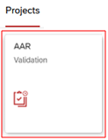
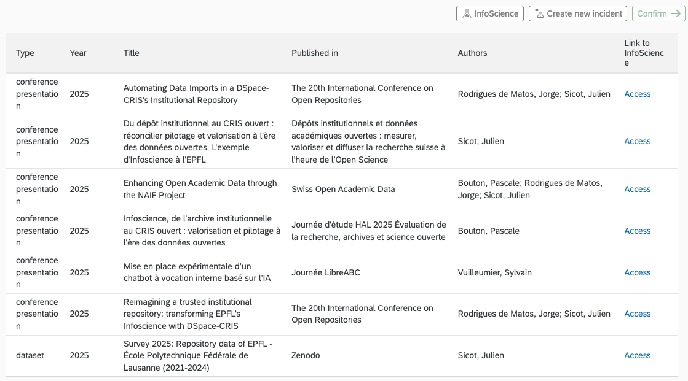
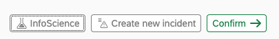

# Infoscience et le Rapport Académique Annuel (AAR)

!!! warning "Principes clés à retenir"
    - Infoscience est la **source de vérité** pour les sections *Publications* et *Brevets* de l'AAR ;
    - L'interface de l'AAR est en **lecture seule** : aucune modification ne peut y être effectuée directement ;
    - **Toute correction** doit être réalisée **à la source**, c'est-à-dire **dans Infoscience** pour les données relatives aux publications ou aux brevets ;
    - La validation du rapport académique porte **sur l'unité** (laboratoire, chaire ou groupe), et non sur ses membres individuellement ;
    - Les **modifications** apportées dans Infoscience sont généralement répercutées dans l'AAR **le lendemain (J+1).**

Cette documentation porte principalement sur les sections **Publications** et **Brevets** du Rapport Académique Annuel (AAR). Ces sections de l'AAR sont spécifiquement liées à Infoscience.

*Une documentation plus générale sur l'AAR est disponible (après authentification) à l'adresse suivante : [inside.epfl.ch/data/aar](https://inside.epfl.ch/data/aar)*

Le Rapport Académique Annuel (AAR) a pour objectif de rendre compte des activités des **laboratoires**, **groupes** et **chaires** associés à l'EPFL.

[Infoscience](https://infoscience.epfl.ch/) est le dépôt institutionnel de l'EPFL : il vise à collecter, préserver et valoriser l'ensemble de la production académique et scientifique associée à l'EPFL.

**Dans ce cadre, Infoscience est la source de vérité qui fournit les listes de publications et brevets utilisés dans le rapport académique (AAR).**

!!! info "Campagne de validation"
    - Ouverture : 16 mars 2026
    - Clôture : 24 avril 2026

    Après cette date, **aucune validation ne sera plus possible.**

---

## Accès à la plateforme AAR



- **Connexion :** le rapport est accessible sur le [portail Sesame](https://sesame.epfl.ch/), section Projets, tuile AAR Validation ;
- L'accès est automatique pour les responsables et gestionnaires d'unité selon les droits ACCRED. Si le bouton n'apparaît pas, contactez [1234@epfl.ch](mailto:1234@epfl.ch) ;
- **Délégation de droits :** les gestionnaires peuvent déléguer l'accès à d'autres collaborateurs via [accred.epfl.ch](http://accred.epfl.ch/), via le droit : « AAR – voir les rapports d'accomplissements académiques » ;
- **Navigation multi-unités :** si vous gérez plusieurs unités, utilisez le menu déroulant en haut à gauche pour basculer d'une unité à l'autre.

---

## Périmètre Infoscience : publications et brevets

**Les données concernent principalement les laboratoires, chaires et groupes de recherche de l'EPFL.**

#### Section « Publications »

La section *Publications* de l'AAR affiche l'ensemble de la production académique (articles, communications à des conférences, chapitres de livres, working papers, preprints, rapports, datasets, etc.) rattachées à votre unité et présentes dans Infoscience pour l'année concernée.

Accéder à l'[ensemble des types de documents](document-types.fr.md) acceptés dans Infoscience.

#### Section « Brevets »

La section *Brevets* de l'AAR affiche les brevets rattachés à votre unité et présents dans Infoscience. Seuls les brevets publiés sont présents (en général ≈ 18 mois après le dépôt). Un brevet peut avoir plusieurs dépôts internationaux : c'est le premier dépôt daté qui est pris en considération.

#### Critères d'inclusion dans le rapport académique

Pour être inclus dans l'AAR, une publication ou un brevet doit remplir les conditions suivantes :

- Être présente/référencée dans Infoscience ;
- Attribué à une unité EPFL de type laboratoire, chaire ou groupe. Champ « **EPFL units** » ;
- **Affiliation EPFL reconnue :** au moins un auteur (ou inventeur, selon le cas) est affilié à l'EPFL. Le champ « **Written at** » doit indiquer EPFL. Si ce champ n'indique pas EPFL, la publication est considérée comme non EPFL dans ce contexte et ne sera pas versée dans l'AAR ;
- **Année cohérente avec l'AAR** : la date de publication doit correspondre à l'année du rapport.

---

## Affichage des informations dans le rapport académique

La section *Publications* présente, pour chaque entrée, les informations suivantes :

- **Type** : type de publication selon la classification utilisée dans Infoscience ;
- **Year** : année de publication retenue pour le rapport académique ;
- **Title** : titre de la publication ;
- **Published in** : source de la publication, qui varie selon le type de document ;
- **Author** : auteurs affiliés à l'EPFL et rattachés à votre unité pendant l'année concernée. Seuls les 4 premiers auteurs répondant aux critères d'affiliation EPFL et d'appartenance à l'unité sont affichés ;
- **Link to Infoscience** : lien permettant de consulter la référence complète dans la plateforme Infoscience.



---

## Vérifications à faire

L'objectif est de valider les 10 sections thématiques de l'AAR : Enseignement, Suivis de projets individuels, Doctorants, *Projects grants*, *Equipements grants*, **Publications**, **Brevets**, Start-ups, Comités et Récompenses. Les données académiques de chaque section sont à valider via le bouton **« Confirmer »** à droite de chaque section :



Une fois les 10 sections validées, un e-mail de confirmation est envoyé au dernier validateur.

*Outil d'aide : utilisez le bouton **« Exporter Excel »** en haut de l'interface pour faciliter la vérification hors ligne.*

**Points principaux à vérifier concernant vos publications et brevets dans Infoscience :**

- La liste couvre toutes les publications attendues pour l'année ;
- Les publications sont correctement attribuées à votre unité ;
- Le champ « **Written at** » est cohérent (EPFL) pour les publications attendues ;
- L'année (date formelle / date en ligne) est cohérente avec l'année de l'AAR ;
- Absence d'éléments clairement hors périmètre ;
- Absence de doublons évidents.

---

## Droits de modification et rôles dans Infoscience

Étant donné qu'Infoscience est la source de vérité pour votre AAR, les modifications doivent y être effectuées directement, si vous souhaitez modifier le contenu des sections **Publications** et **Brevets** de votre AAR.

| **Rôle** | **Demander une correction** (métadonnées, DOI, auteurs, etc.) | **Modifier l'unité** à laquelle la publication est **attribuée** |
|---|---|---|
| **Responsable d'unité** | ✓ | si : la notice est déjà attribuée à l'unité OU au moins un auteur/inventeur a une **affiliation principale active** à l'unité |
| **Délégué d'unité** (droit accordé par le responsable depuis la page de l'unité dans Infoscience) | ✓ | mêmes conditions que le responsable d'unité |
| **Auteur** (notice dont il/elle est auteur) | ✓ | — |
| **Déposant** (notice qu'il/elle a soumise) | ✓ | — |

---

## Foire Aux Questions

### Comment fonctionne l'AAR avec Infoscience

<span id="faq-q1"></span>
??? question "Q1 — Quelles sections de l'AAR sont alimentées par Infoscience ?"
    En pratique, les sections *Publications* et *Brevets* proviennent d'Infoscience (données bibliographiques et d'attribution). Les autres sections dépendent de sources EPFL différentes (RH, IS-ACADEMIA, GrantsDB, etc.) et ne sont pas gérées par Infoscience.

<span id="faq-q2"></span>
??? question "Q2 — D'où proviennent les publications et brevets du rapport académique ?"
    [Infoscience](https://infoscience.epfl.ch/home) est la source de vérité unique pour les données « Publications » et « Brevets » utilisées dans le Rapport Académique Annuel (AAR). **Toute correction ou mise à jour doit donc être effectuée directement dans Infoscience pour être répercutée dans l'AAR.**
    
    Pour être incluses dans l'AAR, les publications et brevets doivent :
    
    - être référencés dans Infoscience ;
    - être attribués à une unité EPFL de type laboratoire, chaire ou groupe ;
    - avoir une affiliation EPFL reconnue (le champ « Written at » indique EPFL) ;
    - avoir une année de publication cohérente avec l'année du rapport.
    
    Les modifications validées dans Infoscience sont généralement visibles dans l'AAR le lendemain (J+1).

<span id="faq-q3"></span>
??? question "Q3 — Quel est le périmètre des publications et brevets pris en compte pour l'AAR ?"
    La section ***Publications*** de l'AAR inclut tous les travaux scientifiques liés à votre unité et présents dans Infoscience pour l'année concernée : articles de revues, communications et articles de conférences, chapitres de livres, working papers et preprints, rapports, etc. Les thèses de doctorat soutenues à l'EPFL sont également incluses.
    
    La section ***Brevets*** de l'AAR inclut les brevets rattachés à votre unité et indexés dans Infoscience. Seuls les brevets publiés sont pris en compte (en général environ 18 mois après le dépôt) ; en cas de dépôts internationaux multiples, le premier dépôt daté est retenu.

<span id="faq-q4"></span>
??? question "Q4 — Les thèses de doctorat EPFL sont-elles incluses dans l'AAR ?"
    Oui. Les thèses de doctorat soutenues à l'EPFL et référencées dans Infoscience sont incluses dans le Rapport Académique Annuel (AAR).

<span id="faq-q5"></span>
??? question "Q5 — Comment les données sont-elles transmises d'Infoscience à l'AAR ?"
    [Infoscience](https://infoscience.epfl.ch/home) est alimenté par une combinaison de dépôts effectués par les chercheurs, professeurs et unités EPFL, et de processus automatisés de collecte et d'enrichissement, réalisés quotidiennement à partir de sources bibliographiques de référence (Web of Science, Scopus, OpenAlex, Crossref et Zenodo) et de l'Office Européen des Brevets (Espacenet) pour les brevets.
    
    Toutes les données font l'objet d'un contrôle qualité assuré par l'équipe Infoscience (et le TTO pour les brevets), incluant la gestion des doublons, la cohérence des métadonnées, la réconciliation des auteurs EPFL et l'attribution aux unités.
    
    ---

---

### Comprendre l'attribution des publications et brevets à votre unité

<span id="faq-q6"></span>
??? question "Q6 — Que signifie exactement le champ « Written at » ?"
    Le champ « **Written at** » indique si la production scientifique a été réalisée à l'EPFL, sur la base de l'affiliation institutionnelle reconnue des auteur(s) au moment de la publication.
    
    Lorsqu'il indique EPFL, cela signifie que la publication a été réalisée par au moins un auteur affilié à l'EPFL à ce moment-là et qu'elle fait partie de la bibliographie institutionnelle EPFL.
    
    Dans le cadre du Rapport Académique Annuel (AAR), seules les publications pour lesquelles le champ Written at indique EPFL sont prises en compte.

<span id="faq-q7"></span>
??? question "Q7 — Pourquoi « Written at » n'indique-t-il pas EPFL alors que l'auteur est affilié ?"
    Plusieurs situations peuvent l'expliquer :
    
    - la publication a été réalisée avant l'arrivée de l'auteur à l'EPFL ;
    - l'affiliation EPFL n'est pas mentionnée explicitement ou correctement dans la publication ;
    - les métadonnées des sources externes n'identifient pas clairement l'affiliation EPFL au moment de la publication.
    
    Si l'affiliation EPFL est bien mentionnée dans la publication, une [demande de correction](https://go.epfl.ch/help-infoscience-correction) peut être formulée.

<span id="faq-q8"></span>
??? question "Q8 — Comment fonctionne le processus d'attribution des publications ou brevets aux unités EPFL ?"
    Une publication ou un brevet est automatiquement associé à une unité si au moins un de ses auteurs y était affilié au moment de la publication, selon les données d'accréditation EPFL.
    
    Les responsables d'unité, ou les personnes à qui cette responsabilité a été déléguée, peuvent vérifier et ajuster les attributions des publications liées à leur unité. Pour modifier une attribution :
    
    - Connectez-vous à Infoscience et ouvrez une publication liée à votre unité.
    - Cliquez sur le bouton « … », puis sélectionnez « Edit Unit/Lab affiliations ».
    - Procédez aux ajustements nécessaires : supprimez l'attribution à votre unité via l'icône corbeille ; ajoutez une autre unité EPFL en cas de collaboration.
    
    Pour soumettre une publication non encore présente sur Infoscience : [Déposer une publication](submit-a-publication.fr.md)
    
    !!! info ""
        Les modifications validées dans Infoscience sont généralement visibles dans l'AAR le lendemain (J+1).

<span id="faq-q9"></span>
??? question "Q9 — Pourquoi une publication est-elle rattachée à une unité parente (faculté, institut) plutôt qu'à mon unité (laboratoire, groupe) ?"
    Plusieurs situations peuvent l'expliquer :
    
    - L'affiliation de l'auteur EPFL n'était pas assez précise dans la publication ou les métadonnées disponibles ;
    - Les dépôts institutionnels utilisés pour l'attribution n'ont pas permis de résoudre automatiquement l'affiliation au niveau le plus fin ;
    - La publication a été importée automatiquement avec une affiliation partielle.
    
    Si la publication concerne bien votre laboratoire ou groupe, les responsables d'unité ou les personnes déléguées peuvent demander ou effectuer un ajustement d'attribution dans Infoscience ([Demander une correction](https://go.epfl.ch/help-infoscience-correction) ou [Ajouter ou rejeter une attribution](https://go.epfl.ch/help-infoscience-unit-add-reject)).

<span id="faq-q10"></span>
??? question "Q10 — Que faire si une publication ou un brevet n'est pas encore lié à mon unité ?"
    Si vous disposez des droits nécessaires (responsable d'unité ou personne déléguée) et qu'au moins l'un des auteurs ou inventeurs listés est un membre actif de votre unité, vous pouvez directement ajouter l'attribution de votre unité dans Infoscience via la fonctionnalité « Edit Unit/Lab affiliations ».
    
    **Procédure :**
    
    - Ouvrez la notice Infoscience de la publication ou du brevet concerné ;
    - Cliquez sur le bouton « … » en haut à droite ;
    - Sélectionnez « ***Edit Unit/Lab affiliations*** » ;
    - Ajustez l'attribution selon le cas ;
    - Sauvegardez les modifications.
    
    Pour plus de détails : [Ajouter ou rejeter une attribution](https://go.epfl.ch/help-infoscience-unit-add-reject)
    
    Dans le cas contraire, vous pouvez formuler une [demande de correction](https://go.epfl.ch/help-infoscience-correction) ou contacter l'équipe Infoscience via [infoscience@epfl.ch](mailto:infoscience@epfl.ch) ou via un incident AAR.

<span id="faq-q11"></span>
??? question "Q11 — Pourquoi une publication est-elle attribuée à une unité non-EPFL ?"
    Si une publication est associée à une unité non-EPFL, cela signifie généralement qu'elle est hors périmètre EPFL, c'est-à-dire qu'elle n'a pas été produite dans le cadre de l'EPFL.
    
    Pour corriger ce type de cas, référez-vous à la question : [Que faire pour corriger une publication associée à une unité non-EPFL ?](#faq-q20)
    
    ---

---

### Vérification et signalement de problèmes dans votre AAR

<span id="faq-q12"></span>
??? question "Q12 — Comment vérifier la liste des publications attribuées à mon unité qui seront transmises dans l'AAR ?"
    La liste des publications prises en compte pour le Rapport Académique Annuel (AAR) correspond aux publications rattachées à votre unité dans Infoscience.
    
    Pour y accéder, utilisez le menu [Explorer → Unités EPFL](https://infoscience.epfl.ch/explore/orgunits), puis recherchez votre unité par son acronyme.
    
    Une fois sur la page de votre unité :
    
    - Ouvrez l'onglet Scholarly Works, qui liste tous les travaux actuellement liés à l'unité ;
    - Utilisez les critères de recherche pour filtrer les publications selon les règles du rapport académique, par exemple :
    
    ```
    dateIssued.year:2025 AND epfl.writtenAt:(EPFL)
    ```
    
    [Exemple de requête →](https://infoscience.epfl.ch/entities/orgunit/d74be593-dcf3-4e4d-a5ed-9d0304f2831c?spc.page=1&query=dateIssued.year:2025%20AND%20epfl.writtenAt:(EPFL)%20)
    
    - Pour afficher uniquement les brevets, ajoutez le critère : *entityType:(patent)*
    
    ```
    entityType:(patent) AND dateIssued.year:2025 AND epfl.writtenAt:(EPFL)
    ```

<span id="faq-q13"></span>
??? question "Q13 — Après une demande de correction, quand la modification sera-t-elle visible dans l'AAR ?"
    La demande de correction est analysée et validée par l'équipe Infoscience, ce qui prend **généralement 24 à 48 heures**, selon la nature et la complexité de la modification.
    
    Une fois la correction appliquée dans Infoscience, les données sont automatiquement répercutées dans l'AAR lors du prochain rafraîchissement, généralement le lendemain (J+1).

<span id="faq-q14"></span>
??? question "Q14 — Comment supprimer une publication incorrectement liée à mon unité ?"
    Il n'est pas possible de supprimer une publication d'Infoscience. Conformément à [la licence de dépôt Infoscience](https://go.epfl.ch/help-infoscience-conditions), les notices acceptées ne peuvent pas être supprimées.
    
    En revanche, **le lien à une unité peut être corrigé**.
    
    Si une publication est incorrectement attribuée à votre unité :
    
    - **Vous disposez des droits de gestion d'unité (responsable ou délégué) :** vous pouvez supprimer l'attribution via l'option « [*Edit Unit/Lab affiliations*](https://go.epfl.ch/help-infoscience-unit-add-reject) » dans la notice Infoscience ;
    - **Vous ne disposez pas des droits nécessaires ou la situation est complexe :** créez un incident via la section concernée dans l'AAR (*Create a new incident*) ou formulez une [demande de correction](https://go.epfl.ch/help-infoscience-correction) dans Infoscience.
    
    Toute modification validée dans Infoscience sera répercutée dans l'AAR lors du prochain rafraîchissement (généralement J+1).

<span id="faq-q15"></span>
??? question "Q15 — Comment signaler un problème ou une anomalie dans l'AAR ?"
    Chaque section du portail AAR dispose d'un bouton « **Create a new incident** ».
    
    Utilisez le bouton de la section concernée (Publications ou Brevets) pour que votre demande soit redirigée vers le bon interlocuteur.
    
    L'AAR est en lecture seule. Toutes les corrections sont effectuées au niveau de la source (Infoscience pour les publications/brevets), et seront ensuite visibles après le rafraîchissement de l'AAR (souvent J+1).
    
    ---

---

### Correction de l'affiliation ou des métadonnées d'une publication

<span id="faq-q16"></span>
??? question "Q16 — Que faire si une publication ou un brevet dans l'AAR ne devrait pas être lié à mon unité ?"
    Si vous disposez des droits nécessaires (responsable d'unité ou personne déléguée), vous pouvez directement supprimer l'attribution de votre unité dans Infoscience :
    
    - Ouvrez la notice Infoscience de la publication ou du brevet concerné.
    - Cliquez sur le bouton « … » en haut à droite.
    - Sélectionnez *« Edit Unit/Lab affiliations »*.
    - Supprimez votre unité si la publication ou le brevet ne la concerne pas.
    - Sauvegardez les modifications.
    
    Dans le cas contraire, vous pouvez créer un incident AAR ou contacter [infoscience@epfl.ch](mailto:infoscience@epfl.ch).
    
    Voir les procédures : [Demander une correction](https://go.epfl.ch/help-infoscience-correction) ou [Ajouter ou rejeter une attribution](https://go.epfl.ch/help-infoscience-unit-add-reject)

<span id="faq-q17"></span>
??? question "Q17 — Comment corriger les métadonnées d'une publication ou d'un brevet dans l'AAR (titre, auteur, résumé, date…) ?"
    L'AAR est en lecture seule, et toutes les demandes de correction concernant les publications et brevets doivent être effectuées à la source dans Infoscience. Depuis la notice concernée :
    
    - utilisez le bouton « … » puis « ***Demander une correction*** » pour corriger ou compléter des métadonnées (titre, auteurs, affiliation, DOI, etc.) ou des fichiers ;
    - utilisez le bouton « … » puis « ***Créer une nouvelle version*** » uniquement en cas de **changement de version éditoriale** (preprint → version publiée).
    
    Voir : [Demander une correction](https://go.epfl.ch/help-infoscience-correction) ou [Créer une nouvelle version](https://go.epfl.ch/help-infoscience-new-version)

<span id="faq-q18"></span>
??? question "Q18 — Est-il possible de corriger une attribution directement dans Infoscience ?"
    Oui, si vous disposez des **droits nécessaires** (responsable d'unité ou personne déléguée), vous pouvez corriger une attribution **directement dans Infoscience**, sans passer par le support.
    
    Cette possibilité s'applique uniquement aux publications ou brevets :
    
    - **déjà attribués à votre unité** ;
    - ou pour lesquels au moins **un des auteurs ou inventeurs est membre de votre unité**.
    
    **Procédure :**
    
    - Ouvrez la notice Infoscience de la publication ou du brevet concerné.
    - Cliquez sur le bouton « … » en haut à droite.
    - Sélectionnez *« Edit Unit/Lab affiliations »*.
    - Ajustez l'attribution selon le cas.
    - Sauvegardez les modifications.

<span id="faq-q19"></span>
??? question "Q19 — Que faire si une publication apparaît en doublon ?"
    Signalez le doublon via une [demande de correction](https://go.epfl.ch/help-infoscience-correction) ou contactez l'équipe Infoscience via un incident AAR ou à [infoscience@epfl.ch](mailto:infoscience@epfl.ch), en indiquant les deux notices Infoscience concernées. L'équipe Infoscience est responsable de leur fusion.

<span id="faq-q20"></span>
??? question "Q20 — Que faire pour corriger une publication associée à une unité non-EPFL ?"
    Si une publication est associée à une unité non-EPFL, cela signifie généralement qu'elle est hors périmètre EPFL pour le Rapport Académique Annuel.
    
    Voici comment procéder selon le cas :
    
    - si la publication ne concerne effectivement pas l'EPFL (aucun auteur affilié à l'EPFL au moment de la publication), aucune action n'est nécessaire. Elle ne sera pas prise en compte dans l'AAR.
    - si la publication concerne bien l'EPFL, mais est incorrectement liée à une unité non-EPFL, vous pouvez :
        - ajouter l'unité EPFL correcte (si vous disposez des droits de gestion d'unité) ;
        - formuler une [demande de correction](https://go.epfl.ch/help-infoscience-correction) dans Infoscience en justifiant l'affiliation EPFL ;
        - ou contacter l'équipe Infoscience via un incident AAR ou à [infoscience@epfl.ch](mailto:infoscience@epfl.ch).

<span id="faq-q21"></span>
??? question "Q21 — Que faire si la date de publication en ligne est différente de la date formelle de publication ?"
    Pour le Rapport Académique Annuel (AAR), l'année retenue est la date de publication indiquée dans la notice Infoscience correspondante. Si cette date ne correspond pas à la date formelle de publication, vous pouvez [demander une correction](https://go.epfl.ch/help-infoscience-correction) dans Infoscience en fournissant des éléments factuels (page éditeur, DOI, dates officielles).
    
    ---

---

### Certaines publications ou brevets n'apparaissent pas dans votre AAR

<span id="faq-q22"></span>
??? question "Q22 — Pourquoi ma publication n'est-elle ni dans Infoscience ni dans l'AAR ?"
    Plusieurs raisons peuvent l'expliquer :
    
    - la publication n'a pas encore été soumise ou importée dans Infoscience ;
    - les métadonnées des sources externes n'identifient pas clairement un auteur EPFL ou une affiliation EPFL (affiliation non normalisée, ambiguïté sur les noms d'auteurs, absence d'[ORCID](https://www.epfl.ch/campus/library/services-researchers/orcid/), etc.).
    
    Pour limiter ces situations, il est fortement recommandé :
    
    - de créer et d'utiliser un [ORCID](https://www.epfl.ch/campus/library/services-researchers/orcid/) et de le transmettre systématiquement à l'éditeur lors de la soumission d'un article ;
    - d'indiquer une affiliation EPFL normalisée, en y associant l'[identifiant ROR de l'EPFL](https://ror.org/02s376052). *Exemple : École Polytechnique Fédérale de Lausanne, Lausanne, Suisse. [https://ror.org/02s376052](https://ror.org/02s376052)*
    
    Pour soumettre une publication non encore présente sur Infoscience : [*Déposer une publication*](submit-a-publication.fr.md)

<span id="faq-q23"></span>
??? question "Q23 — Pourquoi ma publication n'apparaît-elle pas dans l'AAR alors qu'elle est présente dans Infoscience ?"
    Si une publication est présente dans Infoscience mais absente du Rapport Académique Annuel (AAR), cela signifie généralement qu'elle ne remplit pas les critères d'inclusion dans l'AAR :
    
    - l'attribution à l'unité est absente ou incorrecte ;
    - le champ **« Written at »** n'indique pas EPFL ;
    - l'année de publication ne correspond pas à l'année du rapport.
    
    Si une anomalie est constatée, vous pouvez [demander une correction dans Infoscience](https://go.epfl.ch/help-infoscience-correction) ou signaler le problème via un incident AAR.

<span id="faq-q24"></span>
??? question "Q24 — Pourquoi certains brevets attendus n'apparaissent-ils pas dans l'AAR ?"
    Plusieurs raisons peuvent expliquer l'absence d'un brevet dans l'AAR :
    
    - le brevet n'est pas encore publié : seuls les brevets publiés sont pris en compte, généralement environ 18 mois après le dépôt ;
    - le brevet n'est pas (encore) indexé dans Infoscience ;
    - les brevets importés automatiquement depuis Espacenet sont ceux dont le déposant (titulaire) est l'EPFL ;
    - le brevet existe dans Infoscience mais l'attribution à l'unité EPFL est absente ou incorrecte ;
    - l'affiliation EPFL de l'inventeur n'est pas reconnue au moment de l'import ;
    - l'année retenue pour le brevet ne correspond pas à l'année du rapport académique.
    
    Si votre brevet est bien publié et n'apparaît pas encore dans Infoscience, veuillez contacter [infoscience@epfl.ch](mailto:infoscience@epfl.ch) ou signaler un problème via un incident AAR.

<span id="faq-q25"></span>
??? question "Q25 — Comment ajouter une publication manquante ?"
    Après avoir vérifié que la publication n'existe pas déjà dans Infoscience (recherche par titre, DOI ou auteur), vous pouvez l'ajouter directement via le formulaire de soumission d'Infoscience, en suivant la procédure dédiée [*Déposer une publication*](submit-a-publication.fr.md).
    
    Si le volume de publications manquantes est important, il est recommandé de contacter l'équipe Infoscience ([infoscience@epfl.ch](mailto:infoscience@epfl.ch)).
    
    ---

---

### Rôles et droits de modification

<span id="faq-q26"></span>
??? question "Q26 — Qui a le droit de demander des corrections dans Infoscience ?"
    Les déposants d'une notice et les auteurs d'une publication peuvent : [demander des corrections](https://go.epfl.ch/help-infoscience-correction).
    
    Les responsables d'unité ou les personnes déléguées peuvent : [demander des corrections](https://go.epfl.ch/help-infoscience-correction) et [modifier les attributions](https://go.epfl.ch/help-infoscience-unit-add-reject) de leur unité.
    
    Le détail des droits est disponible ici : [*Droits de modification et rôles dans Infoscience*](https://go.epfl.ch/aar-infoscience-modification-rights).

<span id="faq-q27"></span>
??? question "Q27 — Comment obtenir l'autorisation d'associer une unité à une publication ?"
    L'attribution est basée sur l'affiliation EPFL des auteurs au moment de la publication. Les responsables d'unité (ou personnes déléguées) peuvent ajouter ou supprimer une unité directement depuis la notice Infoscience.
    
    En cas de doute ou de situation complexe, contactez [infoscience@epfl.ch](mailto:infoscience@epfl.ch).
    
    ---
    
    [Retour à l'accueil de l'Aide](index.fr.md)

---
