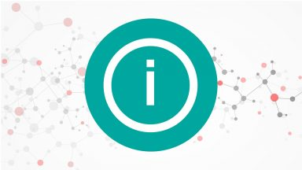

# About Infoscience

<figure markdown="span">
  { width="300" }
</figure>

Infoscience is the institutional platform of EPFL for disseminating scientific publications and research output. It collects, preserves and shares the academic and scientific output of EPFL researchers, teachers and students, making it freely accessible to the largest possible audience.

Infoscience is one of the main instruments for implementing EPFL's Open Access policy, allowing School members to disseminate their publications in full-text, preprint, postprint, or final version, to the international community, complementing traditional publication channels.

---

## Why publish in Infoscience?

### Commit to Open Science

Infoscience contributes to EPFL's commitment to open access to scientific information (Green Open Access).

According to [LEX 3.5.1](https://www.epfl.ch/about/overview/wp-content/uploads/2019/09/LEX-3.5.1_EN.pdf), *"EPFL authors must deposit all their publications in the institutional repository Infoscience and provide access in accordance with the conditions imposed by the publishers. This deposit must be made no later than 6 months after the publication date following the principle of Green Open Access."*

The community is encouraged to report and submit their various research findings to benefit from wide dissemination, free distribution, and long-term archiving. Like an open window on academic activity, Infoscience presents the work of EPFL authors, faculties, institutes and sections, as well as other campus communities, and provides long-term access to these productions.

### Benefits for EPFL authors

- **Share your research with a wide audience** and contribute to the development of science.
- **Increase the visibility of your research** on the main search tools, such as Google Scholar or OpenAIRE Explore.
- **Meet the Open Science requirements of EPFL and funding agencies** by legally disseminating your publications and other academic output (Green Open Access).
- **Get persistent identifiers** for accessing and citing your research works. Each submission receives a Handle, and a DOI can be assigned under certain conditions.
- **Get usage statistics** to measure the impact of your output (citations, downloads, views).
- **Take advantage of [import-export](submit-a-publication.md) features** to simplify the submission and sharing of your work.
- **Highlight your scientific contributions** by [customising your researcher profile](manage-profile.md).
- **Facilitate the exchange of knowledge** within the academic community.
- **Benefit from long-term preservation** of your publications in a reputable institutional repository.

### Benefits for EPFL

Infoscience:

- disseminates and highlights the output of research carried out at EPFL, in the various disciplines, laboratories and research centres;
- is the **central platform** for reporting publications and academic work produced at EPFL;
- is part of **EPFL's commitment as a public teaching and research institution**, open to society, to facilitate the legal dissemination, sharing and promotion of knowledge developed and taught at EPFL;
- is one of the main instruments for implementing **EPFL's [Open Access](https://www.epfl.ch/about/overview/wp-content/uploads/2019/09/LEX-3.5.1_EN.pdf) policy** (Green Open Access);
- contributes to the **visibility, promotion and enhancement** of academic production and access to a wide audience, without financial barriers;
- serves as a **trusted source** for the production of reports and analyses, such as the annual academic reports and Graph Search.

### Serving the missions of EPFL

Infoscience offers three main sections reflecting EPFL's missions:

- **Research** — bringing together scientific contributions by faculties, institutes, and laboratories.
- **Education** — including theses, student works and projects, and teaching resources.
- **Innovation** — focusing on patents.

---

## Who can access and publish in Infoscience?

### Free access to all

Research results are visible to everyone in Infoscience. Authenticated EPFL users benefit from extended access to certain content: restricted and embargoed documents (by requesting access from the submitter), and more extensive statistics (profile and related publications).

Non-EPFL users can request access to a restricted-access or embargoed file via the **Request a copy** form.

### Roles and rights

-   :fontawesome-solid-flask:{ .lg .middle } **EPFL Researcher**

    ---

    You must deposit all your publications in Infoscience no later than 6 months after the publication date ([LEX 3.5.1](https://www.epfl.ch/about/overview/wp-content/uploads/2019/09/LEX-3.5.1_EN.pdf)). You can submit manually, via imports (Web of Science, etc.), or appoint a collaborator. Other scientific works (research data, etc.) are also welcome — see [Document types](document-types.md).

-   :fontawesome-solid-graduation-cap:{ .lg .middle } **EPFL Doctoral student**

    ---

    Theses defended at EPFL are deposited by the Library under its official mandate. Dissemination follows your instructions: immediate access or 3-month embargo. You are encouraged to also submit your other scientific works (articles, etc.).

-   :fontawesome-solid-users:{ .lg .middle } **Head of lab / PI**

    ---

    You [manage the list of publications](manage-lab-unit.md) associated with your laboratory on the unit's Infoscience page. You can delegate this responsibility to a colleague.

-   :fontawesome-solid-star:{ .lg .middle } **Newcomer to EPFL**

    ---

    You have the opportunity to [import your previous publications](submit-a-publication.md) from external sources and link them to your EPFL profile.

-   :fontawesome-solid-chalkboard-teacher:{ .lg .middle } **EPFL Teacher**

    ---

    You can submit [teaching resources as well as student work](document-types.md) to Infoscience.

-   :fontawesome-solid-user-graduate:{ .lg .middle } **EPFL Student**

    ---

    If your section's policy allows it, your Master's work will be disseminated in Infoscience.

-   :fontawesome-solid-building:{ .lg .middle } **EPFL Staff**

    ---

    If you are employed at EPFL and have a scientific publication, you are invited to submit it in Infoscience.

-   :fontawesome-solid-globe:{ .lg .middle } **Non-EPFL user**

    ---

    You can search, consult, quote, and download publications and works by EPFL authors available in Infoscience free of charge.

For the complete matrix of rights per role, see the [Roles and rights reference](roles-rights.md).

---

## Publishing conditions

In accordance with [LEX 3.5.1](https://www.epfl.ch/about/overview/wp-content/uploads/2019/09/LEX-3.5.1_EN.pdf), EPFL authors must deposit publications and works (scientific or academic) no later than 6 months after the publication date.

- At least one EPFL author must be present in the list of authors.
- An EPFL member who is the scientific editor of a publication may submit either the texts they have written (introduction, etc.) or the entire work (provided that all authors agree).
- Students cannot directly deposit their publications; they must seek approval from their PI and/or faculty.

The following documents are exclusively deposited by the Infoscience team:

- EPFL doctoral theses (in collaboration with the Doctoral School)
- Patents (in collaboration with the Technology Transfer Office)

For more information, refer to the [charter and deposit licence](https://www.epfl.ch/campus/library/services-researchers/infoscience-en/charter-deposit-licence-and-conditions-of-use/).

---

## What does Infoscience contain?

As of 1 July 2024, Infoscience contains **more than 178,000 documents**. The platform reports and disseminates publications as well as other research results (research data, code, etc.) produced by EPFL authors. It provides a comprehensive overview of academic production, linking laboratories, researchers and scientific work.

### EPFL scientific and academic output

Infoscience collects a large variety of scientific and academic output:

- articles published in scientific journals
- papers, posters and presentations prepared for conferences
- books and book chapters
- preprints
- reports
- doctoral theses
- student works
- datasets and code
- educational resources
- images and videos
- patents

For more information, visit the [Document types](document-types.md) page.

### Descriptive metadata

Each record contains descriptive metadata, provides information on the type of access offered (open access, embargo, restricted access), the file version (preprint, accepted version, final version), and the peer-review status. It also displays bibliometric indicators (number of citations, altmetrics) and usage statistics (views and downloads).

For more information, refer to the [data model](data-model.md).

### How the platform is fed and enriched

Infoscience is populated through four complementary channels:

**1. Self-archiving by authors**

EPFL researchers, teachers, and students can [deposit their own publications](submit-a-publication.md) directly in Infoscience, either manually through the submission form or by importing a BibTeX file. Submissions from non-Library staff go through a curation workflow: the Infoscience team verifies bibliographic content and file dissemination conditions before the record is published.

**2. Automatic imports from trusted external sources**

The Infoscience team regularly imports EPFL-authored publications from major bibliographic databases. Records are automatically matched to EPFL when at least one author carries an EPFL affiliation. Current trusted sources include:

- [Web of Science](https://www.webofscience.com/)
- [Scopus](https://www.scopus.com/)
- [Crossref](https://www.crossref.org/)
- [DataCite](https://datacite.org/)
- [OpenAlex](https://openalex.org/)
- [Unpaywall](https://unpaywall.org/) (for open-access file enrichment)
- [EspaceNet](https://worldwide.espacenet.com/) (for EPFL patents, validated by the Technology Transfer Office)

**3. Synchronisation with EPFL referential systems**

Person and unit entities in Infoscience are created and kept up to date automatically from EPFL's authoritative referential systems:

- **[people.epfl.ch](https://people.epfl.ch)** — researcher profiles (name, contact details, photo, position) are synchronised to create and update Person entities in Infoscience.
- **[accred.epfl.ch](https://accred.epfl.ch)** (EPFL accreditation system) — affiliation data is used to automatically associate publications and outputs with the correct unit and authors at the time of publication, enabling reliable attribution without manual intervention.
- **[units.epfl.ch](https://units.epfl.ch)** — the EPFL organisational directory feeds the OrgUnit entities (laboratories, institutes, sections) and their hierarchical structure.

These synchronisations ensure that the units and researcher profiles displayed in Infoscience always reflect the current state of EPFL's organisation.

**IS-Academia** is used in the specific context of the mandatory doctoral thesis deposit mandate: thesis metadata (author, supervisors, faculty, doctoral school, defence date) is derived from IS-Academia and used to pre-populate the thesis record before it is published by the Library.

**4. Doctoral theses**

Theses defended at EPFL are deposited by the Library as part of its official mandate to archive and distribute EPFL theses, in collaboration with the Doctoral School.

!!! note "Author responsibility"
    Regardless of the import channels in place, **it is the responsibility of each author to verify the completeness of their publication record** in Infoscience and to complete it manually where needed. The Infoscience team is available to help at [infoscience@epfl.ch](mailto:infoscience@epfl.ch).

###  Visibility and automatic dissemination

Since its creation, particular attention has been given to the referencing of Infoscience in quality tools, with the aim of automatically making EPFL publications available everywhere researchers worldwide go to search for scientific information. This visibility is achieved through essential web tools such as search engines, but also through specialised tools such as Open Access harvesters, library catalogues, and researcher networks.

A publication deposited in Infoscience is just a few steps away from being distributed as widely as possible. Once published, records are automatically harvested by the following services:

**Search engines and academic aggregators**

- **[Google Scholar](https://scholar.google.com/)** — regularly crawls and indexes Infoscience records, linking them to author profiles and improving discoverability by the global research community.
- **[OpenAlex](https://openalex.org/)** — an open, comprehensive index of scholarly works, authors, institutions and sources, harvesting Infoscience content.
- **[BASE — Bielefeld Academic Search Engine](https://www.base-search.net/)** — one of the world's largest search engines for academic open access content, indexing Infoscience via OAI-PMH.
- **[OpenAIRE](https://explore.openaire.eu/)** — harvests Infoscience via OAI-PMH to monitor open access compliance for European and Swiss funders (SNSF, Horizon Europe). Infoscience records are visible on the OpenAIRE Explore portal and count towards institutional OA reporting.
- **[CORE](https://core.ac.uk/)** — the world's largest aggregator of open access research, harvesting full-text content from Infoscience.

**Library catalogues and national collections**

- **[Swisscovery](https://swisscovery.slsp.ch/)** — the Swiss national discovery portal for academic libraries, indexing Infoscience records for discovery across all Swiss higher education institutions.
- **[Helveticat](https://nb-helveticat.primo.exlibrisgroup.com/discovery/search?vid=41SNL_51_INST:helveticat&lang=en)** and **[e-Helvetica](https://www.e-helvetica.nb.admin.ch/)** (Swiss National Library) — EPFL doctoral theses deposited in Infoscience are archived in e-Helvetica, the Swiss National Library's digital archive for born-digital Swiss publications.

---

## Contact

Need help using Infoscience? Want to report a technical problem? Can't find what you're looking for in the [Help pages](index.md) or the [FAQ](faq.md)?

The Infoscience team is available to answer your questions, Monday–Friday 08:00–17:00 (open days):

- **E-mail:** [infoscience@epfl.ch](mailto:infoscience@epfl.ch)
- **Book an appointment:** [go.epfl.ch/book-an-infoscience-expert](https://go.epfl.ch/book-an-infoscience-expert) — for submitting publications, creating and modifying publication lists, managing your personal profile and laboratory page, syncing your ORCID profile, and obtaining identifiers (DOI, ISBN).
