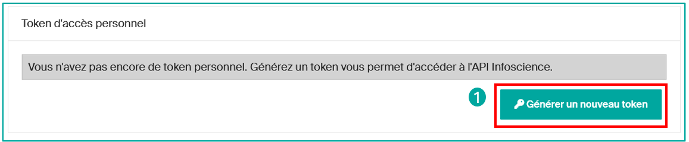

# Utiliser l'API REST Infoscience

L'API REST d'Infoscience donne un accès programmatique à l'ensemble des métadonnées et fichiers publics du dépôt. C'est le socle technique de la plateforme elle-même — elle peut servir à construire des intégrations, automatiser des workflows et moissonner des données.

**URL de base :** `https://infoscience.epfl.ch/server/api`

!!! note "Convention des URL dans les exemples"
    Tous les exemples `curl` de cette page utilisent des **chemins relatifs à l'URL de base** ci-dessus. Pour les exécuter directement, préfixez l'URL de base :
    ```bash
    curl "https://infoscience.epfl.ch/server/api/core/items/{{uuid}}" ...
    ```

!!! info "Explorateur interactif"
    Le [HAL Browser](https://infoscience.epfl.ch/server/#/server/api) offre une interface en direct et auto-documentée de tous les points d'accès. Utilisez-le pour explorer la structure de l'API et tester des requêtes sans écrire de code.

!!! tip "Rétro-ingénierie de l'interface"
    Tout ce qui est possible dans l'interface web d'Infoscience est également réalisable via l'API. Ouvrez les outils de développement de votre navigateur (F12 → onglet Réseau), effectuez une action dans l'interface, et inspectez les requêtes émises — cela révèle les appels API et paramètres exacts utilisés par chaque fonctionnalité.

!!! info "Spécifications officielles"
    - DSpace (noyau) : [github.com/DSpace/RestContract](https://github.com/DSpace/RestContract)
    - Extensions DSpace-CRIS : [github.com/4Science/Rest7Contract](https://github.com/4Science/Rest7Contract)

---

## Architecture

L'API suit trois standards complémentaires :

- **HAL** — chaque réponse intègre des `_links` qui décrivent les opérations disponibles et les ressources liées.
- **HATEOAS** — l'API est auto-navigable : commencez depuis la racine et suivez les liens plutôt que de construire les URL manuellement.
- **ALPS** — des profils sémantiques lisibles par machine documentent ce que chaque endpoint accepte et retourne.

Toutes les réponses sont en **JSON**. L'API est en lecture seule pour les utilisateur·trices anonymes ; les requêtes authentifiées permettent aussi de modifier des données avec les droits appropriés.

---

## Authentification

### Accès anonyme

Toutes les métadonnées et tous les fichiers accessibles publiquement sont disponibles sans token :

```bash
curl "/core/items/{{uuid}}" \
  -H 'accept: application/json'
```

### Token Bearer

Un token personnel donne accès aux ressources restreintes et est nécessaire pour les opérations d'écriture.

**Obtenir votre token :**

1. Connectez-vous à [infoscience.epfl.ch](https://infoscience.epfl.ch).
2. Cliquez sur votre icône de profil → **Compte et profil**.
3. Faites défiler vers le bas et cliquez sur **Générer un nouveau token**.
4. Copiez le token immédiatement — il ne sera plus visible ensuite.



!!! warning
    Le token n'est pas récupérable une fois la fenêtre fermée. En cas de perte, générez-en un nouveau — le précédent est automatiquement révoqué.

```bash
export INFOSCIENCE_TOKEN="votre_token"

curl "/core/items/{{uuid}}" \
  -H 'accept: application/json' \
  -H "Authorization: Bearer $INFOSCIENCE_TOKEN"
```

### Comptes de service

Pour les workflows automatisés non rattachés à un compte individuel, contactez [infoscience@epfl.ch](mailto:infoscience@epfl.ch). Dans des contextes spécifiques et justifiés, des droits en écriture peuvent être accordés.

### Bonnes pratiques de sécurité

- N'incluez jamais votre token dans du code source ou des dépôts publics.
- Stockez les tokens dans des variables d'environnement ou un gestionnaire de secrets (fichier `.env`, secrets CI).
- Renouvelez votre token si vous suspectez une compromission.

---

## Concepts fondamentaux

### Pagination

Tous les endpoints de collection sont paginés. La réponse inclut `page.totalElements` et `page.totalPages` pour la navigation :

| Paramètre | Défaut | Max | Description |
|---|---|---|---|
| `page` | `0` | — | Numéro de page (indexé à zéro) |
| `size` | `20` | `100` | Résultats par page |

```bash
# Page 3, 50 résultats par page
curl "/discover/search/objects\
?configuration=researchoutputs&query=dc.description.sponsorship:LASUR\
&page=2&size=50" \
  -H "Authorization: Bearer $INFOSCIENCE_TOKEN"
```

La manière la plus simple d'itérer toutes les pages est de suivre `_links.next` dans chaque réponse — il est présent tant qu'il reste des pages, et absent sur la dernière :

```python
import requests, os

BASE    = "https://infoscience.epfl.ch/server/api"
HEADERS = {
    "accept": "application/json",
    "Authorization": f"Bearer {os.environ['INFOSCIENCE_TOKEN']}",
}

def search_all_raw(query, configuration="researchoutputs", size=100):
    """Itère toutes les pages via _links.next et retourne les dicts indexableObject bruts."""
    url = f"{BASE}/discover/search/objects"
    params = {
        "configuration": configuration,
        "query": query,
        "sort": "dc.date.issued,DESC",
        "size": size,
    }
    results = []
    while url:
        r = requests.get(url, headers=HEADERS, params=params)
        r.raise_for_status()
        data = r.json()
        params = None  # les params sont encodés dans _links.next à partir de la 2e page

        search_result = data.get("_embedded", {}).get("searchResult", {})
        for obj in search_result.get("_embedded", {}).get("objects", []):
            item = obj.get("_embedded", {}).get("indexableObject")
            if item:
                results.append(item)

        url = (search_result.get("_links", {})
                            .get("next", {})
                            .get("href"))
    return results
```

Ou bien, itérer par numéro de page en utilisant `page.totalPages` :

```python
# BASE et HEADERS sont définis dans la variante _links.next ci-dessus
def search_all_raw(query, configuration="researchoutputs", size=100):
    """Itère toutes les pages par numéro et retourne les dicts indexableObject bruts."""
    page, results = 0, []
    while True:
        r = requests.get(
            f"{BASE}/discover/search/objects",
            headers=HEADERS,
            params={
                "configuration": configuration,
                "query": query,
                "sort": "dc.date.issued,DESC",
                "page": page,
                "size": size,
            }
        )
        r.raise_for_status()
        data = r.json()

        search_result = data.get("_embedded", {}).get("searchResult", {})
        for obj in search_result.get("_embedded", {}).get("objects", []):
            item = obj.get("_embedded", {}).get("indexableObject")
            if item:
                results.append(item)

        page_info = search_result.get("page", {})
        if page >= page_info.get("totalPages", 1) - 1:
            break
        page += 1
    return results
```

### Intégration de ressources liées (embed)

Le paramètre `embed` évite les allers-retours superflus en intégrant des ressources liées en une seule requête. Combinez plusieurs valeurs sous forme de liste séparée par des virgules :

| Valeur | Intègre |
|---|---|
| `bundles/bitstreams` | Tous les bundles et leurs fichiers (ORIGINAL, TEXT, THUMBNAIL…) |
| `thumbnail` | La vignette principale de la notice |
| `metrics` | Métriques de citation et d'usage (Scopus, vues, téléchargements) |

```bash
# Fichiers uniquement
curl "/core/items/{{uuid}}\
?embed=bundles%2Fbitstreams" \
  -H "Authorization: Bearer $INFOSCIENCE_TOKEN"

# Vignette uniquement
curl "/core/items/{{uuid}}\
?embed=thumbnail" \
  -H "Authorization: Bearer $INFOSCIENCE_TOKEN"

# Fichiers + vignette + métriques en une seule requête
curl "/core/items/{{uuid}}\
?embed=bundles%2Fbitstreams,thumbnail,metrics" \
  -H "Authorization: Bearer $INFOSCIENCE_TOKEN"
```

`embed` fonctionne également sur l'endpoint de recherche — utile pour récupérer fichiers ou métriques pour tous les résultats en un seul appel :

```bash
curl "/discover/search/objects\
?configuration=researchoutputs&query=dc.description.sponsorship:LASUR\
&size=20&embed=bundles%2Fbitstreams,thumbnail,metrics" \
  -H "Authorization: Bearer $INFOSCIENCE_TOKEN"
```

---

## Structure des réponses

### Réponse de recherche

Une réponse de recherche enveloppe les résultats dans un objet `_embedded` imbriqué :

```json
{
  "_embedded": {
    "searchResult": {
      "_embedded": {
        "objects": [
          {
            "_embedded": {
              "indexableObject": {
                "uuid": "a1b2c3d4-e5f6-7890-abcd-000000000001",
                "metadata": {
                  "dc.title": [{ "value": "Titre de ma publication", "language": null }],
                  "dc.date.issued": [{ "value": "2024", "language": null }],
                  "dc.contributor.author": [
                    { "value": "Martin, Sophie", "language": null },
                    { "value": "Dupont, Jean", "language": null }
                  ]
                },
                "_links": {
                  "self":            { "href": "/core/items/a1b2c3d4-..." },
                  "bundles":         { "href": "/core/items/a1b2c3d4-.../bundles" },
                  "owningCollection":{ "href": "/core/items/a1b2c3d4-.../owningCollection" }
                }
              }
            }
          }
        ]
      },
      "page": {
        "size": 20,
        "totalElements": 1234,
        "totalPages": 62,
        "number": 0
      }
    }
  }
}
```

Champs clés :

| Champ | Description |
|---|---|
| `_embedded.searchResult._embedded.objects` | Tableau de résultats ; l'item réel est dans `_embedded.indexableObject` |
| `page.totalElements` | Nombre total de notices correspondantes |
| `page.totalPages` | Nombre total de pages pour la taille demandée |
| `page.number` | Page courante (indexée à zéro) |
| `_links.next` | URL de la page suivante (absent sur la dernière page) |

### Notice (GET direct)

Un GET direct retourne l'objet sans l'enveloppe de recherche. L'exemple ci-dessous est tiré d'une vraie notice Infoscience :

```json
{
  "id":     "a1b2c3d4-e5f6-7890-abcd-000000000001",
  "uuid":   "a1b2c3d4-e5f6-7890-abcd-000000000001",
  "name":   "A novel numerical method for plasma simulation",
  "handle": "20.500.14299/000001",
  "metadata": {
    "dc.title": [
      { "value": "A novel numerical method for plasma simulation",
        "language": null, "authority": null, "confidence": -1, "place": 0 }
    ],
    "dc.date.issued": [
      { "value": "2024-10-01",
        "language": null, "authority": null, "confidence": -1, "place": 0 }
    ],
    "dc.contributor.author": [
      { "value": "Durand, Alice",
        "language": null, "authority": null, "confidence": -1, "place": 0 },
      { "value": "Martin, Thomas",
        "language": null, "authority": "a1b2c3d4-e5f6-7890-abcd-000000000002",
        "confidence": 600, "place": 1 },
      { "value": "Bernard, Claire",
        "language": null, "authority": null, "confidence": -1, "place": 2 }
    ],
    "dc.description.sponsorship": [
      { "value": "LABX",
        "language": null, "authority": "a1b2c3d4-e5f6-7890-abcd-000000000003",
        "confidence": 600, "place": 0 }
    ],
    "dc.relation.journal": [
      { "value": "Journal of Computational Physics",
        "language": null, "authority": "a1b2c3d4-e5f6-7890-abcd-000000000004",
        "confidence": 600, "place": 0 }
    ],
    "dc.identifier.doi": [
      { "value": "10.1000/example.2024.001",
        "language": null, "authority": null, "confidence": -1, "place": 0 }
    ],
    "cris.virtual.orcid": [
      { "value": "#PLACEHOLDER_PARENT_METADATA_VALUE#",
        "language": null, "authority": null, "confidence": -1, "place": 0 },
      { "value": "0000-0001-2345-6789",
        "language": null, "authority": null, "confidence": -1, "place": 1 },
      { "value": "#PLACEHOLDER_PARENT_METADATA_VALUE#",
        "language": null, "authority": null, "confidence": -1, "place": 2 }
    ]
  },
  "_links": {
    "self":             { "href": "/core/items/a1b2c3d4-..." },
    "bundles":          { "href": "/core/items/a1b2c3d4-.../bundles" },
    "owningCollection": { "href": "/core/items/a1b2c3d4-.../owningCollection" }
  }
}
```

Les valeurs de métadonnées sont toujours des tableaux. Chaque entrée contient cinq attributs :

| Attribut | Description |
|---|---|
| `value` | La chaîne d'affichage |
| `language` | Code de langue ISO, ou `null` |
| `authority` | UUID de l'entité CRIS liée (Person, OrgUnit, Journal…), ou `null` si non résolu |
| `confidence` | Score de confiance : `600` = lien confirmé, `-1` = sans autorité |
| `place` | Position dans la liste de valeurs du champ (indexée à zéro) — préserve l'ordre d'insertion et l'alignement des groupes |

Quand `authority` est renseigné, l'UUID peut être utilisé directement comme `scope` dans une requête `RELATION.*` — sans recherche préalable.

### Champs virtuels et valeurs de remplacement

Les champs préfixés `cris.virtual.*` sont calculés à partir des entités CRIS liées et sont **alignés positionnellement** avec leur champ parent via l'index `place`. Par exemple, `cris.virtual.orcid[place=N]` correspond à `dc.contributor.author[place=N]`.

Quand une entrée d'auteur·e n'a pas d'item Person lié (`authority: null`), toutes les entrées `cris.virtual.*` à ce même `place` portent la valeur sentinelle `#PLACEHOLDER_PARENT_METADATA_VALUE#`. Cela préserve la structure de groupe afin que les index `place` restent cohérents entre tous les champs virtuels.

```
dc.contributor.author[place=0]: "Durand, Alice"   authority: null  → pas de Person lié
dc.contributor.author[place=1]: "Martin, Thomas"        authority: "a1b2c3d4-..."
dc.contributor.author[place=2]: "Bernard, Claire"    authority: null

cris.virtual.orcid[place=0]: "#PLACEHOLDER_PARENT_METADATA_VALUE#"  ← pas d'ORCID
cris.virtual.orcid[place=1]: "0000-0001-2345-6789"                   ← ORCID de Martin
cris.virtual.orcid[place=2]: "#PLACEHOLDER_PARENT_METADATA_VALUE#"  ← pas d'ORCID
```

Les champs compagnons `cris.virtualsource.*` stockent l'UUID de l'item source de chaque valeur virtuelle — ce sont des champs d'infrastructure, non destinés à l'usage externe.

### Structure des métriques

Quand `embed=metrics` est utilisé, la réponse inclut un tableau `_embedded.metrics`. Chaque entrée représente un type de métrique :

```json
{
  "metricType":      "scopusCitation",
  "metricCount":     2.0,
  "acquisitionDate": "2024-09-01T00:00:00.000+00:00",
  "last":            true,
  "deltaPeriod2":    null
}
```

| `metricType` | Description |
|---|---|
| `scopusCitation` | Nombre de citations Scopus |
| `wosCitation` | Nombre de citations Web of Science |
| `view` | Nombre de consultations de la page |
| `download` | Nombre de téléchargements de fichiers |
| `altmetric` | Score Altmetric (configuration uniquement, pas de `metricCount`) |

`last: true` marque l'acquisition la plus récente pour ce type de métrique. Utilisez-le pour exclure les snapshots historiques quand plusieurs entrées du même type sont présentes.

### Utilitaire Python — extraire des valeurs de métadonnées

Quand on travaille avec des réponses JSON brutes (par exemple issues de `search_all_raw`), les métadonnées sont un simple dictionnaire. Ces utilitaires simplifient l'accès aux champs :

```python
def get_meta(item, field, default=None):
    """Retourne la première valeur d'un champ de métadonnée depuis un dict JSON brut."""
    entries = item.get('metadata', {}).get(field, [])
    return entries[0].get('value', default) if entries else default

def get_meta_all(item, field):
    """Retourne toutes les valeurs d'un champ, en ignorant les placeholders."""
    return [
        e.get('value') for e in item.get('metadata', {}).get(field, [])
        if e.get('value') != '#PLACEHOLDER_PARENT_METADATA_VALUE#'
    ]

# Exemple : extraire des champs depuis les résultats de search_all_raw
items = search_all_raw("dc.description.sponsorship:LABX")
for item in items:
    print(get_meta(item, 'dc.title'))
    print(get_meta(item, 'dc.date.issued'))
    print(get_meta_all(item, 'dc.contributor.author'))
```

---

## Rechercher des notices

**Endpoint de base :** `GET /discover/search/objects`

### Paramètre configuration

| Valeur | Portée |
|---|---|
| `researchoutputs` | Publications, jeux de données, brevets (défaut) |
| `persons` | Profils de chercheur·euses |
| `orgunits` | Laboratoires et unités |
| `journals` | Revues |
| `events` | Conférences et événements |

### Syntaxe de requête

Le paramètre `query` accepte la syntaxe Lucene/Solr :

| Opérateur | Exemple |
|---|---|
| Texte libre | `query=intelligence artificielle` |
| Champ spécifique | `query=author_editor:(Martin, Sophie)` |
| Expression exacte | `query=title:("deep learning")` |
| ET booléen | `query=author_editor:(bernard) AND dateIssued.year:[2020 TO 2024]` |
| OU booléen | `query=(author_editor:(dupont) OR author_editor:(martin))` |
| Exclusion | `query=dc.description.sponsorship:LASUR -types:(conference poster)` |
| Joker | `query=author_editor:(Martin, S*)` |
| Plage | `query=dateIssued.year:[2020 TO 2024]` |

### Rechercher par UUID

Deux approches équivalentes :

```bash
# GET direct (le plus rapide)
curl "/core/items/a1b2c3d4-e5f6-7890-abcd-000000000001" \
  -H "Authorization: Bearer $INFOSCIENCE_TOKEN"

# Via la recherche discovery
curl "/discover/search/objects\
?configuration=researchoutputs\
&query=search.resourceid:a1b2c3d4-e5f6-7890-abcd-000000000001\
&size=1" \
  -H "Authorization: Bearer $INFOSCIENCE_TOKEN"
```

### Rechercher par DOI

Préférez `itemidentifier_keyword` — cet index normalise la chaîne (insensible à la casse, gère les variantes de format) :

```bash
# Recommandé
curl "/discover/search/objects\
?configuration=researchoutputs\
&query=itemidentifier_keyword:(10.5281/zenodo.0000000)\
&sort=dc.date.issued,DESC&page=0&size=100" \
  -H "Authorization: Bearer $INFOSCIENCE_TOKEN"

# Alternative (correspondance exacte sur la valeur stockée)
curl "/discover/search/objects\
?configuration=researchoutputs\
&query=dc.identifier.doi:(10.5281/zenodo.0000000)\
&sort=dc.date.issued,DESC&page=0&size=100" \
  -H "Authorization: Bearer $INFOSCIENCE_TOKEN"
```

### Rechercher par titre

Pour une correspondance exacte, encadrez le titre de guillemets doubles. Les deux-points (`:`) brisent la requête — nettoyez le titre en supprimant la ponctuation et les diacritiques :

```bash
# Titre exact (entre guillemets)
curl "/discover/search/objects\
?configuration=researchoutputs\
&query=title:(%22SEFI SIG Workshop: Eager to further develop the field of engineering ethics education?%22)\
&sort=dc.date.issued,DESC&page=0&size=100" \
  -H "Authorization: Bearer $INFOSCIENCE_TOKEN"

# Titre nettoyé (plus sûr — supprime la ponctuation qui bloque le parseur)
curl "/discover/search/objects\
?configuration=researchoutputs\
&query=title:(SEFI SIG Workshop Eager to further develop the field of engineering ethics education)\
&sort=dc.date.issued,DESC&page=0&size=100" \
  -H "Authorization: Bearer $INFOSCIENCE_TOKEN"
```

!!! warning "Nettoyage du titre"
    Les deux-points, points d'interrogation et caractères spéciaux dans les titres cassent le parseur de requêtes. Supprimez la ponctuation et les diacritiques avant d'envoyer une requête sur le titre, ou encadrez la chaîne exacte de guillemets doubles.

### Rechercher par ISSN

Couvrez les deux champs `dc.relation.issn` et `dc.relation.seriesissn` — les notices anciennes peuvent utiliser l'un ou l'autre :

```bash
curl "/discover/search/objects\
?configuration=researchoutputs\
&query=dc.relation.issn:%221069-4730%22 OR dc.relation.issn:%222168-9830%22 \
OR dc.relation.seriesissn:%221069-4730%22 OR dc.relation.seriesissn:%222168-9830%22\
&sort=dc.date.issued,DESC&page=0&size=50" \
  -H "Authorization: Bearer $INFOSCIENCE_TOKEN"
```

!!! note "Couverture des ISSN"
    Infoscience n'a pas stocké les ISSN de façon systématique dans les notices anciennes. Si une requête par ISSN retourne peu de résultats, complétez par une recherche sur le titre de la revue (voir ci-dessous).

### Rechercher par titre de revue

Quand les ISSN sont incomplets, recherchez par titre de revue en couvrant les deux champs `dc.relation.journal` et `dc.relation.ispartofseries` :

```bash
curl "/discover/search/objects\
?configuration=researchoutputs\
&query=dc.relation.journal:%22Journal of Engineering Education%22 \
OR dc.relation.journal:%22European Journal of Engineering Education%22 \
OR dc.relation.ispartofseries:%22Journal of Engineering Education%22 \
OR dc.relation.ispartofseries:%22European Journal of Engineering Education%22\
&sort=dc.date.issued,DESC&page=0&size=100" \
  -H "Authorization: Bearer $INFOSCIENCE_TOKEN"
```

### Rechercher par conférence

Combinez `oairecerif.acronym`, `dc.relation.conference` et `dc.relation.ispartof` :

```bash
curl "/discover/search/objects\
?configuration=researchoutputs\
&query=oairecerif.acronym:(*SEFI*) \
OR dc.relation.conference:(*SEFI*) \
OR dc.relation.ispartof:(*SEFI*)\
&sort=dc.date.issued,DESC&page=0&size=100" \
  -H "Authorization: Bearer $INFOSCIENCE_TOKEN"
```

### Rechercher les thèses EPFL

```bash
curl "/discover/search/objects\
?configuration=researchoutputs\
&query=types:(doctoral thesis) publisher:EPFL\
&sort=dc.date.issued,DESC&page=0&size=100" \
  -H "Authorization: Bearer $INFOSCIENCE_TOKEN"
```

### Filtrer par unité

```bash
# Par code court d'unité (index Solr)
curl "/discover/search/objects\
?configuration=researchoutputs\
&query=dc.description.sponsorship:LASUR\
&sort=dc.date.issued,DESC&size=20" \
  -H "Authorization: Bearer $INFOSCIENCE_TOKEN"
```

### Notices avec résumé et texte intégral

```bash
# Notices avec résumé + au moins un fichier déposé
curl "/discover/search/objects\
?configuration=researchoutputs\
&query=dc.description.abstract:* has_content_in_original_bundle:(true)\
&sort=dc.date.issued,DESC&page=0&size=100" \
  -H "Authorization: Bearer $INFOSCIENCE_TOKEN"
```

### Moissonnage incrémental

Trois champs de date servent des usages différents :

| Champ | Ce qu'il trace | Cas d'usage |
|---|---|---|
| `lastModified` | Toute modification de la notice (métadonnées ou fichiers) | Détecter les mises à jour de notices existantes |
| `dc.date.accessioned` | Date d'entrée dans le dépôt | Filtrer par date de dépôt |
| `dc.date.created` | Date de création de la notice dans le système | Alternative à `accessioned` pour certains types |

```bash
# Notices modifiées un jour donné (mises à jour + nouveaux dépôts)
curl "/discover/search/objects\
?configuration=researchoutputs\
&query=lastModified:[2026-01-09T00:00:00Z TO 2026-01-09T23:59:59Z]\
&sort=lastModified,DESC&page=0&size=100" \
  -H "Authorization: Bearer $INFOSCIENCE_TOKEN"

# Notices déposées dans une plage de dates (nouveaux items uniquement)
curl "/discover/search/objects\
?configuration=researchoutputs\
&query=dc.date.accessioned:[2025-01-01T00:00:00Z TO 2025-12-31T23:59:59Z]\
&sort=dc.date.accessioned,DESC&page=0&size=100" \
  -H "Authorization: Bearer $INFOSCIENCE_TOKEN"

# Notices créées dans une plage de dates (alternative)
curl "/discover/search/objects\
?configuration=researchoutputs\
&query=dc.date.created:[2025-01-01T00:00:00Z TO 2025-12-31T23:59:59Z]\
&sort=dc.date.accessioned,DESC&page=0&size=100" \
  -H "Authorization: Bearer $INFOSCIENCE_TOKEN"
```

!!! note
    Pour un moissonnage incrémental complet (nouvelles notices + mises à jour), utilisez `lastModified`. Pour un chargement initial filtré par période de dépôt, utilisez `dc.date.accessioned`.

---

## Accès aux fichiers (bundles et bitstreams)

Les réponses de l'API incluent des `_links` pointant vers les opérations disponibles, notamment `bundles` pour l'accès aux fichiers.

### Types de bundles

Chaque notice peut contenir plusieurs bundles :

| Nom du bundle | Contenu |
|---|---|
| `ORIGINAL` | Fichiers déposés par l'auteur·e (visibles dans l'interface publique) |
| `THUMBNAIL` | Images de vignette dérivées des fichiers originaux |
| `TEXT` | Texte extrait par OCR depuis les PDF — utile pour l'analyse plein texte |

### Récupérer les fichiers d'une notice

```bash
# Via embed (une seule requête)
curl "/core/items/{{uuid}}\
?embed=bundles%2Fbitstreams" \
  -H "Authorization: Bearer $INFOSCIENCE_TOKEN"

# Via le lien bundles (deux requêtes)
curl "/core/items/{{uuid}}/bundles" \
  -H "Authorization: Bearer $INFOSCIENCE_TOKEN"
```

### Télécharger un fichier spécifique

Suivez le lien `content` dans `_links` du bitstream :

```bash
curl -L "/core/bitstreams/{{uuid}}/content" \
  -H "Authorization: Bearer $INFOSCIENCE_TOKEN" \
  -o fichier.pdf
```

!!! note
    Pour les fichiers en accès restreint, le token est obligatoire. Les requêtes anonymes sur des bitstreams restreints retournent HTTP 401.

!!! warning "Licences et data mining"
    **Les métadonnées Infoscience sont publiées sous licence [CC0](https://creativecommons.org/publicdomain/zero/1.0/)** — elles peuvent être librement réutilisées sans restriction.
    Les bitstreams (fichiers) obéissent à des règles différentes : vérifiez la licence de chaque fichier avant tout téléchargement à grande échelle. Les fichiers sous licence Creative Commons peuvent être utilisés pour le text and data mining ; les fichiers sous copyright peuvent être soumis à des restrictions. La licence est généralement stockée dans `oaire.licenseCondition` dans les métadonnées de la notice.

---

## Client Python (dspace-rest-python)

La Bibliothèque EPFL maintient un client Python officiel pour l'API Infoscience :
**[github.com/epfllibrary/dspace-rest-python](https://github.com/epfllibrary/dspace-rest-python) (branche : `dev`)**

### Installation

```bash
git clone https://github.com/epfllibrary/dspace-rest-python.git
cd dspace-rest-python
git checkout dev
pip install -r requirements.txt
```

Créez un fichier `.env` à partir du modèle fourni :

```bash
cp .sample.env .env
```

Ajoutez les variables suivantes dans `.env` :

```
DS_API_ENDPOINT=https://infoscience.epfl.ch/server/api
DS_API_TOKEN=votre_token
ENV=prod
```

### Utilitaires d'accès aux métadonnées

Le `DSpaceClient` retourne des objets `DSO` dont les métadonnées sont accessibles via `dso.metadata`. Ces utilitaires sont équivalents aux versions dict brut de la section [Structure des réponses](#structure-des-reponses) :

```python
def get_meta(dso, field, default=None):
    """Retourne la première valeur d'un champ de métadonnée depuis un objet DSO."""
    entries = dso.metadata.get(field, [])
    return entries[0].get('value', default) if entries else default

def get_meta_all(dso, field):
    """Retourne toutes les valeurs d'un champ, en ignorant les placeholders."""
    return [
        e.get('value') for e in dso.metadata.get(field, [])
        if e.get('value') != '#PLACEHOLDER_PARENT_METADATA_VALUE#'
    ]
```

### Utilisation de base

```python
import pandas as pd
from dspace_rest_client.client import DSpaceClient

d = DSpaceClient()
authenticated = d.authenticate()

# Rechercher toutes les notices avec un DOI
query = "dc.identifier.doi:*"
dsos = d.search_objects(
    query=query,
    page=0,
    size=100,
    dso_type="item",
    configuration="researchoutputs"
)

output = []
for dso in dsos:
    output.append({
        'dc.title':           dso.metadata.get('dc.title', [{}])[0].get('value'),
        'dc.type':            dso.metadata.get('dc.type', [{}])[0].get('value'),
        'dspace.entity.type': dso.metadata.get('dspace.entity.type', [{}])[0].get('value'),
        'dc.relation.journal':dso.metadata.get('dc.relation.journal', [{}])[0].get('value'),
        'dc.date.issued':     dso.metadata.get('dc.date.issued', [{}])[0].get('value'),
        'epfl.writtenAt':     dso.metadata.get('epfl.writtenAt', [{}])[0].get('value'),
    })

df = pd.DataFrame(output)
df.to_csv('output.csv', index=False)
```

### Paginer tous les résultats

```python
def search_all(client, query, configuration="researchoutputs", size=100):
    """Récupère tous les résultats d'une requête en gérant la pagination."""
    page, results = 0, []
    while True:
        batch = client.search_objects(
            query=query,
            page=page,
            size=size,
            dso_type="item",
            configuration=configuration
        )
        if not batch:
            break
        results.extend(batch)
        if len(batch) < size:
            break
        page += 1
    return results

all_items = search_all(d, "dc.description.sponsorship:LASUR")
print(f"{len(all_items)} notices trouvées")
```

### Extraire des métadonnées par unité

Utilisez `dc.description.sponsorship` (index Solr : `unitOrLab`) pour regrouper les résultats par unité affiliée — et non `cris.virtual.department`, qui est un champ d'affichage virtuel à ne pas utiliser pour filtrer ou grouper :

```python
output = []
for dso in dsos:
    units = [x.get('value') for x in dso.metadata.get('dc.description.sponsorship', [])]
    for unit in units:
        output.append({
            'dc.title':                   dso.metadata.get('dc.title', [{}])[0].get('value'),
            'dc.date.issued':             dso.metadata.get('dc.date.issued', [{}])[0].get('value'),
            'dc.description.sponsorship': unit,
        })
```

### Moissonnage incrémental

```python
from datetime import date, timedelta

yesterday = (date.today() - timedelta(days=1)).strftime('%Y-%m-%dT00:00:00Z')
today     = date.today().strftime('%Y-%m-%dT23:59:59Z')

# Toutes les notices modifiées hier (mises à jour + nouveaux dépôts)
modified = search_all(
    d,
    query=f"lastModified:[{yesterday} TO {today}]",
    configuration="researchoutputs"
)
print(f"{len(modified)} notices modifiées hier")

# Nouveaux dépôts uniquement (par date d'entrée)
new_items = search_all(
    d,
    query=f"dc.date.accessioned:[{yesterday} TO {today}]",
    configuration="researchoutputs"
)
print(f"{len(new_items)} notices déposées hier")
```

---

## Navigation par relations CRIS

DSpace-CRIS permet de traverser les relations entre entités — par exemple, récupérer toutes les publications liées à une unité, une personne ou une revue directement via leur UUID.

### Étape 1 — Obtenir l'UUID d'une unité

Recherchez par code d'unité EPFL (`epfl.unit.code`) ou par numéro CF (`epfl.orgUnit.cf`) :

```bash
# Par acronyme
curl "/discover/search/objects\
?configuration=orgunit\
&query=(oairecerif.acronym:("12345"))\
&sort=score,DESC&page=0&size=1&projection=preventMetadataSecurity" \
  -H "Authorization: Bearer $INFOSCIENCE_TOKEN"

# Par code d'unité
curl "/discover/search/objects\
?configuration=orgunit\
&query=(epfl.unit.code:("13020"))\
&sort=score,DESC&page=0&size=1&projection=preventMetadataSecurity" \
  -H "Authorization: Bearer $INFOSCIENCE_TOKEN"

# Par numéro CF
curl "/discover/search/objects\
?configuration=orgunit\
&query=(epfl.orgUnit.cf:("12345"))\
&sort=score,DESC&page=0&size=1&projection=preventMetadataSecurity" \
  -H "Authorization: Bearer $INFOSCIENCE_TOKEN"
```

Le champ `uuid` se trouve dans l'`indexableObject` du premier résultat :

```json
{
  "_embedded": {
    "searchResult": {
      "_embedded": {
        "objects": [{
          "_embedded": {
            "indexableObject": {
              "id":     "a1b2c3d4-e5f6-7890-abcd-000000000003",
              "uuid":   "a1b2c3d4-e5f6-7890-abcd-000000000003",
              "name":   "Laboratoire de modélisation numérique",
              "handle": "20.500.14299/000003"
            }
          }
        }]
      }
    }
  }
}
```

### Étape 2 — Obtenir les publications liées à l'unité

Utilisez `configuration=RELATION.OrgUnit.publications` avec `scope` égal à l'UUID de l'unité :

```bash
curl "/discover/search/objects\
?configuration=RELATION.OrgUnit.publications\
&scope=a1b2c3d4-e5f6-7890-abcd-000000000003\
&sort=dc.date.issued,DESC&page=0&size=10&projection=preventMetadataSecurity" \
  -H "Authorization: Bearer $INFOSCIENCE_TOKEN"
```

Cette approche est plus précise qu'une requête `dc.description.sponsorship` : elle suit le lien de relation CRIS explicite plutôt que de faire correspondre un champ de métadonnée textuel.

### Étape 3 — Requêtes au niveau faculté

Pour récupérer toutes les publications affiliées à une faculté (qui regroupe plusieurs unités), utilisez l'index `organizationHierarchy_authority` avec l'UUID de la faculté :

```bash
# Toutes les publications affiliées à une faculté (ex. : SV — Sciences de la vie)
curl "/discover/search/objects\
?configuration=researchoutputs\
&query=organizationHierarchy_authority:a1b2c3d4-e5f6-7890-abcd-000000000005\
&sort=dc.date.issued,DESC&page=0&size=100" \
  -H "Authorization: Bearer $INFOSCIENCE_TOKEN"
```

L'UUID de la faculté (`a1b2c3d4-...` dans cet exemple pour SV) s'obtient en cherchant l'entité faculté via `configuration=orgunit`, exactement comme pour une unité (étape 1). L'index `organizationHierarchy_authority` indexe l'ensemble de la chaîne organisationnelle — il correspond à toute unité dont la hiérarchie passe par l'UUID donné, donc un UUID de faculté couvre tous ses laboratoires constituants.

!!! note
    `organizationHierarchy_authority` peut aussi être combiné avec `embed=bundles/bitstreams` pour récupérer les fichiers de toutes les notices correspondantes en une seule requête — utile pour les workflows de data mining.

### Configurations RELATION disponibles

| Configuration | Entité (scope) | Retourne |
|---|---|---|
| `RELATION.OrgUnit.publications` | UUID d'une unité | Publications liées à l'unité |
| `RELATION.OrgUnit.persons` | UUID d'une unité | Personnes affiliées à l'unité |
| `RELATION.Person.researchoutputs` | UUID d'une personne | Productions scientifiques d'un·e chercheur·euse |
| `RELATION.Journal.publications` | UUID d'une revue | Publications parues dans la revue |
| `RELATION.Event.publications` | UUID d'un événement | Publications liées à une conférence |

### Exemple Python — toutes les publications d'une unité par code

```python
from dspace_rest_client.client import DSpaceClient

d = DSpaceClient()
d.authenticate()

# Étape 1 : résoudre le code d'unité en UUID
results = d.search_objects(
    query='epfl.unit.code:("13020")',
    page=0, size=1,
    dso_type="item",
    configuration="orgunit"
)
if not results:
    raise ValueError("Unité introuvable")

unit_uuid = results[0].uuid
print(f"UUID de l'unité : {unit_uuid}")

# Étape 2 : récupérer les publications liées
publications, page = [], 0
while True:
    batch = d.search_objects(
        query=None, page=page, size=100,
        dso_type="item",
        configuration="RELATION.OrgUnit.publications",
        scope=unit_uuid
    )
    if not batch:
        break
    publications.extend(batch)
    if len(batch) < 100:
        break
    page += 1

print(f"{len(publications)} publications trouvées")
for pub in publications[:5]:
    title = pub.metadata.get('dc.title', [{}])[0].get('value', '(sans titre)')
    print(f"  - {title}")
```

### Exemple Python — toutes les productions d'un·e chercheur·euse

Le même schéma en deux étapes s'applique pour une personne : `configuration=persons` pour résoudre l'UUID, puis `RELATION.Person.researchoutputs` pour récupérer ses productions.

**Étape 1 — Obtenir l'UUID de la personne**

Recherchez par SCIPER, ORCID ou par nom :

```bash
# Par SCIPER
curl "/discover/search/objects\
?configuration=persons\
&query=cris.virtual.sciperId.:123456\
&sort=score,DESC&page=0&size=1&projection=preventMetadataSecurity" \
  -H "Authorization: Bearer $INFOSCIENCE_TOKEN"

# Par ORCID
curl "/discover/search/objects\
?configuration=persons\
&query=orcid:0000-0001-2345-6789\
&sort=score,DESC&page=0&size=1&projection=preventMetadataSecurity" \
  -H "Authorization: Bearer $INFOSCIENCE_TOKEN"

# Par nom
curl "/discover/search/objects\
?configuration=persons\
&query=dc.contributor.author:(Martin, Sophie)\
&sort=score,DESC&page=0&size=5&projection=preventMetadataSecurity" \
  -H "Authorization: Bearer $INFOSCIENCE_TOKEN"
```

L'UUID se trouve dans `_embedded.searchResult._embedded.objects[0]._embedded.indexableObject.uuid`.

**Étape 2 — Récupérer les productions liées**

```bash
curl "/discover/search/objects\
?configuration=RELATION.Person.researchoutputs\
&scope={{person_uuid}}\
&sort=dc.date.issued,DESC&page=0&size=100&projection=preventMetadataSecurity" \
  -H "Authorization: Bearer $INFOSCIENCE_TOKEN"
```

**Python — workflow complet**

```python
from dspace_rest_client.client import DSpaceClient

d = DSpaceClient()
d.authenticate()

# Étape 1 : résoudre l'ORCID en UUID de personne
results = d.search_objects(
    query='orcid:0000-0001-2345-6789',
    page=0, size=1,
    dso_type="item",
    configuration="persons"
)
if not results:
    raise ValueError("Personne introuvable")

person_uuid = results[0].uuid
print(f"UUID de la personne : {person_uuid}")

# Étape 2 : récupérer les productions liées
outputs, page = [], 0
while True:
    batch = d.search_objects(
        query=None, page=page, size=100,
        dso_type="item",
        configuration="RELATION.Person.researchoutputs",
        scope=person_uuid
    )
    if not batch:
        break
    outputs.extend(batch)
    if len(batch) < 100:
        break
    page += 1

print(f"{len(outputs)} productions trouvées")
```

!!! note
    `RELATION.Person.researchoutputs` suit le lien d'autorship CRIS explicite. Cette approche est plus précise qu'une requête `orcid:` ou `author_editor:` sur `researchoutputs`, qui porte sur des métadonnées textuelles et peut inclure des variantes de nom ou des homonymes.

---

## Index de recherche clés

| Index | Description | Exemple |
|---|---|---|
| `search.resourceid` | UUID de la notice | `search.resourceid:a1b2c3d4-...` |
| `cris.legacyId` | Ancien identifiant Infoscience | `cris.legacyId:175201` |
| `dc.identifier.doi` | DOI (correspondance exacte) | `dc.identifier.doi:(10.1000/example.2020.002)` |
| `itemidentifier_keyword` | Tout identifiant, normalisé | `itemidentifier_keyword:(10.1000/example.2020.002)` |
| `author_editor` | Nom de l'auteur·e | `author_editor:(Martin, Sophie)` |
| `author_editor_authority` | UUID de l'auteur·e | `author_editor_authority:a1b2c3d4-...` |
| `dc.description.sponsorship` | Acronyme de l'unité EPFL affiliée | `dc.description.sponsorship:LASUR` |
| `unitOrLab` | Acronyme de l'unité EPFL affiliée | `unitOrLab:CRPP` |
| `unitOrLab_authority` | UUID de l'unité EPFL affiliée | `unitOrLab_authority:a1b2c3d4-...` |
| `types` | Type de document | `types:(research article)` |
| `title` | Titre | `title:("deep learning")` |
| `dateIssued.year` | Année de publication | `dateIssued.year:[2020 TO 2024]` |
| `dc.relation.issn` | ISSN de la revue | `dc.relation.issn:"1069-4730"` |
| `dc.relation.seriesissn` | ISSN de la série | `dc.relation.seriesissn:"1069-4730"` |
| `dc.relation.journal` | Titre de la revue | `dc.relation.journal:"Nature"` |
| `dc.relation.ispartofseries` | Titre de la série | `dc.relation.ispartofseries:"Lecture Notes"` |
| `dc.relation.conference` | Nom de la conférence | `dc.relation.conference:(*SEFI*)` |
| `oairecerif.acronym` | Acronyme de la conférence | `oairecerif.acronym:(*SEFI*)` |
| `orcid` | Identifiant ORCID | `orcid:0000-0001-2345-6789` |
| `epfl.peerreviewed` | Évalué par les pairs | `epfl.peerreviewed:REVIEWED` |
| `fundername` | Nom du financeur | `fundername:(FNS)` |
| `lastModified` | Date de dernière modification | `lastModified:[2026-01-09T00:00:00Z TO ...]` |
| `has_content_in_original_bundle` | Fichiers déposés | `has_content_in_original_bundle:(true)` |
| `dc.description.abstract` | Présence d'un résumé | `dc.description.abstract:*` |
| `organizationHierarchy_authority` | UUID de hiérarchie faculté/unité | `organizationHierarchy_authority:a1b2c3d4-...` |

Référence complète : [Profil d'application des métadonnées](metadata-profile.fr.md) · [Modèle de données](data-model.fr.md)

---

## Bonnes pratiques

- **Préférez `itemidentifier_keyword` à `dc.identifier.doi`** — cet index gère les variantes de casse et de format.
- **Nettoyez les titres avant de les requêter** — supprimez les deux-points, points d'interrogation et diacritiques, ou encadrez la chaîne de guillemets doubles.
- **Couvrez les deux champs ISSN** — `dc.relation.issn` et `dc.relation.seriesissn` pour une couverture complète.
- **Utilisez `embed` avec des valeurs séparées par des virgules** — `?embed=bundles%2Fbitstreams,thumbnail,metrics` pour récupérer fichiers et métriques sans requêtes supplémentaires.
- **Limitez la taille de page à 100** — le maximum autorisé par l'API ; utilisez la pagination pour les grands ensembles.
- **Utilisez `lastModified` pour le moissonnage incrémental** — capture à la fois les nouveaux dépôts et les mises à jour de notices existantes.
- **Utilisez `dc.description.sponsorship` (index `unitOrLab`) pour grouper par unité** — ne pas utiliser `cris.virtual.department`, qui est un champ d'affichage uniquement.
- **Exploitez `authority` directement comme UUID de scope** — quand une entrée de métadonnée a une `authority` non nulle, elle peut être utilisée directement dans une requête `RELATION.*`.
- **Ne divulguez jamais votre token** — utilisez des variables d'environnement ou des fichiers `.env` (ne jamais committer dans git).
- **Utilisez `organizationHierarchy_authority`** pour les requêtes à l'échelle d'une faculté — couvre toutes les unités de la hiérarchie.
- **Les métadonnées sont CC0** — réutilisation libre. Pour les bitstreams, vérifiez `oaire.licenseCondition` avant tout téléchargement en masse — les fichiers sous copyright peuvent restreindre le text and data mining.
- **Respectez la charge de la plateforme** — planifiez les moissonnages en dehors des heures de pointe (soirées, week-ends).

---

[Retour à l'accueil de l'Aide](index.fr.md)
