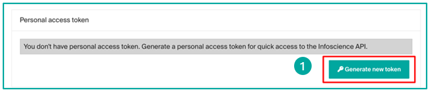

# Using the Infoscience REST API

The Infoscience REST API provides programmatic access to all metadata and public files in the repository. It is the backbone of the Infoscience platform itself and can be used to build integrations, automate workflows, and harvest data.

**Base URL:** `https://infoscience.epfl.ch/server/api`

!!! note "URL convention in examples"
    All `curl` examples on this page use **paths relative to the base URL** above. To run them directly, prepend the base URL:
    ```bash
    curl "https://infoscience.epfl.ch/server/api/core/items/{{uuid}}" ...
    ```

!!! info "Interactive explorer"
    The [HAL Browser](https://infoscience.epfl.ch/server/#/server/api) provides a live, self-documenting interface to all available endpoints. Use it to explore the API structure and test requests without writing code.

!!! tip "Reverse-engineer the interface"
    Everything possible through the Infoscience web interface is also possible via the API. Open your browser's developer tools (F12 → Network tab), perform any action in the UI, and inspect the requests fired — this reveals the exact API calls and parameters behind each feature.

!!! info "Official specifications"
    - DSpace core: [github.com/DSpace/RestContract](https://github.com/DSpace/RestContract)
    - DSpace-CRIS extensions: [github.com/4Science/Rest7Contract](https://github.com/4Science/Rest7Contract)

---

## Architecture

The API follows three complementary standards:

- **HAL** — every response embeds `_links` that describe available operations and related resources.
- **HATEOAS** — the API is self-navigable: start from the root and follow links rather than constructing URLs manually.
- **ALPS** — machine-readable semantic profiles document what each endpoint accepts and returns.

All responses are in **JSON**. The API is read-only for anonymous users; authenticated requests can also modify data with appropriate rights.

---

## Authentication

### Anonymous access

All publicly accessible metadata and files are available without a token:

```bash
curl "/core/items/{{uuid}}" \
  -H 'accept: application/json'
```

### Bearer token

A personal token grants access to restricted resources and is required for write operations.

**Obtain your token:**

1. Log in to [infoscience.epfl.ch](https://infoscience.epfl.ch).
2. Click your profile icon → **Account and profile**.
3. Scroll down → **Generate a new token**.
4. Copy the token immediately — it will not be shown again.



!!! warning
    Once generated, the token is not recoverable. If lost, generate a new one — the previous one is automatically revoked.

```bash
export INFOSCIENCE_TOKEN="your_token_here"

curl "/core/items/{{uuid}}" \
  -H 'accept: application/json' \
  -H "Authorization: Bearer $INFOSCIENCE_TOKEN"
```

### Service accounts

For automated workflows not tied to an individual account, contact [infoscience@epfl.ch](mailto:infoscience@epfl.ch) to request a service account. In specific justified cases, write access can be granted.

### Security best practices

- Never include your token in source code or public repositories.
- Store tokens in environment variables or a secrets manager (`.env` file, CI secrets).
- Rotate your token if you suspect it has been compromised.

---

## Core concepts

### Pagination

All collection endpoints are paginated. The response includes `page.totalElements` and `page.totalPages` for navigation:

| Parameter | Default | Max | Description |
|---|---|---|---|
| `page` | `0` | — | Zero-indexed page number |
| `size` | `20` | `100` | Results per page |

```bash
# Page 3, 50 results per page
curl "/discover/search/objects\
?configuration=researchoutputs&query=dc.description.sponsorship:LASUR\
&page=2&size=50" \
  -H "Authorization: Bearer $INFOSCIENCE_TOKEN"
```

The simplest way to iterate all pages is to follow `_links.next` in each response — it is present as long as more pages exist, and absent on the last page:

```python
import requests, os

BASE    = "https://infoscience.epfl.ch/server/api"
HEADERS = {
    "accept": "application/json",
    "Authorization": f"Bearer {os.environ['INFOSCIENCE_TOKEN']}",
}

def search_all_raw(query, configuration="researchoutputs", size=100):
    """Iterate all pages via _links.next and return raw indexableObject dicts."""
    url = f"{BASE}/discover/search/objects"
    params = {
        "configuration": configuration,
        "query": query,
        "sort": "dc.date.issued,DESC",
        "size": size,
    }
    results = []
    while url:
        r = requests.get(url, headers=HEADERS, params=params)
        r.raise_for_status()
        data = r.json()
        params = None  # params are encoded in _links.next from the second page on

        search_result = data.get("_embedded", {}).get("searchResult", {})
        for obj in search_result.get("_embedded", {}).get("objects", []):
            item = obj.get("_embedded", {}).get("indexableObject")
            if item:
                results.append(item)

        url = (search_result.get("_links", {})
                            .get("next", {})
                            .get("href"))
    return results
```

Alternatively, iterate by page number using `page.totalPages`:

```python
# BASE and HEADERS are defined in the _links.next variant above
def search_all_raw(query, configuration="researchoutputs", size=100):
    """Iterate all pages by page number and return raw indexableObject dicts."""
    page, results = 0, []
    while True:
        r = requests.get(
            f"{BASE}/discover/search/objects",
            headers=HEADERS,
            params={
                "configuration": configuration,
                "query": query,
                "sort": "dc.date.issued,DESC",
                "page": page,
                "size": size,
            }
        )
        r.raise_for_status()
        data = r.json()

        search_result = data.get("_embedded", {}).get("searchResult", {})
        for obj in search_result.get("_embedded", {}).get("objects", []):
            item = obj.get("_embedded", {}).get("indexableObject")
            if item:
                results.append(item)

        page_info = search_result.get("page", {})
        if page >= page_info.get("totalPages", 1) - 1:
            break
        page += 1
    return results
```

### Embedding related resources

The `embed` parameter avoids extra round-trips by including related resources in one request. Combine multiple values as a comma-separated list:

| Value | Embeds |
|---|---|
| `bundles/bitstreams` | All bundles and their files (ORIGINAL, TEXT, THUMBNAIL…) |
| `thumbnail` | The primary thumbnail of the item |
| `metrics` | Citation and usage metrics (Scopus, views, downloads) |

```bash
# Files only
curl "/core/items/{{uuid}}\
?embed=bundles%2Fbitstreams" \
  -H "Authorization: Bearer $INFOSCIENCE_TOKEN"

# Thumbnail only
curl "/core/items/{{uuid}}\
?embed=thumbnail" \
  -H "Authorization: Bearer $INFOSCIENCE_TOKEN"

# Files + thumbnail + metrics in one request
curl "/core/items/{{uuid}}\
?embed=bundles%2Fbitstreams,thumbnail,metrics" \
  -H "Authorization: Bearer $INFOSCIENCE_TOKEN"
```

`embed` also works on the search endpoint — useful to retrieve files or metrics for all results in a single call:

```bash
curl "/discover/search/objects\
?configuration=researchoutputs&query=dc.description.sponsorship:LASUR\
&size=20&embed=bundles%2Fbitstreams,thumbnail,metrics" \
  -H "Authorization: Bearer $INFOSCIENCE_TOKEN"
```

---

## Response structure

### Search response

A search response wraps results in a nested `_embedded` object:

```json
{
  "_embedded": {
    "searchResult": {
      "_embedded": {
        "objects": [
          {
            "_embedded": {
              "indexableObject": {
                "uuid": "a1b2c3d4-e5f6-7890-abcd-000000000001",
                "metadata": {
                  "dc.title": [{ "value": "My publication title", "language": null }],
                  "dc.date.issued": [{ "value": "2024", "language": null }],
                  "dc.contributor.author": [
                    { "value": "Martin, Sophie", "language": null },
                    { "value": "Dupont, Jean", "language": null }
                  ]
                },
                "_links": {
                  "self":            { "href": "/core/items/a1b2c3d4-..." },
                  "bundles":         { "href": "/core/items/a1b2c3d4-.../bundles" },
                  "owningCollection":{ "href": "/core/items/a1b2c3d4-.../owningCollection" }
                }
              }
            }
          }
        ]
      },
      "page": {
        "size": 20,
        "totalElements": 1234,
        "totalPages": 62,
        "number": 0
      }
    }
  }
}
```

Key fields:

| Field | Description |
|---|---|
| `_embedded.searchResult._embedded.objects` | Array of result wrappers; the actual item is at `_embedded.indexableObject` |
| `page.totalElements` | Total number of matching records |
| `page.totalPages` | Total number of pages at the requested `size` |
| `page.number` | Current page (zero-indexed) |
| `_links.next` | URL of the next page (absent on the last page) |

### Item (direct GET)

A direct item request returns the object without the search wrapper. The example below is drawn from a real Infoscience record:

```json
{
  "id":     "a1b2c3d4-e5f6-7890-abcd-000000000001",
  "uuid":   "a1b2c3d4-e5f6-7890-abcd-000000000001",
  "name":   "A novel numerical method for plasma simulation",
  "handle": "20.500.14299/000001",
  "metadata": {
    "dc.title": [
      { "value": "A novel numerical method for plasma simulation",
        "language": null, "authority": null, "confidence": -1, "place": 0 }
    ],
    "dc.date.issued": [
      { "value": "2024-10-01",
        "language": null, "authority": null, "confidence": -1, "place": 0 }
    ],
    "dc.contributor.author": [
      { "value": "Durand, Alice",
        "language": null, "authority": null, "confidence": -1, "place": 0 },
      { "value": "Martin, Thomas",
        "language": null, "authority": "a1b2c3d4-e5f6-7890-abcd-000000000002",
        "confidence": 600, "place": 1 },
      { "value": "Bernard, Claire",
        "language": null, "authority": null, "confidence": -1, "place": 2 }
    ],
    "dc.description.sponsorship": [
      { "value": "LABX",
        "language": null, "authority": "a1b2c3d4-e5f6-7890-abcd-000000000003",
        "confidence": 600, "place": 0 }
    ],
    "dc.relation.journal": [
      { "value": "Journal of Computational Physics",
        "language": null, "authority": "a1b2c3d4-e5f6-7890-abcd-000000000004",
        "confidence": 600, "place": 0 }
    ],
    "dc.identifier.doi": [
      { "value": "10.1000/example.2024.001",
        "language": null, "authority": null, "confidence": -1, "place": 0 }
    ],
    "cris.virtual.orcid": [
      { "value": "#PLACEHOLDER_PARENT_METADATA_VALUE#",
        "language": null, "authority": null, "confidence": -1, "place": 0 },
      { "value": "0000-0001-2345-6789",
        "language": null, "authority": null, "confidence": -1, "place": 1 },
      { "value": "#PLACEHOLDER_PARENT_METADATA_VALUE#",
        "language": null, "authority": null, "confidence": -1, "place": 2 }
    ]
  },
  "_links": {
    "self":             { "href": "/core/items/a1b2c3d4-..." },
    "bundles":          { "href": "/core/items/a1b2c3d4-.../bundles" },
    "owningCollection": { "href": "/core/items/a1b2c3d4-.../owningCollection" }
  }
}
```

Each metadata entry has five attributes:

| Attribute | Description |
|---|---|
| `value` | The display string |
| `language` | ISO language code, or `null` |
| `authority` | UUID of the linked CRIS entity (Person, OrgUnit, Journal…), or `null` if unresolved |
| `confidence` | Confidence score: `600` = confirmed link, `-1` = no authority |
| `place` | Zero-indexed position in the field's value list — preserves insertion order and group alignment |

When `authority` is set, the UUID can be used directly as a `scope` in a `RELATION.*` query — no separate lookup needed.

### Virtual fields and positional placeholders

Fields prefixed `cris.virtual.*` are computed from linked CRIS entities and are **positionally aligned** with their parent field by `place` index. For example, `cris.virtual.orcid[place=N]` corresponds to `dc.contributor.author[place=N]`.

When an author entry has no linked Person item (`authority: null`), all derived `cris.virtual.*` entries at that same `place` carry the sentinel value `#PLACEHOLDER_PARENT_METADATA_VALUE#`. This preserves the group structure so that `place` indices remain consistent across all virtual fields.

```
dc.contributor.author[place=0]: "Durand, Alice"   authority: null  → no Person linked
dc.contributor.author[place=1]: "Martin, Thomas"        authority: "a1b2c3d4-..."
dc.contributor.author[place=2]: "Bernard, Claire"    authority: null

cris.virtual.orcid[place=0]: "#PLACEHOLDER_PARENT_METADATA_VALUE#"  ← no ORCID
cris.virtual.orcid[place=1]: "0000-0001-2345-6789"                   ← ORCID of Martin
cris.virtual.orcid[place=2]: "#PLACEHOLDER_PARENT_METADATA_VALUE#"  ← no ORCID
```

The companion fields `cris.virtualsource.*` store the UUID of the linked item that is the source of each virtual value — these are infrastructure fields, not user-facing.

### Metrics structure

When `embed=metrics` is used, the response includes an `_embedded.metrics` array. Each entry represents one metric type:

```json
{
  "metricType":    "scopusCitation",
  "metricCount":   2.0,
  "acquisitionDate": "2024-09-01T00:00:00.000+00:00",
  "last":          true,
  "deltaPeriod2":  null
}
```

| `metricType` | Description |
|---|---|
| `scopusCitation` | Scopus citation count |
| `wosCitation` | Web of Science citation count |
| `view` | Page view count |
| `download` | File download count |
| `altmetric` | Altmetric score (config only, no `metricCount`) |

`last: true` marks the most recent acquisition for that metric type. Use it to filter out historical snapshots when multiple entries of the same type are present.

### Python helper — extract metadata values

When working with raw JSON responses (e.g. from `search_all_raw`), metadata is a plain dict. These helpers simplify field access:

```python
def get_meta(item, field, default=None):
    """Return the first value of a metadata field from a raw JSON item dict."""
    entries = item.get('metadata', {}).get(field, [])
    return entries[0].get('value', default) if entries else default

def get_meta_all(item, field):
    """Return all values of a metadata field as a list, skipping placeholders."""
    return [
        e.get('value') for e in item.get('metadata', {}).get(field, [])
        if e.get('value') != '#PLACEHOLDER_PARENT_METADATA_VALUE#'
    ]

# Example: extract fields from search_all_raw results
items = search_all_raw("dc.description.sponsorship:LABX")
for item in items:
    print(get_meta(item, 'dc.title'))
    print(get_meta(item, 'dc.date.issued'))
    print(get_meta_all(item, 'dc.contributor.author'))
```

---

## Searching records

**Base endpoint:** `GET /discover/search/objects`

### Configuration parameter

| Value | Scope |
|---|---|
| `researchoutputs` | Publications, datasets, patents (default) |
| `persons` | Researcher profiles |
| `orgunits` | Laboratories and units |
| `journals` | Journals |
| `events` | Conferences and events |

### Query syntax

The `query` parameter accepts Lucene/Solr syntax:

| Operator | Example |
|---|---|
| Free text | `query=climate change` |
| Field-specific | `query=author_editor:(Martin, Sophie)` |
| Exact phrase | `query=title:("deep learning")` |
| Boolean AND | `query=author_editor:(bernard) AND dateIssued.year:[2020 TO 2024]` |
| Boolean OR | `query=(author_editor:(dupont) OR author_editor:(martin))` |
| Exclusion | `query=dc.description.sponsorship:LASUR -types:(conference poster)` |
| Wildcard | `query=author_editor:(Martin, S*)` |
| Range | `query=dateIssued.year:[2020 TO 2024]` |

### Search by UUID

Two equivalent approaches:

```bash
# Direct GET (fastest)
curl "/core/items/a1b2c3d4-e5f6-7890-abcd-000000000001" \
  -H "Authorization: Bearer $INFOSCIENCE_TOKEN"

# Via discovery search
curl "/discover/search/objects\
?configuration=researchoutputs\
&query=search.resourceid:a1b2c3d4-e5f6-7890-abcd-000000000001\
&size=1" \
  -H "Authorization: Bearer $INFOSCIENCE_TOKEN"
```

### Search by DOI

Prefer `itemidentifier_keyword` — it normalises the string (case-insensitive, handles variations):

```bash
# Recommended
curl "/discover/search/objects\
?configuration=researchoutputs\
&query=itemidentifier_keyword:(10.5281/zenodo.0000000)\
&sort=dc.date.issued,DESC&page=0&size=100" \
  -H "Authorization: Bearer $INFOSCIENCE_TOKEN"

# Alternative (exact match on stored value)
curl "/discover/search/objects\
?configuration=researchoutputs\
&query=dc.identifier.doi:(10.5281/zenodo.0000000)\
&sort=dc.date.issued,DESC&page=0&size=100" \
  -H "Authorization: Bearer $INFOSCIENCE_TOKEN"
```

### Search by title

For exact match, wrap the title in double quotes. Colons (`:`) break the query — clean the title first by removing punctuation and diacritics:

```bash
# Exact title (double-quoted)
curl "/discover/search/objects\
?configuration=researchoutputs\
&query=title:(%22SEFI SIG Workshop: Eager to further develop the field of engineering ethics education?%22)\
&sort=dc.date.issued,DESC&page=0&size=100" \
  -H "Authorization: Bearer $INFOSCIENCE_TOKEN"

# Cleaned title (safer — removes punctuation that breaks parsing)
curl "/discover/search/objects\
?configuration=researchoutputs\
&query=title:(SEFI SIG Workshop Eager to further develop the field of engineering ethics education)\
&sort=dc.date.issued,DESC&page=0&size=100" \
  -H "Authorization: Bearer $INFOSCIENCE_TOKEN"
```

!!! warning "Title cleaning"
    Colons, question marks, and special characters in titles break query parsing. Strip punctuation and diacritics before sending a title query, or wrap the exact string in double quotes.

### Search by ISSN

Use both `dc.relation.issn` and `dc.relation.seriesissn` — historical records may use either:

```bash
curl "/discover/search/objects\
?configuration=researchoutputs\
&query=dc.relation.issn:%221069-4730%22 OR dc.relation.issn:%222168-9830%22 \
OR dc.relation.seriesissn:%221069-4730%22 OR dc.relation.seriesissn:%222168-9830%22\
&sort=dc.date.issued,DESC&page=0&size=50" \
  -H "Authorization: Bearer $INFOSCIENCE_TOKEN"
```

!!! note "ISSN coverage"
    Infoscience did not systematically store ISSNs in early records. If ISSN queries return few results, complement with journal title searches (see below).

### Search by journal title

When ISSNs are incomplete, search by journal title using both `dc.relation.journal` and `dc.relation.ispartofseries`:

```bash
curl "/discover/search/objects\
?configuration=researchoutputs\
&query=dc.relation.journal:%22Journal of Engineering Education%22 \
OR dc.relation.journal:%22European Journal of Engineering Education%22 \
OR dc.relation.ispartofseries:%22Journal of Engineering Education%22 \
OR dc.relation.ispartofseries:%22European Journal of Engineering Education%22\
&sort=dc.date.issued,DESC&page=0&size=100" \
  -H "Authorization: Bearer $INFOSCIENCE_TOKEN"
```

### Search by conference

Use `oairecerif.acronym`, `dc.relation.conference`, and `dc.relation.ispartof` together:

```bash
curl "/discover/search/objects\
?configuration=researchoutputs\
&query=oairecerif.acronym:(*SEFI*) \
OR dc.relation.conference:(*SEFI*) \
OR dc.relation.ispartof:(*SEFI*)\
&sort=dc.date.issued,DESC&page=0&size=100" \
  -H "Authorization: Bearer $INFOSCIENCE_TOKEN"
```

### Search EPFL theses

```bash
curl "/discover/search/objects\
?configuration=researchoutputs\
&query=types:(doctoral thesis) publisher:EPFL\
&sort=dc.date.issued,DESC&page=0&size=100" \
  -H "Authorization: Bearer $INFOSCIENCE_TOKEN"
```

### Filter by unit

```bash
# By unit short code (Solr index)
curl "/discover/search/objects\
?configuration=researchoutputs\
&query=dc.description.sponsorship:LASUR\
&sort=dc.date.issued,DESC&size=20" \
  -H "Authorization: Bearer $INFOSCIENCE_TOKEN"
```

### Records with abstract and full text

```bash
# Has abstract + at least one deposited file
curl "/discover/search/objects\
?configuration=researchoutputs\
&query=dc.description.abstract:* has_content_in_original_bundle:(true)\
&sort=dc.date.issued,DESC&page=0&size=100" \
  -H "Authorization: Bearer $INFOSCIENCE_TOKEN"
```

### Incremental harvesting

Three date fields serve different purposes:

| Field | What it tracks | Use case |
|---|---|---|
| `lastModified` | Any change to the item (metadata or files) | Detect updates to existing records |
| `dc.date.accessioned` | Date the item was added to the repository | Filter by deposit date |
| `dc.date.created` | Date the record was created in the system | Alternative to `accessioned` for some record types |

```bash
# Records modified on a specific day (updates + new deposits)
curl "/discover/search/objects\
?configuration=researchoutputs\
&query=lastModified:[2026-01-09T00:00:00Z TO 2026-01-09T23:59:59Z]\
&sort=lastModified,DESC&page=0&size=100" \
  -H "Authorization: Bearer $INFOSCIENCE_TOKEN"

# Records deposited in a date range (new items only)
curl "/discover/search/objects\
?configuration=researchoutputs\
&query=dc.date.accessioned:[2025-01-01T00:00:00Z TO 2025-12-31T23:59:59Z]\
&sort=dc.date.accessioned,DESC&page=0&size=100" \
  -H "Authorization: Bearer $INFOSCIENCE_TOKEN"

# Records created in a date range (alternative)
curl "/discover/search/objects\
?configuration=researchoutputs\
&query=dc.date.created:[2025-01-01T00:00:00Z TO 2025-12-31T23:59:59Z]\
&sort=dc.date.accessioned,DESC&page=0&size=100" \
  -H "Authorization: Bearer $INFOSCIENCE_TOKEN"
```

!!! note
    For a full incremental harvest (new records + updated records), use `lastModified`. For an initial load filtered by deposit period, use `dc.date.accessioned`.

---

## Accessing files (bundles and bitstreams)

API responses include `_links` pointing to available operations, including `bundles` for file access.

### Bundle types

Each item can have multiple bundles:

| Bundle name | Content |
|---|---|
| `ORIGINAL` | Files deposited by the author (visible in the public interface) |
| `THUMBNAIL` | Thumbnail images derived from original files |
| `TEXT` | OCR-extracted text from PDF files — useful for full-text analysis |

### Get files for an item

```bash
# Via embed (one request)
curl "/core/items/{{uuid}}\
?embed=bundles%2Fbitstreams" \
  -H "Authorization: Bearer $INFOSCIENCE_TOKEN"

# Via bundles link (two requests)
curl "/core/items/{{uuid}}/bundles" \
  -H "Authorization: Bearer $INFOSCIENCE_TOKEN"
```

### Download a specific file

Follow the `content` link in `_links` of the bitstream:

```bash
curl -L "/core/bitstreams/{{uuid}}/content" \
  -H "Authorization: Bearer $INFOSCIENCE_TOKEN" \
  -o filename.pdf
```

!!! note
    For restricted-access files, the token is required. Anonymous requests to restricted bitstreams return HTTP 401.

!!! warning "Licenses and data mining"
    **Infoscience metadata is published under [CC0](https://creativecommons.org/publicdomain/zero/1.0/)** — it can be freely reused without restriction.
    File bitstreams are a different matter: verify the license of each file before downloading at scale. Publications under a Creative Commons license may be used for text and data mining; copyrighted files may be subject to restrictions. The license is typically stored in `oaire.licenseCondition` in the item metadata.

---

## Python client (dspace-rest-python)

The EPFL Library maintains an official Python client for the Infoscience API:
**[github.com/epfllibrary/dspace-rest-python](https://github.com/epfllibrary/dspace-rest-python) (branch: `dev`)**

### Setup

```bash
git clone https://github.com/epfllibrary/dspace-rest-python.git
cd dspace-rest-python
git checkout dev
pip install -r requirements.txt
```

Create a `.env` file from the provided sample:

```bash
cp .sample.env .env
```

Add the following variables to `.env`:

```
DS_API_ENDPOINT=https://infoscience.epfl.ch/server/api
DS_API_TOKEN=your_token_here
ENV=prod
```

### Helper functions for metadata access

The `DSpaceClient` returns `DSO` objects where metadata is accessed via `dso.metadata`. These helpers mirror the raw-dict versions from the [Response structure](#response-structure) section:

```python
def get_meta(dso, field, default=None):
    """Return the first value of a metadata field from a DSO object."""
    entries = dso.metadata.get(field, [])
    return entries[0].get('value', default) if entries else default

def get_meta_all(dso, field):
    """Return all values of a metadata field, skipping placeholders."""
    return [
        e.get('value') for e in dso.metadata.get(field, [])
        if e.get('value') != '#PLACEHOLDER_PARENT_METADATA_VALUE#'
    ]
```

### Basic usage

```python
import pandas as pd
from dspace_rest_client.client import DSpaceClient

d = DSpaceClient()
authenticated = d.authenticate()

# Search all items with a DOI
query = "dc.identifier.doi:*"
dsos = d.search_objects(
    query=query,
    page=0,
    size=100,
    dso_type="item",
    configuration="researchoutputs"
)

output = []
for dso in dsos:
    output.append({
        'dc.title':           dso.metadata.get('dc.title', [{}])[0].get('value'),
        'dc.type':            dso.metadata.get('dc.type', [{}])[0].get('value'),
        'dspace.entity.type': dso.metadata.get('dspace.entity.type', [{}])[0].get('value'),
        'dc.relation.journal':dso.metadata.get('dc.relation.journal', [{}])[0].get('value'),
        'dc.date.issued':     dso.metadata.get('dc.date.issued', [{}])[0].get('value'),
        'epfl.writtenAt':     dso.metadata.get('epfl.writtenAt', [{}])[0].get('value'),
    })

df = pd.DataFrame(output)
df.to_csv('output.csv', index=False)
```

### Paginate through all results

```python
def search_all(client, query, configuration="researchoutputs", size=100):
    """Fetch all results for a query, handling pagination."""
    page, results = 0, []
    while True:
        batch = client.search_objects(
            query=query,
            page=page,
            size=size,
            dso_type="item",
            configuration=configuration
        )
        if not batch:
            break
        results.extend(batch)
        if len(batch) < size:
            break
        page += 1
    return results

all_items = search_all(d, "dc.description.sponsorship:LASUR")
print(f"Found {len(all_items)} items")
```

### Extract per-unit metadata

Use `dc.description.sponsorship` (Solr index: `unitOrLab`) to group results by affiliated unit — not `cris.virtual.department`, which is a virtual display field and should not be used for filtering or grouping:

```python
output = []
for dso in dsos:
    units = [x.get('value') for x in dso.metadata.get('dc.description.sponsorship', [])]
    for unit in units:
        output.append({
            'dc.title':                  dso.metadata.get('dc.title', [{}])[0].get('value'),
            'dc.date.issued':            dso.metadata.get('dc.date.issued', [{}])[0].get('value'),
            'dc.description.sponsorship': unit,
        })
```

### Incremental harvesting

```python
from datetime import date, timedelta

yesterday = (date.today() - timedelta(days=1)).strftime('%Y-%m-%dT00:00:00Z')
today     = date.today().strftime('%Y-%m-%dT23:59:59Z')

# All items modified yesterday (updates + new deposits)
modified = search_all(
    d,
    query=f"lastModified:[{yesterday} TO {today}]",
    configuration="researchoutputs"
)
print(f"{len(modified)} items modified yesterday")

# New deposits only (by accession date)
new_items = search_all(
    d,
    query=f"dc.date.accessioned:[{yesterday} TO {today}]",
    configuration="researchoutputs"
)
print(f"{len(new_items)} items deposited yesterday")
```

---

## Navigating CRIS entity relations

DSpace-CRIS allows traversing relations between entities — for example, retrieving all publications linked to a specific unit, person, or journal directly via their UUID.

### Step 1 — Get the UUID of an OrgUnit

Search by EPFL unit code (`epfl.unit.code`) or CF number (`epfl.orgUnit.cf`):

```bash
# By unit acronym
curl "/discover/search/objects\
?configuration=orgunit\
&query=(oairecerif.acronym:("12345"))\
&sort=score,DESC&page=0&size=1&projection=preventMetadataSecurity" \
  -H "Authorization: Bearer $INFOSCIENCE_TOKEN"

# By unit code
curl "/discover/search/objects\
?configuration=orgunit\
&query=(epfl.unit.code:("13020"))\
&sort=score,DESC&page=0&size=1&projection=preventMetadataSecurity" \
  -H "Authorization: Bearer $INFOSCIENCE_TOKEN"

# By CF number
curl "/discover/search/objects\
?configuration=orgunit\
&query=(epfl.orgUnit.cf:("12345"))\
&sort=score,DESC&page=0&size=1&projection=preventMetadataSecurity" \
  -H "Authorization: Bearer $INFOSCIENCE_TOKEN"
```

The `uuid` field is in the `indexableObject` of the first result:

```json
{
  "_embedded": {
    "searchResult": {
      "_embedded": {
        "objects": [{
          "_embedded": {
            "indexableObject": {
              "id":     "a1b2c3d4-e5f6-7890-abcd-000000000003",
              "uuid":   "a1b2c3d4-e5f6-7890-abcd-000000000003",
              "name":   "Laboratoire de modélisation numérique",
              "handle": "20.500.14299/000003"
            }
          }
        }]
      }
    }
  }
}
```

### Step 2 — Get publications linked to the unit

Use `configuration=RELATION.OrgUnit.publications` with `scope` set to the unit UUID:

```bash
curl "/discover/search/objects\
?configuration=RELATION.OrgUnit.publications\
&scope=a1b2c3d4-e5f6-7890-abcd-000000000003\
&sort=dc.date.issued,DESC&page=0&size=10&projection=preventMetadataSecurity" \
  -H "Authorization: Bearer $INFOSCIENCE_TOKEN"
```

This approach is more precise than a `dc.description.sponsorship` query — it follows the explicit CRIS relation link rather than matching a text metadata field.

### Step 3 — Faculty-level queries

To retrieve all publications affiliated with a faculty (which groups multiple units), use the `organizationHierarchy_authority` index with the faculty UUID:

```bash
# All publications affiliated with a faculty (e.g. School of Life Sciences — SV)
curl "/discover/search/objects\
?configuration=researchoutputs\
&query=organizationHierarchy_authority:a1b2c3d4-e5f6-7890-abcd-000000000005\
&sort=dc.date.issued,DESC&page=0&size=100" \
  -H "Authorization: Bearer $INFOSCIENCE_TOKEN"
```

The faculty UUID (`a1b2c3d4-...` in this example for SV) is obtained by searching `configuration=orgunit` for the faculty entity, exactly as for a unit (Step 1). The `organizationHierarchy_authority` index indexes the full organizational chain — it matches any unit whose hierarchy passes through the given UUID, so a faculty UUID covers all its constituent labs.

!!! note
    `organizationHierarchy_authority` can also be combined with `embed=bundles/bitstreams` to retrieve files for all matching records in a single query — useful for data mining workflows.

### Available RELATION configurations

| Configuration | Scope entity | Returns |
|---|---|---|
| `RELATION.OrgUnit.publications` | OrgUnit UUID | Publications linked to the unit |
| `RELATION.OrgUnit.persons` | OrgUnit UUID | Persons (researchers) affiliated with the unit |
| `RELATION.Person.researchoutputs` | Person UUID | Research outputs linked to a researcher |
| `RELATION.Journal.publications` | Journal UUID | Publications published in a journal |
| `RELATION.Event.publications` | Event UUID | Publications linked to a conference |

### Python example — all publications of a unit by code

```python
from dspace_rest_client.client import DSpaceClient

d = DSpaceClient()
d.authenticate()

# Step 1: resolve unit code to UUID
results = d.search_objects(
    query='epfl.unit.code:("13020")',
    page=0,
    size=1,
    dso_type="item",
    configuration="orgunit"
)
if not results:
    raise ValueError("Unit not found")

unit_uuid = results[0].uuid
print(f"Unit UUID: {unit_uuid}")

# Step 2: fetch linked publications
publications = []
page = 0
while True:
    batch = d.search_objects(
        query=None,
        page=page,
        size=100,
        dso_type="item",
        configuration="RELATION.OrgUnit.publications",
        scope=unit_uuid
    )
    if not batch:
        break
    publications.extend(batch)
    if len(batch) < 100:
        break
    page += 1

print(f"Found {len(publications)} publications")
for pub in publications[:5]:
    title = pub.metadata.get('dc.title', [{}])[0].get('value', '(no title)')
    print(f"  - {title}")
```

### Python example — all research outputs of a researcher

The same two-step pattern applies for a researcher, using `configuration=persons` to resolve the UUID and `RELATION.Person.researchoutputs` to fetch their outputs.

**Step 1 — Get the person UUID**

Search by SCIPER, ORCID or by name:

```bash
# By SCIPER
curl "/discover/search/objects\
?configuration=persons\
&query=cris.virtual.sciperId.:123456\
&sort=score,DESC&page=0&size=1&projection=preventMetadataSecurity" \
  -H "Authorization: Bearer $INFOSCIENCE_TOKEN"

# By ORCID
curl "/discover/search/objects\
?configuration=persons\
&query=orcid:0000-0001-2345-6789\
&sort=score,DESC&page=0&size=1&projection=preventMetadataSecurity" \
  -H "Authorization: Bearer $INFOSCIENCE_TOKEN"

# By name
curl "/discover/search/objects\
?configuration=persons\
&query=dc.contributor.author:(Martin, Sophie)\
&sort=score,DESC&page=0&size=5&projection=preventMetadataSecurity" \
  -H "Authorization: Bearer $INFOSCIENCE_TOKEN"
```

The UUID is at `_embedded.searchResult._embedded.objects[0]._embedded.indexableObject.uuid`.

**Step 2 — Fetch linked research outputs**

```bash
curl "/discover/search/objects\
?configuration=RELATION.Person.researchoutputs\
&scope={{person_uuid}}\
&sort=dc.date.issued,DESC&page=0&size=100&projection=preventMetadataSecurity" \
  -H "Authorization: Bearer $INFOSCIENCE_TOKEN"
```

**Python — complete workflow**

```python
from dspace_rest_client.client import DSpaceClient

d = DSpaceClient()
d.authenticate()

# Step 1: resolve ORCID to person UUID
results = d.search_objects(
    query='orcid:0000-0001-2345-6789',
    page=0, size=1,
    dso_type="item",
    configuration="persons"
)
if not results:
    raise ValueError("Person not found")

person_uuid = results[0].uuid
print(f"Person UUID: {person_uuid}")

# Step 2: fetch research outputs
outputs, page = [], 0
while True:
    batch = d.search_objects(
        query=None, page=page, size=100,
        dso_type="item",
        configuration="RELATION.Person.researchoutputs",
        scope=person_uuid
    )
    if not batch:
        break
    outputs.extend(batch)
    if len(batch) < 100:
        break
    page += 1

print(f"Found {len(outputs)} research outputs")
```

!!! note
    `RELATION.Person.researchoutputs` follows the explicit CRIS authorship link. It is more precise than an `orcid:` or `author_editor:` query on `researchoutputs`, which matches free-text metadata and may include records with name variants or homonyms.

---

## Key search indexes

| Index | Description | Example |
|---|---|---|
| `search.resourceid` | Record UUID | `search.resourceid:a1b2c3d4-...` |
| `cris.legacyId` | Former Infoscience ID | `cris.legacyId:175201` |
| `dc.identifier.doi` | DOI (exact) | `dc.identifier.doi:(10.1000/example.2020.002)` |
| `itemidentifier_keyword` | Any identifier, normalised | `itemidentifier_keyword:(10.1000/example.2020.002)` |
| `author_editor` | Author or Scientific Editor name | `author_editor:(Martin, Sophie)` |
| `author_editor_authority` | Author or Scientific Editor UUID | `author_editor_authority:a1b2c3d4-...` |
| `dc.description.sponsorship` | Affiliated EPFL unit | `dc.description.sponsorship:LASUR` |
| `unitOrLab` | Affiliated EPFL unit | `unitOrLab:CRPP` |
| `unitOrLab_authority` | Affiliated EPFL unit UUID | `unitOrLab_authority:a1b2c3d4-...` |
| `types` | Document type | `types:(research article)` |
| `title` | Title | `title:("deep learning")` |
| `dateIssued.year` | Publication year | `dateIssued.year:[2020 TO 2024]` |
| `dc.relation.issn` | Journal ISSN | `dc.relation.issn:"1069-4730"` |
| `dc.relation.seriesissn` | Series ISSN | `dc.relation.seriesissn:"1069-4730"` |
| `dc.relation.journal` | Journal title | `dc.relation.journal:"Nature"` |
| `dc.relation.ispartofseries` | Series title | `dc.relation.ispartofseries:"Lecture Notes"` |
| `dc.relation.conference` | Conference name | `dc.relation.conference:(*SEFI*)` |
| `oairecerif.acronym` | Conference acronym | `oairecerif.acronym:(*SEFI*)` |
| `orcid` | ORCID identifier | `orcid:0000-0001-2345-6789` |
| `epfl.peerreviewed` | Peer-reviewed filter | `epfl.peerreviewed:REVIEWED` |
| `fundername` | Funder name | `fundername:(SNSF)` |
| `lastModified` | Last modification date | `lastModified:[2026-01-09T00:00:00Z TO ...]` |
| `has_content_in_original_bundle` | Has deposited files | `has_content_in_original_bundle:(true)` |
| `dc.description.abstract` | Has abstract | `dc.description.abstract:*` |
| `organizationHierarchy_authority` | Faculty/unit hierarchy UUID | `organizationHierarchy_authority:a1b2c3d4-...` |

Full index reference: [Metadata Application Profile](metadata-profile.md) · [Data model](data-model.md)

---

## Best practices

- **Use `itemidentifier_keyword` over `dc.identifier.doi`** — it handles case and formatting variations.
- **Clean titles before querying** — remove colons, question marks, and diacritics, or wrap in double quotes.
- **Cover both ISSN fields** — `dc.relation.issn` and `dc.relation.seriesissn` for complete coverage.
- **Use comma-separated `embed`** — `?embed=bundles%2Fbitstreams,thumbnail,metrics` to retrieve files and metrics without extra requests.
- **Limit page size to 100** — the API cap; use pagination for larger datasets.
- **Use `lastModified` for incremental harvesting** — captures both new deposits and updates to existing records.
- **Use `dc.description.sponsorship` (index `unitOrLab`) for unit grouping** — do not use `cris.virtual.department`, which is a display field only.
- **Use `authority` values directly as scope UUIDs** — when a metadata entry has a non-null `authority`, it can be used directly in a `RELATION.*` query.
- **Never expose your token** — use environment variables or `.env` files (never commit to git).
- **Use `organizationHierarchy_authority`** for faculty-wide queries — it covers all units in the hierarchy.
- **Metadata is CC0** — reuse freely. For file bitstreams, check `oaire.licenseCondition` before bulk download — copyrighted files may restrict text and data mining.
- **Respect platform load** — schedule bulk harvesting during off-peak hours (evenings, weekends).

---

[Back to Help home](index.md)
