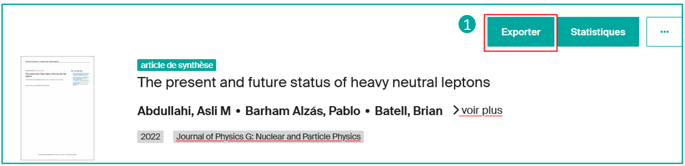
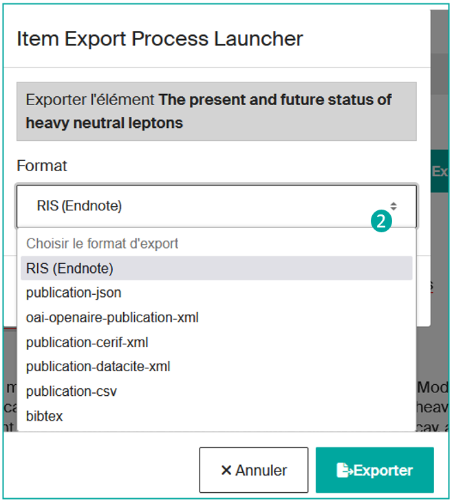
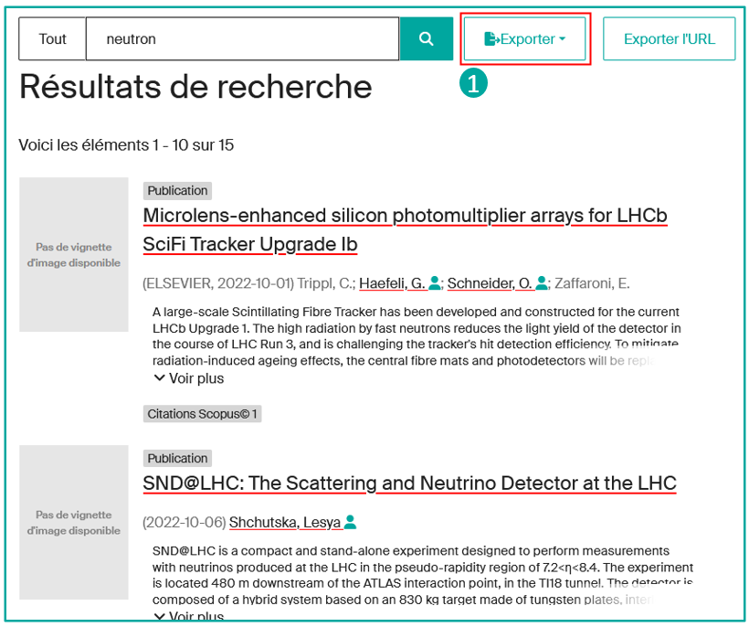
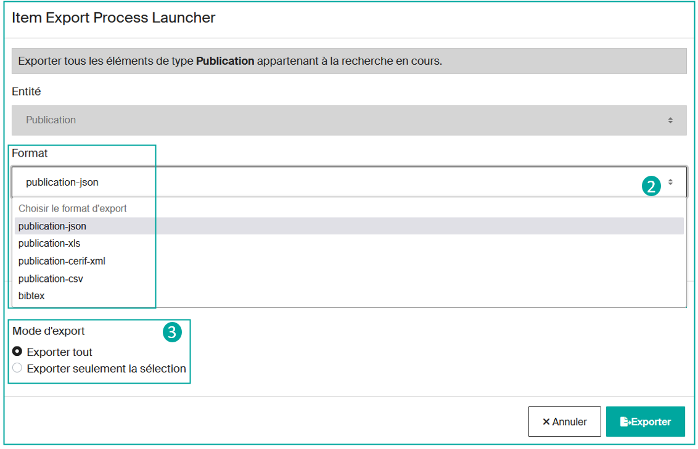
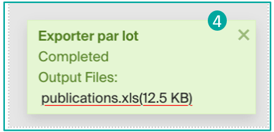
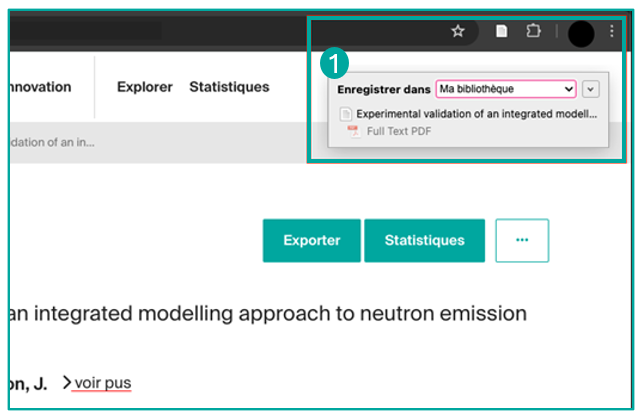
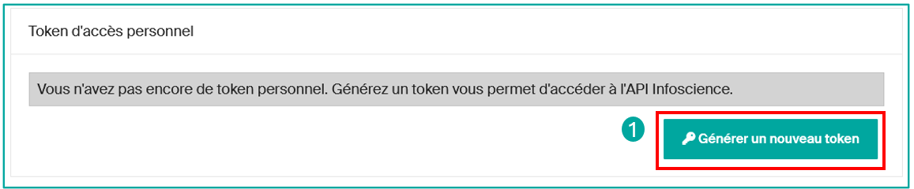

# Exporter, partager et réutiliser les données Infoscience (API, OAI, exports…)


---

## Préambule sur la réutilisation des données

**Conformément aux [conditions d'utilisation](https://www.epfl.ch/campus/library/services-researchers/infoscience-en/charter-deposit-licence-and-conditions-of-use/) de la plateforme Infoscience, les métadonnées d'Infoscience sont placées sous licence [Creative Commons CC0 1.0](https://creativecommons.org/publicdomain/zero/1.0/deed.fr). Cette licence permet l'utilisation, la modification et la redistribution des métadonnées sans nécessiter de consentement préalable.** Le modèle de données d'Infoscience est décrit à cette [adresse](https://github.com/epfllibrary/infoscience-map).

**En tant qu'utilisateur.trice final.e, vous êtes autorisé.e à utiliser les œuvres mises à disposition sur Infoscience, à condition de respecter les droits d'auteur.trice et les termes de la licence associée.**

Cela inclut :

- **Citer correctement les auteur.trices**,
- **Fournir des mentions bibliographiques complètes** (titre, éditeur, année de publication, lien permanent : Handle),
- **Appliquer les conditions d'une licence copyleft** si spécifiée, telle que Creative Commons.

**Toute utilisation des contenus d'Infoscience à des fins autres que personnelles et non commerciales nécessite l'autorisation expresse des détenteur.trices des droits**. Les œuvres restreintes à la communauté EPFL ne peuvent être utilisées, téléchargées ou distribuées en dehors de ce cadre sans une autorisation formelle des auteur.trices.

**Vous êtes responsable de l'usage que vous faites de ces informations et devez assumer pleinement cette responsabilité.**

---

## Exporter les métadonnées

### Exporter et partager des références

**Infoscience propose divers formats d'export de références bibliographiques** afin de permettre aux utilisateur.trices de transférer facilement ces données vers différents systèmes ou services, comme des logiciels de gestion bibliographique tels que Endnote ou Zotero. Ces formats respectent les standards de métadonnées largement utilisés tels que DataCite, BibTeX, et RIS.

De plus, Infoscience propose également d'autres formats d'export structurés tels que CSV, JSON, et XML.

Ces services d'export sont accessibles **sans nécessiter d'authentification préalable**.

#### Depuis une notice simple — via le bouton « Exporter »

**En allant sur la notice détaillée d'une publication**, cliquez sur le bouton « **Exporter** » (**1**) :



Puis, **choisissez son format d'export parmi la liste proposée** (**2**) :



#### Depuis une liste de résultats — via le menu « Exporter »

**En allant sur une liste de résultats**, cliquez sur le bouton « **Exporter** » (**1**) :



Actuellement, Infoscience ne permet pas d'exporter l'ensemble des résultats en une seule opération. **Vous devez préalablement sélectionner la catégorie de contenu** que vous souhaitez exporter, par exemple les résultats de type « **Publication** », « **Dataset ou Produit** », ou « **Brevet** ».

Après avoir choisi la catégorie, **déterminez le format d'export** (**2**) souhaité parmi les options disponibles (json, xls, csv, bibtex, etc.).

Ensuite, **vous pouvez décider d'exporter tous les résultats ou seulement une sélection manuelle** (**3**).

!!! note
    L'exportation de tous les résultats peut prendre un certain temps, en fonction du volume de données à traiter.



**Une fois votre choix effectué, cliquez sur** le bouton « **Exporter** » pour démarrer le processus. Une fois terminé, vous pourrez récupérer le fichier généré (**4**).



### En utilisant le logiciel Zotero

Vous pouvez facilement **sauvegarder des références bibliographiques depuis une notice Infoscience**.

Pour cela, utilisez l'extension [Zotero Connector](https://www.zotero.org/download/connectors) et **cliquez sur le bouton « Save to Zotero »** dans votre navigateur afin de **capturer et sauvegarder la référence directement dans votre bibliothèque Zotero** (**1**).



---

## Réutiliser les métadonnées

### API REST

**URL d'accès :** `https://infoscience.epfl.ch/server/api`

Infoscience est une solution entièrement basée sur des services back-end fournis par une API de type [REST](https://fr.wikipedia.org/wiki/Representational_state_transfer).

Cette API est basée sur plusieurs standards pour assurer une interaction fluide et auto-documentée : [ALPS](https://datatracker.ietf.org/doc/html/draft-amundsen-richardson-foster-alps-04), [HATEOAS](https://spring.io/projects/spring-hateoas) et [HAL](https://en.wikipedia.org/wiki/Hypertext_Application_Language). Un **[HAL Browser](https://infoscience.epfl.ch/server/#/server/api)** dédié fournit une description complète de tous les points d'accès disponibles.

**Les réponses de l'API sont fournies dans un format standard exprimé en JSON.**

#### Accès anonyme

**L'API permet un accès en lecture seule aux métadonnées et aux fichiers publics sans nécessiter d'authentification.**

#### Accès via Token

**Les utilisateur.trices peuvent obtenir un token activable depuis leur compte sur la plateforme Infoscience**, qui leur accorde des droits d'accès spécifiques basés sur leur(s) rôle(s).

**Ce token est essentiel pour effectuer des requêtes authentifiées vers l'API et pour accéder aux ressources protégées.**

**Obtenir un Token :**

1. **Connectez-vous** à votre compte sur la plateforme Infoscience.
2. Cliquez sur **Compte et profil** sous votre icône de profil.
3. Faites défiler vers le bas et cliquez sur « **Générer un nouveau token** » (**1**).
4. Notez et conservez le token affiché dans un endroit sécurisé.



!!! warning
    Une fois généré, le token ne sera plus visible. Si vous le perdez, vous devrez en générer un nouveau.

#### Comptes de service

**Il est possible de créer un « compte de service »** (local) **qui n'est pas rattaché à un compte individuel afin de bénéficier de droits supplémentaires.** Dans des contextes spécifiques et justifiés, ces comptes peuvent également obtenir des droits en écriture.

Pour toute demande, veuillez contacter [infoscience@epfl.ch](mailto:infoscience@epfl.ch).

#### Bonnes pratiques de sécurité

- **Ne partagez jamais votre token** avec un tiers.
- **Évitez l'exposition** : ne l'incluez pas dans du code source partagé ou des dépôts publics (ex. GitHub).
- **En cas de suspicion de compromission**, générez un nouveau token en suivant la même procédure.

#### Documentation officielle de l'API

**Vous pouvez trouver la documentation officielle de l'API** à ces adresses :

- **DSpace :** [https://github.com/DSpace/RestContract](https://github.com/DSpace/RestContract)
- **Points d'accès spécifiques à la distribution DSpace-CRIS :** [https://github.com/4Science/Rest7Contract](https://github.com/4Science/Rest7Contract)

#### Exemples de requêtes

Ci-dessous quelques exemples de requêtes effectuées avec l'API. Pour connaître les index de recherche disponibles, référez-vous au [modèle de données](https://github.com/epfllibrary/infoscience-map).

**Récupérer une notice :**

```bash
curl --location 'https://infoscience.epfl.ch/server/api/core/items/{{uuid_item}}' \
--header 'accept: application/json, text/plain, */*' \
--header 'Authorization: Bearer VOTRE_TOKEN'
```

**Récupérer une notice avec ses bundles/bitstreams :**

```bash
curl --location 'https://infoscience.epfl.ch/server/api/core/items/{{uuid_item}}?embed=bundles/bitstreams' \
--header 'accept: application/json, text/plain, */*' \
--header 'Authorization: Bearer VOTRE_TOKEN'
```

**Rechercher des notices avec le critère « intelligence artificielle » :**

```bash
curl --location 'https://infoscience.epfl.ch/server/api/discover/search/objects?sort=score,DESC&page=0&size=20&configuration=researchoutputs&query=Artificial+intelligence' \
--header 'accept: application/json, text/plain, */*' \
--header 'Authorization: Bearer VOTRE_TOKEN'
```

**Rechercher des notices affiliées à une unité spécifique :**

```bash
curl --location 'https://infoscience.epfl.ch/server/api/discover/search/objects?sort=dc.date.issued,DESC&page=0&size=10&configuration=researchoutputs&query=unitOrLab:LASUR' \
--header 'accept: application/json, text/plain, */*' \
--header 'Authorization: Bearer VOTRE_TOKEN'
```

---

### Entrepôt OAI-PMH

Infoscience est compatible avec le protocole [OAI-PMH](https://www.openarchives.org/pmh/) (Open Archives Initiative Protocol for Metadata Harvesting), un standard qui permet l'échange automatisé de métadonnées entre entrepôts de données.

**L'entrepôt OAI-PMH d'Infoscience** est accessible à l'adresse suivante :

```
https://infoscience.epfl.ch/server/oai/openaire4
```

#### Formats de métadonnées supportés

- Dublin Core (`oai_dc`)
- MarcXML (`marcxml`)
- [OpenAIRE Guidelines](https://guidelines.openaire.eu/) (`oai_openaire`)

#### Les principaux Sets OAI

| **Set Spec** | **Nom du Set** | **Description** |
|---|---|---|
| `OpenAIREv4` | OpenAIREv4 | Documents exposés à OpenAIRE |
| `fulltext-public` | fulltext-public | Documents en Open Access |
| `fulltext` | fulltext | Documents avec texte intégral |
| `theses-bn` | theses-bn | Thèses de doctorat soutenues à l'EPFL |
| `doi` | DOI | Documents avec un DOI attribué par l'EPFL |
| `col_20.500.14299_2` | Livres et parties de livres | Tous les documents de la collection Livres |
| `col_20.500.14299_3` | Conférences, Ateliers, Symposiums et Séminaires | Tous les documents de la collection Conférences |
| `col_20.500.14299_16` | Contenus | Tous les documents de la collection Contenus |
| `col_20.500.14299_4` | Datasets et Code | Tous les documents de la collection Datasets et Code |
| `col_20.500.14299_5` | Thèses EPFL | Tous les documents de la collection Thèses EPFL |
| `col_20.500.14299_6` | Images, Vidéos, Ressources interactives et Design | Tous les documents de la collection correspondante |
| `col_20.500.14299_7` | Articles de revues | Tous les documents de la collection Articles de revues |
| `col_20.500.14299_8` | Articles de journal, de magazine ou de blog | Tous les documents de la collection correspondante |
| `col_20.500.14299_10` | Brevets | Tous les documents de la collection Brevets |
| `col_20.500.14299_11` | Préprints et Documents de travail | Tous les documents de la collection correspondante |
| `col_20.500.14299_12` | Rapports, Documentation et Normes | Tous les documents de la collection correspondante |
| `col_20.500.14299_13` | Travaux étudiants | Tous les documents de la collection Travaux étudiants |
| `col_20.500.14299_14` | Matériel pédagogique | Tous les documents de la collection Matériel pédagogique |

#### Exemples de requêtes OAI

**Notices du set fulltext-public en Dublin Core :**

```
https://infoscience.epfl.ch/server/oai/openaire4?verb=ListRecords&metadataPrefix=oai_dc&set=fulltext-public
```

**Notices du set OpenAIREv4 en format oai_openaire :**

```
https://infoscience.epfl.ch/server/oai/openaire4?verb=ListRecords&metadataPrefix=oai_dc&set=openaire_data
```

**Notices créées ou modifiées entre le 13 et le 14 juillet 2024 :**

```
https://infoscience.epfl.ch/server/oai/openaire4?verb=ListRecords&metadataPrefix=oai_dc&from=2024-07-13T00:00:00Z&until=2024-07-14T23:59:00Z
```

---

[Retour à l'accueil de l'Aide](index.fr.md)
