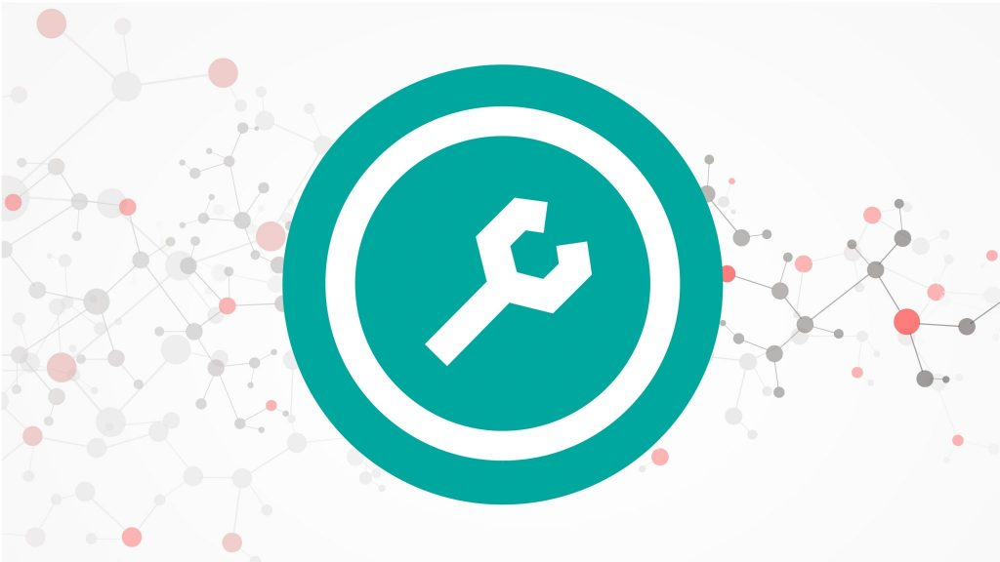
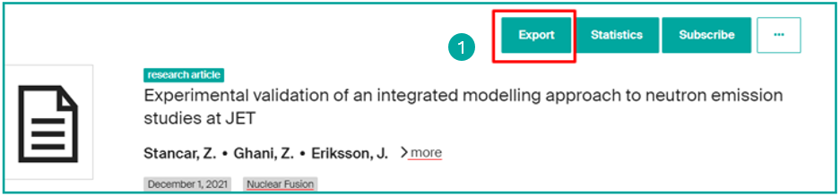
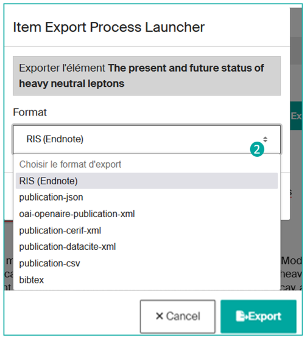
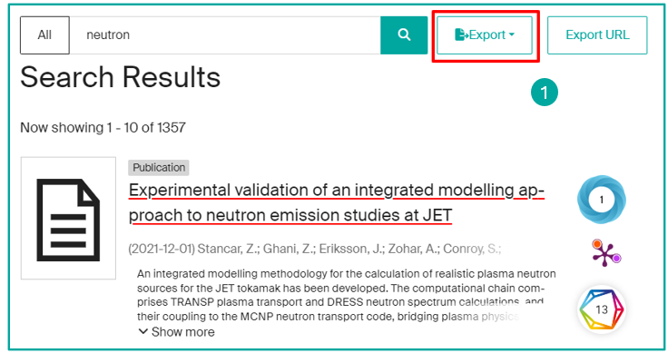
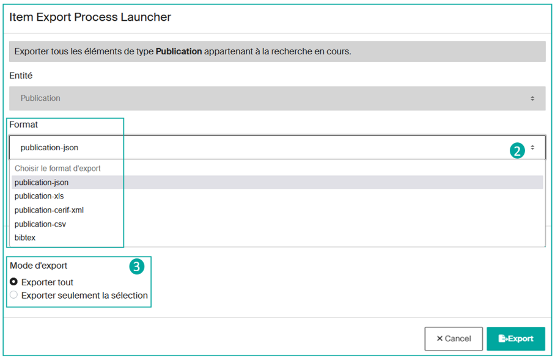
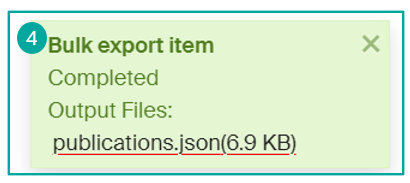
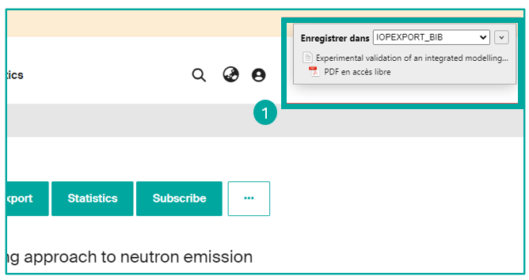
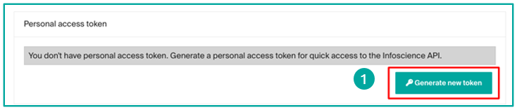

# Export, share, and reuse Infoscience data (API, OAI, exports, etc.)



---

## Preamble on data reuse

**According to the [terms of use](https://www.epfl.ch/campus/library/services-researchers/infoscience-en/charter-deposit-licence-and-conditions-of-use/) of the Infoscience platform, the Infoscience metadata are licensed under [Creative Commons CC0 1.0](https://creativecommons.org/publicdomain/zero/1.0/). This license allows the use, modification, and redistribution of the metadata without requiring prior consent**. The Infoscience data model is described at this [address](https://github.com/epfllibrary/infoscience-map).

**As an end user, you are permitted to use the works made available on Infoscience, provided that you respect the copyright and the terms of the associated license.**

This includes:

- **Properly cite the authors**,
- **Provide complete bibliographic references** (title, publisher, year of publication, permanent link: Handle),
- **Apply the terms of a copyleft license** if specified, such as Creative Commons.

**Any use of Infoscience content for purposes other than personal and non-commercial purposes requires the express authorization of the rights holders**. Works restricted to the EPFL community may not be used, downloaded or distributed outside this framework without the express permission of the authors.

It is your responsibility as the end user to appropriately assess the copyright and legal aspects related to the use of Infoscience content.

**You are responsible for your use of this information and must take full responsibility for it.**

---

## Export metadata

### Export and share references

**Infoscience offers various formats for exporting bibliographic references** to allow users to easily transfer this data to different systems or services, such as bibliographic management software such as Endnote or Zotero. These formats comply with widely used metadata standards such as DataCite, BibTeX, and RIS.

In addition, Infoscience also offers other structured export formats such as CSV, JSON, and XML, providing increased flexibility to meet specific user and system needs.

It is important to emphasize that these export services are accessible **without requiring prior authentication**.

**Users can export one or more references in a variety of ways.**

#### From a single record — via the "Export" button

**On the detailed record for a publication**, click on the **"Export"** button (**1**):



Then **choose the export format from the list** (**2**):



#### From a list of results — via the "Export" menu

**On a list of results**, click on the **"Export"** button (**1**):



Currently, Infoscience does not allow you to export all the results in a single operation. **You will first need to select the content** category you want to export, for example, "**Publication**", "**Dataset or Product**", or "**Patent**" results.

After choosing the category of results to be exported, **you will need to determine the desired export format** from the available options (json, xls, csv, bibtex, etc.) (**2**).

Then **you can decide to export all the results or just export a manual selection** (**3**).

!!! note
    It may take some time to export all the results, depending on the volume of data to be processed.



**Once you have made your choice, click on the "Export" button** to start the process. Once the file is complete, you will be able to recover the generated file (**4**).



### Using Zotero bibliographic management software

You can easily **save bibliographic references from an Infoscience record**.

To do this, use the [Zotero Connector](https://www.zotero.org/download/connectors) extension and **click on the "Save to Zotero"** button on your browser, in order **to capture and save the reference directly to your Zotero library** (**1**).



---

## Reuse metadata

### REST API

**Access URL:** `https://infoscience.epfl.ch/server/api`

Infoscience is a solution based entirely on back-end services provided by a [REST](https://en.wikipedia.org/wiki/Representational_state_transfer) API.

This API is based on several standards to ensure a smooth and self-documenting interaction: [ALPS](https://datatracker.ietf.org/doc/html/draft-amundsen-richardson-foster-alps-04) (Application Level Profile Semantics), [HATEOAS](https://spring.io/projects/spring-hateoas) (Hypertext As The Engine Of Application State) and [HAL](https://en.wikipedia.org/wiki/Hypertext_Application_Language) (Hypertext Application Language). A dedicated [**HAL Browser**](https://infoscience.epfl.ch/server/#/server/api) provides a complete description of all available endpoints.

**API responses are provided in a standard format expressed in JSON**. In addition, each API response includes links to the following operations available, allowing the API to describe itself and guide the user through its interactions.

#### Anonymous access

**The API allows read-only access to metadata and public files without requiring authentication.**

This allows any user to view publicly available information.

#### Access via Token

**Users can obtain an activatable token from their account on the Infoscience platform**, which grants them specific access rights based on the role(s) assigned to them.

**This token is essential for making authenticated requests to the API and for accessing protected resources.**

**Get a Token:**

1. **Log in** to your account on the Infoscience platform.
2. Click on **Account and profile** under your profile icon.
3. Scroll down and click on "**Generate a new token**" (**1**).
4. Write down and keep the displayed token in a secure place.



!!! warning
    Once generated, the token will no longer be visible. If you lose it, you'll need to generate a new one.

#### Service accounts

**It is possible to create a** (local) "**service account**" **that is not attached to an individual account to benefit from additional rights**. In specific, justified contexts, these accounts can also obtain write rights.

For any request, please contact [infoscience@epfl.ch](mailto:infoscience@epfl.ch).

#### Security best practices

To ensure the security of your token, please follow these recommendations:

- **Never share your token:** Never pass your token on to a third party, as this could compromise the security of your access.
- **Avoid exposure:** Don't include it in shared source code or public repositories (for example, on GitHub).
- **If you suspect that your token has been compromised or if you have lost it**, you can generate a new one by following the same steps as for the first obtainment.

#### Official API Documentation

**You can find the official documentation of the API** based on the DSpace solution and the DSpace-CRIS distribution at these addresses:

- **DSpace:** [https://github.com/DSpace/RestContract](https://github.com/DSpace/RestContract)
- **DSpace-CRIS distribution-specific endpoints:** [https://github.com/4Science/Rest7Contract](https://github.com/4Science/Rest7Contract)

#### Some examples of queries

Below are some examples of requests made with the API. To find out which search indexes are available, please refer to the [data model](https://github.com/epfllibrary/infoscience-map).

**Get item:**

```bash
curl --location 'https://infoscience.epfl.ch/server/api/core/items/{{uuid_item}}' \
--header 'accept: application/json, text/plain, */*' \
--header 'Authorization: Bearer YOUR_TOKEN'
```

**Get item with bundles/bitstreams:**

```bash
curl --location 'https://infoscience.epfl.ch/server/api/core/items/{{uuid_item}}?embed=bundles/bitstreams' \
--header 'accept: application/json, text/plain, */*' \
--header 'Authorization: Bearer YOUR_TOKEN'
```

**Search items with 'artificial intelligence' criteria:**

```bash
curl --location 'https://infoscience.epfl.ch/server/api/discover/search/objects?sort=score,DESC&page=0&size=20&configuration=researchoutputs&query=Artificial+intelligence' \
--header 'accept: application/json, text/plain, */*' \
--header 'Authorization: Bearer YOUR_TOKEN'
```

**Search items affiliated with a specific unit:**

```bash
curl --location 'https://infoscience.epfl.ch/server/api/discover/search/objects?sort=dc.date.issued,DESC&page=0&size=10&configuration=researchoutputs&query=unitOrLab:LASUR' \
--header 'accept: application/json, text/plain, */*' \
--header 'Authorization: Bearer YOUR_TOKEN'
```

---

### OAI-PMH

Infoscience is compatible with the [OAI-PMH](https://www.openarchives.org/pmh/) (Open Archives Initiative Protocol for Metadata Harvesting), a standard that allows the automated exchange of metadata between data warehouses. It facilitates access to and management of information about digital assets.

**Infoscience's OAI-PMH** repository is accessible at the following address:

```
https://infoscience.epfl.ch/server/oai/openaire4
```

#### Supported metadata formats

**The Infoscience repository supports several metadata formats**, including:

- Dublin Core (`oai_dc`)
- MarcXML (`marcxml`)
- [OpenAIRE Guidelines for Literature, Institutional, and Thematic Repositories](https://guidelines.openaire.eu/) (`oai_openaire`)

#### The main OAI Sets

| **Set Spec** | **Set Name** | **Description** |
|---|---|---|
| `OpenAIREv4` | OpenAIREv4 | Documents exhibited to OpenAIRE |
| `fulltext-public` | fulltext-public | Documents in open access |
| `fulltext` | fulltext | Documents with fulltext |
| `theses-bn` | theses-bn | PhD theses defended at EPFL |
| `doi` | DOI | Documents with a DOI assigned by EPFL |
| `col_20.500.14299_2` | Books and Book parts | All the documents in the Books and Book parts collection |
| `col_20.500.14299_3` | Conferences, Workshops, Symposiums, and Seminars | All the documents in the Conferences, Workshops, Symposiums, and Seminars collection |
| `col_20.500.14299_16` | Contents | All the documents in the Contents collection |
| `col_20.500.14299_4` | Datasets and Code | All the documents in the Datasets and Code collection |
| `col_20.500.14299_5` | EPFL thesis | All the documents in the EPFL thesis collection |
| `col_20.500.14299_6` | Images, Videos, Interactive resources, and Design | All the documents in the Images, Videos, Interactive resources, and Design collection |
| `col_20.500.14299_7` | Journal articles | All the documents in the journal articles collection |
| `col_20.500.14299_8` | Newspaper, Magazine, or Blog post | All documents in the Newspaper, Magazine, or Blog post collection |
| `col_20.500.14299_10` | Patents | All documents in the Patents collection |
| `col_20.500.14299_11` | Preprints and Working Papers | All documents in the Preprints and Working Papers collection |
| `col_20.500.14299_12` | Reports, Documentation, and Standards | All documents in the Reports, Documentation, and Standards collection |
| `col_20.500.14299_13` | Student works | All documents in the Student works collection |
| `col_20.500.14299_14` | Teaching Materials | All documents in the Teaching Materials collection |

#### Examples of OAI requests

**Records of the fulltext-public set in Dublin Core:**

```
https://infoscience.epfl.ch/server/oai/openaire4?verb=ListRecords&metadataPrefix=oai_dc&set=fulltext-public
```

**OpenAIREv4 set records in oai_openaire format:**

```
https://infoscience.epfl.ch/server/oai/openaire4?verb=ListRecords&metadataPrefix=oai_dc&set=openaire_data
```

**Records created or modified between July 13 and July 14, 2024:**

```
https://infoscience.epfl.ch/server/oai/openaire4?verb=ListRecords&metadataPrefix=oai_dc&from=2024-07-13T00:00:00Z&until=2024-07-14T23:59:00Z
```

---

[Back to Help home](index.md)
