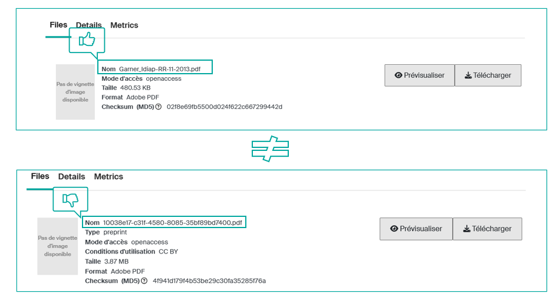

# Conseils pour le dépôt de vos fichiers (nommage, formats, versions)

Il est essentiel que les déposants de fichiers privilégient des **formats durables**, pour éviter la perte de lisibilité. Ils sont également encouragés à soigner le **nommage et le versionnage des fichiers**, car ils conditionnent leur identification et leur réutilisation.

---

## Formats de fichiers

Privilégiez des formats de fichiers qui :

- sont **couramment utilisés** et de **haute qualité** ;
- **peuvent être lus par plusieurs logiciels** ;
- ne sont **pas propriétaires** (free and open source software) ;
- sont **ouverts et documentés** ;
- ne sont **pas compressés, ni cryptés**.

| **Type de fichier** | **Niveau de confiance élevé** | **Niveau de confiance moyenne** | **Niveau de confiance bas** |
|---|---|---|---|
| **Document texte** | PDF/A-1 – ISO 19005-1 (.pdf) Plain Text UTF-8 (.txt) XML with included schema (.xml) | HTML (.htm, .html) LaTeX (.latex, .tex, .ltx) Word 2007+ (.docx) PDF with embedded fonts (.pdf) Rich Text Format 1.x (.rtf) SGML (.sgml) | Word 2003 ou antérieur (.doc) PDF chiffré (.pdf) WordPerfect (.wpd) |
| **Feuille de calcul** | CSV / TSV (.csv, .tsv, .txt) SIARD (.siard) | Excel 2007+ (.xlsx) OpenDocument (.ods) XML (.xml) | Excel 2003 ou antérieur (.xls) |
| **Présentation** | PDF/A-1 (.pdf) | PowerPoint 2007+ (.ppt, .pptx) OpenDocument Presentation (.odp) | PDF générique (.pdf) PowerPoint (.ppt) Keynote (.key) |
| **Image** | PNG 24bit (.png) TIFF non compressé (.tif, .tiff) | DNG (.dng) GIF (.gif) JPEG2000 sans perte (.jp2) JPEG/JFIF (.jpg) PNG 8bit (.png) TIFF compressé (.tif, .tiff) | JPEG2000 avec perte (.jp2) Photoshop (.psd) Formats RAW (.raw, etc) |
| **Audio** | AIFF non compressé (.aif, .aiff) FLAC (.flac) WAV non compressé (.wav) | AAC (.mp4) ALAC (.m4a) MP3 (.mp3) SUN audio non compressé (.au, .snd) | AIFC compressé (.aifc) RealAudio (.ra, .rm) WAV compressé (.wav) WMA (.wma) |
| **Vidéo** | AVI non compressé (.avi) QuickTime non compressé (.mov) | MXF non compressé (.mxf) Motion JPEG2000 (.jp2) MPEG-1, MPEG-2 (.mp1, .mp2) MPEG-4 H.264 (.mp4) | RealVideo (.rv, .rm) QuickTime compressé (.mov) WMV (.wmv) |
| **CAD** | PDF/E – ISO 24517-1:2008 (.pdf) | AutoCAD (.dwg) DXF (.dxf) | N/A |
| **Archives** | ZIP (.zip) TAR (.tar) GZIP (.gz) RAR (.rar) | N/A | N/A |
| **Données** | JSON (.json) XML (.xml) SQL (.sql) | N/A | N/A |
| **Code source** | Fichiers de code (.py, .java, .cpp, .html, .css, .js, etc.) | N/A | N/A |

---

## Nommage des fichiers

**Respectez ces quelques règles pour le nommage des fichiers** que vous déposez sur Infoscience :

- **Choisissez un nom signifiant** pour votre fichier.
- **Évitez les noms trop longs** (max. 32 caractères, y compris l'extension).
- **N'utilisez ni caractères accentués, ni caractères spéciaux** (espace # @ & € + …).
- **Placez un underscore** `_` **entre les termes si besoin**.
- **Évitez les conjonctions** (et, sur, de, à propos…) et les articles inutiles (le-la, un-une…).
- **Évitez les abréviations**, sauf si elles sont bien connues à l'EPFL.
- **N'écrivez pas le nom de l'auteur.trice/propriétaire dans le titre**. Cette information est déjà présente dans les métadonnées de la notice.

**Exemples :**

---

## Versions de fichiers

**Infoscience permet de déposer plusieurs versions éditoriales du même document sur une seule notice** en utilisant l'option « créer une nouvelle version » (voir [Déposer une publication](submit-a-publication.fr.md#mettre-a-jour-une-notice-publiee-creer-une-nouvelle-version)).

**La version renseigne sur l'état du document** selon son avancement dans le cycle de publication.

| **Version** | **Définition** |
|---|---|
| **Preprint ou submitted version** | Version soumise, avant peer-reviewing, pas encore acceptée. |
| **Postprint ou accepted version** | Version acceptée après peer-reviewing, avant mise en page éditeur. |
| **Published version** | Version finale acceptée par une revue, peer-reviewed, corrigée par l'auteur.trice, et mise en forme par l'éditeur.trice de la revue pour être publiée. |

!!! tip
    **Si la politique de l'éditeur le permet, déposez la *published version***, avec l'embargo éventuellement imposé. Il est **toujours autorisé de déposer *preprint* et *postprint*.**

---

[Retour à l'accueil de l'Aide](index.fr.md)
