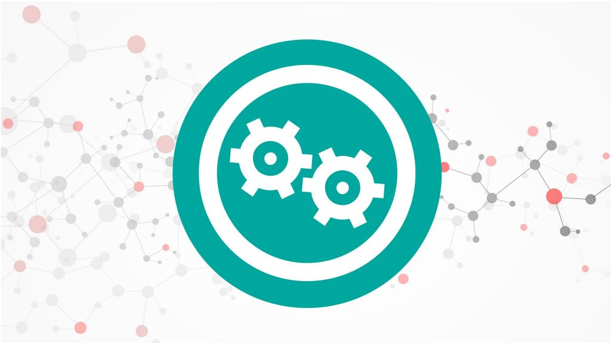
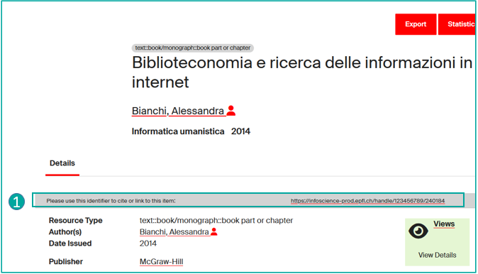

# Obtenir un identifiant (Handle, DOI, ISBN)

**La plateforme Infoscience garantit la citabilité des publications et travaux déposés grâce à un service d'identifiants permanents.**
Les PIDs (persistent identifiers) assurent l'identification univoque et pérenne des ressources déposées. Ils facilitent la citation et le partage des publications et travaux.

---

## Attribution systématique de Handle

Le numéro Handle permet d'identifier de façon unique une ressource en ligne (document, vidéo, etc.).

Sur Infoscience, chaque notice a un Handle => **identifiant univoque et pérenne** que vous pouvez utiliser **pour référencer, citer une publication, un profil de chercheur.euse, un laboratoire.**

Vous trouverez le Handle dans la notice détaillée (**1**) (voir page [Rechercher et consulter](search-and-consult.fr.md)).

---

## Obtenir un DOI

Le DOI (Digital Object Identifier) est un **lien permanent ou persistant** attribué à une ressource numérique, qui pointe durablement vers son emplacement sur Internet.

Lorsque vous publiez un article, l'éditeur lui assigne un DOI, afin de le rendre durablement accessible en ligne.

La Bibliothèque de l'EPFL attribue de façon automatique et systématique un DOI à **chaque thèse de doctorat EPFL**.

Ce n'est pas le cas pour les autres documents, qui souvent reçoivent déjà un DOI de la part des éditeurs.

**Il vous est possible de demander l'attribution d'un DOI** à l'équipe Infoscience, **si les conditions suivantes sont remplies :**

- **La publication ne doit pas déjà posséder un DOI.** Si la publication est diffusée par un éditeur ou un organisateur de conférence, il leur revient d'attribuer le DOI.
- **Le travail scientifique doit avoir été fait à l'EPFL** et au moins un des auteurs doit y être affilié. Pour des actes de conférence organisée à l'EPFL, au moins un des éditeurs scientifiques doit être affilié à l'École.
- **Le texte intégral de la publication doit être chargé sur Infoscience et impérativement disponible en Open Access sous licence libre.** Il est possible d'attribuer le DOI avant le dépôt pour mentionner l'identifiant dans le document.

Si vous souhaitez obtenir un DOI pour vos publications et/ou en savoir plus sur les conditions ci-dessus, veuillez contacter l'équipe Infoscience : [infoscience@epfl.ch](mailto:infoscience@epfl.ch).

!!! info
    Une fois le DOI généré, il sera actif sous **24h**.

---

## Obtenir un ISBN

L'**ISBN** (International Standard Book Number) est un **numéro d'identification unique attribué à chaque édition d'un ouvrage**. Il est attribué automatiquement par l'éditeur et permet d'identifier de manière univoque chaque livre publié.

Vous pouvez solliciter l'attribution d'un ISBN pour votre ouvrage auprès de la Bibliothèque EPFL, **si les conditions suivantes sont remplies** :

- Le **contenu n'est ni publié ni accepté** pour publication ailleurs ;
- Au moins **un.e des auteur.rices est affilié.e à l'EPFL** ;
- Le **contenu doit être publié en Open Access**.

Si vous souhaitez obtenir un ISBN pour un ouvrage et/ou en savoir plus sur les conditions ci-dessus, veuillez contacter l'équipe Infoscience : [infoscience@epfl.ch](mailto:infoscience@epfl.ch).

!!! info
    Une fois l'ISBN généré, il sera actif sous **24h**.

---

[Retour à l'accueil de l'Aide](index.fr.md)
