# Gérer la page de mon laboratoire / unité

---

## Accéder à la page de mon unité

L'accès à la page d'une unité dans Infoscience peut se faire de différentes manières :

**Parcourir les unités**

- Via l'icône « ***Unités EPFL*** » depuis la page d'accueil

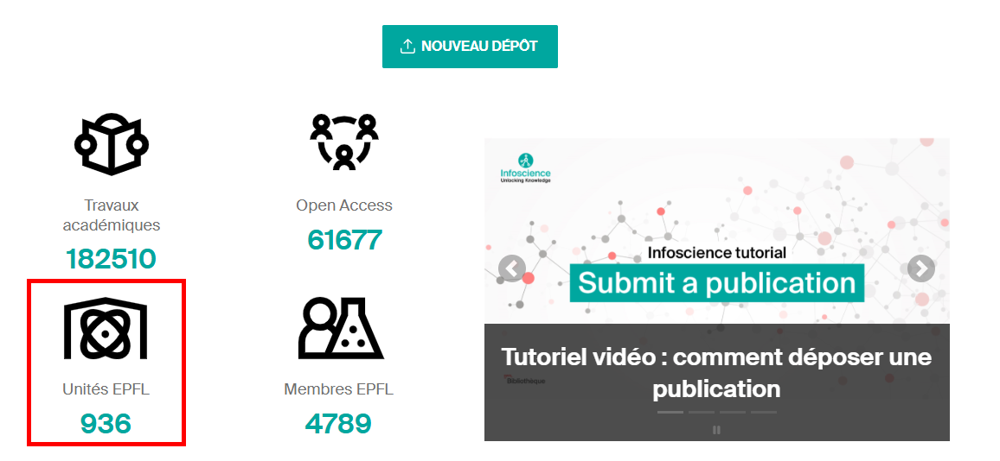

- Via l'onglet ***Explorer*** puis « ***Unité EPFL*** » depuis le menu principal

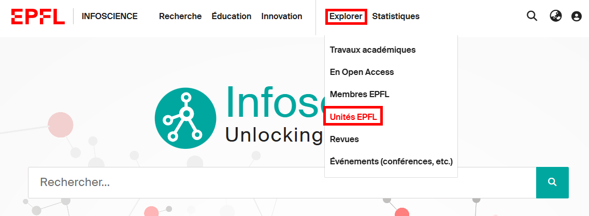

**Rechercher une unité**

- Saisissez l'acronyme ou le nom de l'unité dans l'un des champs dédiés et cliquez sur « Rechercher ».
- Pour afficher toutes les unités répertoriées, cliquez directement sur « Rechercher » sans saisir de nom ou d'acronyme.

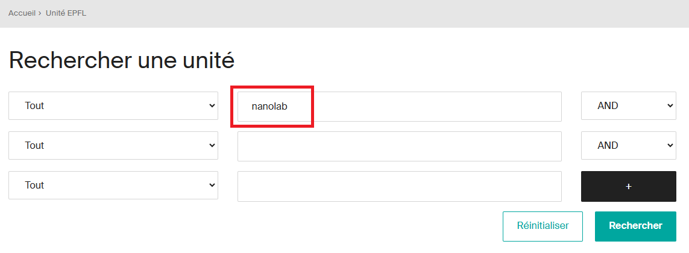

- Une fois la recherche effectuée, depuis la liste des résultats, cliquez sur le nom de l'unité souhaitée pour accéder à sa page descriptive.

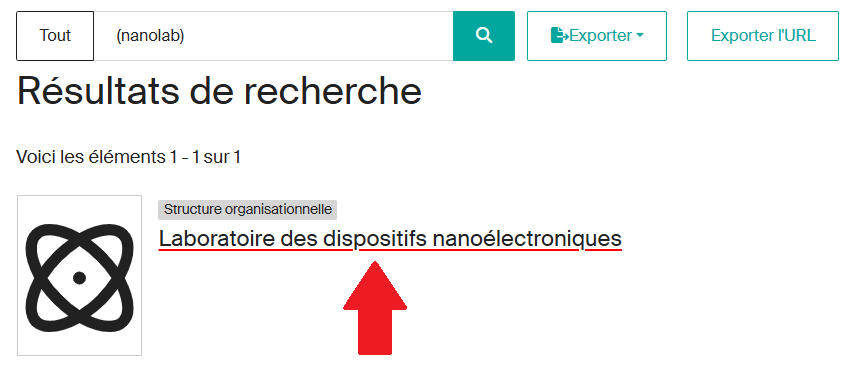

---

## Informations affichées sur la page de l'unité

La page d'une unité fournit ces informations par défaut :

- Son acronyme
- Le nom du ou de la responsable
- Son rattachement institutionnel à l'unité parente directe
- Son statut (actif ou fermé)
- La liste des travaux académiques
- La liste des membres affiliés

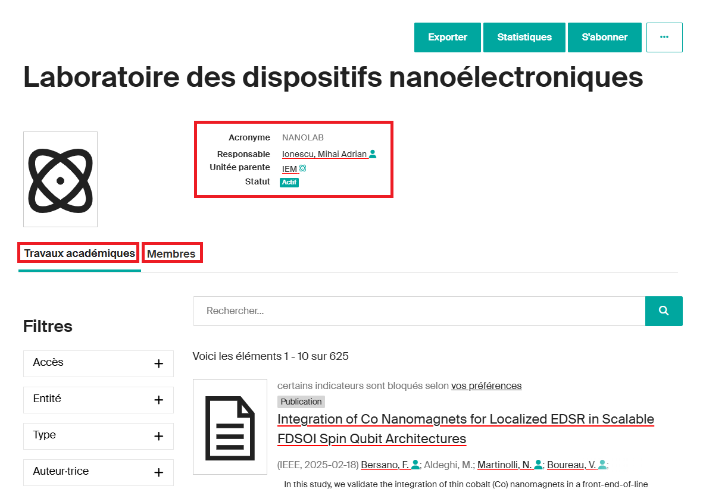

*Les unités parentes héritent dynamiquement des publications des unités filles.*

---

## Fonctionnalités principales

Plusieurs actions sont possibles depuis la page d'une unité :

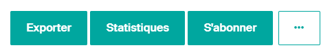

- **Exporter :** Permet d'exporter les données de l'unité sous divers formats (*XML, JSON, PDF…*). L'export isolé des publications n'est pas possible ici.
- **Statistiques :** Affiche les statistiques de consultations et de téléchargements de l'unité et des publications liées, avec la possibilité de les exporter en *Excel* ou *CSV*.
- **S'abonner :** Option réservée aux utilisateurs authentifiés pour recevoir des notifications sur les nouvelles publications de l'unité (voir section [Recevoir des notifications sur les publications et statistiques de mon unité](#recevoir-des-notifications-sur-les-publications-et-statistiques-de-mon-unite)).
- **Accéder aux options :** En cliquant sur « … », vous pouvez consulter l'ensemble des métadonnées ou procéder à des modifications de la notice (voir section [Mettre à jour les informations sur la page de mon unité](#mettre-a-jour-les-informations-sur-la-page-de-mon-unite)).

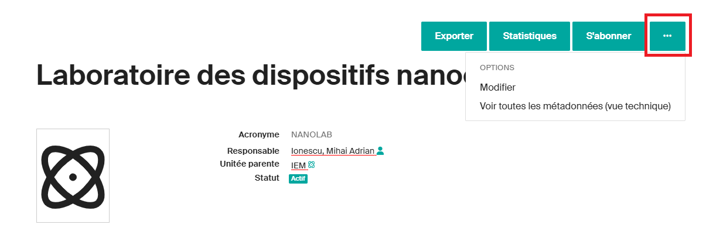

---

## Mettre à jour les informations sur la page de mon unité

En tant que responsable d'unité (ou personne déléguée), vous pouvez modifier certaines informations directement depuis la page de votre unité.

**Procédure de modification**

Rendez-vous sur la page de votre unité, cliquez sur « **…** », puis sélectionnez **« Modifier »**.

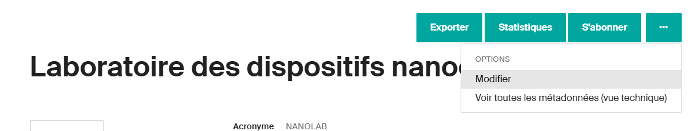

Les champs suivants sont éditables :

- **Délégation de la gestion** (attribuable à plusieurs personnes) — voir section [Déléguer la gestion des publications de mon unité](#deleguer-la-gestion-des-publications-de-mon-unite).

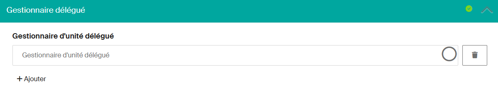

- **Ajout d'un alias** (autre acronyme ou variante du nom de l'unité).

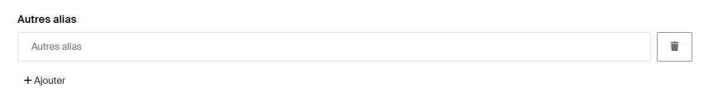

- **Mise à jour de la date de création de l'unité**.

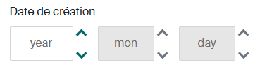

- **Ajout d'identifiants** spécifiques à votre unité.

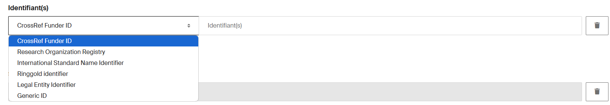

- **Modification de la description**.

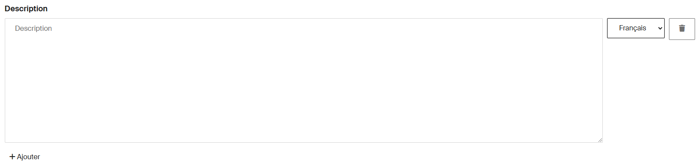

- **Changement du type d'unité**.

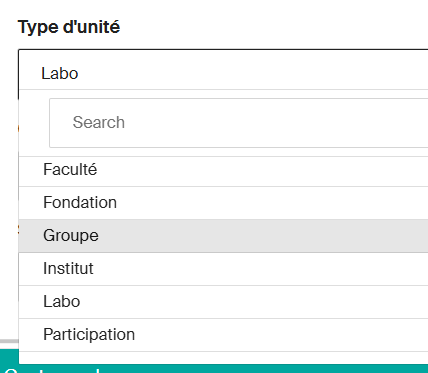

- **Personnalisation de l'URL**, pour choisir l'acronyme de votre unité par exemple.

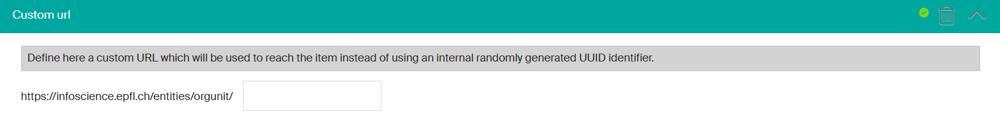

- **Ajout de document**.

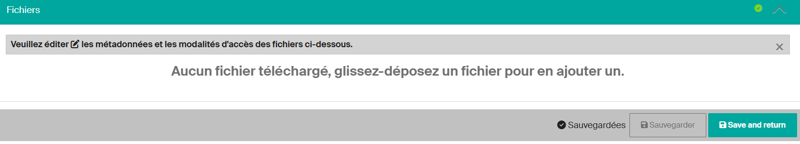

- **Ajout d'un logo**.

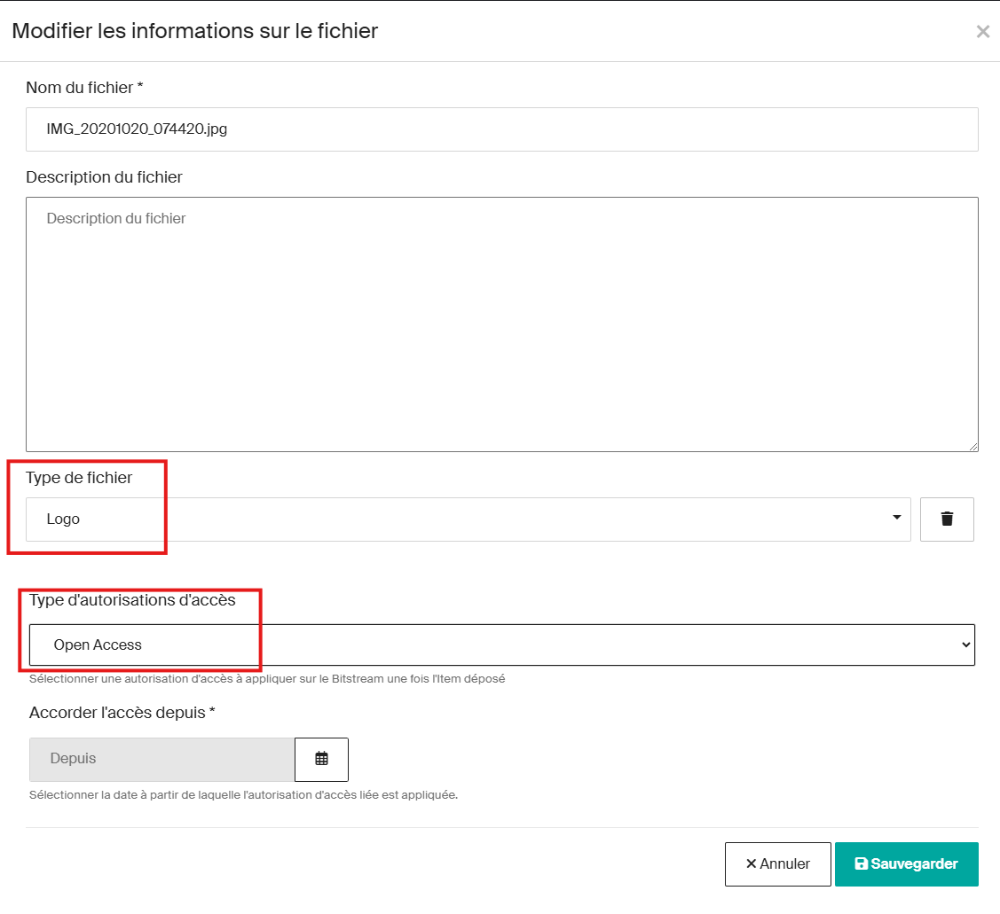

!!! note
    Certaines informations sont grisées et ne sont pas modifiables. Ce sont des champs importés depuis les référentiels *units.epfl.ch* et *people.epfl.ch*. En cas d'erreur, pour que la source soit corrigée, contactez [dri@epfl.ch](mailto:dri@epfl.ch).

---

## Déléguer la gestion des publications de mon unité

Le ou la responsable d'unité peut déléguer la gestion des publications à un ou plusieurs membres de son équipe. Au préalable, la personne désignée doit s'être authentifiée au moins une fois sur Infoscience en utilisant le bouton vert « Se connecter avec son compte EPFL ».

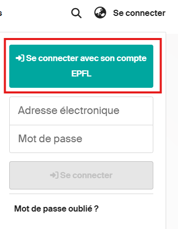

**Comment déléguer cette gestion ?**

- **Depuis la page de votre unité**, cliquez sur **« … »**, puis sélectionnez **« Modifier »**.

- **Dans la section « Gestionnaire d'unité délégué »**, commencez à saisir le nom de la personne concernée et sélectionnez-la.

- **Cliquez sur « Sauvegarder »** pour enregistrer la modification.

*Les personnes déléguées auront accès à la gestion des publications et recevront les courriels d'alertes associées aux abonnements.*

---

## Recevoir des notifications sur les publications et statistiques de mon unité

Infoscience vous offre la possibilité de suivre facilement les nouvelles publications et mises à jour (contenus et statistiques) liées à votre unité. Configurez vos préférences pour recevoir des notifications automatiques à la fréquence de votre choix.

**Depuis la page de votre unité :**

- **Cliquez sur « S'abonner »** depuis la page de votre unité.

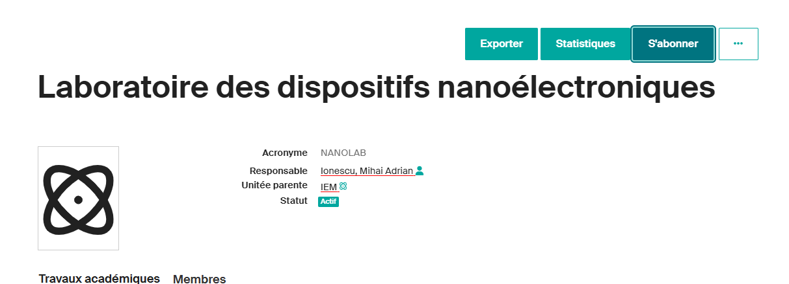

- **Choisissez la fréquence de réception des alertes** (*quotidienne, hebdomadaire ou mensuelle*).

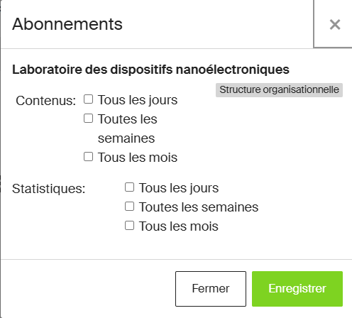

- **Pour modifier ou supprimer un abonnement**, accédez à votre profil puis cliquez sur **« Abonnements »**.

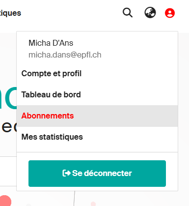

- **Ajustez ou désactivez les notifications** selon vos préférences.

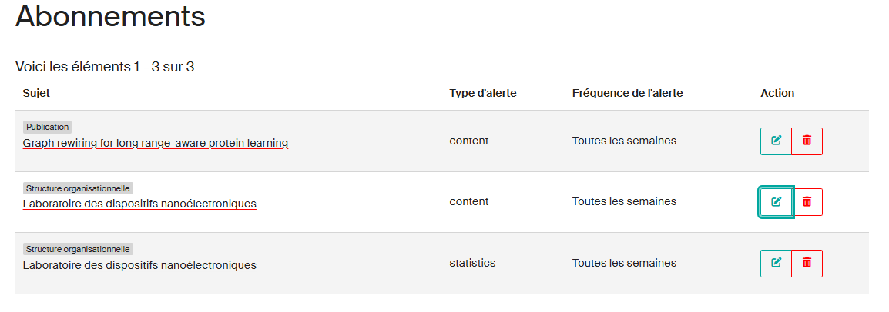

!!! note
    La fonctionnalité **« S'abonner »** est disponible pour l'ensemble des contenus Infoscience : depuis une **publication**, une **personne**, une **revue**, un **événement**, et donc une **unité**.

    Les rapports sont systématiques et vous informent de l'état de la cible que des modifications y ait été apportées ou non. Nous recommandons de paramétrer une **fréquence hebdomadaire ou mensuelle** pour éviter un trop grand nombre de notifications.

---

## Ajouter ou rejeter l'attribution d'une unité à une publication

En tant que responsable d'unité (ou [personne déléguée](#deleguer-la-gestion-des-publications-de-mon-unite)), vous avez la possibilité de modifier les affiliations des publications attribuées à votre unité ou laboratoire, ou celles dont au moins une autrice ou un auteur est affilié.

- Depuis une notice attribuée à votre unité, cliquez sur le bouton « … », puis sélectionnez « **Modifier les attributions aux unités/laboratoires** ».

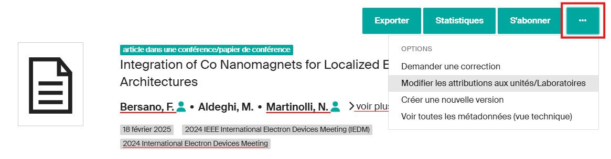

- Procédez aux ajustements de l'affiliation de la publication. Vous pouvez :
    - **Supprimer** la mention à votre unité en cliquant sur l'icône Poubelle.
    - **Ajouter** une autre unité en cas de collaboration.

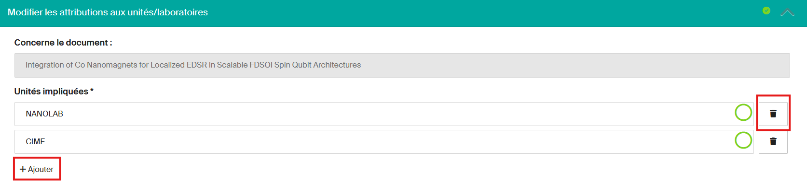

### Accepter ou rejeter une publication attribuée à mon unité

**Évolution du processus d'attribution des publications**

Précédemment, lorsqu'un membre de l'EPFL déposait une publication et l'associait à une unité à laquelle il n'était pas affilié, une alerte était envoyée au responsable de l'unité ou à une personne déléguée pour validation. Si l'attribution était confirmée, la publication était rattachée à l'unité ; dans le cas contraire, elle était rejetée et restait invisible dans Infoscience.

La nouvelle version d'Infoscience adopte une approche **opt-out** afin de fluidifier et d'optimiser la gestion des publications. L'attribution reste contrôlée, mais elle est désormais gérée **en aval du dépôt**.

**Principales améliorations :**

- **Renforcement des mécanismes d'importation** : Infoscience élargit ses sources certifiées en intégrant, en plus du Web of Science, la base de données Scopus.
- **Fiabilisation des affiliations** : en s'appuyant sur les référentiels institutionnels et les identifiants chercheurs (ORCID), Infoscience associe automatiquement une publication à une unité si l'un de ses auteurs y était affilié au moment de la publication, selon les données d'accréditation EPFL.

Bien que ces évolutions améliorent la gestion des publications, des erreurs d'attribution peuvent survenir. Les responsables d'unité conservent donc la possibilité de **superviser les publications associées à leur unité** et d'intervenir si nécessaire. Ce nouveau fonctionnement garantit une intégration plus efficace des publications tout en maintenant un contrôle rigoureux des attributions.

**Une notice est automatiquement associée à votre unité si l'un de ses auteurs y est affilié**, en fonction de son accréditation EPFL au moment de la publication.

---

## Mettre à jour un dépôt publié

En tant que **responsable d'unité (ou personne déléguée)**, vous avez la possibilité de mettre à jour une publication attribuée à votre unité en :

- **créant une nouvelle version**, qui conservera l'historique des modifications.
- **demandant une correction**, qui modifiera la notice sans conserver d'historique.

Cette option s'applique également aux publications dont le déposant ou l'un des auteurs est affilié à votre unité.

!!! tip "Pourquoi créer une nouvelle version ?"
    - Vous avez déposé un *preprint* et souhaitez le remplacer par la version publiée.
    - Vous souhaitez assurer le suivi éditorial des évolutions de la publication.
    - Vous voulez conserver une trace des versions successives.

!!! tip "Quand effectuer une demande de correction ?"
    - Vous souhaitez corriger une erreur sur un champ spécifique (titre, auteur, affiliation, etc.).
    - Vous voulez ajouter une information complémentaire.
    - Vous avez besoin de remplacer, ajouter un fichier associé ou modifier ses métadonnées.

### Créer une nouvelle version

1. Ouvrez la publication concernée.
2. Cliquez sur le bouton **« … »** en haut à droite.

    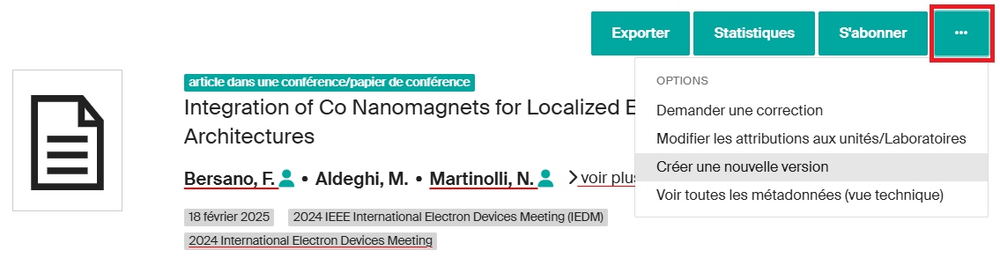

3. Sélectionnez **« Créer une nouvelle version »**.
4. Précisez dans le sommaire le commentaire qui sera affiché publiquement.

    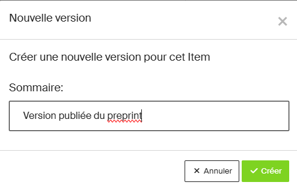

5. Modifiez ou ajoutez les champs nécessaires dans le formulaire.
6. Remplacez les fichiers joints et mettez à jour leurs métadonnées si nécessaire.
7. Déposez la nouvelle version.

**Gestion des versions dans Infoscience :**

- La **dernière version publiée** sera celle affichée par défaut.
- Les anciennes versions restent archivées et consultables via l'onglet « **Versions** ».

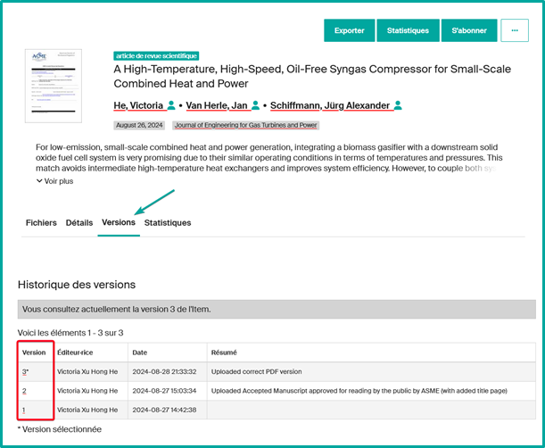

*La nouvelle version sera examinée par l'équipe Infoscience avant diffusion.*

### Demander une correction

1. Ouvrez la notice concernée.
2. Cliquez sur le bouton **« … »** en haut à droite.

    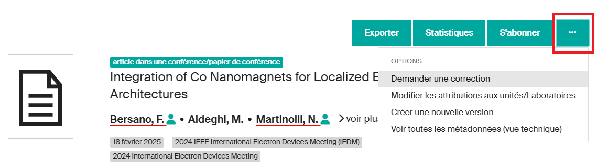

3. Cliquez sur le bouton **« Demander une correction »**.
4. Modifiez les champs souhaités dans le formulaire.
5. Retirez ou ajoutez un fichier et renseignez ses métadonnées obligatoires, en cliquant sur l'icône d'édition.

    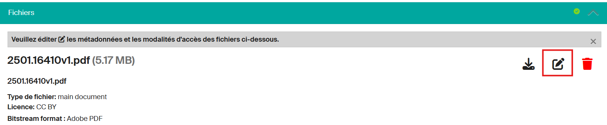

6. Rédigez un message explicatif dans le champ *« Notes pour le curateur »* si nécessaire.
7. Validez votre demande en cliquant sur **« Déposer »**.

*Toute demande de correction sera validée par l'équipe Infoscience avant diffusion.*

---

## Ajouter une publication manquante

Infoscience est alimenté quotidiennement par l'import automatique des publications de l'EPFL à partir de sources certifiées telles que Web of Science et Scopus.

Certaines publications peuvent cependant échapper à cette récolte. Dans ce cas, vous avez la possibilité de les ajouter manuellement en suivant la procédure détaillée sur notre [page d'aide](submit-a-publication.fr.md) et notre [tutoriel vidéo](https://www.youtube.com/watch?v=WTJt7sDSa3s).

---

## Synchroniser ma liste de publications avec la page web de mon unité

La synchronisation avec une page web externe repose sur une requête dynamique provenant d'Infoscience. Cette connexion permet d'afficher en temps réel toutes les publications liées à l'unité.

Si vous désirez restreindre la liste à un type de document précis ou à une période donnée, une requête spécifique sera nécessaire. Contactez-nous pour obtenir l'URL correspondante.

**Pour procéder à la synchronisation :**

1. **Récupérez l'URL de votre unité** en la copiant depuis la barre d'adresse de votre navigateur.

    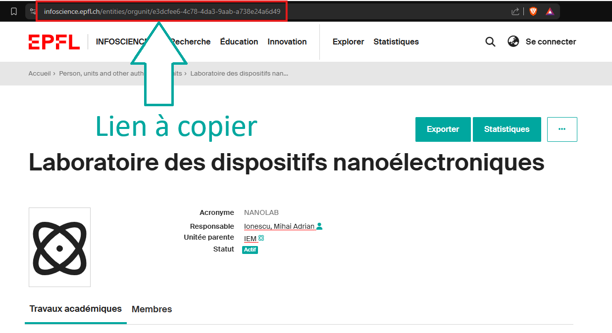

2. **Connectez-vous à WordPress** avec vos identifiants Gaspar (droits d'accès requis).

3. **Ajoutez un bloc « EPFL Infoscience »** sur une page existante ou créez-en une nouvelle.

    

4. **Collez l'URL copiée** dans le champ « Infoscience URL ».

    

5. **Ajustez les paramètres d'affichage.** Dans un souci d'ergonomie, nous vous conseillons de :
    - Limiter le nombre de publications affichées à **200** pour plus de lisibilité.
    - Sélectionner l'option de tri « *Year, then document type* » pour organiser les publications par année.

    

6. **Sauvegardez la page** pour appliquer les modifications.

!!! note
    Le bloc infoscience dans WordPress est limité à **500 entrées**. Si la liste de vos publications dépasse ce nombre, pensez à les répartir par tranches chronologiques grâce à des requêtes spéciales (nous contacter).

    Il est aussi possible d'ajouter un bouton, tel que **« Voir toutes les publications »**, à l'aide du bloc WordPress **« EPFL button »** pour rediriger vers l'URL Infoscience de votre unité.

    Si votre site dispose de versions en plusieurs langues, assurez-vous de répercuter les modifications sur chacune d'elles.

Pour toute assistance supplémentaire, contactez-nous à [infoscience@epfl.ch](mailto:infoscience@epfl.ch).

---

## Exporter les publications de mon unité

Infoscience propose divers formats d'exportation de références bibliographiques pour faciliter leur intégration dans d'autres systèmes et logiciels de gestion, notamment *EndNote* et *Zotero*. Ces formats respectent les standards internationaux les plus utilisés (Datacite, BibTeX, RIS).

En complément, Infoscience propose des formats facilitant l'intégration dans des bases de données et outils analytiques (CSV, JSON, XML).

Ces options d'exportation sont librement accessibles, **sans nécessité d'authentification préalable**.

### Exporter une référence/notice

1. Depuis la notice détaillée d'une publication, cliquez sur **« Exporter »**.

    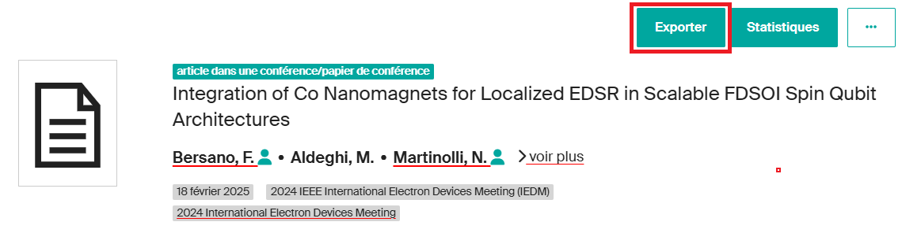

2. Sélectionnez le format souhaité parmi ceux proposés.

    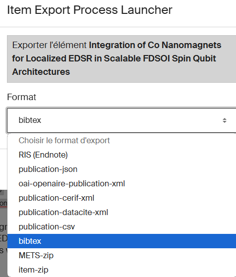

3. **Cliquez sur « Exporter »** et téléchargez le fichier généré une fois l'opération terminée.

### Exporter une sélection de références/notices

1. Effectuez une recherche et cliquez sur **« Exporter »** depuis la page des résultats.

    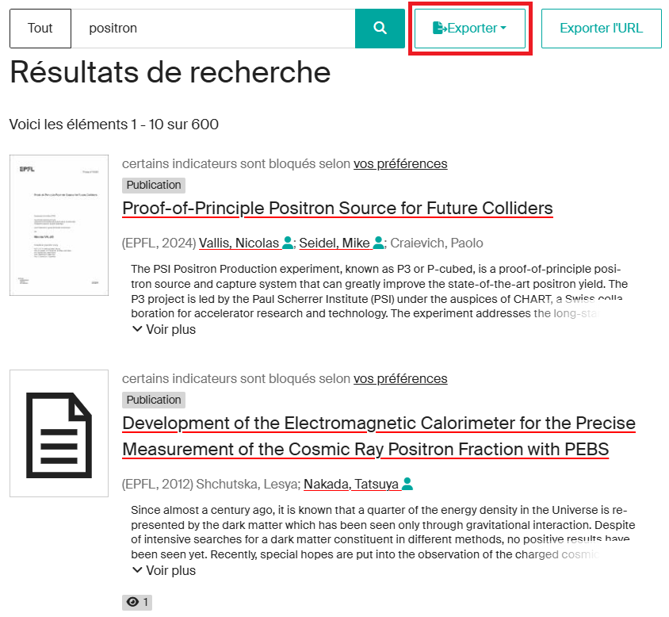

2. Infoscience ne permet pas encore d'exporter tous les résultats en une seule opération : vous devez **choisir une catégorie de contenu** (*Publication*, *Dataset*, *Brevet*, etc.).
3. **Sélectionnez le format d'exportation** (*JSON, CSV, BibTeX, XML*, etc.).
4. Déterminez si vous souhaitez exporter **toutes les notices** de la recherche ou une **sélection manuelle**.

    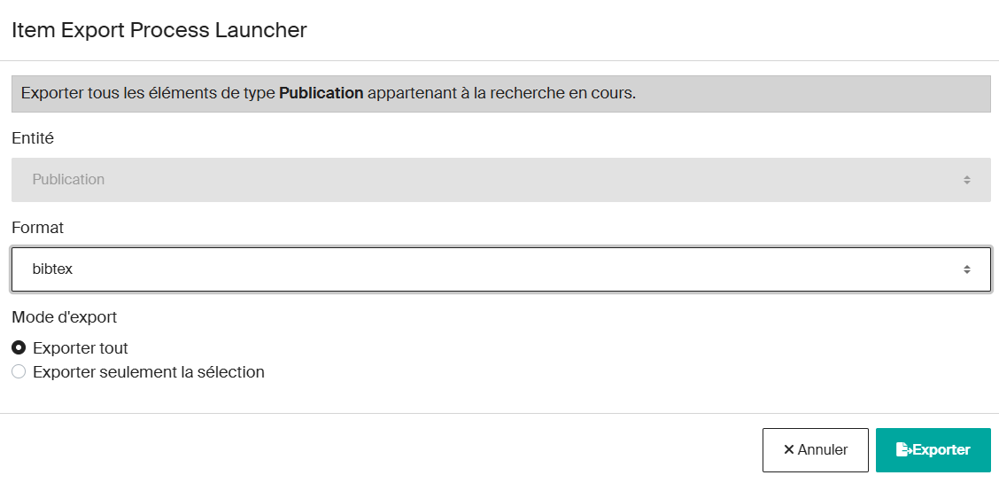

5. Cliquez sur **« Exporter »** et téléchargez le fichier généré une fois l'opération terminée.

    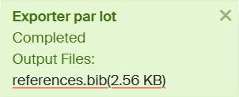

*L'export peut prendre du temps selon le volume de données.*

### Exporter vers le logiciel de gestion bibliographique Zotero

Infoscience permet une exportation directe vers *Zotero* via l'extension [*Zotero Connector*](https://www.zotero.org/download/connectors).

1. Ouvrez la notice souhaitée.
2. Cliquez sur l'icône **« Enregistrer dans Zotero »** de votre navigateur.

    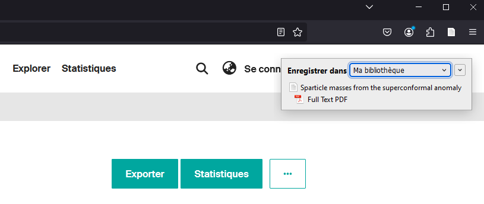

3. La référence sera automatiquement enregistrée dans votre bibliothèque *Zotero*.

Pour toute assistance, contactez-nous à [infoscience@epfl.ch](mailto:infoscience@epfl.ch).

---

[Retour à l'accueil de l'Aide](index.fr.md)
