# Manage my lab/unit page

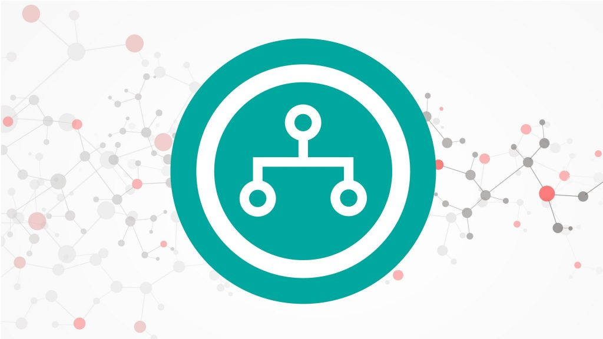

---

## Manage my unit page

To access a unit page, several options are available on Infoscience:

**From the Infoscience homepage**

- Click on **Units EPFL** icon

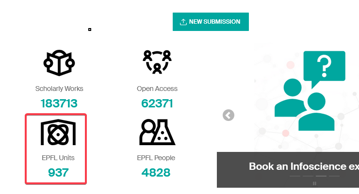

- Through the top bar menu under **Explore (1) > EPFL Units (2)**

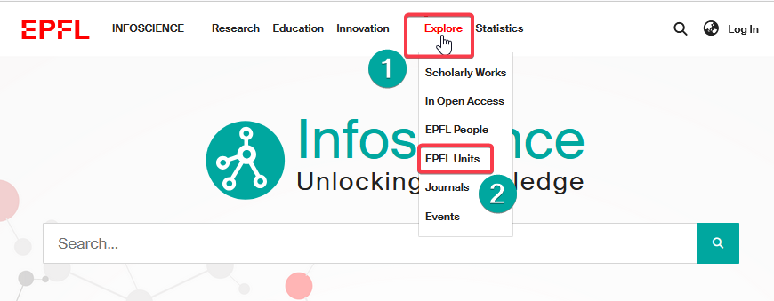

**Find a unit**

- Enter the acronym or unit name in one of the dedicated fields and click on "Search".
- To display all the units, click directly on "Search" without entering a name or acronym (empty search).

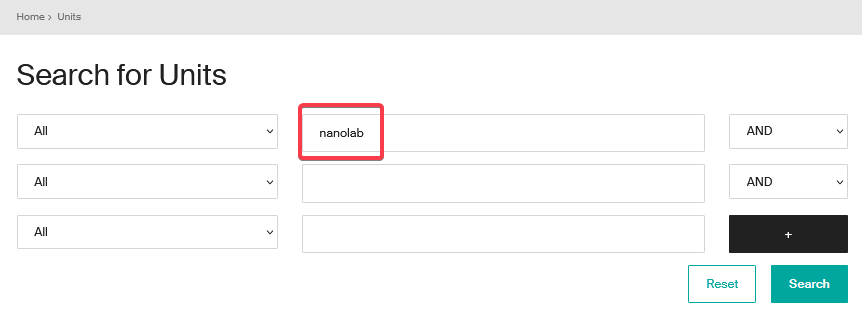

- **Selection from results:** once the search has been completed, click on the name of the unit to access its description page.

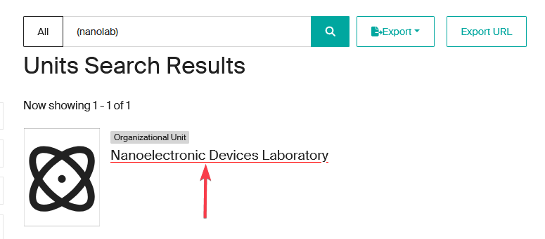

---

## Information displayed on the unit page

The unit page provides this information by default:

- Unit acronym
- Name of the Head of unit/Director
- Institutional affiliation to its direct hierarchical parent unit
- Unit status (if active or closed)
- List of related scholarly works (**1**)
- List of affiliated members (**2**)

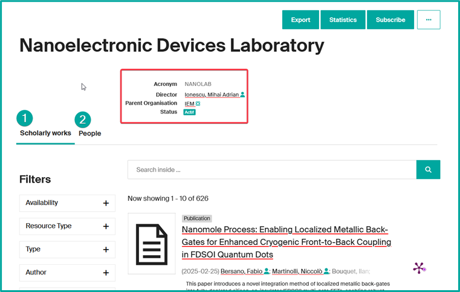

*Parent units dynamically inherit publications from subordinate units.*

---

## Main features

Several actions can be performed from the unit page:

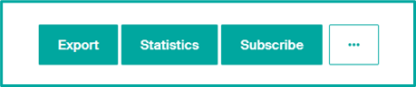

- **Export:** export unit's profile data in various formats (*XML, JSON, PDF…*). Export of publications is not possible here.
- **Statistics**: to view the number of consultations and downloads of the unit's profile and unit's publications. This data can be exported in Excel or CSV format.
- **Subscribe:** (authenticated users only): to be alerted to new publications from the unit (see [Receive notifications about my unit's publications and statistics](#receive-notifications-about-my-units-publications-and-statistics)).
- **Go to options:** By clicking on "…" button, you can consult all the unit's data and change its record (see [Update my unit page information](#update-my-unit-page-information)).

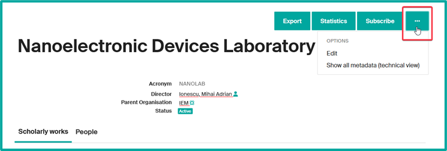

---

## Update my unit page information

As Head of unit (or his/her delegate), you can modify certain data directly from your unit's page.

**To modify:** go to your unit's page, click on "…" button (**1**), then select "Edit" (**2**).

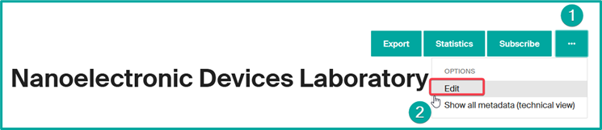

The following fields are editable:

- **Delegation of management** (attributable to several people) — see [Delegate the management of my unit's publications](#delegate-the-management-of-my-units-publications).

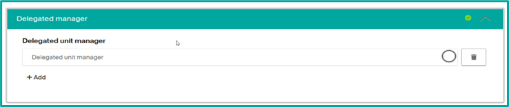

- **Add an alias** (variant name of the unit).

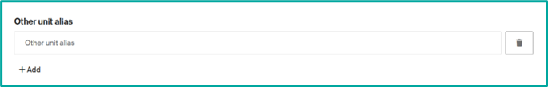

- **Update unit foundation date**.

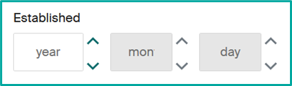

- **Add unit identifiers** based on the drop-down list options.

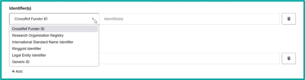

- **Description** field to present your unit or give relevant information to be displayed.

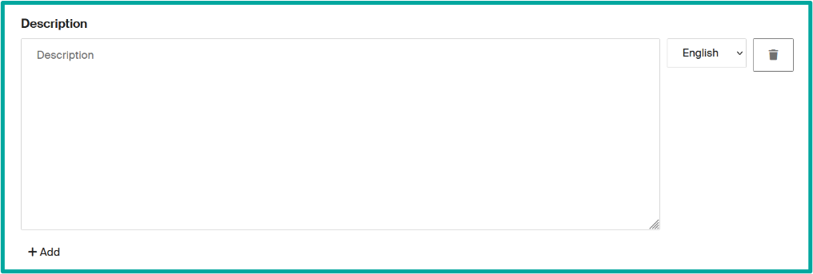

- **Unit type** to change the type of your unit (drop-down list options).

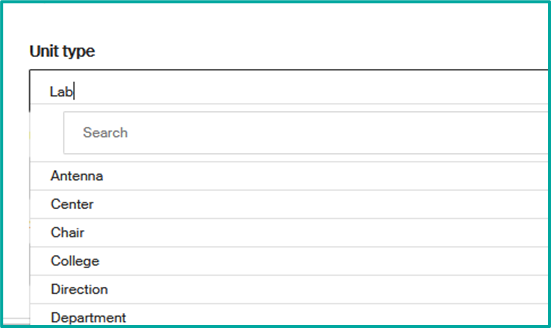

- **Custom URL** to replace the numerical URL provided by Infoscience. You may choose your lab acronym for example.

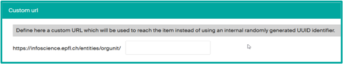

- **File upload** to add an image as a thumbnail.

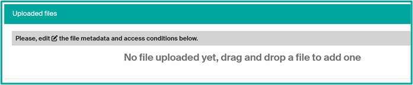

Select the drop files bar at the top:

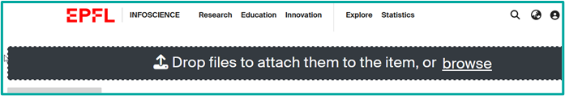

And drag or drop your file and then fill the file data (edit icon):

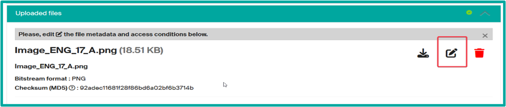

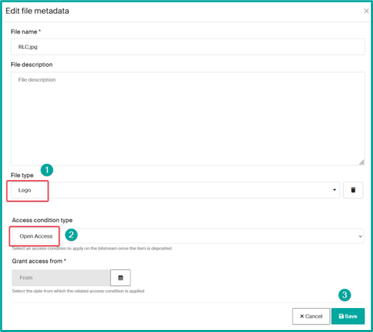

!!! note
    Some greyed-out data cannot be modified. This is imported data from our units.epfl.ch and people.epfl.ch trusted sources. In the event of an error, to have the source corrected, contact [dri@epfl.ch](mailto:dri@epfl.ch).

---

## Delegate the management of my unit's publications

The Head of unit may delegate publication management to one or more members of his or her team. This person must have logged on to Infoscience at least once, using the green "Log in with EPFL account" button.

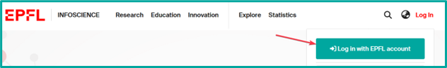

**How to delegate management?**

- **From your unit page**, click on the "…" button, then select "**Edit**".

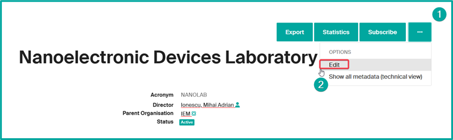

- In the "**Delegated manager**" section, start entering the name of the person concerned and select him or her.

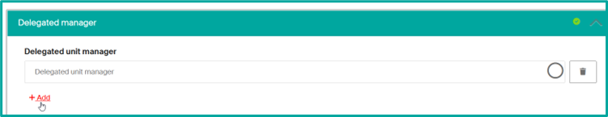

- **Click on "Save and return"** to save your changes.

*Delegates will have access to publications management and will receive e-mail alerts associated with subscriptions.*

---

## Receive notifications about my unit's publications and statistics

Infoscience lets you receive automatic notifications of new publications and updates (content and statistics) associated with your unit at a frequency you determine.

**From your unit's page:**

- **Click on "Subscribe"** from your unit's page.

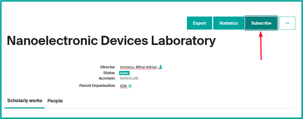

- **Select the frequency** of alerts (daily, weekly or monthly).

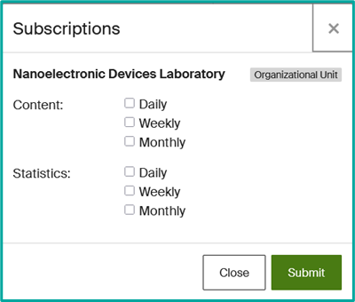

- **To modify or delete a subscription**, access your profile and click on "**Subscriptions**".

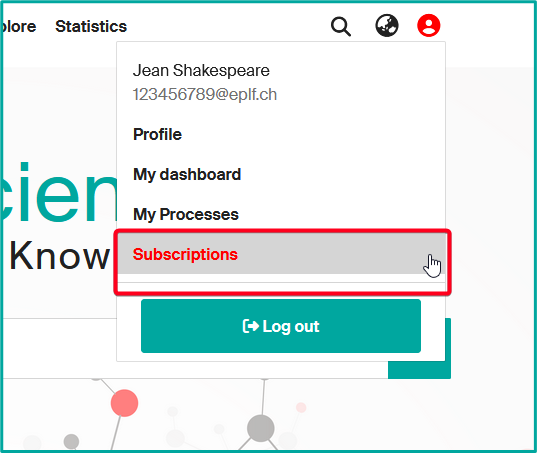

- **Adjust or deactivate notifications** according to your preferences.

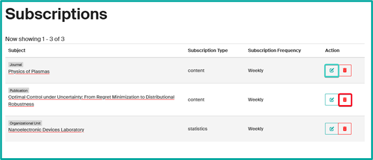

!!! note
    The "Subscribe" feature is available for all Infoscience content, i.e. from a publication, a person, a journal, an event, and therefore a unit.

    Reports are systematic and inform you of the status of the target, whether or not any changes have been made. We recommend setting a **weekly or monthly** frequency to avoid too many notifications.

---

## Add or reject the assignment of a unit to a publication

As a head of unit (or [delegated person](#delegate-the-management-of-my-units-publications)), you can modify the affiliations of publications attributed to your unit or laboratory, or those with at least one affiliated author.

- From a record assigned to your unit, click on the "…" button, then select "**Edit Unit/Lab affiliations**".

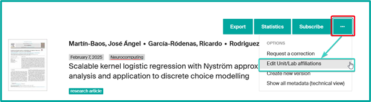

- Adjust the publication's affiliation. You can:
    - **Remove** the mention of your unit by clicking on the Trash icon.
    - **Add** another unit in case of collaboration.

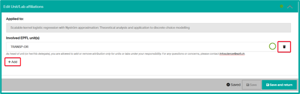

### Accept or reject a publication attributed to my unit

**Evolution of the publication attribution process**

Previously, when an EPFL member submitted a publication and associated it with a unit to which he or she was not affiliated, an alert was sent to the head of the unit or a delegated person (lab manager) for validation. If the attribution was confirmed, the publication was attached to the unit; if not, it was rejected and remained invisible in Infoscience. This validation was not required for members affiliated to the unit, nor for publications imported from the Web of Science, managed by the Infoscience curatorial team.

The new version of Infoscience adopts an **opt-out** approach to streamline and optimize publication management. Attribution remains controlled, but is **now managed downstream of the deposit**.

**Main improvements:**

- **Reinforced import mechanisms**: Infoscience expands its trusted sources by integrating the Scopus database in addition to the Web of Science.
- **More reliable affiliations**: based on institutional repositories and researcher identifiers (ORCID), Infoscience automatically associates a publication with a unit if one of its authors was affiliated to it at the time of publication, according to EPFL accreditation data.

Although these developments improve publication management, attribution errors can still occur. Unit managers therefore retain the possibility of **supervising publications associated with their unit** and intervening if necessary to adjust an attribution, by adding or deleting a publication. This new system guarantees more efficient integration of publications, while maintaining rigorous control over allocations.

A record is automatically associated with your unit if one of its authors is affiliated to it, according to his or her EPFL accreditation at the time of publication.

---

## Update a published submission

As a head of unit (or [delegate](#delegate-the-management-of-my-units-publications)), you can update a publication assigned to your unit by:

- **creating** a new version, which will retain the modification history
- **requesting** a correction, which will modify the record without keeping a history.

This option also applies to publications where the submitter or one of the authors is affiliated with your unit.

!!! tip "Why create a new version?"
    - You have deposited a *preprint* and wish to replace it with the published version.
    - You want to ensure editorial follow-up of publication evolutions.
    - You want to keep track of successive versions.

!!! tip "When to request a correction?"
    - You want to correct an error in a specific field (title, author, affiliation, etc.).
    - You want to add additional information.
    - You need to replace, add an associated file or modify its metadata.

### Create a new version

1. Retrieve and display the record.
2. Click on the "…" button at the top right.
3. Select **"Create new version"**.

    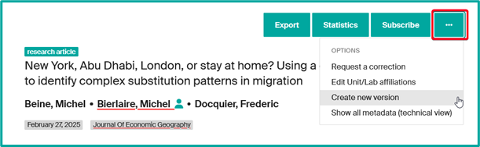

4. Specify in the Summary the comment that will be displayed publicly.

    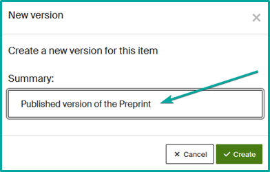

5. Modify or add the necessary fields in the form.
6. Replace attached files and update their metadata if necessary.
7. Submit the new version.

**Version management in Infoscience:**

- The **latest published version** will be displayed by default.
- Older versions remain archived and can be consulted via the "**Versions**" tab of the record.

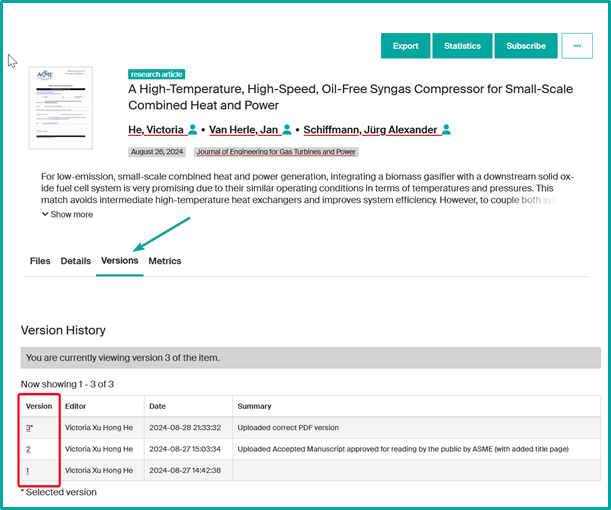

*The new version will be reviewed by the Infoscience team before release.*

### Request a correction

1. Retrieve and display the record.
2. Click on the "…" button at the top right.
3. Select "**Request a correction**".

    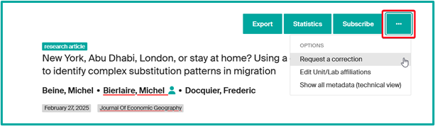

4. Modify or add the necessary fields in the form.
5. Replace attached files and update their metadata if necessary.

    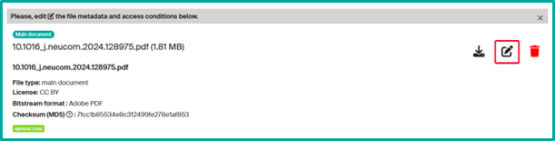

6. Write an explanatory message in the "**Notes for reviewer**" field to help us with the curation process.
7. Click on "**Deposit**" to confirm your request.

*All correction requests will be validated by the Infoscience Team before release.*

---

## Add a missing publication

Infoscience is populated daily by the automatic import of EPFL publications from trusted sources such as Web of Science and Scopus.

However, some publications may not be included. In this case, you can add them manually by following the procedure detailed on our [help page](submit-a-publication.md) and our [video tutorial](https://www.youtube.com/watch?v=WTJt7sDSa3s).

---

## Synchronize my publications list with my unit's web page

Synchronization with an external web page is based on a dynamic request from Infoscience. This connection displays all publications related to the unit in real time.

If you wish to restrict the list to a specific type of document or to a given period, a specific request will be necessary. Please contact us to obtain the corresponding URL.

**To perform synchronization:**

1. **Retrieve your unit's URL** by copying it from your browser's address bar.

    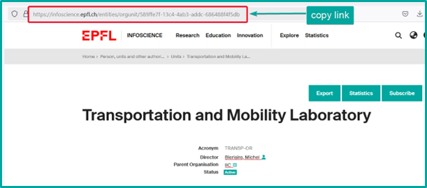

2. **Log in to WordPress** with your Gaspar credentials (access rights required).

3. **Add an "EPFL Infoscience" block** to an existing page or create a new one.

    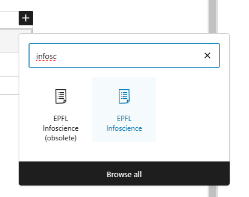

4. **Paste the copied URL** into the "A direct Infoscience URL" field.

    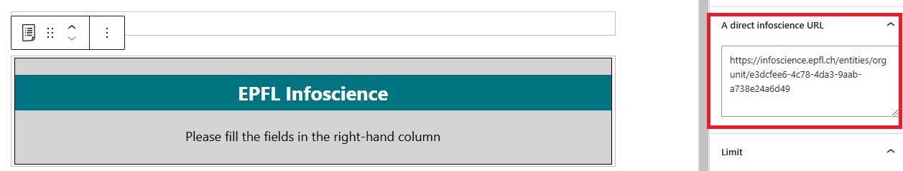

5. **Adjust display parameters**. For ease of use, we advise you to:
    - Limit the number of publications displayed to **200** for greater legibility.
    - Select the "*Year, then document type*" sorting option to organize publications by year.

    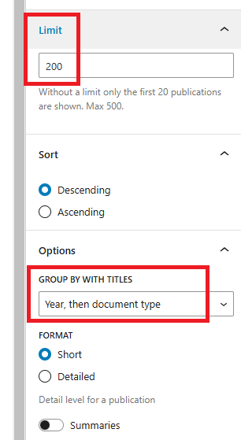

6. **Save the page** to apply changes.

!!! note
    The "Infoscience block" in WordPress is limited to **500 entries**. If the list of your publications exceeds this number, consider dividing them into chronological brackets using special queries (contact us).

    You may also add a button, such as "**See all publications**", using the WordPress "**EPFL button**" block to redirect to your unit's Infoscience URL.

    If your site has multiple language versions, make sure you apply the changes to all of them.

For further assistance, contact us at [infoscience@epfl.ch](mailto:infoscience@epfl.ch).

---

## Export my unit's publications

Infoscience offers a range of bibliographic reference export formats to facilitate their integration into other systems and management software, notably *EndNote* and *Zotero*. These formats comply with the most widely used international standards (Datacite, BibTeX, RIS).

In addition, Infoscience offers formats that facilitate integration into databases and analytical tools (CSV, JSON, XML).

These export options are freely accessible, with **no need for prior authentication**.

### Export a record

1. Click on "**Export**" in the record details.

    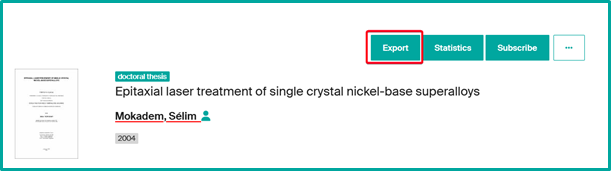

2. Select the desired format from the list.

    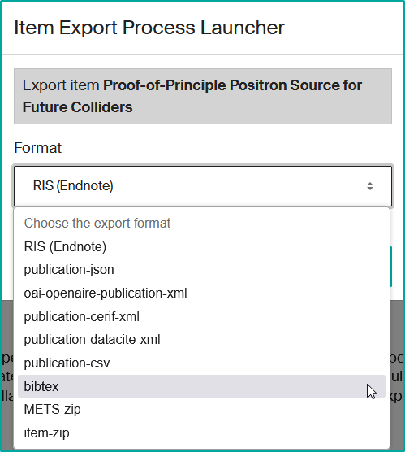

3. Click on "**Export**" and download the generated file once the operation is complete.

### Export a selection of records

1. Perform a search (e.g. "positron") and click on "**Export**" from the results page.

    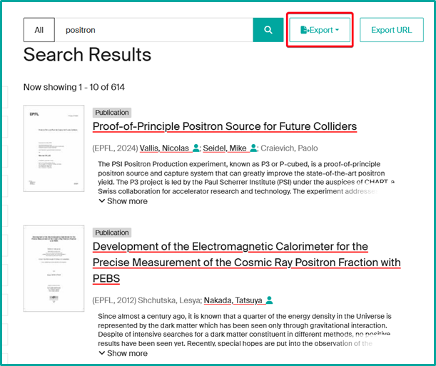

2. Infoscience does not yet allow you to export all results in a single operation: you must **select a content category** (*Publication*, *Dataset*, *Patent*, etc.).
3. **Select the export format** (*JSON*, *CSV*, *BibTeX*, *XML*, etc.).
4. Decide whether you wish to **export all** the records in the search or a **manual selection**.

    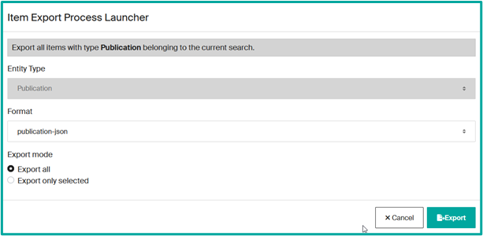

5. Click on "**Export**" and download the generated file once the operation is complete.

    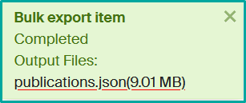

*Export may take some time, depending on the volume of data.*

### Export to Zotero citation manager

Infoscience allows direct export to *Zotero* via the [*Zotero Connector*](https://www.zotero.org/download/connectors) extension.

1. Open the requested record.
2. Click on the "**Save to Zotero**" icon in your browser.

    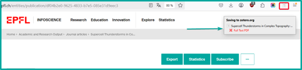

3. The reference will be automatically saved in your *Zotero* library.

For assistance, contact us at [infoscience@epfl.ch](mailto:infoscience@epfl.ch).

---

[Back to Help home](index.md)
