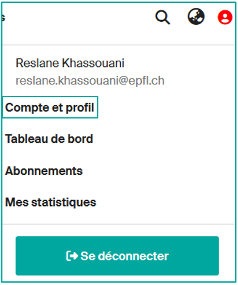
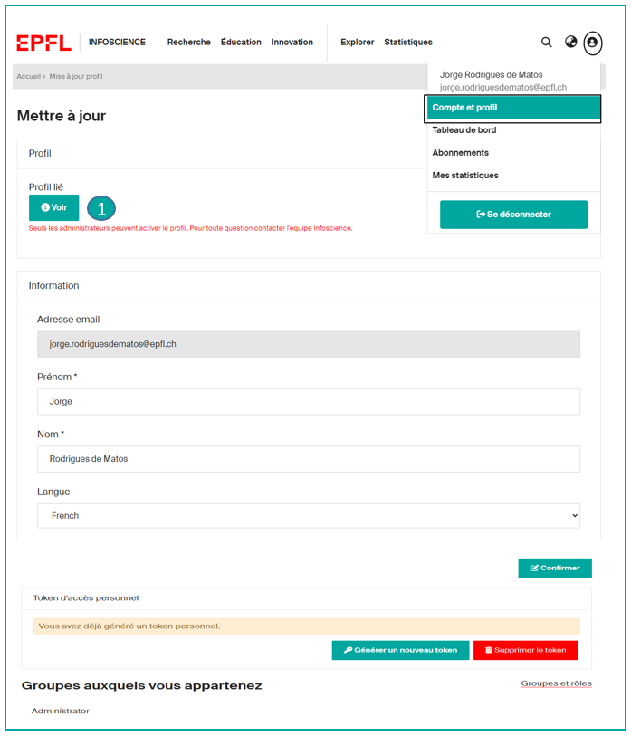

# Gérer mon profil Infoscience

---

## Consulter mon compte

**En tant que membre accrédité·e EPFL, vous pouvez gérer votre profil.**
**Cliquez sur l'icône de profil** en haut à droite, puis sur Compte et profil :

**Votre profil affiche par défaut les données issues de « People EPFL »** (nom, prénom, affiliation, email, photo…). Ces données ne sont pas modifiables directement dans Infoscience. Toutefois vous pouvez enrichir et/ou modifier votre profil Infoscience.

---

## Paramétrer mon compte

Sur la page de votre compte [https://infoscience.epfl.ch/profile](https://infoscience.epfl.ch/profile), vous avez la possibilité de :

- **choisir la langue** par défaut de l'interface (français / anglais)
- **générer un Token** pour utiliser l'API d'Infoscience (voir [Exporter, partager et réutiliser les données Infoscience](export-reuse.fr.md))
- **visualiser vos droits** sur Infoscience ([Rôles de groupe](https://infoscience.epfl.ch/profile/group-roles))
- **accéder à la page d'accueil de votre profil** en cliquant sur « Voir » (**1**)

---

## Vérifier mon profil public (pour les auteur·ices EPFL dont l'unité est présente sur Infoscience)

Chaque profil public présente : nom, affiliation, email, Scopus ID, Researcher ID… (**2**)

En bas de page, trois onglets (**3**) sont proposés :

- **Travaux académiques**, affichant l'ensemble des publications sous forme de graphe et de liste (uniquement s'il y a des publications)
- **À propos**, affichant des informations supplémentaires (biographie, domaine de recherche, URL personnalisée, etc.)
- **Statistiques**, affichant le nombre de consultations des publications

En haut de page, quatre actions supplémentaires (**4**) sont disponibles :

- **Exporter** : exporter votre profil dans différents formats (XML, JSON, PDF, etc.)
- **Statistiques** : accéder aux détails des statistiques du profil, avec possibilité d'export (xls, csv)
- **S'abonner** : recevoir des alertes lors d'ajouts/modifications sur le profil (contenu et/ou statistiques)
- **…** : accéder aux options de modification, de paramétrage ORCID et de consultation des métadonnées du profil.

---

## Modifier mon profil

Enrichissez votre profil en cliquant sur les 3 petits points et en sélectionnant l'option MODIFIER (**1**).

Les données suivantes peuvent être modifiées\*. Elles facilitent l'import automatique de vos publications depuis les bases de données externes.

**Variantes du nom :**
Par défaut, Infoscience utilise le nom affiché sur votre page People. Vous pouvez ajouter des variantes de votre nom susceptibles d'apparaître dans vos publications.
Ex. Viazovska, Maryna (forme préférée) => Vyazovskaya, M. S. ; Viazovska, Maryna Sergiivna (variantes utilisées).

**Affiliation :**
Infoscience utilise votre affiliation principale par défaut, mais vous pouvez ajouter d'autres postes.

**Identifiants :**
Vous pouvez ajouter votre Scopus Author ID et votre Researcher ID (Web of Science).

**ORCID :**
L'identifiant ORCiD (Open Researcher and Contributor ID), identifiant numérique persistant et unique, est utilisé par Infoscience pour faciliter l'ajout à votre liste de publications.

L'identifiant ORCiD apparaît sur votre page de profil uniquement si vous avez effectué une déclaration préalable sur [https://orcid-integration.epfl.ch/](https://orcid-integration.epfl.ch/). Nous vous encourageons vivement à vous inscrire sur ORCiD, pour une meilleure gestion de vos publications en général, et dans Infoscience en particulier.

Pour plus d'informations sur l'intégration entre Infoscience et ORCiD, consultez la page [Obtenir un identifiant](identifiers.fr.md).

**Biographie :**
Vous pouvez ajouter une biographie à votre profil Infoscience.

**URL de profil :**
Vous pouvez définir une URL personnalisée, plus lisible que celle générée automatiquement par le système, en ajoutant votre nom ou vos initiales par exemple.

\*Les champs grisés ne peuvent pas être modifiés.

---

## Connecter votre ORCID à votre profil Infoscience

Connecter votre identifiant ORCID à votre profil Infoscience garantit que vos productions de recherche vous sont correctement attribuées et contribue à maintenir un dossier académique complet et à jour.

### Accéder aux paramètres ORCID d'Infoscience

Dans Infoscience, vous pouvez lier votre identifiant ORCID à votre [profil](https://infoscience.epfl.ch/profile). Après avoir accédé à votre page de profil Infoscience, **sélectionnez « Ouvrir la page de paramétrage ORCID »** pour accéder à l'option de liaison ORCID.

Une nouvelle fenêtre s'ouvrira, dans laquelle vous devrez **cliquer sur « EPFL ORCID Integration Service »**.

### Lier ORCID à Infoscience

Vous serez redirigé·e vers une application web développée par la Bibliothèque EPFL : [orcid-integration.epfl.ch](http://orcid-integration.epfl.ch/) (accessible sur le réseau EPFL ou via VPN). Le processus d'intégration peut prendre jusqu'à 24 heures. **Cliquez sur le bouton « Login »**.

Après avoir cliqué sur le bouton « Login », une nouvelle fenêtre s'ouvrira vous invitant à autoriser une connexion sécurisée entre votre identifiant ORCID et votre identité EPFL.

En autorisant cette connexion, vous permettez à l'EPFL de :

- Associer et afficher publiquement votre identifiant ORCID dans ses répertoires
- Ajouter votre/vos affiliation(s) EPFL à votre dossier ORCID
- Contribuer à maintenir vos données ORCID à jour

Vous pouvez sélectionner une ou plusieurs affiliations dans la liste fournie (au moins une est requise). Une fois la connexion établie, votre identifiant ORCID s'affichera sur votre profil People@EPFL et Infoscience. Pour procéder, **cliquez sur « Register or Connect your ORCID iD »**.

Vous serez redirigé·e vers la page de connexion ORCID. Nous recommandons d'utiliser le bouton **« Sign in to ORCID »** (plutôt que « Sign in through your institution »).

Vous serez ensuite automatiquement redirigé·e vers l'application « ORCID Integration at EPFL », où vous verrez que votre connexion ORCID à l'EPFL est maintenant complète.

Vous pouvez ajouter votre identifiant ORCID à votre profil Infoscience à tout moment. Si ce n'était pas fait lors de l'inscription ou s'il a été accidentellement supprimé, vous pouvez le renvoyer en **cliquant sur « Send ID »**.

De plus, vous recevrez un e-mail de notification d'ORCID confirmant que l'intégration a été correctement effectuée.

À ce stade, le lien avec ORCID@EPFL est établi et l'identifiant ORCID est automatiquement transféré à Infoscience. En revenant à votre profil Infoscience, vous verrez votre identifiant ORCID affiché.

### Activer toutes les fonctionnalités ORCID dans Infoscience

Pour activer toutes les fonctionnalités ORCID d'Infoscience : sur votre page de profil Infoscience, **cliquez sur « Ouvrir la page de paramétrage ORCID »**.

Vous serez redirigé·e vers la page ci-dessous — **cliquez sur « Connect to ORCID iD »** pour procéder.

Si vous voyez un message de confirmation vert, cela signifie que votre identifiant ORCID a été lié avec succès à votre profil Infoscience et que vous avez accordé tous les droits d'accès nécessaires. Notez que, pour l'instant, la synchronisation n'est supportée que pour les travaux académiques et les publications ; les datasets, logiciels et brevets ne sont pas encore inclus.

Vous pouvez révoquer ces autorisations à tout moment via la [plateforme EPFL](https://orcid-integration.epfl.ch/) ou via votre compte ORCID sous : Paramètres du compte > Organisations de confiance.

Une fois la procédure terminée, l'icône ORCID verte apparaîtra à côté de votre nom sur votre profil Infoscience

et à côté de vos publications, indiquant une connexion vérifiée.

### Délier votre ORCID

De même que pour lier votre ORCID à votre profil Infoscience, vous pouvez le déconnecter à tout moment en **cliquant sur « Ouvrir la page de paramétrage ORCID »** puis en **sélectionnant « Disconnect from ORCID »**.

Vous pouvez également supprimer le lien entre votre dossier ORCID et l'EPFL. Voir plus de détails [ici](https://orcid-integration.epfl.ch/#how-to-orcid).

Pour exporter des publications depuis Infoscience vers votre dossier ORCID, consultez la section suivante : [Comment exporter vos publications d'Infoscience vers votre profil ORCID](#comment-exporter-vos-publications-dinfoscience-vers-votre-profil-orcid).

---

## Comment exporter vos publications d'Infoscience vers votre profil ORCID

### Configurer les préférences de synchronisation ORCID

Vous pouvez exporter automatiquement votre liste de publications depuis Infoscience vers votre profil ORCID.

!!! note
    Actuellement, seules les publications sont supportées. Les datasets, logiciels et brevets ne sont pas exportés.

Pour tirer pleinement parti de l'intégration ORCID d'Infoscience, vous devez d'abord lier votre identifiant ORCID à votre profil Infoscience. Consultez : [Connecter votre ORCID à votre profil Infoscience](#connecter-votre-orcid-a-votre-profil-infoscience).

Après avoir lié vos profils, accédez à votre [profil Infoscience](https://infoscience.epfl.ch/profile) et sélectionnez « **Ouvrir la page de paramétrage ORCID** ».

Après avoir accédé à la page de paramétrage, vous pourrez choisir comment vos données de publication sont synchronisées avec ORCID :

- **Manuel** — vous envoyez manuellement vos données vers ORCID.
- **Par lot** — la synchronisation avec ORCID est effectuée automatiquement selon un calendrier régulier, mais vous pouvez également la déclencher manuellement si nécessaire.

En bas de la page de paramétrage, vous trouverez la File d'attente du registre ORCID, qui affiche vos publications Infoscience éligibles à l'export vers votre profil ORCID.

### Export par lot automatique (mode synchronisé)

Lorsque vous choisissez l'option d'export par lot (synchronisation automatique), Infoscience synchronisera automatiquement vos publications éligibles avec votre profil ORCID, sans approbation manuelle pour chaque élément. La synchronisation s'effectue à intervalles réguliers (généralement quotidiennement).

Si vous avez activé les notifications dans votre compte ORCID, vous recevrez une alerte à chaque fois qu'une nouvelle publication est ajoutée ou qu'une entrée existante est modifiée.

### Exporter des publications vers ORCID (mode manuel)

Si vous avez sélectionné l'option Manuelle, vous aurez le contrôle total sur les publications exportées vers votre profil ORCID. Dans la file d'attente du registre ORCID, vous pouvez effectuer les actions suivantes :

- **Ajouter** : cliquez sur l'icône plus (+) (surlignée en rouge) pour ajouter manuellement une publication à votre dossier ORCID. Aucun doublon ne sera créé.

- **Ignorer** : cliquez sur l'icône de corbeille (surlignée en bleu) pour annuler l'export en attente. La publication sera retirée de la file d'attente.
- **Mettre à jour** : cliquez sur l'icône de crayon (surlignée en jaune) pour mettre à jour une publication déjà présente dans votre dossier ORCID.

### La file d'attente ORCID semble vide ou incomplète

Si votre file d'attente du registre ORCID semble vide ou n'affiche pas toutes vos publications éligibles, vous pouvez la rafraîchir manuellement :

- Dans la section Préférences de publication, sélectionnez **Désactivé**, puis cliquez sur **Mettre à jour les paramètres**. Cela videra la file d'attente actuelle.
- Resélectionnez **Toutes les publications**, puis cliquez à nouveau sur **Mettre à jour les paramètres**. Cela déclenchera un rafraîchissement complet.

---

[Retour à l'accueil de l'aide](index.fr.md)
