---
search:
  boost: 1.5
description: >-
  How to manage your Infoscience researcher profile: ORCID synchronisation, publication lists, affiliations, and profile visibility.
---

# Manage my Infoscience profile

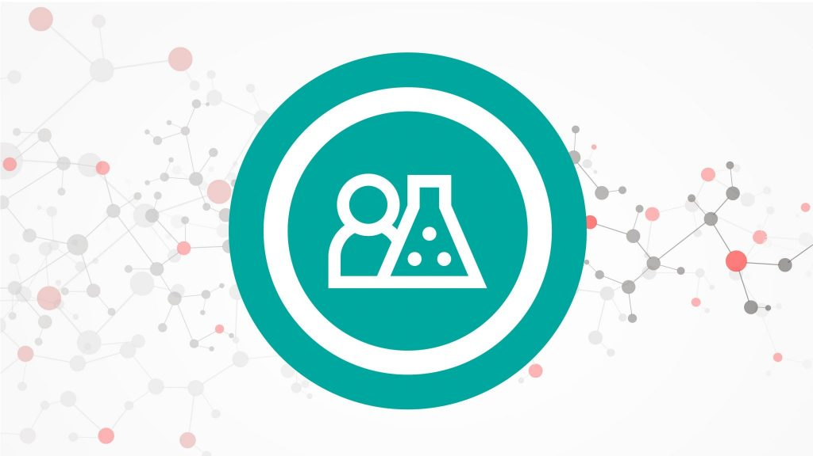

---

## View my account and profile

**As an accredited EPFL member, you can manage your profile.**

After logging on, click on the profile icon at the top right, then on Profile:

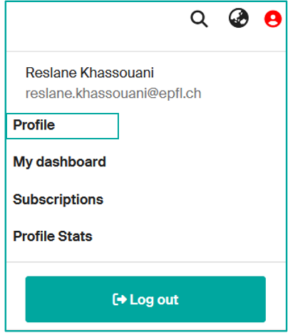

By default, your profile displays data from "People EPFL" (surname, first name, affiliation, email address, photo, etc.). However, you can add to and/or modify your Infoscience profile.

---

## Set your account up

On your account page [https://infoscience.epfl.ch/profile](https://infoscience.epfl.ch/profile), you can:

- **choose the default interface language** (French/English)
- **generate a token** to use the Infoscience API (see [Export, Share and Reuse Infoscience data](export-reuse.md))
- **view your Infoscience rights** ([Group roles](https://infoscience.epfl.ch/profile/group-roles))
- **access your profile home page** by clicking on "View" (**1**)

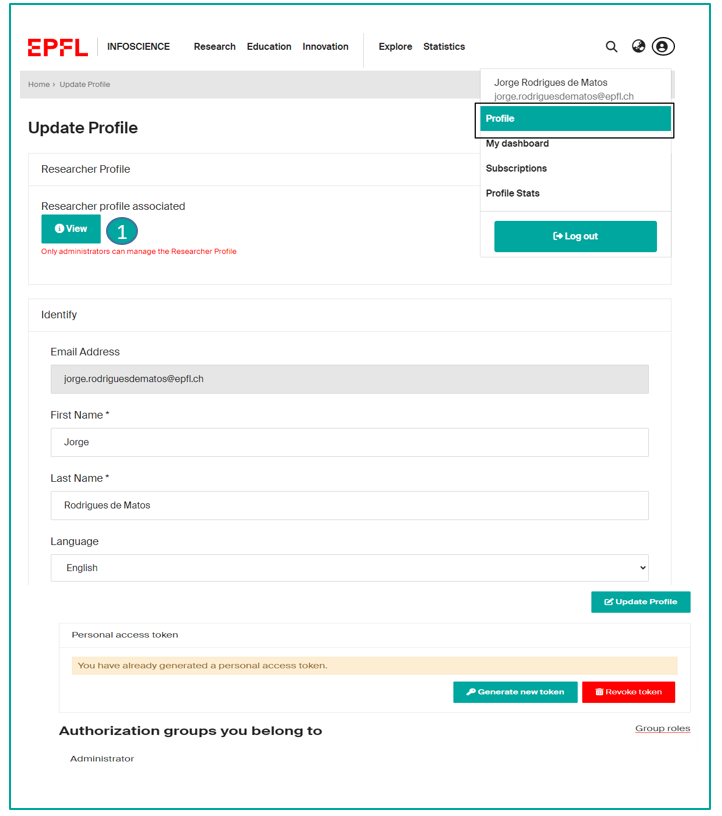

---

## Check my public profile (for EPFL authors whose unit is listed on Infoscience)

Each public profile shows: name, affiliation, email, Scopus ID, Researcher ID… (**2**)

At the bottom of the page, three tabs (**3**) are available:

- **Scholarly works:** displaying all publications in the form of a graph and a list (only if there are publications)
- **About:** displaying additional information (biography, research field, personalized URL, etc.)
- **Statistics**, displaying the number of times publications have been viewed

The top of the page gives access to four additional actions (**4**):

- **Export**: Export your profile in different formats (XML, JSON, PDF, etc.)
- **Statistics**: to access the details of the profile's statistics, with the option of exporting them (xls, csv)
- **Subscribe**: to receive alerts when additions/modifications are made to the profile (content and/or statistics)
- **…** : to access the options for modifying, setting ORCID parameters and viewing the profile's metadata.

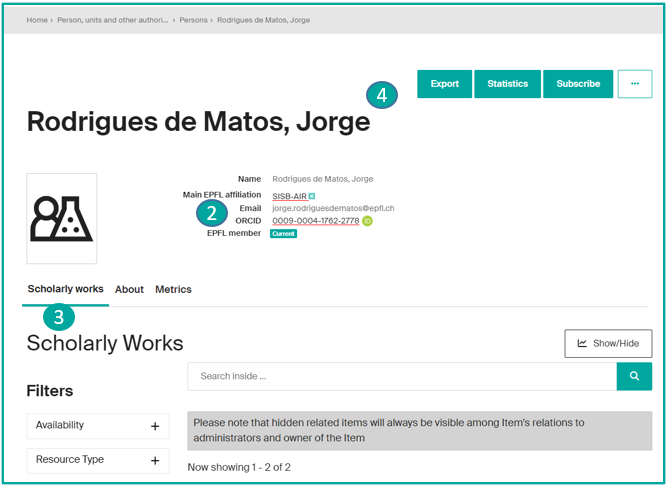

---

## Edit my profile

Enhance your profile by clicking on the 3 small dots and selecting the EDIT option (**1**).

The following data can be modified\*. These will ease the automatic import of your publications from external databases. You can edit different fields:

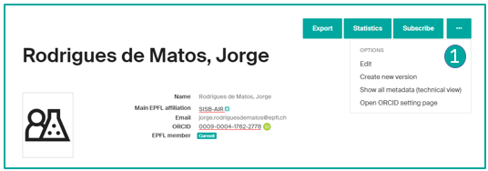

**Name variations:**
By default, Infoscience uses the name displayed on your People page. You can add any variations of your name that may appear in your publications.
E.g. Viazovska, Maryna (preferred form) => Vyazovskaya, M. S. ; Viazovska, Maryna Sergiivna (variations used).

**Affiliation:**
Infoscience uses your main affiliation by default, but you can add other positions.

**Identifiers:**
You can add your Scopus Author ID and Researcher ID (Web of Science).

**ORCID:**
ORCiD (Open Researcher and Contributor ID), a persistent and unique numerical identifier, is used by Infoscience to make it easier to add to your list of publications.

The ORCiD identifier appears on your profile page only if you have made a prior declaration on [https://orcid-integration.epfl.ch/](https://orcid-integration.epfl.ch/). We strongly encourage you to register on ORCiD, for better management of your publications in general, and in Infoscience in particular.

For more information on the integration between Infoscience and ORCiD, please refer to the page [Get an identifier](identifiers.md).

**Biography:**
You can add a biography to your Infoscience profile.

**Profile URL:**
You can define a personalised URL, more readable than the one generated automatically by the system, by adding your name or initials for example.

\*Grayed fields cannot be edited.

---

## Connect Your ORCID iD to Your Infoscience Profile

Connecting your ORCID iD to your Infoscience profile ensures that your research outputs are correctly attributed to you and helps maintain a complete, up-to-date academic record. This procedure guides you through accessing your Infoscience ORCID settings, securely linking your ORCID iD, enabling full ORCID features, and managing your connection.

### Access Infoscience ORCID Settings

In Infoscience, you can link your ORCID iD to your [profile](https://infoscience.epfl.ch/profile). After you have accessed your Infoscience profile page, **select "Open ORCID setting page"** to access the ORCID linking option.

A new window will open, where you should **click on "EPFL ORCID Integration Service"**.

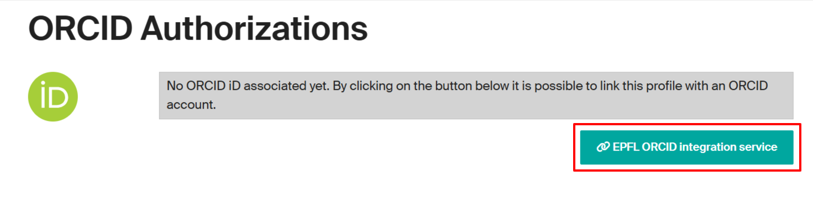

### Link ORCID to Infoscience

You will be redirected to a web application developed by EPFL Library: [orcid-integration.epfl.ch](http://orcid-integration.epfl.ch/) (accessible on the EPFL network or through VPN). Note that the integration process may take up to 24 hours to complete. You can now **click on the "Login" button**.

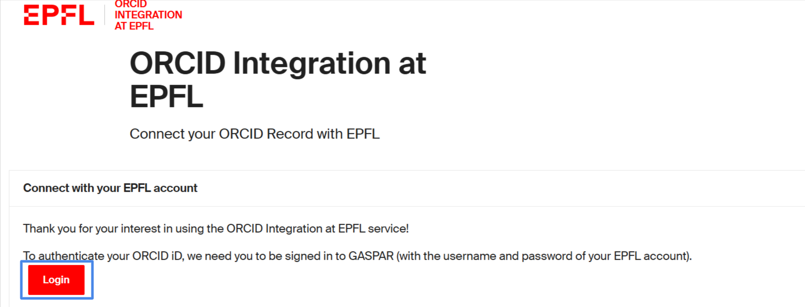

After clicking the "Login" button, a new window will open prompting you to authorize a secure connection between your ORCID iD and your EPFL identity.

By authorizing this connection, you allow EPFL to:

- Associate and publicly display your ORCID iD in its directories
- Add your EPFL affiliation(s) to your ORCID record
- Help keep your ORCID data up to date

You can select one or more affiliations from the list provided (at least one is required). The default start year is determined by your current accreditation status. If you previously held positions at EPFL, you may manually add them to your ORCID record.

Once the connection is established, your ORCID iD will be displayed on both your People@EPFL and Infoscience profiles. To proceed, **click on "Register or Connect your ORCID iD"** to link your account.

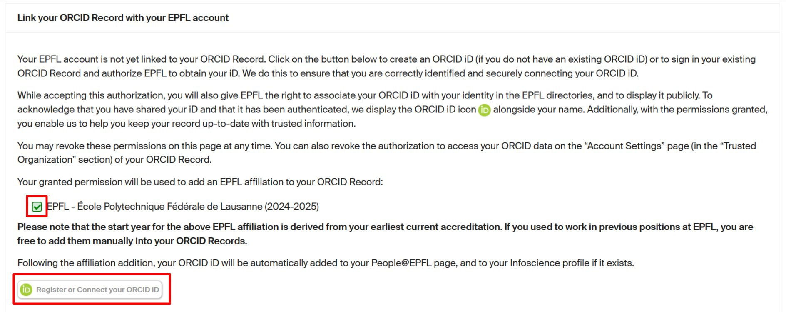

You will be redirected to the ORCID login page, where you will see two sign-in options. We recommend using the **"Sign in to ORCID" button** (instead of the "Sign in through your institution" option).

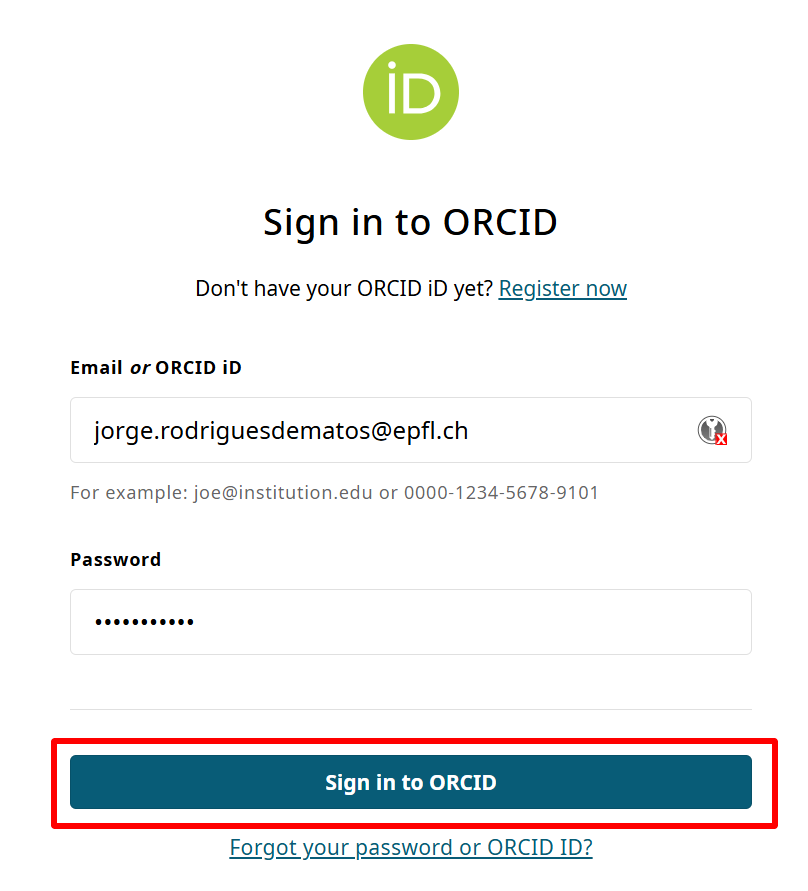

After that, you will be automatically redirected to the « ORCID Integration at EPFL » web application, where you will see that your ORCID connection to EPFL is now complete.

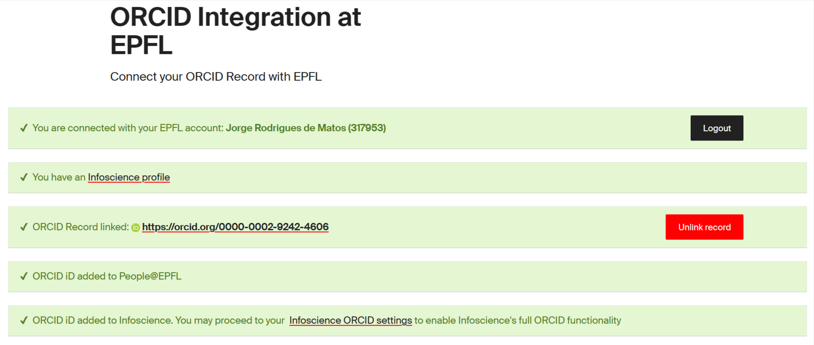

You can add your ORCID iD to your Infoscience profile at any time — not just during the initial registration. If it was not added initially or if it was accidentally removed from Infoscience, you can resend by **clicking on "Send ID"** to ensure your Infoscience profile stays up to date.

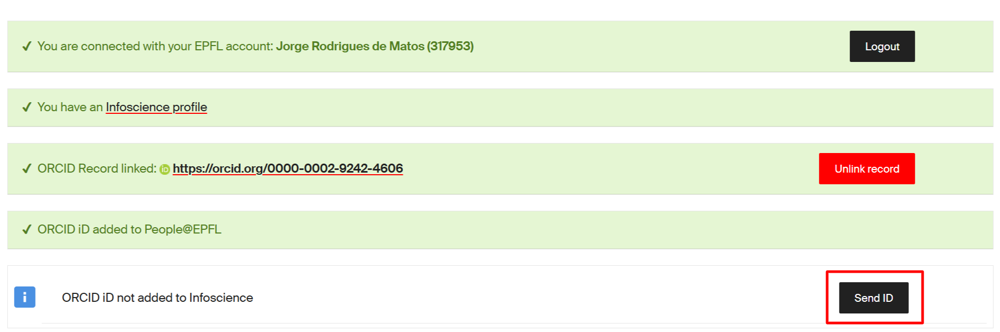

In addition, you will receive an email notification from ORCID that confirms the integration has been correctly performed.

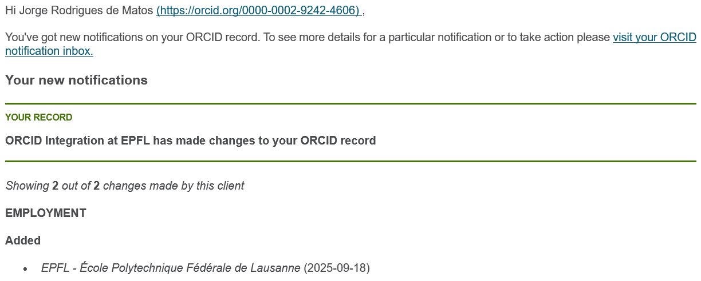

At this stage, the link with ORCID@EPFL is established, and the ORCID identifier is automatically transferred to Infoscience. When going back to your Infoscience profile, you will see your ORCID identifier displayed.

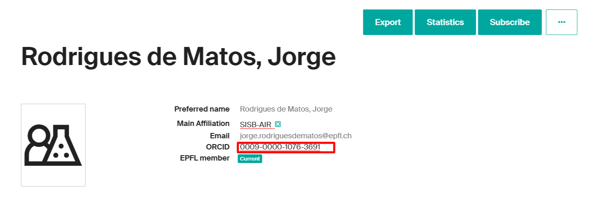

### Enable Full ORCID Features in Infoscience

To enable Infoscience's full ORCID functionalities: on your Infoscience profile page, **click on "Open ORCID setting page"**.

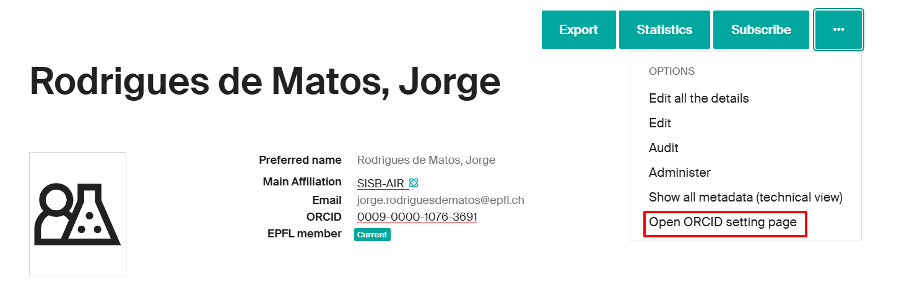

You will be redirected to the page shown below — then **click "Connect to ORCID iD"** to proceed.

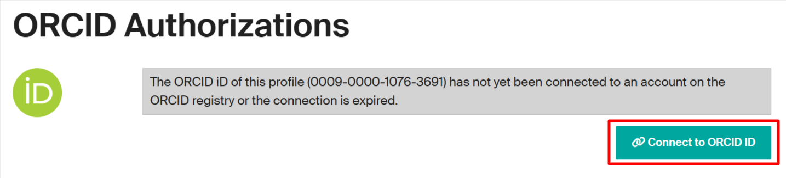

Once on the page, if you see a green confirmation message, it means that your ORCID iD has been successfully linked to your Infoscience profile and that you have granted all the necessary access rights to use the features offered by Infoscience. Please note that, for now, synchronization is supported only for scholarly works and publications; datasets, software, and patents are not yet included.

You can revoke these permissions at any time via the [EPFL platform](https://orcid-integration.epfl.ch/) or through your ORCID account under: Account Settings > Trusted Organizations.

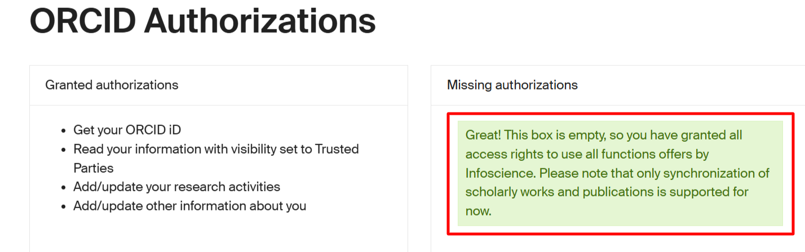

Once the procedure has been completed, the green ORCID icon will appear next to your name on both your Infoscience profile

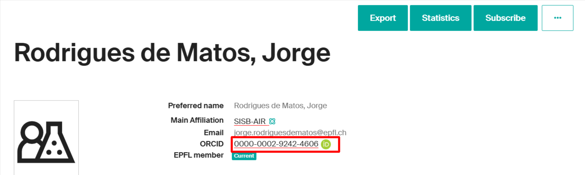

and next to your publications, indicating a verified connection.

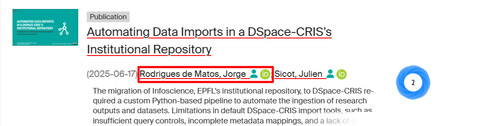

### Unlink your ORCID

Similarly to linking your ORCID to your Infoscience profile, you can disconnect it at any time by **clicking on "Open ORCID setting page"** and then **selecting "Disconnect from ORCID"**.

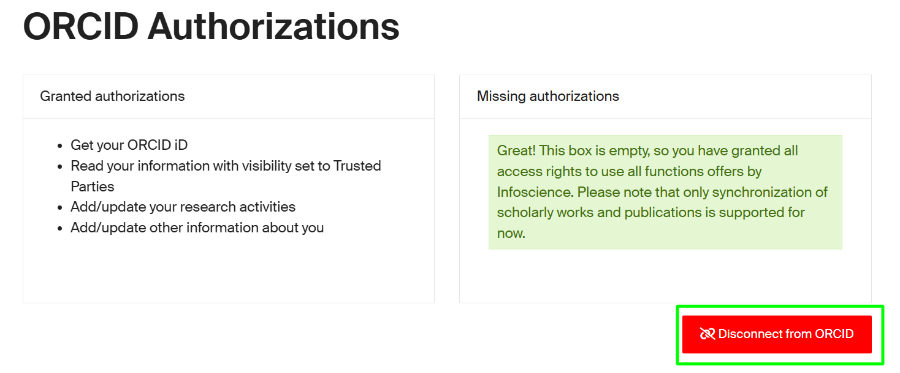

You can also remove the link between your ORCID record and EPFL. See more details [here](https://orcid-integration.epfl.ch/#how-to-orcid).

To export publications from EPFL's institutional repository, Infoscience, to your ORCID record, please refer to the following section for detailed instructions: [How to export your publications from Infoscience to your ORCID profile](#how-to-export-your-publications-from-infoscience-to-your-orcid-profile).

---

## How to Export Your Publications from Infoscience to Your ORCID Profile

Exporting your publications from Infoscience to your ORCID profile allows you to keep your ORCID record current with your latest research outputs. This procedure provides step-by-step instructions to select and send your publications from Infoscience to ORCID, ensuring your scholarly work is accurately represented and easily accessible.

### Configure ORCID Synchronization Preferences

You can automatically export your publication list from EPFL's institutional repository, Infoscience, to your ORCID profile. This feature streamlines the process of keeping your ORCID record up to date with your latest academic publications.

!!! note
    Currently, only publications are supported. Datasets, software, and patents are not exported.

To take full advantage of Infoscience's ORCID integration, you must first link your ORCID iD to your Infoscience profile. For instructions on how to complete this step, please refer to the following guide: [Connect Your ORCID iD to Your Infoscience Profile](#connect-your-orcid-id-to-your-infoscience-profile).

After linking your profiles, you can configure your ORCID synchronization preferences — either manual or batch mode. To access these settings, go to your [Infoscience profile](https://infoscience.epfl.ch/profile).

Once on your profile page, select "**Open ORCID setting page**" to access the ORCID linking option.

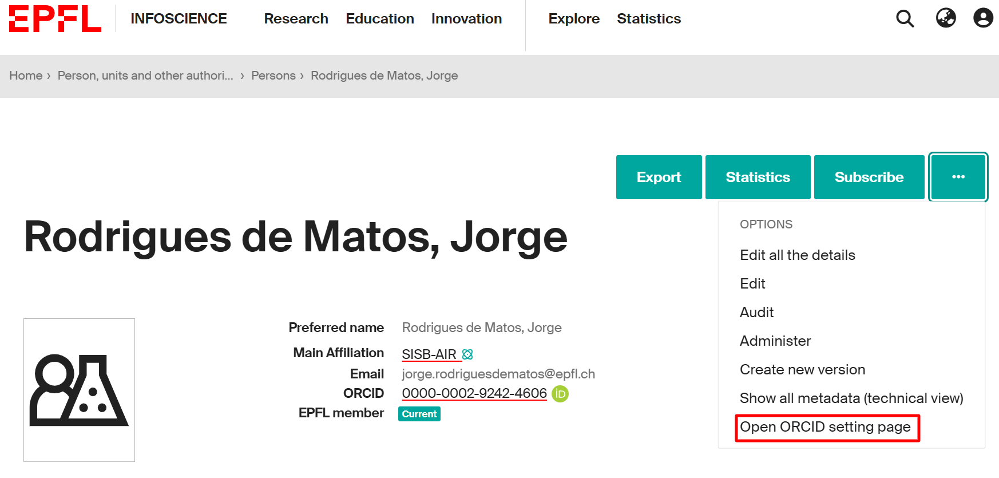

After accessing the settings page, you will be able to choose how your publication data is synchronized with ORCID. The available options are:

- **Manual** – You will manually push your data to ORCID.
- **Batch** – Synchronization with ORCID is performed automatically on a regular schedule, but you can also trigger it manually if needed.

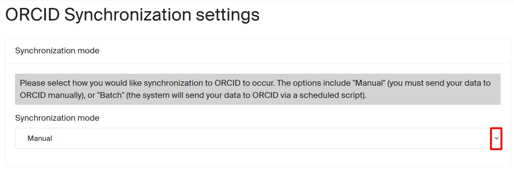

At the bottom of the settings page, you will find the ORCID Registry Queue, which displays your Infoscience publications that are eligible for export to your ORCID profile.

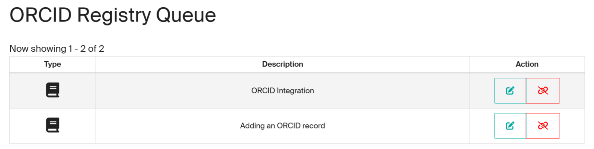

### Automatic Batch Export (Synchronized Mode)

When you choose the Batch export (automatic synchronization) option in your ORCID connection settings, Infoscience will synchronize your eligible publications with your ORCID profile automatically, without requiring manual approval for each item.

Publications added to Infoscience are automatically queued and exported to ORCID based on your predefined preferences. Synchronization occurs at regular intervals (typically daily), ensuring your ORCID record is updated with the latest publications and metadata.

**Behavior and Controls:**

New publications are automatically exported to your ORCID record once they satisfy the eligibility criteria and your preferences.

For already exported works, any metadata changes in Infoscience (e.g., title updates, corrections, new authors) will automatically be propagated to ORCID during the next sync. Duplicate detection mechanisms prevent creating multiple entries: only one record per publication is maintained in ORCID.

Although Infoscience may be set as the source of metadata during export, ORCID allows you to modify source preferences afterward if desired.

If you have enabled notifications in your ORCID account settings, you will receive an alert each time a new publication is added, or an existing entry is modified. The notification includes a summary of the affected elements, allowing you to review changes and track updates made by Infoscience.

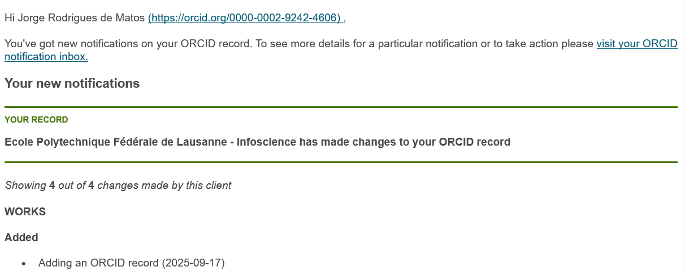

### Export Publications to ORCID (Manual Mode)

If you have selected the Manual option in your ORCID connection settings, you will have full control over which publications are exported to your ORCID profile. This mode allows you to manually review and approve each item before export.

At the bottom of the settings page, you will find the ORCID Registry Queue, which displays the list of your Infoscience publications that are eligible for export to the ORCID registry.

Within the queue, you can perform the following actions:

- **Add**: Click the plus (+) icon (highlighted in red in the image) to manually add a publication to your ORCID record. No duplicate entries will be created. You retain the ability to select the preferred source for each publication directly in your ORCID profile.

This is a manual action; no entries will be exported without your explicit confirmation.

- **Discard**: Click the trash or discard icon (highlighted in blue in the image) to cancel the pending export. The publication will not be synchronized with ORCID and will be removed from the export queue.

- **Update**: Click the pencil icon (highlighted in yellow in the image) to update an existing publication already present in your ORCID record. This ensures that the latest version of the metadata from Infoscience is reflected on your ORCID profile. This approach gives you granular control over your ORCID integration and helps ensure the accuracy and completeness of your scholarly record.

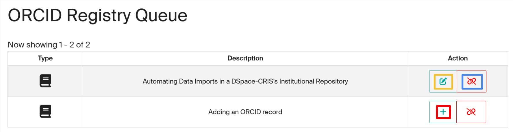

### ORCID Registry Queue Appears Empty or Incomplete

If your ORCID Registry Queue appears empty or does not display the full list of your eligible publications, you can manually refresh it using the following steps:

- In the Publication preferences section, select **Disabled**, then click **Update settings**. This will clear the current queue.
- Re-select **All publications**, then click **Update settings** again. This will trigger a full refresh and repopulate the queue with all your eligible Infoscience publications.

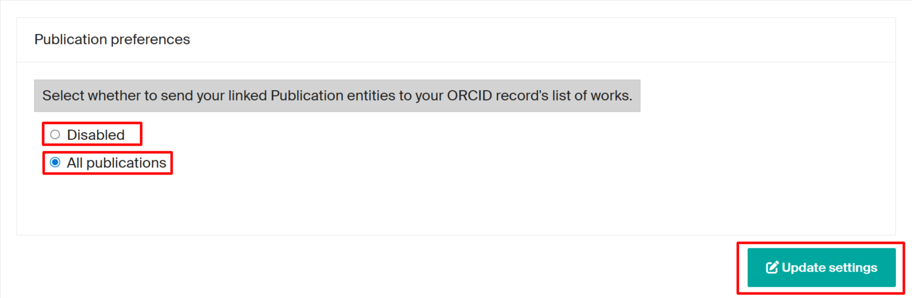

---

[Back to Help home](index.md)
