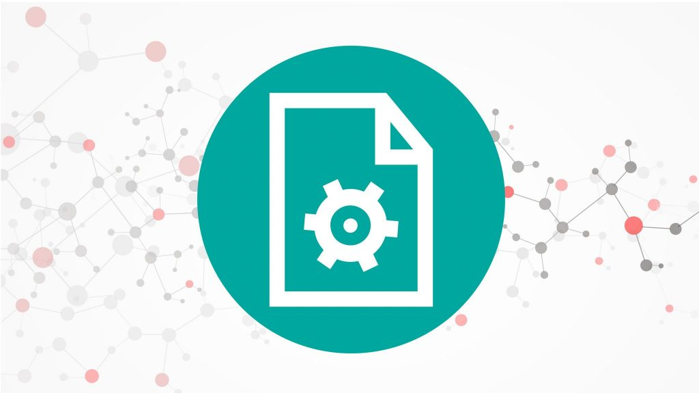
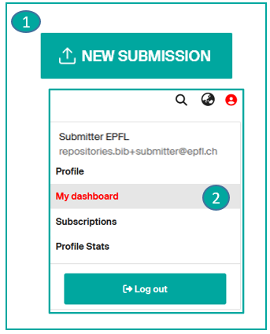
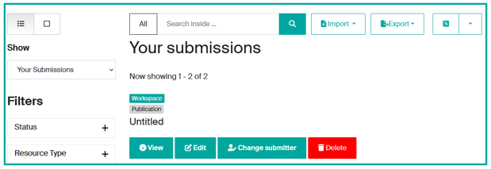
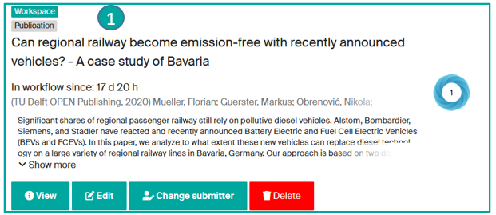
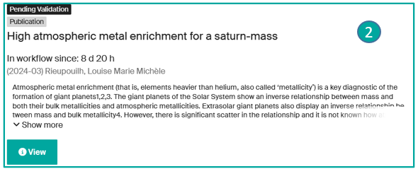
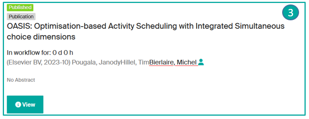
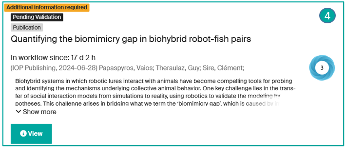
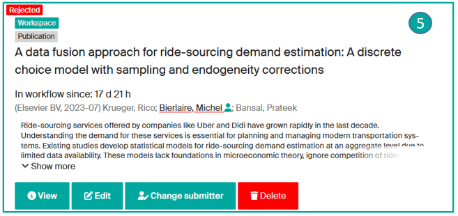
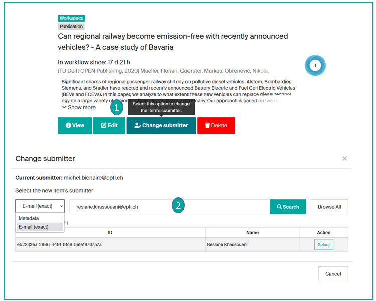
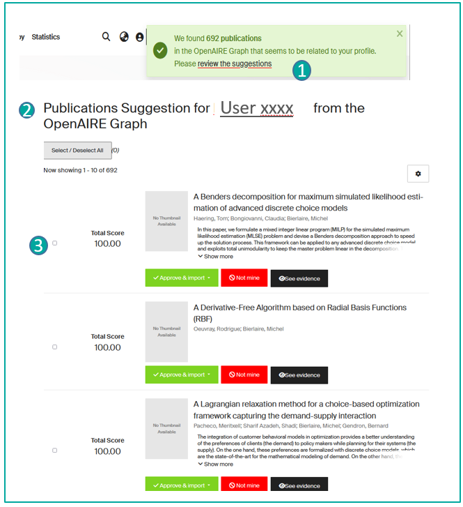

# Gérer mes publications

---

## Ajouter une nouvelle publication

Vous avez la possibilité de déposer une nouvelle publication : via la page d'accueil (**1**) (après vous être authentifié·e) ou depuis le tableau de bord (**2**) de votre compte Infoscience. Voir la page [Déposer une publication](submit-a-publication.fr.md).

---

## Voir et gérer mes dépôts

Dans le menu accessible via l'icône de votre profil, cliquez sur « **Tableau de bord** ». Vous accédez ainsi à la liste de vos dépôts. Le filtre Vue affiche **Vos dépôts** (par défaut).

### Menu Vos dépôts

Vous pouvez afficher la liste de vos dépôts selon le statut\* des notices :

- **Espace de travail** (**1**) : la notice est enregistrée dans votre tableau de bord, mais pas encore déposée. Vous pouvez la visualiser, la modifier, changer le·la déposant·e ou même la supprimer.

- **En attente de validation** (**2**) : la notice est en cours de vérification par l'équipe Infoscience. Seule l'option Vue est disponible.

- **Publiée** (**3**) : la notice a été acceptée par l'équipe Infoscience, elle est publiée et consultable dans Infoscience. Seule l'option Vue est disponible.

- **Informations supplémentaires requises** (**4**) : la notice a été traitée par l'équipe Infoscience, mais renvoyée pour complément d'informations. Seule l'option Vue est disponible. Veuillez répondre à l'e-mail avec les informations demandées, ce qui créera automatiquement un ticket. L'équipe Infoscience mettra à jour la notice.

- **Rejetée** (**5**) : la notice a été rejetée par l'équipe Infoscience. Vous avez reçu un e-mail de notification avec la raison du rejet. Vous pouvez visualiser la notice, la modifier, changer de déposant·e ou la supprimer.

**Actions disponibles selon le statut :**

| Action | Description |
|---|---|
| **\*Vue** | Afficher les métadonnées de la notice. |
| **\*Modifier** | Modifier les métadonnées et/ou ajouter des fichier(s). |
| **\*Changer de déposant·e** | Attribuer la responsabilité du dépôt à un autre membre EPFL. Il sera transféré dans le tableau de bord du nouveau·elle déposant·e. |
| **\*Supprimer** | Supprimer définitivement la notice. |

---

## Mettre à jour une notice publiée (nouvelle version, correction, suppression)

[Voir la page Déposer une publication](submit-a-publication.fr.md#mettre-a-jour-une-notice-publiee-creer-une-nouvelle-version)

---

## Transférer la responsabilité d'un dépôt

En tant que déposant·e, vous pouvez réattribuer vos notices brouillons à une autre personne (co-auteur·trice, collègue…).

- Accédez à « **Mon tableau de bord** » pour afficher vos dépôts.
- Seules les notices avec le statut « Brouillon » disposent de l'option « **Changer de déposant·e** » (**1**).
- **Recherchez un·e collègue** (via les métadonnées ou l'adresse e-mail exacte) et cliquez sur Sélectionner (**2**).

L'élément « brouillon » sera transféré dans le tableau de bord du nouveau·elle déposant·e. Une fois authentifié·e, il·elle pourra gérer ou modifier la notice.

---

## Accepter ou rejeter des suggestions de publications importées

**Des publications provenant de sources externes vous seront parfois suggérées** : après avoir vérifié si vous en êtes l'auteur·trice ou non, vous pouvez les accepter ou les rejeter.

Lorsque vous vous authentifiez sur Infoscience, une fenêtre contextuelle (**1**) vous propose des suggestions de publications.

En cliquant sur le lien « **réviser les suggestions** », vous accédez à la liste des suggestions à traiter (**2**) :

- « **Approuver et importer** » : vous acceptez la publication dont vous êtes l'auteur·trice et choisissez le [type de document](document-types.fr.md) correspondant. La publication sera ajoutée à votre tableau de bord : vous pourrez la modifier, compléter les métadonnées, ajouter des fichier(s), puis enregistrer le dépôt.
- « **Ce n'est pas le mien** » : vous rejetez la publication dont vous n'êtes pas l'auteur·trice.
- « **Voir les preuves** » : vous êtes informé·e des raisons de cette suggestion.

!!! tip
    Vous pouvez sélectionner plusieurs suggestions en cochant les cases à gauche (**3**), et approuver/rejeter plusieurs publications en une seule action.

---

[Retour à l'accueil de l'aide](index.fr.md)
