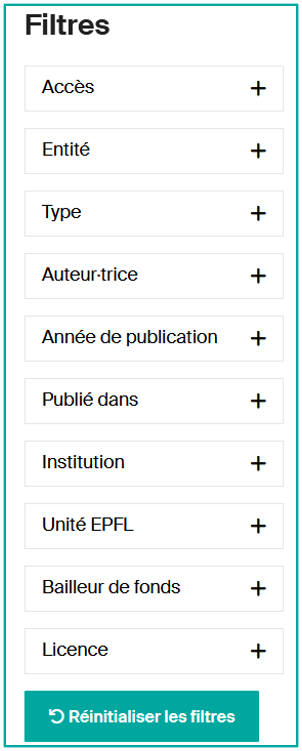
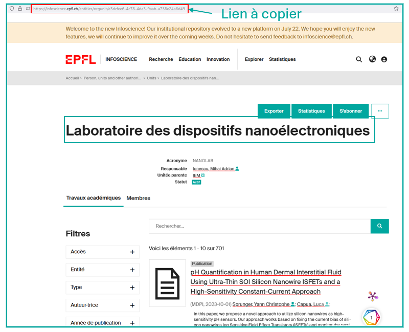
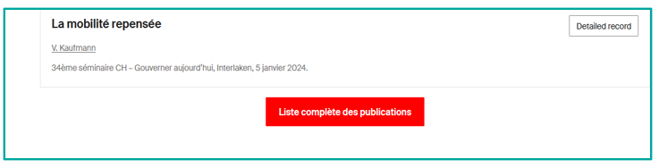
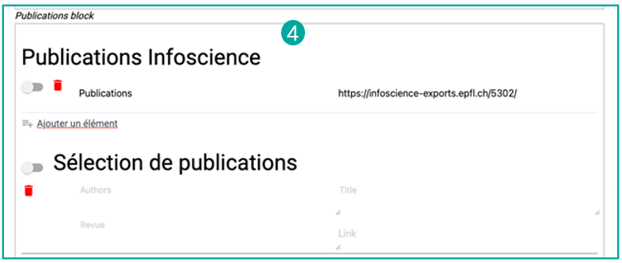

# Créer/Modifier mes listes de publications


**Infoscience vous offre la possibilité de générer, en seulement quelques clics, des listes de publications dynamiques**, parfaitement adaptées pour une diffusion sur le site de votre unité ou sur votre page people. Ces listes s'actualisent automatiquement selon les critères définis lors de leur création, intégrant en temps réel les nouveaux dépôts ainsi que les modifications apportées aux publications existantes.

---

## Tutoriel vidéo

<div class="video-wrapper">
  <iframe
    src="https://www.youtube.com/embed/Z_XiYbLNr7o"
    title="Upgrade your publication list"
    frameborder="0"
    allowfullscreen>
  </iframe>
</div>

---

## Caractéristiques principales

- **Simplicité d'utilisation** : créez des listes en quelques clics, sans compétences techniques requises.
- **Mise à jour automatique** : les listes se rafraîchissent automatiquement pour inclure les nouvelles publications et les mises à jour des travaux existants.
- **Personnalisation** : définissez des critères précis pour que chaque liste réponde exactement à vos besoins.
- **Diffusion optimale** : intégrez facilement les listes dynamiques sur le site de votre unité ou votre page people.

!!! warning "Points importants concernant la fréquence d'actualisation des listes"
    **Chaque nouveau dépôt dans Infoscience nécessite une vérification et un enrichissement des métadonnées par l'équipe Infoscience.** Ce processus prend maximum deux jours ouvrables après la création du dépôt.

    De plus, **les listes de publications créées via Infoscience sont actualisées toutes les 24 heures**. Les contenus sont mis en cache afin d'optimiser leur chargement.

---

## Avantages de l'utilisation d'Infoscience pour valoriser vos travaux

**En utilisant Infoscience, vous vous assurez que vos travaux sont à jour, enrichis et valorisés**, non seulement sur le site web de l'EPFL.

**Déposer vos travaux sur Infoscience, c'est vous assurer une diffusion maximale de vos recherches** en seulement quelques clics, permettant ainsi de renforcer l'impact de vos contributions scientifiques (Google Scholar, OpenAIRE, catalogues de bibliothèques, etc.).

---

## Création d'une requête pour alimenter votre liste

**Infoscience offre diverses options pour effectuer des recherches.** La méthode la plus directe consiste à utiliser la barre de recherche disponible sur [la page d'accueil](https://infoscience.epfl.ch/) ou accessible via le menu principal.

Pour des recherches plus ciblées, explorez les sections spécifiques disponibles sous le menu **Explorer** :

- [Travaux académiques](https://infoscience.epfl.ch/explore/researchoutputs)
- [Open Access](https://infoscience.epfl.ch/explore/researchoutputsoa)
- etc.

La documentation complète des index de recherche est accessible sur cette [page](https://epfllibrary.github.io/infoscience-map/).

Les résultats de recherche s'accompagnent de filtres ou facettes, situés sur la gauche de la page des résultats. Vous pouvez affiner votre recherche en utilisant les filtres : Type, Auteur.trices, Année de Publication, Publié Dans, Unité EPFL, etc.

!!! note
    Cette méthode offre une flexibilité limitée : il n'est pas possible de sélectionner plusieurs valeurs pour une même facette simultanément.



---

## Construction d'une requête avancée

Pour obtenir des résultats plus précis, il est fortement recommandé de **construire des requêtes bien définies en utilisant les index disponibles**.

### Rechercher toutes les références pour un.e auteur.trice donné.e

**2 options :**

- **Aller sur la page du profil de l'auteur.trice** dans Infoscience via la Recherche par Membres EPFL : [https://infoscience.epfl.ch/explore/researcherprofiles](https://infoscience.epfl.ch/explore/researcherprofiles)

    Une fois sur la page du profil avec les publications, copiez le lien de la page et collez-le dans le bloc Export ou WordPress.

- **Construisez une requête dans la barre de recherche globale d'Infoscience :**

    Exemple :
    ```
    author:(bierlaire, michel)
    ```
    [Essayer cette requête →](https://infoscience.epfl.ch/search?spc.page=1&query=author:(bierlaire,%20michel)&configuration=researchoutputs)

### Rechercher tous les travaux pour une personne avec le rôle d'auteur.trice ou d'éditeur.trice scientifique

```
author_editor:(bierlaire, michel)
```

### Rechercher toutes les références affiliées à une unité

**2 options :**

- Aller sur la page de votre unité dans Infoscience via la Recherche par unité : [https://infoscience.epfl.ch/explore/orgunits](https://infoscience.epfl.ch/explore/orgunits)

    

- **Construire la requête suivante** dans la barre de recherche globale d'Infoscience :

    ```
    dc.description.sponsorship:XXX
    ```
    (remplacez XXX par l'acronyme de l'unité)

    Exemple :
    ```
    dc.description.sponsorship:LASUR
    ```

### Recherche par limitation chronologique

- **Pour les publications des trois dernières années :**
    ```
    dc.description.sponsorship:("LASUR") AND (dateIssued.min=2022 OR dateIssued.max=2024)
    ```

- **Pour les publications depuis une date donnée :**
    ```
    dc.description.sponsorship:("LASUR") AND dc.date.issued:[2013 TO*]
    ```

- **Pour les publications d'une année uniquement :**
    ```
    dc.description.sponsorship:("LASUR") AND dc.date.issued:2013*
    ```

### Rechercher une ou plusieurs notices spécifiques

Si vous souhaitez rechercher une notice particulière, recherchez via l'identifiant de la notice, soit par **UUID** (indiqué dans l'URL) soit par **handle** (indiqué dans la section « Details » de la notice).

```
search.resourceid:(UUID)
```
ou
```
handle:(numéro de handle)
```

### Recherche par types de documents

**Pour restreindre la recherche à certains types de documents**, créez une requête pour chaque type de document. Vous pouvez en ajouter autant que vous souhaitez, en séparant les requêtes avec l'opérateur booléen **OR** :

| **Je recherche** | **Requête dans la barre de recherche globale** |
|---|---|
| **Tous les Livres** (de mon labo) | `types_authority:(*c_2f33*) AND dc.description.sponsorship:("SXL")` |
| Chapitre de livre | `types_authority:(*c_3248*)` |
| **Objet de conférence** | `types_authority:(*c_c94f*)` |
| Article de conférence non publié dans les actes | `types_authority:(*c_18cp*)` |
| Poster de conférence non publié dans les actes | `types_authority:(*c_18co*)` |
| Support de présentation à une conférence | `types_authority:(*R60J-J5BD*)` |
| Actes de conférence | `types_authority:(*c_f744*)` |
| Article dans une conférence | `types_authority:(*c_5794*)` |
| Poster de conférence | `types_authority:(*c_6670*)` |
| Thèse de bachelor | `types_authority:(*c_7a1f*)` |
| Thèse de doctorat | `types_authority:(*c_db06*)` |
| Thèse de master | `types_authority:(*c_bdcc*)` |
| **Revue** | `types_authority:(*c_0640*)` |
| Article de revue | `types_authority:(*c_6501*)` |
| Article de synthèse | `types_authority:(*c_dcae04bc*)` |
| Article de revue scientifique | `types_authority:(*c_2df8fbb1*)` |
| **Préprint** | `types_authority:(*c_816b*)` |
| **Rapport** | `types_authority:(*c_93fc*)` |
| **Brevet** | `types_authority:(*c_15cd*)` |
| **Document de travail** | `types_authority:(*c_8042*)` |
| **Dataset** | `types_authority:(*c_ddb1*)` |

\*D'après le vocabulaire COAR => [https://vocabularies.coar-repositories.org/resource_types/](https://vocabularies.coar-repositories.org/resource_types/)

**Exemples :**

- Je recherche les « Rapports » pour le laboratoire SXL :
    ```
    types_authority:(*c_93fc*) AND dc.description.sponsorship:("SXL")
    ```
- Je recherche « Rapport », « Brevet » et « Articles de revues » pour le laboratoire SXL :
    ```
    (types_authority:(*c_93fc*) OR types_authority:(*c_15cd*) OR types_authority:(*c_6501*)) AND dc.description.sponsorship:("SXL")
    ```

**Exclure certains types de documents :**

Pour afficher toutes les publications de votre laboratoire **en excluant certains types**, utilisez l'opérateur booléen NOT :

- Toutes les publications de LASUR sauf les thèses de master :
    ```
    dc.description.sponsorship:("LASUR") NOT types_authority:(*c_bdcc*)
    ```

### Trier les résultats

**Par défaut, Infoscience trie les résultats par pertinence.** Si vous préférez un mode de tri différent, utilisez les options à gauche sous les filtres/facettes. Par exemple, pour trier par date de publication décroissante, cliquez sur Sort By : **Date issued Descending** et copiez l'URL après le tri.

!!! warning
    Il est important de définir le tri souhaité pour votre liste de publications **dès la construction de la requête.**

Pour toute assistance, contactez [infoscience@epfl.ch](mailto:infoscience@epfl.ch).

---

## Créer une liste de publications pour un labo/une unité via WordPress

1. **Connectez-vous à WordPress** avec vos identifiants Gaspar.
2. Sur une page existante ou une nouvelle page, **ajoutez un bloc de type « EPFL Infoscience »**.
3. Dans [Infoscience](https://infoscience.epfl.ch/), effectuez une [recherche](https://infoscience.epfl.ch/explore/researchoutputs) pour cibler les publications souhaitées. Référez-vous à la section précédente pour des exemples utiles.
4. **Une fois la requête préparée et vérifiée, copiez-la** depuis la liste de résultats d'Infoscience en **cliquant sur le bouton « Export URL »** (**1**).

    

5. **Retournez dans WordPress** et, après avoir cliqué sur le **bloc « EPFL Infoscience »** (**2**), **collez l'URL de la requête dans le champ « Infoscience URL »** (**3**).

    Alternativement, vous pouvez coller uniquement l'équation de recherche (par exemple, `dc.description.sponsorship:LASUR`) dans le champ « search for » et définir « Field restriction » sur « Any field ».

    

6. **Si nécessaire, mettez à jour le nombre d'éléments à afficher** (actuellement limité à 100). Nous recommandons de **limiter le nombre de publications à 100** et de potentiellement lier vers la liste complète de vos publications sur Infoscience via un bouton.

    

7. **La liste apparaîtra sur la page de votre unité dès que vous la sauvegarderez.**
8. **Éditez la liste dans la page française** si vous en avez une, en suivant le même processus.

!!! note
    Si votre unité travaille avec un prestataire externe pour sa page web, nous sommes disponibles pour vous conseiller sur l'extraction des données. Contactez [infoscience@epfl.ch](mailto:infoscience@epfl.ch).

---

## Créer une liste de publications pour votre page « People » via Infoscience-Exports

1. **Accédez à Infoscience et effectuez une recherche** pour identifier les publications à afficher. Référez-vous à la section précédente pour des conseils pratiques.
2. Une fois les résultats obtenus, **cliquez sur « Export URL »** au-dessus de la liste de résultats pour copier l'URL de votre requête.

    

3. **Allez sur le service Infoscience Exports** à l'adresse [https://infoscience-exports.epfl.ch/](https://infoscience-exports.epfl.ch/).
4. **Cliquez sur le bouton « Créer »** (**2**) pour créer une nouvelle liste.

    

5. **Configurez votre liste :**
    - Donnez à votre liste **un titre clair**.
    - Collez l'URL obtenue précédemment dans le champ **« Request URL »**.
    - **Choisissez les options de présentation et de regroupement** selon vos préférences.
    - Utilisez le bouton « **Prévisualisation** » en bas de la page pour voir un aperçu.
    - Une fois la liste confirmée, **cliquez sur « Submit ». Une URL vous sera fournie. Copiez-la** (**3**).

6. **Naviguez vers votre page « People »** et cliquez sur « **Edit profile** » (voir l'[aide dédiée](https://www.epfl.ch/campus/services/website/web-services/help-for-people-epfl-ch/) à ce service).
7. **Cherchez « Infoscience Publications »** dans le « **Publications block** » (**4**). La barre grise en haut de la page vous donne le choix de la (des) langue(s). Si vous souhaitez les deux versions (français et anglais), éditez-les séparément.
8. **Cliquez sur « Add an element »** et **collez l'URL copiée précédemment dans le champ « Source »**. Sauvegardez en cliquant sur « Save » dans la barre grise en haut.

    

9. **Lors du dépôt d'une nouvelle publication dans Infoscience** correspondant à la requête définie ci-dessus, elle **sera automatiquement affichée sur votre page « People »**, après un délai de quelques heures.

---

## Mettre à jour la liste de publications de votre unité (nouvelle version d'Infoscience)

**Le 22 juillet 2024, Infoscience a été mis à jour vers une nouvelle version améliorée.** Cette mise à jour entraîne des incompatibilités avec les listes de publications générées dans l'ancienne version. Il est donc **essentiel de faire migrer vos listes de publications**.

### Impact sur les listes créées avant la migration

**Les listes de publications actuellement affichées sur les sites EPFL peuvent toujours être consultées.** Cependant, **ces listes ont été placées en statut de cache permanent et leur contenu est désormais figé** (**1**). Elles ne seront plus mises à jour.

**Les listes concernées peuvent être facilement identifiées grâce à une notification spécifique en haut de chaque liste** (**2**).

**Sur le bloc WordPress EPFL Infoscience Publications :**


### Mettre à jour ma liste de publications People

**Sur le service Infoscience-Exports :**

1. Cliquez sur le bouton **Migrate** (**1**).

    

2. Insérez votre nouvelle requête (voir [Création d'une requête pour alimenter votre liste](#creation-dune-requete-pour-alimenter-votre-liste)) dans le champ « **New proposed url** » (**2**).

    

3. Cliquez sur le bouton **Migrate** en bas du formulaire.

### Mettre à jour ma liste de publications WordPress

**Sur le site du laboratoire/de l'unité :**

1. Sur la page web du laboratoire, cliquez sur l'onglet Publications.
2. Connectez-vous à la console d'administration WordPress.
3. Éditez via le menu WordPress qui apparaît en haut de la page.
4. En mode édition, identifiez le **bloc EPFL Infoscience** (**1**) utilisé pour construire la liste et cliquez dessus.
5. Un message apparaîtra indiquant que le bloc est obsolète. Procédez à la migration en cliquant sur le bouton bleu **« Migrate to dynamic list »** (**2**).

    

6. Dans la colonne de droite, sous les paramètres du bloc, dans le champ « **A direct Infoscience URL** » (**3**), remplacez l'URL par la nouvelle requête Infoscience.

7. Choisissez le nombre de résultats à afficher dans le champ « **Limit** » (**4**). Nous recommandons de **limiter le nombre de publications à 100**.

    

8. Laissez l'option « **Sort** » (**5**) en ordre décroissant et dans « **Group By Titles** » (**6**), choisissez « **Year, then document Type** ».

    

9. Vous pouvez prévisualiser les résultats en cliquant sur « Preview » et mettre à jour la page en cliquant sur « **Update** ».
10. **Éditez la liste dans la page française** si vous en avez une, en suivant le même processus.

---

[Retour à l'accueil de l'Aide](index.fr.md)
