# Create/edit my publication lists

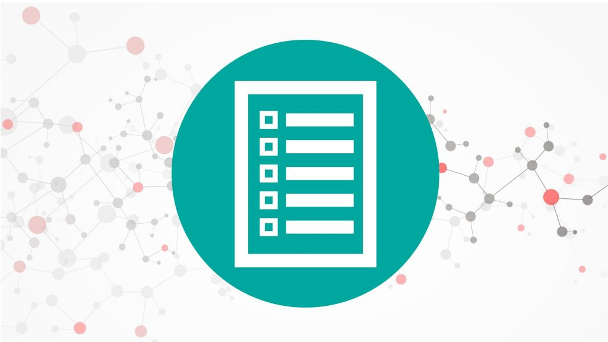

**Infoscience enables you to generate dynamic publication lists in just a few clicks**, perfectly suited for publication on your lab's or on your people page.

These lists are designed to update automatically according to the criteria defined when they were created. They incorporate new submissions and changes to existing publications in real time.

**Thanks to this functionality, you can ensure constant, up-to-date visibility of your research work**, without any additional effort. Dynamic lists are a powerful tool for highlighting your team's scientific contributions, making your research widely available and accessible.

---

## Tutorial

<div class="video-wrapper">
  <iframe
    src="https://www.youtube.com/embed/Z_XiYbLNr7o"
    title="Upgrade your publication list"
    frameborder="0"
    allowfullscreen>
  </iframe>
</div>

---

## Main features

- **Easy to use**: create lists in a few clicks. No technical skills are required.
- **Automatic updates**: lists refresh automatically to include new publications and updates to existing records.
- **Customisation**: define precise criteria so that each list meets your exact requirements.
- **Optimal dissemination**: easily integrate dynamic lists into your unit website or people page.

!!! warning "Important note about the frequency with which lists are updated"
    **Each new submission in Infoscience requires metadata verification and enrichment by the Infoscience team**. This process takes max. two working days after the creation of the record.

    In addition, **publication lists created via Infoscience are updated every 24 hours**. To improve the performance of the lists integrated into the EPFL pages, the content is cached to optimise loading.

---

## Benefits of using Infoscience to promote your work

**By using Infoscience, you ensure that your work is up to date, enriched and promoted,** not only on the EPFL website.

Since its creation, **Infoscience has been committed to ensuring high-quality referencing, with the aim of automatically "pushing" the content deposited on the platform to all the sources where the world's academic community seeks so-called scientific information**. This visibility is guaranteed not only by key search engines such as Google Scholar, but also by more specialised tools such as Open Access aggregators (OpenAIRE), library catalogues and many others.

**By depositing your work on Infoscience, you ensure maximum dissemination of your research output** in just a few clicks, thereby increasing the impact of your scientific contributions.

---

## Creating a query to populate your list

**Infoscience offers various options for carrying out searches**. The most direct method is to use the search bar available on the [home page](http://infoscience.epfl.ch/) or accessible via the main menu. This allows you to carry out quick searches across the whole site. For more targeted searches, explore the specific sections available under the **Explore** menu.

These sections include:

- [Academic works](https://infoscience.epfl.ch/explore/researchoutputs)
- [Open Access](https://infoscience.epfl.ch/explore/researchoutputsoa)
- etc.

**These categories allow you to filter your searches according to the context and nature of the content you are looking for.**

Full documentation of the search indexes associated with each metadata item is available on this [page](https://epfllibrary.github.io/infoscience-map/).

The search results are accompanied by filters, or facets, located on the left of the results page. You can refine your search using the following filters: Type, Author, Year of Publication, Published in, EPFL Unit, etc. These filters allow to restrict the results intuitively.

!!! note
    This method offers limited flexibility: it is not possible to select several values for the same facet simultaneously.

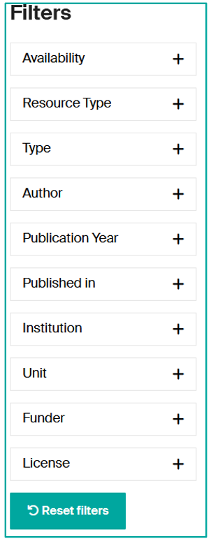

---

## Creation of an advanced query

To obtain more precise results, we strongly recommend you to **create well-defined queries using the available indexes**.

Here are a few examples of queries to help you create your publication lists efficiently.

### Search for all references for a given author

**You have 2 options:**

- **Go to your profile page in Infoscience via Search by EPFL People**: [https://infoscience.epfl.ch/explore/researcherprofiles](https://infoscience.epfl.ch/explore/researcherprofiles)

    Once you are on your profile page with its publications, copy the link from the page and paste it into the Export or WordPress block.

- **Build the query in the Infoscience global search bar**:

    Example:
    ```
    author:(bierlaire, michel)
    ```
    [Try this query →](https://infoscience.epfl.ch/search?spc.page=1&query=author:(bierlaire,%20michel)&configuration=researchoutputs)

### Search for all works for a person with the role of author or scientific editor

```
author_editor:(bierlaire, michel)
```
[Try this query →](https://infoscience.epfl.ch/search?spc.page=1&query=author_editor:(bierlaire,michel)&configuration=researchoutputs)

### Search for all references affiliated to a unit

**You have 2 options:**

- Go to your unit's page in Infoscience via the Search by unit: [https://infoscience.epfl.ch/explore/orgunits](https://infoscience.epfl.ch/explore/orgunits)

    Once you have reached your unit's page with its publications, copy the link from the page and paste it into the WordPress block.

    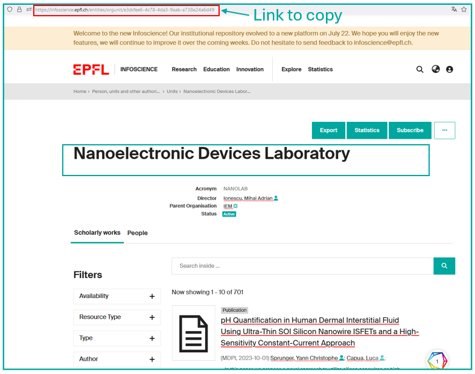

- **Construct the following query** in the Infoscience global search bar:

    ```
    dc.description.sponsorship:XXX
    ```
    (replace XXX with the unit acronym)

    Example:
    ```
    dc.description.sponsorship:LASUR
    ```
    [Try this query →](https://infoscience.epfl.ch/search?spc.page=1&query=dc.description.sponsorship:LASUR:LASUR&configuration=researchoutputs)

### Search by chronological limitation

- **To search for publications from the last three years:**
    ```
    dc.description.sponsorship:("LASUR") AND (dateIssued.min=2022 OR dateIssued.max=2024)
    ```

- **To search for publications since a given date:**
    ```
    dc.description.sponsorship:("LASUR") AND dc.date.issued:[2013 TO*]
    ```

- **To search for publications from one year only:**
    ```
    dc.description.sponsorship:("LASUR") AND dc.date.issued:2013*
    ```

### Search for one or more specific notices

**If you wish to search for a particular record, you must search via the record identifier**, which is either by **UUID** (indicated in the URL) or by **handle** (indicated in the "Details" section of the record).

- Example UUID: `https://infoscience.epfl.ch/entities/publication/01494605-429b-41d3-ae41-4bcedbea5eef` — **Here the UUID is** `01494605-429b-41d3-ae41-4bcedbea5eef`
- Example handle: `https://infoscience.epfl.ch/handle/20.500.14299/129412` — **Here the handle is** `20.500.14299/129412`

**Build the following query** in the Infoscience global search bar and insert the searched identifier:

```
search.resourceid:(UUID)
```
or
```
handle:(handle n°)
```

### Search by document types

**To restrict the search to certain document types, you need to create a query for each document type**. You can add as many document types as you like, separating the query with the **OR** Boolean operator, and adding the query for:

- **Your laboratory** `dc.description.sponsorship:("SXL")` — replace SXL with the acronym of your laboratory.
- **An author** `author_editor:("nobile")` — replace with the name of the desired author.

| **I search for** | **Query** |
|---|---|
| **All Books** (of my lab) | `types_authority:(*c_2f33*) AND dc.description.sponsorship:("SXL")` |
| Book part | `types_authority:(*c_3248*)` |
| **Conference Output** | `types_authority:(*c_c94f*)` |
| Conference paper not in proceedings | `types_authority:(*c_18cp*)` |
| Conference poster not in proceedings | `types_authority:(*c_18co*)` |
| Conference presentation | `types_authority:(*R60J-J5BD*)` |
| Conference proceedings | `types_authority:(*c_f744*)` |
| Conference paper | `types_authority:(*c_5794*)` |
| Conference poster | `types_authority:(*c_6670*)` |
| Bachelor thesis | `types_authority:(*c_7a1f*)` |
| Doctoral thesis | `types_authority:(*c_db06*)` |
| Master thesis | `types_authority:(*c_bdcc*)` |
| **Journal** | `types_authority:(*c_0640*)` |
| Journal article | `types_authority:(*c_6501*)` |
| Review article | `types_authority:(*c_dcae04bc*)` |
| Research article | `types_authority:(*c_2df8fbb1*)` |
| **Preprint** | `types_authority:(*c_816b*)` |
| **Report** | `types_authority:(*c_93fc*)` |
| **Patent** | `types_authority:(*c_15cd*)` |
| **Working paper** | `types_authority:(*c_8042*)` |
| **Dataset** | `types_authority:(*c_ddb1*)` |

\*From vocabulary COAR => [https://vocabularies.coar-repositories.org/resource_types/](https://vocabularies.coar-repositories.org/resource_types/)

**Examples:**

- I'm looking for "Reports" for the SXL laboratory:
    ```
    types_authority:(*c_93fc*) AND dc.description.sponsorship:("SXL")
    ```
- I'm looking for "Report", "Patent" and "Journal articles" for the SXL laboratory:
    ```
    (types_authority:(*c_93fc*) OR types_authority:(*c_15cd*) OR types_authority:(*c_6501*)) AND dc.description.sponsorship:("SXL")
    ```

**Restrict certain document types:**

To display all the publications of your laboratory or of an author, **by removing certain types**, use the Boolean operator NOT:

- I'm looking for all my laboratory's publications **except** master's theses:
    ```
    dc.description.sponsorship:("LASUR") NOT types_authority:(*c_bdcc*)
    ```

### Sort the results

**By default, Infoscience sorts search results by relevance**. However, if you prefer a different sorting mode, you can use the options on the left under the filters/facets. For example, to sort results by publication date in descending order, click on Sort By: **Date issued Descending** and copy the URL after sorting.

!!! warning
    It's important to define the sorting you want for your list of publications **as soon as you build the query**.

By following these steps, you can easily create and customise a list of publications for your unit on WordPress. For further assistance, please contact [infoscience@epfl.ch](mailto:infoscience@epfl.ch).

---

## Create a list of publications for a lab/unit using WordPress

1. **Connect to WordPress** with your Gaspar credentials.
2. On an existing page or on a new page created for this purpose, **add a block of the type "EPFL Infoscience"**.
3. In [Infoscience](https://infoscience.epfl.ch/), carry out a [search](https://infoscience.epfl.ch/explore/researchoutputs) to target the publications you wish to include on your unit's page. Please refer to the previous section for some useful examples.
4. **Once the query has been prepared and checked, copy it** from the Infoscience results list by **clicking on the "Export URL" button** (**1**).

    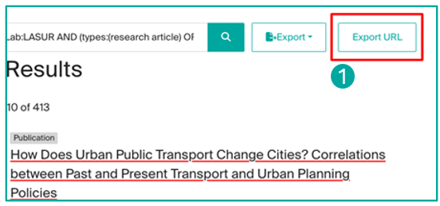

5. **Go back to WordPress** and, after clicking on the **"EPFL Infoscience" block** (**2**), **paste the request URL in the "Infoscience URL" field** (**3**).

    Alternatively, you can paste just the search equation (for example, `dc.description.sponsorship:LASUR`) into the WordPress "search for" field and set "Field restriction" to "Any field".

    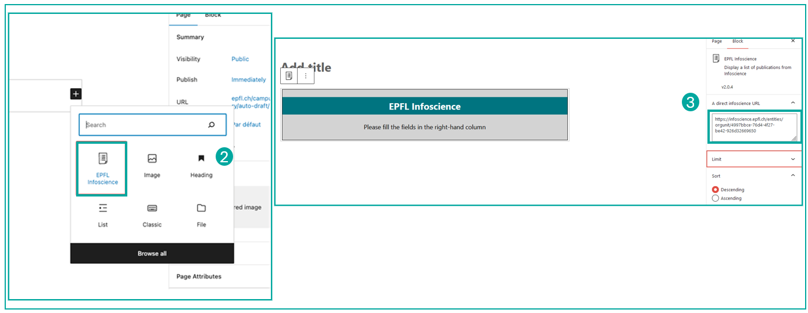

6. **If necessary, update the number of items to be displayed** (currently this number is limited to 100). You can also limit this number, for example if you want to create a list of your unit's 10 most recent publications. In the interests of user-friendliness, **we recommend that you limit the number of publications to 100**, and potentially link to the full list of your publications on Infoscience by creating a button with a link, for example.

    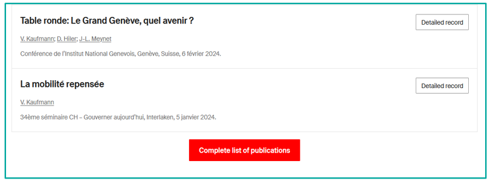

7. **The list will appear on your unit's page as soon as you save it.**
8. **Edit the list in the French page** if you have one using the same process above.

!!! note
    If your unit works with an external service provider for its web page, we are available to provide advice on extracting data from our platform to create a list of publications. Please contact [infoscience@epfl.ch](mailto:infoscience@epfl.ch).

---

## Create a list of publications for your "People" page using Infoscience-Exports

1. **Access Infoscience and perform a search** to identify the publications you wish to display on your "People" page. For practical advice, please refer to the previous section of the documentation.
2. Once you have obtained your search results, **click on "Export URL"** above the list of results to copy the URL of your query.

    

3. **Go to the Infoscience Exports service** at [https://infoscience-exports.epfl.ch/](https://infoscience-exports.epfl.ch/).
4. **Click on the "Create" button** (**2**) to start creating a new list.

    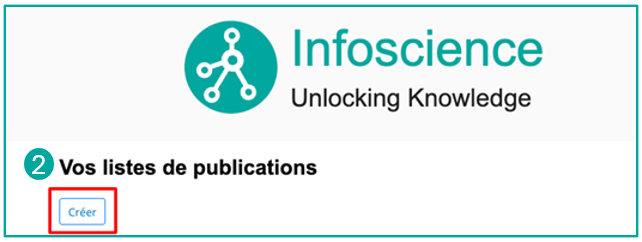

5. **Configure your list:**
    - Give your list **a clear title**.
    - Paste the URL obtained previously into the **"Request URL"** field.
    - **Choose the presentation and grouping options** for your publications according to your preferences.
    - Use the "**Preview**" button at the bottom of the page to see a preview of your list as it will appear on your "People" page.
    - Once you have confirmed that the list meets your requirements, **click on "Submit". You will then be provided with a URL. Copy it** (**3**).

6. **Navigate to your "People" page** and click on "**Edit profile**" (see the [dedicated help](https://www.epfl.ch/campus/services/website/web-services/help-for-people-epfl-ch/) for this service).
7. **Look for the "Infoscience Publications"** entry in the "**Publications block**" (**4**). The grey bar at the top of the page gives you a choice of language(s) in which your page will be displayed. If you want both versions (French and English), you must edit them separately.
8. **Click on "Add an element"** and **paste the URL you copied earlier into the "Source" field**. Depending on the items you wish to promote on your "People" page, it is possible to add several lists, each of which is based on a separate query. In this case, it will probably be useful to specify a label in "Label". Then save the changes by clicking on "Save" in the grey bar at the top.

    

9. By clicking on "**Preview**", you can **preview your list** as it will appear on your public profile.
10. **When you submit a new publication to Infoscience** that matches the query defined above, **it will automatically be displayed on your "People" page**, possibly after a delay of a few hours. If you have chosen to display your page in both languages, repeat step 6 and choose the other language in "Edit in".

---

## Update the list of publications of your lab/unit with the new version of Infoscience

**On 22 July 2024, Infoscience was updated to a new and improved version.** However, **this update leads to incompatibilities with publication lists generated in the former version**. It is therefore **essential to migrate your publication lists** to ensure that they are accessible and continuously updated.

### Impact on publication lists created before the platform migration

**The lists of publications currently displayed on the EPFL websites, laboratory pages and personal pages can still be consulted.** However, **these lists have been placed in perpetual cache status and their content is now frozen** (**1**). They will no longer be updated with new publications submitted in Infoscience.

**The related lists of publications can be easily identified thanks to a specific notification at the top of each list** (**2**). This notification invites managers to update their lists by replacing the old query with a new query generated via the new version of Infoscience by following the steps described above.

**On the WordPress block EPFL Infoscience Publications:**

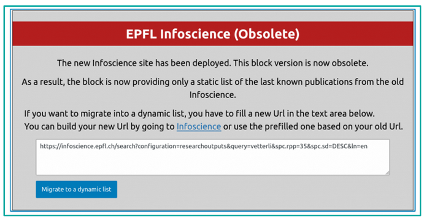

### Update my People publication list

**On the Infoscience-Exports service:**

1. Click on the button **Migrate** (**1**).

    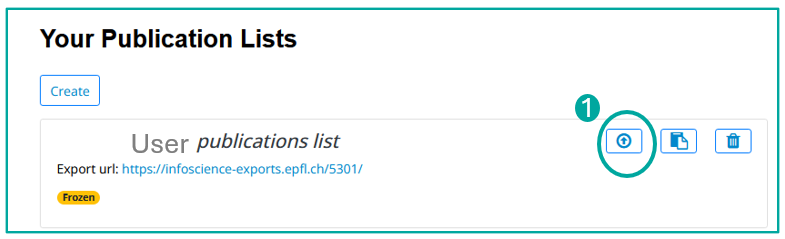

2. Insert your new request (see [Creating a query to populate your list](#creating-a-query-to-populate-your-list)) in the field "**New proposed url**" (**2**).

    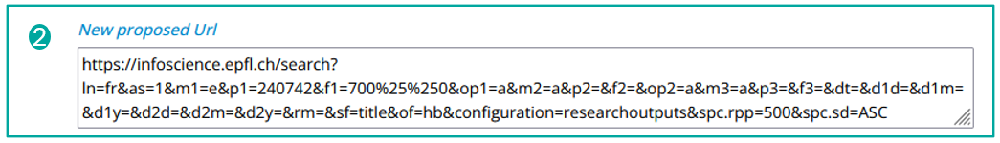

3. Click on the button **Migrate** at the end of the form.

If you need help creating your queries, please contact the Infoscience team.

### Update my WordPress publication list

**On the laboratory/unit website:**

1. On the laboratory webpage, click on the Publications list tab.
2. Log in to the WordPress admin console.
3. Edit it via the WordPress menu that appears at the top of the page, at the left.
4. In edit mode of the page, identify the **EPFL Infoscience block** (**1**) used to build the list and click on it.
5. A message will appear indicating that the block is obsolete. Proceed with the migration by clicking on the blue button **"Migrate to dynamic list"** (**2**).

    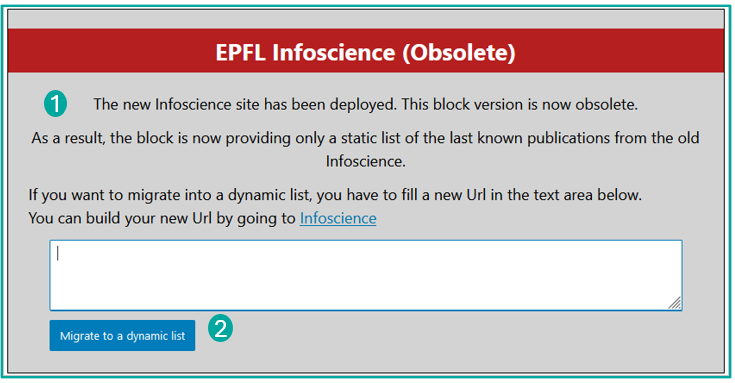

6. In the right-hand column, under the block settings, in the "**A direct Infoscience URL**" field (**3**), replace the URL with the new Infoscience query (see [Creating a query to populate your list](#creating-a-query-to-populate-your-list)).

7. Choose the number of results to display in the "**Limit**" field (**4**). In the interests of user-friendliness, **we recommend that you limit the number of publications to 100**, and potentially link to the full list of your publications on Infoscience by creating a button with a link, for example.

    

8. Leave the "**Sort**" option (**5**) in descending order and in "**Group By Titles**" (**6**), choose "**Year, then document Type**".

    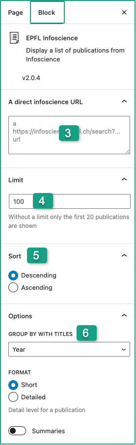

9. You can preview the results by clicking on "Preview" and update the page by clicking on "**Update**".
10. **Edit the list in the French page** if you have one using the same process above.

---

[Back to Help home](index.md)
