# Rechercher et consulter

Pour trouver une publication, un.e auteur.rice, un laboratoire ou un sujet spécifique, naviguez à travers Infoscience !

!!! info
    L'authentification EPFL n'est pas nécessaire.


---

## Recherche simple

La **barre de recherche** sur la page d'accueil permet de rechercher un ou plusieurs **mots-clés : nom, titre, sujet, date**… Vous trouverez les publications et travaux correspondant à ces critères.

Dans la barre de recherche, saisissez les termes souhaités, puis cliquez sur **Recherche**.

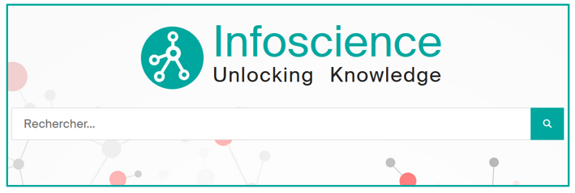

### Afficher les résultats et utiliser les filtres

Lorsque la liste de résultats s'affiche, vous pouvez :

- **L'affiner** à l'aide des filtres proposés à gauche (Type de document, Auteur.trice, Date, Licence…)
- **Trier la liste** en utilisant les paramètres proposés en bas à gauche (pertinence, date de dépôt…)
- **Modifier le nombre de résultats affichés**, en bas à gauche

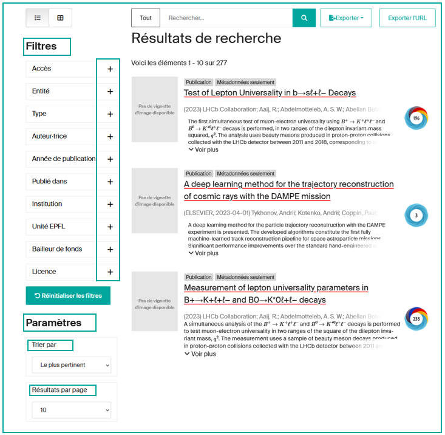

!!! tip
    Diverses astuces peuvent faciliter votre recherche. Découvrez-les en consultant les [exemples de requêtes expertes](#exemples-de-requetes-expertes).

---

## Menus de navigation

Les menus permettent de parcourir les contenus selon **plusieurs points d'entrée :**

- **Recherche :**
    - Facultés et Collèges
    - Centres et plateformes de recherche
- **Éducation :**
    - Programmes doctoraux (thèses EPFL)
    - Sections d'enseignement (travaux étudiant.e.s)
- **Innovation** (brevets)

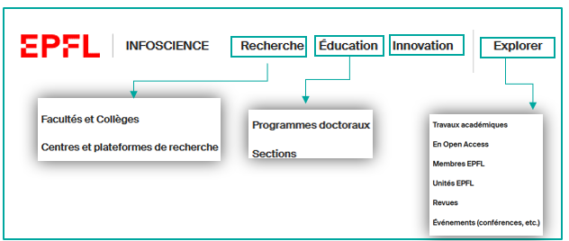

**Explorer :** pour parcourir les contenus d'Infoscience via des listes ordonnées :

- Travaux académiques (recherche avancée)
- En Open Access
- Membres EPFL
- Unités EPFL
- Revues
- Événements

---

## Recherche avancée (menu Explorer)

Le menu **Explorer** (**1**) permet de cibler rapidement un périmètre de recherche et de combiner plusieurs critères (Titre, Auteur, Type de document…) à l'aide des opérateurs booléens (ET, OU, SAUF).

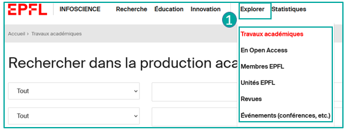

Les **index disponibles** pour la recherche sont proposés dans le menu déroulant (**2**).

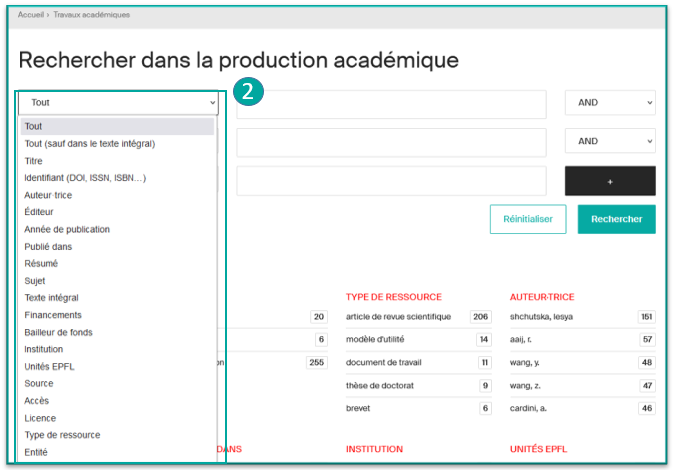

---

## Consulter une notice

Par défaut, les notices se présentent sous forme **brève**. **Cliquer sur le titre donne accès à la notice détaillée**.

### La notice brève (1)

La notice brève présente :

- Le **type** de contenu (ici « Publication »)
- Le type d'**accès** (si disponible)
- Le **titre**
- Le **publisher** (ou *container*)
- Les **premiers auteur.trices** (cliquables pour voir leur profil si disponible)
- Le **début du résumé**
- Les **indicateurs** statistiques de **consultation** et/ou de **téléchargement** (si la notice a été consultée et/ou le fichier téléchargé)
- Un **widget Altmetric** (si disponible) qui mesure et suit la portée et l'impact de la recherche académique en ligne

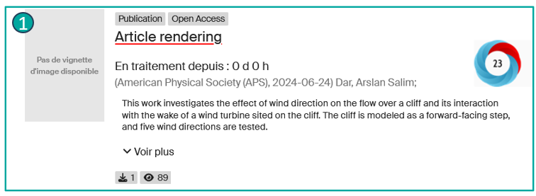

### La notice détaillée (2)

La notice détaillée présente :

- Le **type de document**
- La **date de dépôt**
- Le nom du journal
- Un bouton **Exporter** pour **exporter les informations de la notice** dans différents formats (RIS, JSON, Cerif-XML, Datacite-XML, CSV et BibTeX)
- Le bouton **Statistiques** pour accéder aux **détails statistiques** (Total des vues, vues par mois, Top des villes, vues des fichiers), avec possibilité d'export vers Excel ou CSV
- Un bouton **S'abonner** (visible uniquement pour les utilisateur.trices EPFL connecté.es) : permet de recevoir des alertes sur les mises à jour de la notice
- Un bouton « **…** » qui **affiche toutes les métadonnées de la notice** (vue technique)

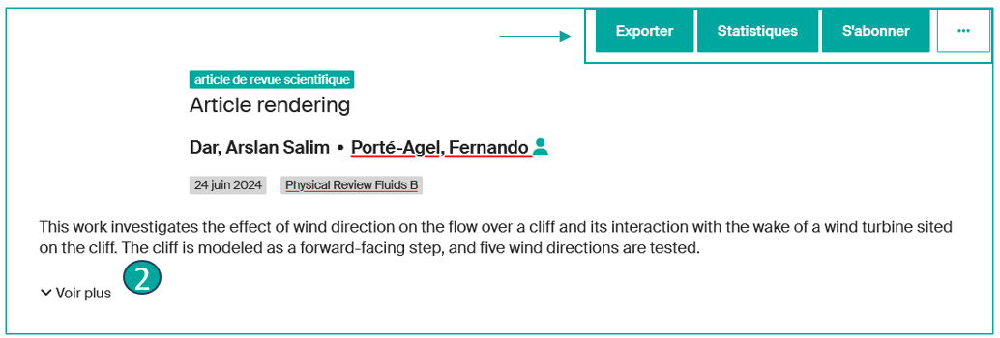

### Dans l'onglet Files (3)

Informations sur le(s) fichier(s) :

- Le **nom du fichier**
- La **version/type du fichier**
- Le **mode d'accès**
- La **licence du fichier**
- La **taille du fichier**
- Le **format du fichier**
- L'**empreinte numérique** (checksum) du fichier
- Et si le **fichier peut être consulté ou téléchargé**

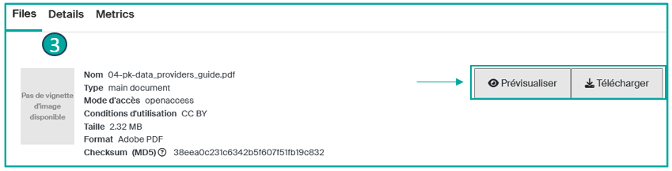

### Dans l'onglet Details (4)

- **Type de ressource**
- **DOI** si présent
- **Identifiant Scopus**\*
- La **liste complète des auteur.trices**
- Auteur.trices institutionnel.les\*
- **Date de publication**
- **Éditeur**
- **Titre du journal**
- **Volume**\*
- **Numéro**\*
- **Numéro d'article**\*
- **Pages de début** et de **fin**\*
- **Mots-clés**
- **Note**\*
- Lien supplémentaire\*
- Si **Évalué par les pairs**
- L'**unité** correspondant à la publication
- Le **Handle** (lien permanent et unique vers la notice)
- Un encart sur le **Financement**\*
- **Relation**, si la notice est liée à une autre notice\*

\*Si disponible dans la notice

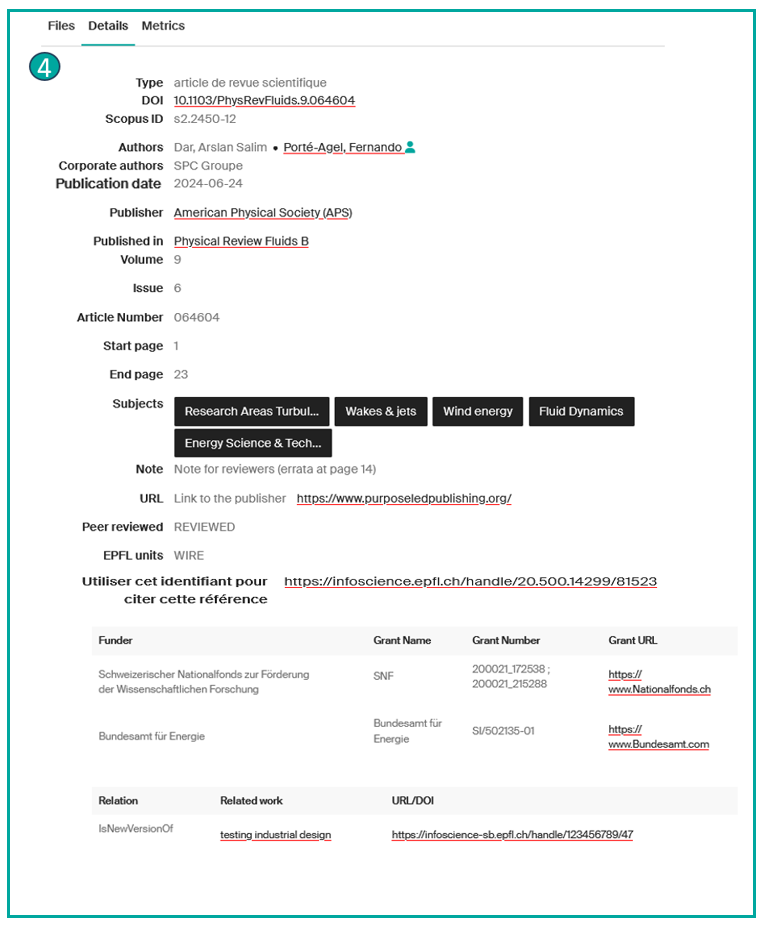

### Dans l'onglet Metrics (5)

- Le **nombre de consultations** de la notice
- Le **nombre de téléchargements** de la notice
- Un **widget Altmetrics** peut être ajouté pour mesurer et suivre la portée et l'impact de la recherche académique en ligne

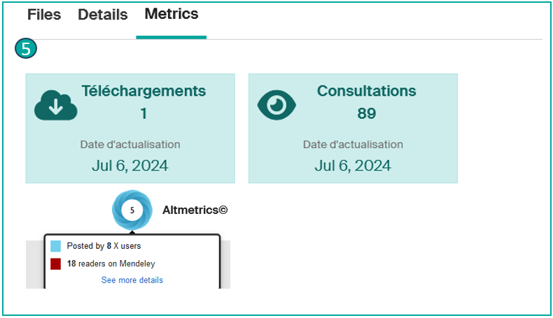

---

## Accéder aux fichiers (texte intégral, demander une copie, etc.)

Lorsqu'une notice contient un ou plusieurs fichiers, plusieurs options s'offrent à vous :

- Si le fichier est en **Open Access**, accédez à l'onglet « **Files** » (**1**), **prévisualisez** ou **téléchargez** le(s) fichier(s) souhaité(s) (**2**). Vous avez la possibilité de télécharger un ou plusieurs fichiers.

- Si le fichier est en **accès restreint** :
    - **Pour les non-membres EPFL**, vous pouvez **demander une copie** à des fins personnelles. Pour cela, accédez à l'onglet « **Files** », puis cliquez sur « **Request a copy** » (**3**). Une fois le formulaire de demande rempli (**4**), si l'auteur.trice accepte, vous recevrez un e-mail contenant un lien d'accès temporaire au(x) fichier(s).
    - **Pour les membres EPFL**, les fichiers en accès restreint sont accessibles après **authentification** avec le compte Gaspar via Tequila.

- **Pour les documents sous embargo**, le(s) fichier(s) deviennent accessibles après la date de levée indiquée dans les détails de la notice. Vous pouvez toutefois y accéder en avance en faisant une demande de copie.

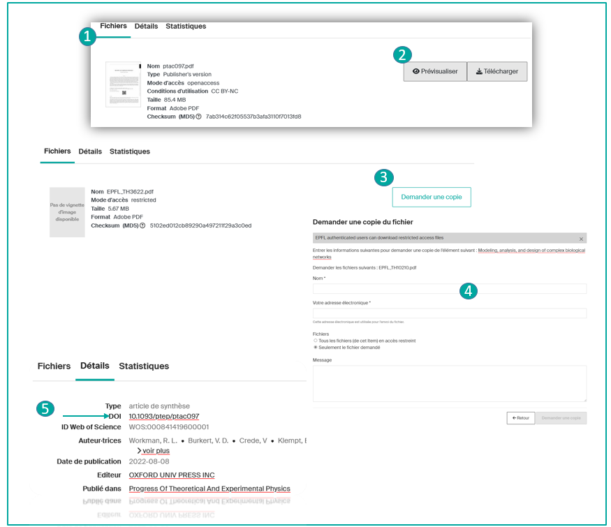

!!! note
    Les notices Infoscience peuvent ne pas comporter de fichier joint. Un **lien** vers le texte intégral (ex. : DOI) (**5**) peut vous permettre d'accéder directement au fichier sur la page de l'éditeur.

---

## Exemples de requêtes expertes

Pour obtenir des résultats plus précis, nous recommandons vivement de construire des requêtes bien définies en utilisant les index disponibles. Voici quelques exemples de requêtes pour vous aider à créer vos listes de publications efficacement.

### Rechercher toutes les références d'un auteur donné

```
author:(bierlaire, michel)
```

[Essayer cette requête →](https://infoscience.epfl.ch/search?spc.page=1&query=author:(bierlaire,%20michel)&configuration=researchoutputs)

### Rechercher toutes les références d'une personne en tant qu'auteur.trice ou éditeur.trice scientifique

```
author_editor:(bierlaire, michel)
```

[Essayer cette requête →](https://infoscience.epfl.ch/search?spc.page=1&query=author_editor:(bierlaire,michel)&configuration=researchoutputs)

### Rechercher toutes les références rattachées à une unité

Exemple :

```
dc.description.sponsorship:LASUR
```

[Essayer cette requête →](https://infoscience.epfl.ch/search?spc.page=1&query=dc.description.sponsorship:LASUR&configuration=researchoutputs)

### Limité aux publications des trois dernières années

[Essayer cette requête →](https://infoscience.epfl.ch/search?spc.page=1&query=dc.description.sponsorship:LASUR&configuration=researchoutputs&f.dateIssued.min=2022&f.dateIssued.max=2024)

### Filtrer par type de publication

Pour restreindre la recherche à certains types de publication, par exemple « articles de recherche » et « articles de conférence », utilisez :

```
dc.description.sponsorship:LASUR AND (types:(research article) OR types:(conference paper))
```

[Essayer cette requête →](https://infoscience.epfl.ch/search?spc.page=1&query=dc.description.sponsorship:LASUR%20AND%20(types:(research%20article)%20OR%20types:(conference%20paper))&configuration=researchoutputs)

### Trier les résultats

Par défaut, Infoscience trie les résultats par pertinence. Si vous souhaitez un autre mode de tri, utilisez les options à gauche sous les filtres/facettes. Par exemple, pour trier par date de publication décroissante :

[Essayer cette requête →](https://infoscience.epfl.ch/search?spc.page=1&query=dc.description.sponsorship:LASUR&configuration=researchoutputs&spc.sf=dc.date.issued&spc.sd=DESC)

!!! warning
    Il est important de définir le tri souhaité pour votre liste de publications dès la construction de la requête.

En suivant ces étapes, vous pouvez facilement créer et personnaliser une liste de publications pour votre unité sur WordPress.

**Pour toute assistance, contactez le support Infoscience.**

---

## Index de recherche

La liste complète des index de recherche est documentée dans la carte interactive du modèle de données sur [epfllibrary.github.io/infoscience-map](https://epfllibrary.github.io/infoscience-map/).

### Identifiants

| Index | Description | Exemple |
|---|---|---|
| `search.resourceid` | Recherche par UUID de la notice | `search.resourceid:a1b2c3d4-e5f6-7890-abcd-ef1234567890` |
| `cris.legacyId` | Recherche par ancien identifiant Infoscience | `cris.legacyId:175201` |
| `itemidentifier` | Recherche par identifiant : DOI, arXiv, WoS, Scopus… | `itemidentifier:(*arXiv.2306.09281)` |
| `doi` | Recherche par DOI uniquement | `doi:(10.1002/anie.202414612)` |
| `orcid` | Recherche par identifiant ORCID | `orcid:0000-0001-2345-6789` |

### Auteurs et personnes

| Index | Description | Exemple |
|---|---|---|
| `author` | Recherche par nom d'auteur | `author:(Martin, Sophie)` ou `author:(Martin, S*)` |
| `author_authority` | Recherche par auteur en utilisant l'UUID du profil | `author_authority:f9e8d7c6-b5a4-3210-fedc-ba9876543210` |
| `author_editor` | Recherche par auteur ou éditeur scientifique | `author_editor:(Martin, Sophie)` |
| `author_editor_authority` | Recherche par auteur ou éditeur scientifique en utilisant l'UUID du profil | `author_editor_authority:f9e8d7c6-b5a4-3210-fedc-ba9876543210` |
| `submitter_keyword` | Recherche par déposant | `submitter_keyword:(*dupont*)` |

### Types de documents

| Index | Description | Exemple |
|---|---|---|
| `types` | Recherche par type de document en utilisant la valeur display | `types:(conference paper)` |
| `types_authority` | Recherche par type de document en utilisant l'identifiant d'autorité COAR | `types_authority:("article-coar-types:c_2df8fbb1")` ou `types_authority:(*c_2df8fbb1)` |

### Dates

| Index | Description | Exemple |
|---|---|---|
| `dateIssued` | Recherche par date de publication (format YYYY-MM-DD) | `dateIssued:(2024-06-12)` ou `dateIssued:(2024-06-*)` |
| `dateIssued.year` | Recherche par année de publication | `dateIssued.year:(2009)` |

### Unités et affiliations

| Index | Description | Exemple |
|---|---|---|
| `unitOrLab` | Recherche par unité ou laboratoire en utilisant l'acronyme | `unitOrLab:("TRANSP-OR")` |
| `organizationHierarchy` | Recherche par affiliation — inclut toute la hiérarchie : faculté > institut > laboratoire | `organizationHierarchy:("SPC")` |
| `epfl.writtenAt` | Filtrer par publications produites ou non à l'EPFL | `epfl.writtenAt:EPFL` ou `epfl.writtenAt:OTHER` |

### Titres, contenu et sujets

| Index | Description | Exemple |
|---|---|---|
| `title` | Recherche dans le titre | `title:(artificial intelligence)` |
| `abstract` | Recherche dans le résumé | `abstract:(artificial intelligence)` |
| `subject` | Recherche par sujet ou mot-clé auteur | `subject:(LLM)` |
| `container` | Recherche selon le titre de l'ouvrage, du proceedings ou de la revue dans lequel le papier apparaît | `container:(*IEEE proceedings*)` |
| `journal` | Recherche selon le titre de la revue dans lequel l'article est publié | `journal:(Physical Review B)` |
| `journal_authority` | Recherche selon le titre de la revue en utilisant l'UUID de la revue dans Infoscience | `journal_authority:c3d4e5f6-a7b8-9012-3456-789abcdef012` |
| `publisher` | Recherche par éditeur | `publisher:(*springer*)` |

### Accès, version et droits

| Index | Description | Exemple |
|---|---|---|
| `oaire.version` | Filtrer selon la version de la publication | `oaire.version(*c_970fb48d4fbd8a85)` = Version éditeur<br>`oaire.version(*c_ab4af688f83e57aa)` = Manuscrit accepté<br>`oaire.version(*c_71e4c1898caa6e32)` = Version soumise |
| `datacite.rights` | Filtrer selon le mode d'accès | `datacite.rights:(openaccess)` ou `datacite.rights:(restricted)` ou `datacite.rights:(metadata only)` |
| `epfl.peerreviewed` | Filtrer par publications révisées par les pairs | `epfl.peerreviewed:REVIEWED` |

### Financement

| Index | Description | Exemple |
|---|---|---|
| `fundername` | Recherche par financeur | `fundername:(SNSF)` |

### Paramètres d'URL

| Paramètre | Description | Exemple |
|---|---|---|
| `query` | Paramètre de recherche principal | `&query=title:(artificial intelligence)` |
| `configuration` | Porte la recherche sur une configuration spécifique | `&configuration=researchoutputs` (publications, brevets, produits) |
| `scope` | Porte la recherche sur une collection, une personne ou une unité particulière | `&scope=1a71fba2-2fc5-4c02-9447-f292e25ce6c1` |
| `f.{index}` | Filtres supplémentaires sur les résultats | `&f.unitOrLab=crpp,equals` |
| `spc.rpp` | Nombre de résultats affichés par page | `&spc.rpp=10`, `&spc.rpp=60`, `&spc.rpp=100` |
| `spc.sf` et `spc.sd` | Champ et direction de tri | `spc.sf=dc.date.issued&spc.sd=DESC` (par date)<br>`spc.sf=metric.scopusCitation&spc.sd=DESC` (par citations)<br>`spc.sf=score&spc.sd=DESC` (par pertinence) |
| `spc.page` | Pagination des résultats | `&spc.page=1` |

### Opérateurs booléens et syntaxe

| Opérateur | Description | Exemple |
|---|---|---|
| `AND` | Combine plusieurs critères de manière stricte | `author:(bernard) AND dateIssued.year:[2008 TO 2010]` |
| `OR` | Étend la recherche avec des choix alternatifs | `(author:(bernard) OR author:(Martin))` |
| `NOT` ou `-` | Exclut certains résultats | `-types:(conference poster)` |
| `" "` (guillemets) | Recherche d'une expression exacte | `"Durand, Claire"`, `"Leclerc, Marc"` |
| `[X TO Y]` | Recherche par plage | `dateIssued.year:[2020 TO 2024]` |
| `*` (joker) | Correspondance partielle | `author:(Martin, S*)` |

---

## Alertes

**Souhaitez-vous être informé.e des nouvelles publications** liées à un laboratoire, un.e auteur.rice, un journal, une conférence, un brevet ou une unité dans Infoscience ?

Infoscience vous permet de **recevoir des alertes par e-mail à la fréquence de votre choix**.

Le bouton **S'abonner** (**1**) disponible sur certaines pages (**publications**, **personnes**, **journaux**, **événements**, **unités**) vous permet de vous abonner en un clic et de sélectionner le contenu et la fréquence des notifications (**2**).

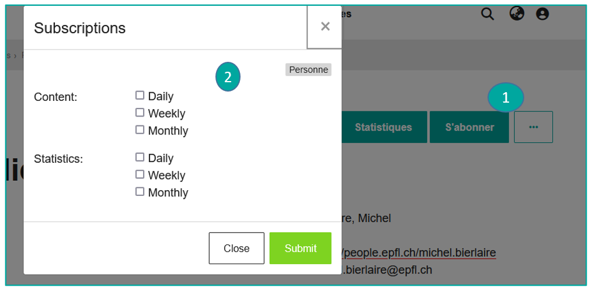

!!! warning
    Seul.es les utilisateur.trices connecté.es peuvent activer ce service.

### Modifier/Supprimer des alertes

Souhaitez-vous **modifier ou supprimer des alertes** auxquelles vous êtes abonné.e ?

Accédez à votre icône de profil et **cliquez sur Abonnements** (**1**).

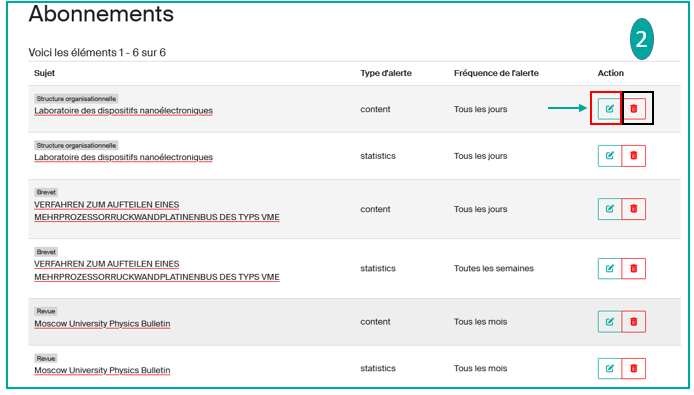

La page de tous vos abonnements apparaît ; **vous pouvez modifier la fréquence et le contenu des alertes, ou les supprimer définitivement** (**2**).

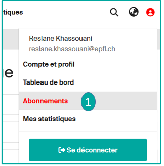

---

## Statistiques

### Statistiques du site

Depuis le bandeau supérieur, vous avez la possibilité de consulter les statistiques en cliquant sur « Site » (**1**).

**Vous y trouverez des rapports sur les vues, les téléchargements et le Top 20** de l'ensemble de la plateforme Infoscience.

En bas de page, vous trouverez plus de détails :

- Top des vues par région
- Top des vues par ville
- Les plus consultés
- Catégories
- Total des vues par mois

Vous pouvez exporter ces rapports vers Excel et CSV.

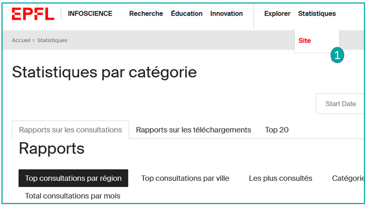

### Statistiques d'une notice

Vous pouvez consulter les statistiques de chaque notice en :

- Cliquant sur le bouton « **Statistiques** » (**1**) :
    - Total des vues
    - Total des vues par mois
    - Total des vues par ville
    - Vues (fichiers)

    Vous pouvez exporter ces rapports vers Excel et CSV.

- Cliquant sur l'**onglet Metrics** en bas de la notice (**2**) :
    - Nombre de consultations de la notice
    - Nombre de téléchargements du fichier
    - Voir, via un outil « Metrics » relatif à la publication : nombre de citations Scopus et Web of Science, Altmetrics (**3**), lien vers la description de la ressource dans Google Scholar si présent

En cliquant sur ces widgets (**3**), vous pouvez accéder aux mêmes détails.

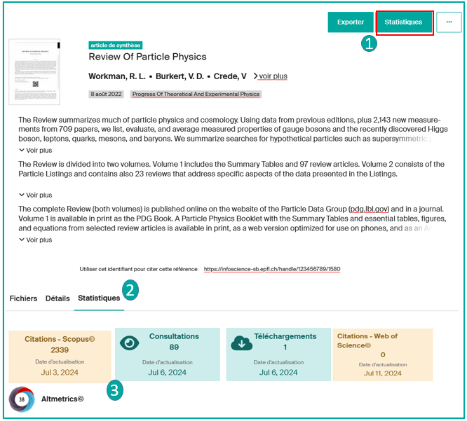

### Statistiques de profil et d'unité

- **Statistiques de profil :** voir [Gérer mon profil Infoscience](manage-profile.fr.md)
- **Statistiques d'unité :** voir [Gérer la page de mon labo/unité](manage-lab-unit.fr.md)

---

[Retour à l'accueil de l'Aide](index.fr.md)
