# Search and consult

To find a publication, an author, a laboratory or a specific subject, browse through Infoscience!

!!! info
    EPFL authentication is not required.


---

## Simple search

The **search bar** on the homepage allows you to search for one or more **keywords: name, title, subject, date**… You will find publications and works corresponding to these criteria.

In the search bar, enter the desired terms, then click on **Search**.

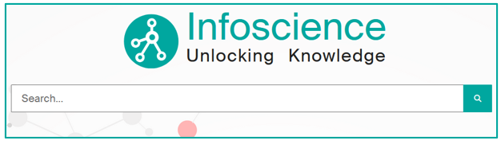

### Display results and use filters

When the list of results is displayed, you can:

- **Refine it** by using the filters offered on the left (Document Type, Authors, Date, License, … .)
- **Sort the list** using the parameters offered at the bottom left (relevance, deposit date, …).
- **Modify the number of results displayed**, at bottom left.

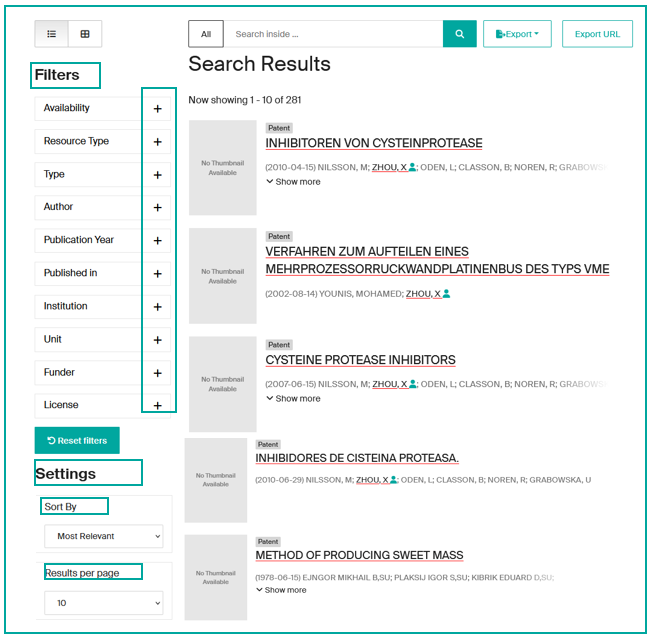

!!! tip
    Various tips can facilitate your search. Discover them by consulting the [expert queries examples](#example-of-expert-queries).

---

## Navigation menus

Menus allow you to browse content from **several entry points**:

- **Search:**
    - Schools & Colleges
    - Research Centers & Platforms
- **Education:**
    - Doctoral Schools (EPFL thesis)
    - Sections (student works)
- **Innovation** (patents)

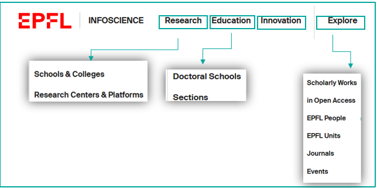

**Explore:** to browse **Infoscience content** through lists ordered by:

- Scholarly Works (advanced search)
- In Open Access
- EPFL People
- EPFL Units
- Journals
- Events

---

## Advanced search (Explore menu)

**Explore** menu (**1**) allows you to quickly target a search scope and combine multiple criteria (Title, Author, Document Type…) using boolean operators (AND, OR, NOT).

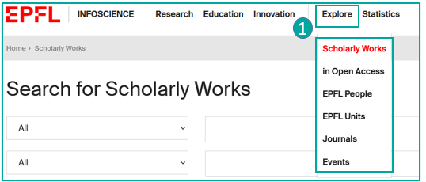

The **available indexes** for search are provided in the dropdown menu (2).

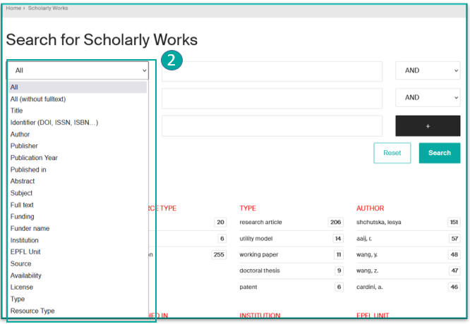

---

## Consult a record

By default, records are presented in **brief** form. **Clicking on the title takes you to the detailed record**.

### The brief record (1)

The brief record presents:

- The **type** of content (here "Publication")
- **Access** type (if available)
- The **title**
- The **publisher** (or *container*)
- The **first authors** (clickable to see their profile if available)
- The **beginning of the abstract**
- Statistical **indicators** of **consultation** and/or **downloading** (if the record has been consulted and/or the file downloaded)
- An **Altmetric widget** (if available) that measures and monitors the scope and impact of online academic research.

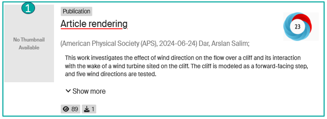

### The detailed record (2)

The detailed record presents:

- **Document type**
- **Deposit date**
- Journal name
- an **Export** button for **exporting information from the record** in various formats (RIS, JSON, Cerif-XML, Datacite-XML, CSV and BibTeX)
- the **Statistics** button for accessing **statistical details** (Total visits, total visits per month, Top city views, File visits), with the option of exporting them to Excel or CSV.
- a **Subscribe** button (only visible to registered EPFL users): Allows you to trigger alerts about the record updates.
- a "**…**" button **displays all the record's metadata** (technical view).

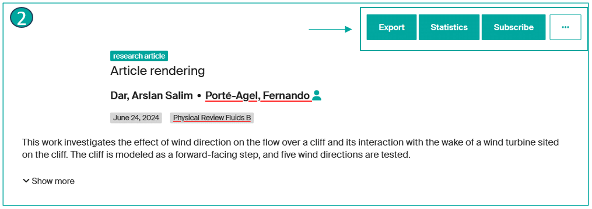

### In the Files tab (3)

Information about the file(s):

- the **file name**
- the **file version/type**
- the **access type**
- **file licence**
- **file size**
- **file format**
- **file checksum**
- and if the **file can be read or downloaded**

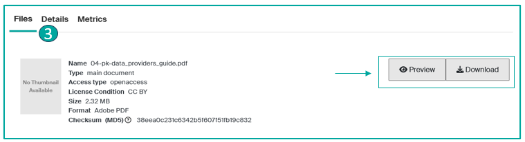

### In the Details tab (4)

- **Resource type**
- **DOI** if present
- **Scopus ID**\*
- The **complete list of authors**
- Corporate authors\*
- **Publication date**
- **Publisher**
- **Journal title**
- **Volume**\*
- **Issue**\*
- **Article Number**\*
- **Start** and **End Page**\*
- **Keywords**
- **Note**\*
- Additional Link\*
- If **Peer reviewed**
- The **unit** corresponding to the publication
- the **Handle** (permanent and unique link to the record)
- An insert on **Funder**\*
- **Relation**, if the record is linked to another record\*

\*If available in the record

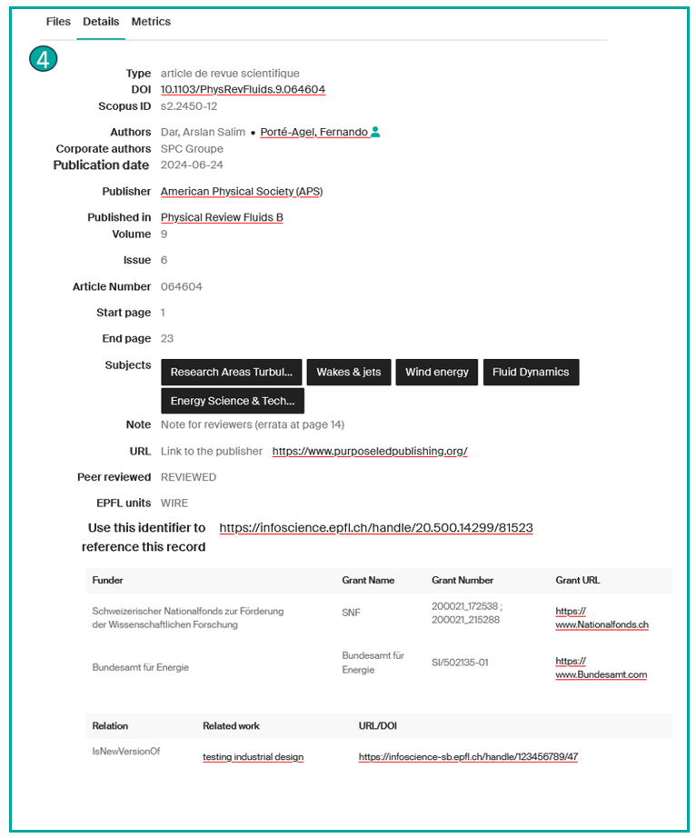

### In the Metrics tab (5)

- The **number of times the record has been consulted**
- The **number of downloads** of the record
- An **Altmetrics** widget can be added to measure and monitor the reach and impact of online academic research.

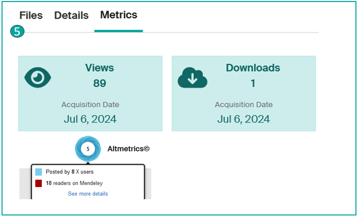

---

## View linked files (full text, request a copy, etc.)

When a record contains one or more files, you have different options:

- If the file is **Open Access**, go to the "**Files**" tab (**1**), **preview** or **download** the desired file(s) (**2**). You have the option to download one or more files.

- If the file is **restricted access**:
    - **For non-EPFL users**, you can **request a copy** for your personal use. To do this, go to the "**Files**" tab, then click on "**Request a copy**" (**3**). Once the request form has been filled in (**4**), if the author agrees, you will receive an e-mail containing a temporary access link to the file(s).
    - **For EPFL users**, restricted-access files are accessible after **authentication** with the Gaspar account via Tequila.

- **For documents under embargo**, the file(s) become accessible after the release date indicated on the record details. However, you can still access the file(s) by requesting a copy.

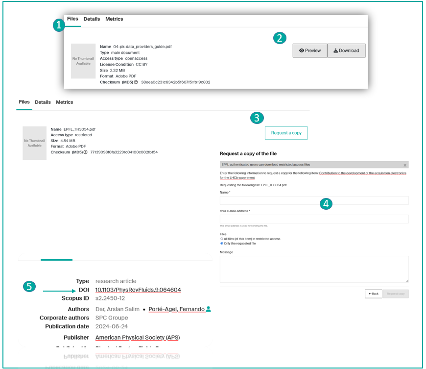

!!! note
    Infoscience records may not include an attached file. A **link** to the full text (e.g., DOI) (**5**) may allow you to access the file directly on the publisher's page.

---

## Example of expert queries

To obtain more precise results, we strongly recommend that you build well-defined queries using the available indexes. Here are a few examples of queries to help you create your publication lists efficiently.

### Search for all references for a given author

```
author:(bierlaire, michel)
```

[Try this query →](https://infoscience.epfl.ch/search?spc.page=1&query=author:(bierlaire,%20michel)&configuration=researchoutputs)

### Search for all references for a person with the role of author or scientific editor

```
author_editor:(bierlaire, michel)
```

[Try this query →](https://infoscience.epfl.ch/search?spc.page=1&query=author_editor:(bierlaire,michel)&configuration=researchoutputs)

### Search for all references assigned to a unit

Example:

```
dc.description.sponsorship:LASUR
```

[Try this query →](https://infoscience.epfl.ch/search?spc.page=1&query=dc.description.sponsorship:LASUR:LASUR&configuration=researchoutputs)

### Limited to publications from the last three years

[Try this query →](https://infoscience.epfl.ch/search?spc.page=1&query=dc.description.sponsorship:LASUR&configuration=researchoutputs&f.dateIssued.min=2022&f.dateIssued.max=2024)

### Filter by type of publication

To restrict the search to certain types of publication, for example 'research articles' and 'conference papers', use:

```
dc.description.sponsorship:LASUR AND (types:(research article) OR types:(conference paper))
```

[Try this query →](https://infoscience.epfl.ch/search?spc.page=1&query=dc.description.sponsorship:LASUR%20AND%20(types:(research%20article)%20OR%20types:(conference%20paper))&configuration=researchoutputs)

### Sorting results

By default, Infoscience sorts search results by relevance. However, if you prefer a different sorting mode, you can use the options on the left under the filters/facets. For example, to sort results by publication date in descending order, follow this link:

[Try this query →](https://infoscience.epfl.ch/search?spc.page=1&query=dc.description.sponsorship:LASUR&configuration=researchoutputs&spc.sf=dc.date.issued&spc.sd=DESC)

!!! warning
    It's important to define the sorting you want for your list of publications as soon as you build the query.

By following these steps, you can easily create and customise a list of publications for your unit on WordPress.

**For further assistance, please contact Infoscience support.**

---

## Alerts

**Would you like to be informed about new publications** related to a laboratory, an author, a journal, a conference, a patent, or a unit in Infoscience?

Infoscience allows you to **receive email alerts at your preferred frequency**.

The **Subscribe** button (**1**) available on certain pages (**publications**, **people**, **journals**, **events**, **units**) lets you subscribe with a single click and select the content and frequency of the notifications (**2**).

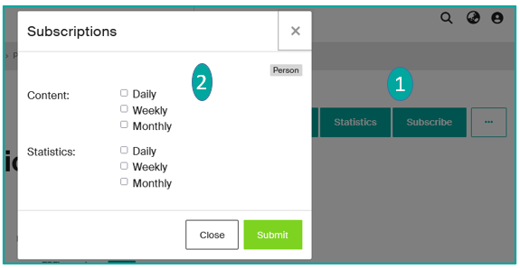

!!! warning
    Only logged-in users can activate this service.

### Modify/Delete alerts

Would you like to **modify or delete alerts** you have subscribed to?

Go to your profile icon and **click on Subscriptions** (**1**).

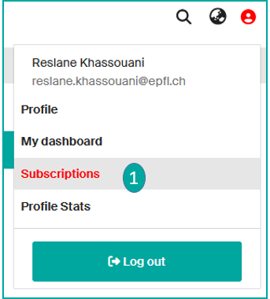

The page with all your subscriptions will appear, **you can modify the frequency and content of the alerts or permanently delete them** (**2**).

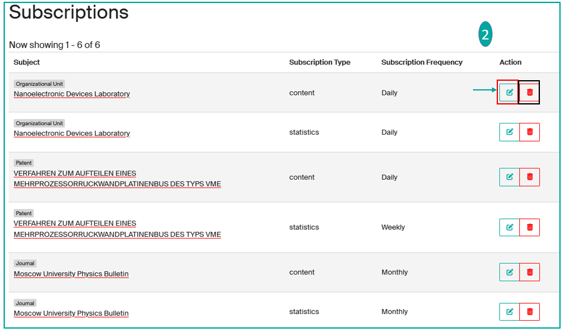

---

## Statistics

### Site statistics

From the top banner, you have the option to view Statistics by clicking on "Site" (**1**).

**You will find reports on views, downloads, and the Top 20 statistics** for the entire Infoscience platform.

At the bottom page, you will find more details:

- Top views by region
- Top views by city
- Most viewed
- Categories
- Total views per month

You can export these reports to Excel and CSV.

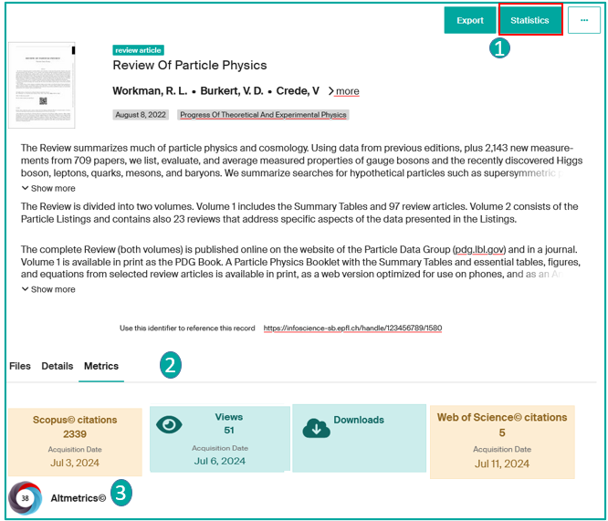

### Record statistics

You can consult the statistics for each record by:

- Clicking on "**Statistics**" button (**1**):
    - Total views
    - Total views per month
    - Total views by city
    - Views (files)

    You can export these reports to Excel and CSV.

- Clicking on the **Statistics tab** at the bottom of the record (**2**):
    - number of times the record has been consulted
    - number of downloads of the file
    - see, via a tool called 'Metrics' relating to the publication: Number of Scopus and Web of Science citations, Altmetrics (**3**), link to the resource description in Google Scholar if present.

By clicking on these widgets (**3**), you can access the same details.

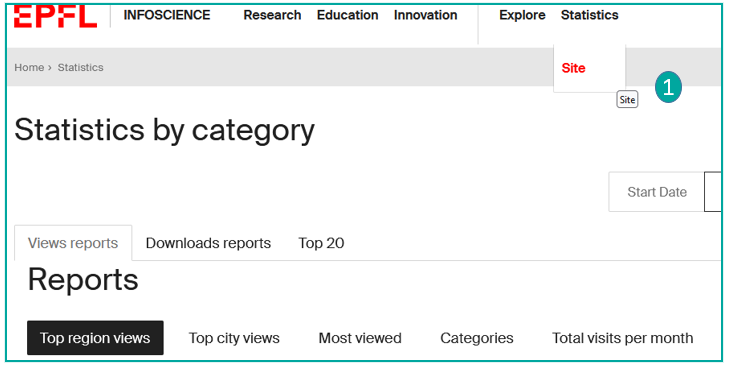

### Profile and unit statistics

- **Profil statistics:** See [Manage my Infoscience profile](manage-profile.md)
- **Unit statistics:** See [Manage my lab/unit page](manage-lab-unit.md)

---

[Back to Help home](index.md)
