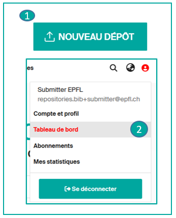
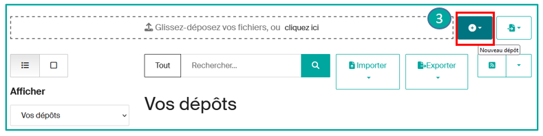
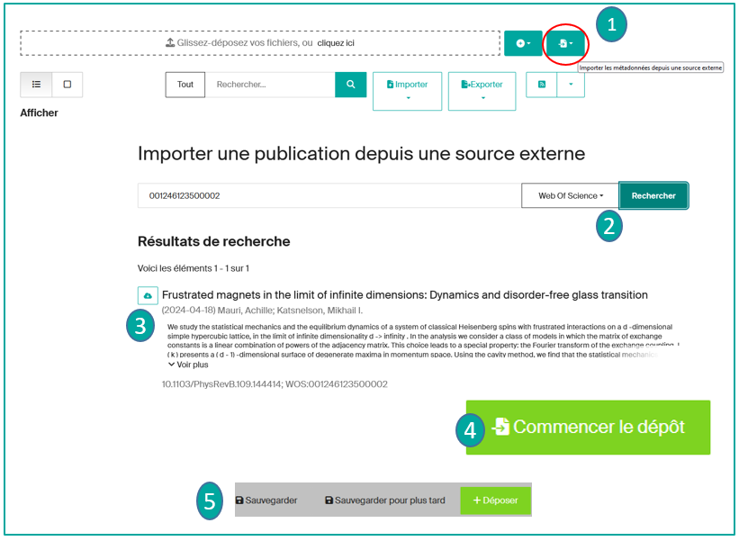
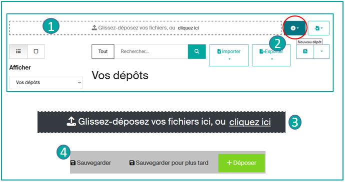
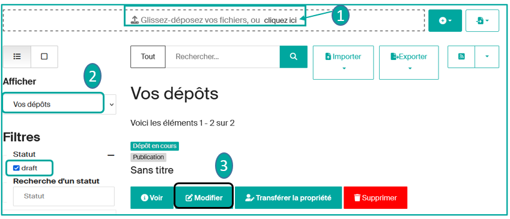
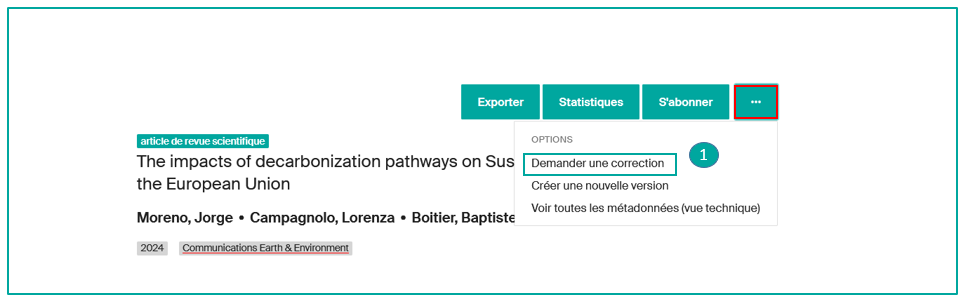
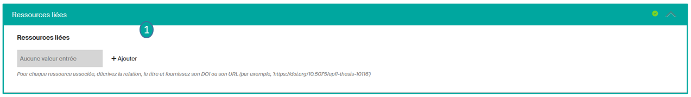
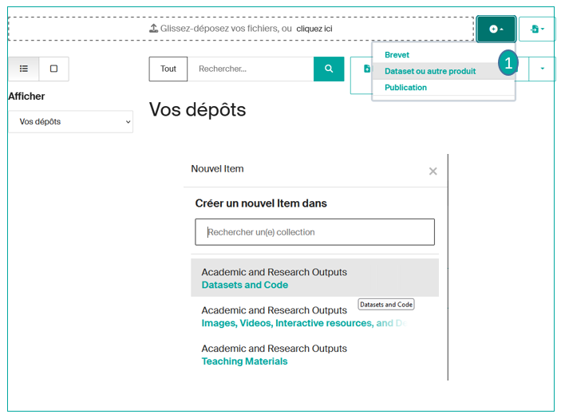

# Déposer une publication

---

## Tutoriel vidéo

  <iframe
    src="https://www.youtube.com/embed/WTJt7sDSa3s"
    title="How to submit a publication in Infoscience"
    frameborder="0"
    allowfullscreen>
  </iframe>

---

## Conditions de dépôt

- selon la [LEX 3.5.1](https://www.epfl.ch/about/overview/wp-content/uploads/2019/09/LEX-3.5.1_EN.pdf), les auteur·trice·s EPFL doivent impérativement déposer toutes leurs publications dans Infoscience au plus tard 6 mois après la date de publication.
- au moins un.e auteur.trice EPFL doit être présent.e dans la liste des auteur.trices de la publication déposée.
- les membres EPFL qui jouent le rôle d'éditeur.trice scientifique peuvent déposer : les textes dont ils.elles sont auteurs.rices (introduction, etc.), ou l'intégralité de la publication dirigée, pour autant que les divers auteur.trices donnent leur accord.
- les étudiant.e.s peuvent déposer leurs travaux avec l'accord de leur superviseur et/ou section.

!!! note
    Le dépôt de certaines catégories de documents est géré par l'équipe Infoscience :

    - [Thèses de doctorat EPFL](https://www.epfl.ch/campus/library/theses/) (en collaboration avec les Écoles Doctorales)
    - Brevets (en collaboration avec le Technology Transfer Office)

---

## Types de documents

Veuillez consulter [**la page**](document-types.fr.md) d'information qui recense les différents types de documents acceptés sur la plateforme Infoscience, avec leur définition.

---

## Effectuer un dépôt

Après authentification,

cliquez sur l'icône « Nouveau dépôt » (**1**)

ou

allez directement dans le « Tableau de bord » disponible sous l'icône de votre profil (**2**).

=> La page « Vos dépôts » s'affiche : cliquez sur « Nouveau dépôt » (**3**).

À partir de là, vous avez différents moyens d'effectuer un dépôt :

- en vous appuyant sur une base externe (par exemple, avec l'aide du DOI)
- en opérant une saisie manuelle
- en important un fichier BibTeX

---

## Importer une publication déjà répertoriée dans une base externe (arXiv, Crossref, DataCite, PubMed, Scopus, Web of Science…)

**Importez votre publication en saisissant son identifiant** (DOI, ISBN…), **son titre, un nom d'auteur.**
Le formulaire s'alimente automatiquement à l'aide des informations importées. Cela vous permet de gagner du temps et améliore la qualité de la notice !

**Marche à suivre :** sur la page « Vos dépôts », cliquez sur le bouton « **Importer les métadonnées depuis une source externe** » (**1**). Sélectionnez la collection voulue (ex : Publication) dans la liste déroulante => Sélectionnez la source dans le menu déroulant (**2**) => Saisissez l'**identifiant ou le titre ou l'auteur.trice** => Rechercher => les résultats s'affichent, cliquez sur l'icône du nuage Import (**3**) pour importer la publication souhaitée.

Une fenêtre « Publication Preview » s'ouvre. Après inspection, vous pouvez cliquer sur « Commencer le dépôt » (**4**). **Sélectionnez la collection** : le formulaire s'affiche et les métadonnées sont préremplies. Vous pouvez ajouter des données, ainsi que le texte intégral.

Pour en savoir plus sur le formulaire, veuillez consulter la [page correspondante](use-submission-form.fr.md).

Lorsque vous avez fini de remplir le formulaire, vous pouvez **« Déposer »** votre publication, la **« Sauvegarder pour plus tard »** ou l'**« Annuler »** (**5**) si vous le souhaitez.

Une fois déposée, votre notice sera **examinée avant diffusion** par l'équipe Infoscience qui vérifiera les données bibliographiques, la version et la licence du/des fichier(s). En fonction du nombre de dépôts à traiter, le délai de mise en ligne peut prendre 48 heures.

---

## Saisir manuellement une publication

!!! tip
    **L'import des publications depuis une source externe doit toujours être privilégié** (voir ci-dessus).

Si votre publication n'est pas répertoriée dans une base externe, vous pouvez néanmoins l'ajouter, en déposant le fulltext ou en saisissant tous les champs manuellement.

Sur la page « Vos dépôts », deux options se présentent :

- **Option 1 : Glissez-déposez votre fichier** (**1**), choisissez la collection correspondant au type de document. Une extraction automatique des métadonnées se fait à partir du fichier déposé dans le formulaire. Complétez ou modifiez les champs au besoin.
- **Option 2** : Cliquez sur le bouton « **Nouveau dépôt** » (**2**) et choisissez la collection de votre publication (pour en savoir plus sur le choix de collection, allez sur la [page Type de document](document-types.fr.md)), ensuite sélectionnez le **Type** de document dans la liste déroulante. Le formulaire s'affiche et vous pouvez **compléter** les champs\*.

!!! note
    Si votre publication a un DOI, vous pouvez ouvrir le formulaire et l'insérer. Le système récupère les métadonnées associées au DOI dans la base [Crossref](https://www.crossref.org/).

\*Les champs obligatoires du formulaire sont signalés par un astérisque. **Pour en savoir plus sur le formulaire, veuillez consulter la [page d'aide](use-submission-form.fr.md) correspondante.**

Vous pouvez également déposer le(s) fichier(s) correspondant à votre publication en les glissant-déposant ou en les téléchargeant (**3**) => **Consultez la page d'aide** pour le [formulaire de dépôt](use-submission-form.fr.md), sous « **Upload files** », pour en savoir plus sur les conditions de diffusion à l'aide de l'outil Sherpa Romeo.

À la fin de la saisie : vous pouvez sauvegarder la notice en brouillon en cliquant sur **Sauvegarder pour plus tard**\*\*, ou la soumettre à l'équipe Infoscience pour validation bibliographique en cliquant sur **Déposer** (**4**).

\*\*Vous trouverez toutes vos notices dans votre « **Tableau de bord** », quel que soit leur statut : brouillon, workspace, publié. (Voir [Gérer mes publications](manage-publications.fr.md))

---

## Votre publication figure dans un fichier BibTeX

Vous pouvez **importer une liste de publications depuis une base de données bibliographiques** (Zotero, par exemple) en insérant un fichier BibTeX.

Sur la page « **Vos dépôts** », cliquez sur le bouton « **Parcourir** » (**1**) et **sélectionnez votre fichier BibTeX**. **Choisissez la collection** pour vos publications (attention : votre fichier BibTeX ne doit contenir qu'un seul type de document, sinon la collection sélectionnée s'appliquera à toutes les publications importées).

Vos données importées **seront converties en notices brouillons dans votre tableau de bord**, sous « **Vos Dépôts** » (**2**). Allez sur la notice brouillon et **complétez les métadonnées manquantes** en cliquant sur « **Modifier** » (**3**).

---

## Mettre à jour une notice publiée : créer une nouvelle version

En tant que déposant.e et/ou auteur.trice d'une notice, vous avez la possibilité de **créer une nouvelle version**, par exemple pour signaler la version publiée d'un preprint précédemment déposé :

- Si vous êtes le.la déposant.e de la notice, allez dans votre « **Tableau de bord** » et affichez « **Vos dépôts** » (**1**).
- Si vous êtes l'auteur.trice de la notice, recherchez-la via la barre de recherche ou via « **profil > Voir > Travaux académiques** » (**2**).
- Cliquez sur la notice souhaitée en appuyant sur « **Voir** » (**3**).
- Une fois la notice ouverte, vous trouverez un bouton « **…** » en haut à droite. (**4**)
- Sélectionnez « **Créer une nouvelle version** » (**5**) : modifiez/ajoutez les champs souhaités dans le formulaire ; modifiez/ajoutez les fichiers joints.
- Puis déposez la nouvelle version.

Elle sera examinée par l'équipe Infoscience avant diffusion.

!!! warning
    Nous vous encourageons fortement à utiliser cette fonction uniquement en cas de changement de version éditoriale **et si vous souhaitez qu'Infoscience génère le versionnage de vos notices.**

**L'ancienne version sera archivée.** L'historique des versions est accessible depuis l'onglet « Versions » de la notice.

---

## Mettre à jour une notice publiée : demander une correction

Que vous soyez l'auteur.trice ou le.la déposant.e de la publication, vous pouvez demander une correction via le bouton **« Demander une correction »** (**1**). Modifiez les métadonnées selon vos besoins et **déposez**.

Les corrections seront examinées par l'équipe Infoscience avant publication.

!!! warning
    Nous vous encourageons fortement à utiliser cette fonction si vous souhaitez :

    - corriger une erreur sur un champ donné,
    - ajouter des informations sur un champ donné,
    - ajouter/remplacer un fichier,
    - modifier les métadonnées d'un fichier,
    - …

    **Si vous choisissez l'option « demander une correction », seule la dernière version de votre dépôt sera proposée, sans possibilité de versionnage.**

---

## Supprimer une notice

**Conformément à la [licence de dépôt](https://www.epfl.ch/campus/library/services-researchers/infoscience-en/charter-deposit-licence-and-conditions-of-use/), « les dépôts ne peuvent pas être retirés des archives Infoscience une fois acceptés. »**

**En tant qu'auteur.trice, vous avez la possibilité d'héberger plusieurs versions éditoriales du même document** (preprint, version acceptée, version finale) sur une seule notice :

- La préservation du preprint vous permet d'horodater les résultats de recherche présentés dans l'article et d'assurer sa citabilité.
- Il reflète le processus dynamique de la recherche en cours, révélant l'évolution des idées, des hypothèses et des résultats.

Exceptionnellement, l'équipe Infoscience peut « restreindre ou supprimer l'accès aux travaux déposés en cas de : violation des droits d'auteur, violation des directives EPFL sur l'intégrité scientifique, violation des obligations de confidentialité, retrait par l'éditeur » (voir [Licence de dépôt](https://www.epfl.ch/campus/library/services-researchers/infoscience-en/charter-deposit-licence-and-conditions-of-use/)).

---

## Lier mes notices à d'autres publications

En tant que déposant.e, vous pouvez **créer des liens entre des notices** (disponibles ou non sur la plateforme Infoscience), ex. un article et un dataset, une communication de conférence et un poster…

- Dans le formulaire de dépôt, allez dans le champ « **Related works** » (**1**) ; cliquez sur **Ajouter** et remplissez le formulaire. Pour chaque ressource associée, décrivez la relation (est cité par, cite, est un supplément de, est complété par…), le titre et indiquez son DOI ou URL.

!!! note
    Si vous souhaitez lier votre notice à une autre notice de la plateforme, recherchez la notice à lier par son titre dans le champ « Resource title », qui vous proposera des suggestions.

### Tableau des types de relations

**Légende :**

- La notice et/ou publication en cours de dépôt = A
- La ressource ou relation ajoutée (dans le champ Related works) = B

| **Type de relation** | **Description** | **Note d'usage et exemple** |
|---|---|---|
| IsCitedBy | Indique que B inclut A dans une citation | Ex. : un dataset est cité dans un article de presse |
| Cites | Indique que A inclut B dans une citation | Ex. : un dataset cite la ressource liée |
| IsSupplementTo | Indique que A est un supplément/complément de B | Ex. : un poster est un supplément d'un article de conférence |
| IsSupplementedBy | Indique que B est complété par A | Ex. : un article de conférence est complété par un poster associé |
| IsContinuedBy | Indique que A est poursuivi par le travail de B | Ex. : un document de travail est suivi d'un rapport technique |
| Continues | Indique que A est la continuation du travail de B | Ex. : un rapport technique est la continuation d'un document de travail |
| IsDescribedBy | Indique que A est décrit par B | Ex. : un rapport de recherche est décrit par un protocole de recherche |
| Describes | Indique que A décrit B | Ex. : un protocole de recherche décrit un rapport de recherche |
| HasVersion | Indique que A a une version B | Ex. : un preprint a une version publiée |
| IsVersionOf | Indique que A est une version de B | Ex. : une version publiée a une version preprint. Ne pas utiliser => créer une nouvelle version |
| IsNewVersionOf | Indique que A est une nouvelle version de B | Ex. : à utiliser pour une version qui rend la précédente obsolète |
| IsPreviousVersionOf | Indique que A est une version précédente de B | … |
| IsPartOf | Indique que A fait partie de B | Ex. : un chapitre de livre fait partie d'un livre |
| HasPart | Indique que A inclut la partie B | Ex. : un livre inclut un chapitre de livre |
| IsReferencedBy | Indique que A est référencé par B | Ex. : un chercheur a fourni un fichier README contenant une liste de références |
| References | Indique que B est utilisé comme référence pour A | … |
| IsPublishedIn | Indique que A est publié dans B, mais est indépendant des autres éléments publiés dans B | Ex. : un article publié dans un périodique |

---

## Gérer les doublons

Lorsque vous soumettez une publication, la plateforme vous signale les doublons potentiels (publications déjà référencées), affichés en bas du formulaire de dépôt.

La détection des doublons potentiels est basée sur la comparaison du :

- DOI
- Ou titre + année de publication

Infoscience vous notifie du doublon potentiel en proposant trois boutons dans le formulaire de dépôt : (**1**)

1. Cliquez sur le bouton Afficher (View) pour comparer les notices.

Deux scénarios sont possibles :

2. **La notice que vous êtes en train de déposer est un doublon :**

    - Soit vous décidez d'abandonner le dépôt : cliquez sur le bouton **Discard**. La notice sera définitivement supprimée.
    - Soit vous souhaitez quand même déposer la publication :
        - Cliquez sur le bouton **It's a duplicate**.
        - Ajoutez une note pour expliquer la raison du nouveau dépôt.
        - Soumettez la notice.

3. **La notice que vous déposez n'est pas un doublon :**

    - Confirmez-le en cliquant sur le bouton **It's not a duplicate**.
    - Déposez la notice.

---

## Déposer mes données de recherche (datasets, logiciels)

La procédure de dépôt est identique à celle des publications. Seule la collection et le formulaire de dépôt diffèrent.

- Sélectionnez la collection **Product** (**1**), puis **Datasets**
- Si une publication complète le dataset/logiciel, veuillez le mentionner dans la section « **related works** » (voir ci-dessus)

---

[Retour à l'accueil de l'Aide](index.fr.md)
