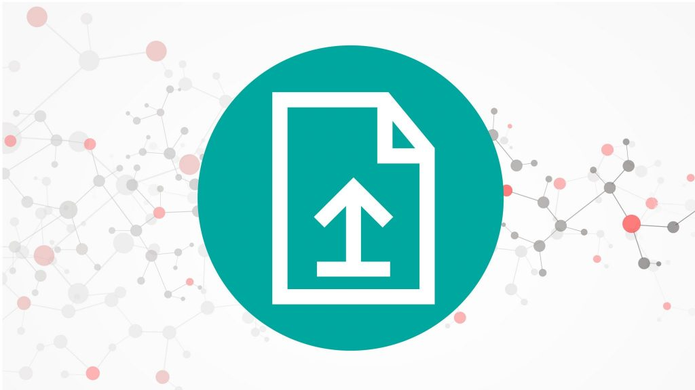
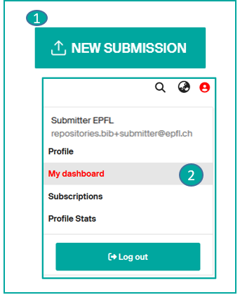
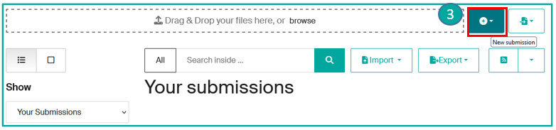
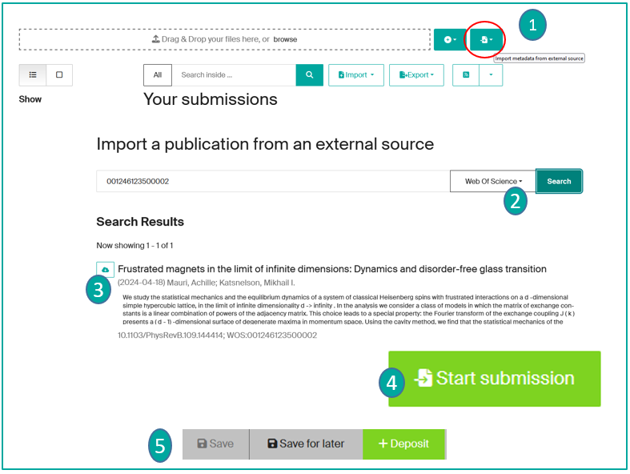
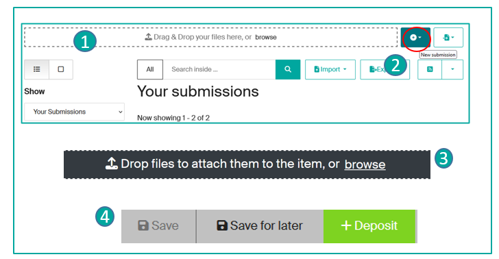
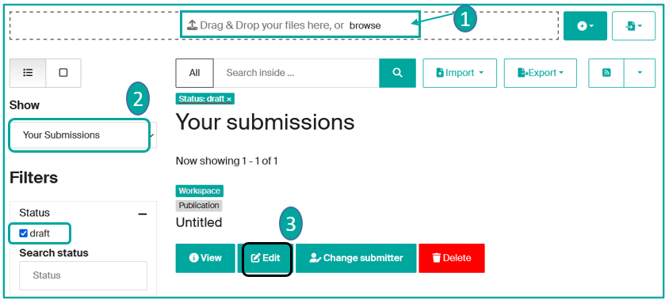
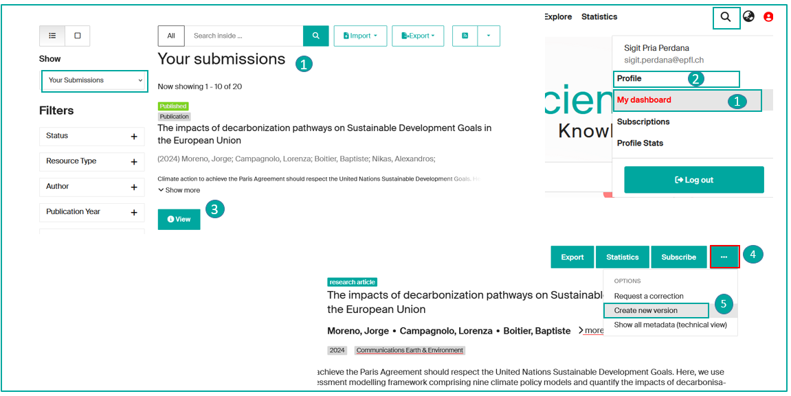
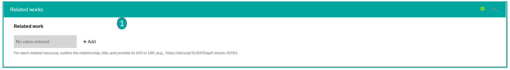
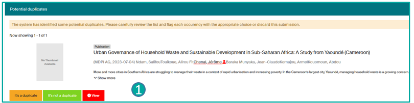
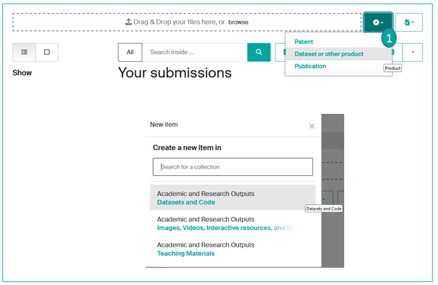

# Submit a publication

---

## Tutorial

  <iframe
    src="https://www.youtube.com/embed/WTJt7sDSa3s"
    title="How to submit a publication in Infoscience"
    frameborder="0"
    allowfullscreen>
  </iframe>

---

## Deposit conditions

- According to [LEX 3.5.1](https://www.epfl.ch/about/overview/wp-content/uploads/2019/09/LEX-3.5.1_EN.pdf), EPFL authors must deposit all their publications in Infoscience no later than 6 months after the publication date.
- At least one EPFL author must be present in the list of authors of the submitted publication.
- EPFL members acting as scientific editors can submit: texts they have authored (introduction, etc.), or the entire edited publication, provided that all contributing authors give their consent.
- Students may deposit their work with the agreement of their supervisor and/or section.

!!! note
    Certain categories of documents are deposited and managed by the Infoscience team:

    - [EPFL doctoral thesis](https://www.epfl.ch/campus/library/theses/) (in collaboration with the Doctoral Schools)
    - Patents (in collaboration with the Technology Transfer Office)

---

## Document types

Please refer to the information [page](document-types.md) that lists and defines the various types of documents accepted on the Infoscience platform.

---

## Make a deposit

After authentication,

click on the "New deposit" icon (**1**)

or

go directly to "My dashboard" available under your profile icon (**2**).

=>The "Your submissions" page appears: click on "New submission" (**3**).

From there, you have different ways to make a submission:

- by using an external database (for example, with the help of the DOI)
- by entering the information manually
- by importing a BibTeX file

---

## Import a publication already listed in an external database (arXiv, Crossref, DataCite, PubMed, Scopus, Web of Science…)

**You can easily import it by entering its identifier** (DOI, ISBN, …), **an author, or a title.**

The submission form is automatically populated with the imported metadata. This saves you time and improves the quality of the record!

Steps to follow: On the "**your submissions**" page, click on the "**Import metadata from an external source**" button (**1**). Select **the chosen collection** (for e.g Publication) from the dropdown list => Choose the **source** from the dropdown menu (**2**) => Enter the **identifier, title, or author** => **Search** => The results will be displayed, click on the **Import** cloud icon (**3**) to import the desired publication.

A "**Publication Preview**" window will open, after inspection, you can click on "**Start submission**" (**4**). **Select the collection:** the submission form will be displayed with pre-filled metadata. You can add additional data if desired, as well as the fulltext.

For more information on completing the submission form, please refer to the corresponding page.

Once you have finished filling out the form, you can "**Submit**" your publication, "**Save for later**," or "**Cancel**" (5) if you wish.

Once submitted, your record will be **reviewed before publication** by the Infoscience Team, who **will check the bibliographic data and the dissemination conditions of the file(s)**. Depending on the number of deposits to process, the time to go online may take 48 hours.

---

## Enter a publication manually

!!! tip
    **Importing your publication from an external source should always be favored** (see above).

If your publication is not listed in an external database, you can still add it by uploading the full text or by manually entering all the fields.

On the "**Your submissions**" page, two options are available:

- **Option 1: Drag and drop your file** (**1**), choose the collection corresponding to the document type. An automatic extraction of metadata is performed from the uploaded file in the submission form. Complete or modify the fields as needed.
- **Option 2**: Click on the "**New deposit**" button (**2**) and choose the collection for your publication (to find out more about choosing a collection, go to the [Document type page](document-types.md)), then, select the **Type** of document from the dropdown list. The submission form will display, and you can **fill in the fields**\*.

!!! note
    If you have a DOI, you can also open the submission form and insert it. The system retrieves metadata associated with the DOI from the [Crossref](https://www.crossref.org/) database.

\* Mandatory fields in the form are indicated by an asterisk. **For more information on completing deposit forms, please refer to the corresponding [help page](use-submission-form.md).**

You can also upload the corresponding file(s) for your publication by dragging and dropping them or by downloading them (**3**) => **See the Help page** for [the submission form](use-submission-form.md), under "**Upload files**," to learn about the submission process for one or more files and their access conditions using the Sherpa Romeo tool, to find out about your publisher's open access policy.

At the end of the entry process: you can save the notice as a draft by clicking on **Save for later**\*\*, or submit it to the Infoscience team for bibliographic validation by clicking on **Deposit** (**4**).

Once submitted, your notice will be **reviewed by the Infoscience team before publication** to ensure the **accuracy of the bibliographic data and the conditions for accessing the file(s)**. Depending on the number of submissions to process, the publication process may take 48 hours.

\*\*You can find all your records in your "**Dashboard**", whatever their status: draft, workspace, published. (See [Manage my publications](manage-publications.md))

---

## Your publication is listed in a BibTeX file

You can **import a list of publications from a bibliographic database** (Zotero, for example) by inserting a BibTeX file.

On the "**Your Submissions**" page, click the "**Browse**" button (**1**) and **select your BibTeX file**. **Choose the collection** for your publications (note: your BibTeX file must contain only one type of document, otherwise the selected collection will apply to all imported publications).

**Your** imported **data will be converted into draft records in your dashboard**, under "**Your Submissions**" (**2**). Go to the draft record and **complete the missing metadata** by clicking "**Edit**" (**3**).

For more information on completing the submission forms, please refer to the corresponding help page.

When you have finished filling out the form, you can "**Submit**" your publication, "**Save for Later**," or "**Cancel**" if you wish.

Once submitted, your record **will be reviewed** by the Infoscience team, who **will check the bibliographic data and the distribution conditions of the file(s)**. Depending on the number of submissions to process, the online publication may take up to 48 hours.

---

## Update a published record: create a new version

As the submitter and/or author of a record, you have the option of **creating a new version**, for example to report the published version of a previously deposited preprint:

- If you are the submitter of the record, go to your "**Dashboard**" and display "**Your submissions**" (**1**).
- If you are the author of the notice, search for it using **the search bar** or on "**profile > View > Scholarly works**" (**2**), where you will find all your publications.
- Click on the desired notice by pressing "**View**" (**3**).
- Once the record is open, you'll find a "**…**" button in the top right-hand corner. (**4**)
- Select "**Create new version**" (**5**): modify/add the desired fields in the form; modify/add the attached files.
- Then **upload the new version**.

It will be examined by the Infoscience team before distribution.

!!! warning
    We strongly encourage you to use this function only in the event of an editorial version change **and if you wish Infoscience to generate the versioning of your records.**

**The old version will be archived**. **The version history is accessible** from the "Versions" tab of the record. All the different versions can be consulted by clicking on their corresponding number.

---

## Update a published record: make a correction

Whether you are the publication's author or the submitter, you can request a correction via the **"Request a correction"** button (**1**). Modify the metadata as required and **deposit**.

Corrections will be reviewed by the Infoscience team before publication.

!!! warning
    We strongly encourage you to use this function if you wish to:

    - correct an error on a given field,
    - add information on a given field,
    - add/replace a file,
    - modify the metadata of a file,
    - …

    **If you choose the "request a correction" option, only the latest version of your deposit will be proposed, with no versioning possible.**

---

## Delete an item

**In accordance with the [deposit license](https://www.epfl.ch/campus/library/services-researchers/infoscience-en/charter-deposit-licence-and-conditions-of-use/), "deposits cannot be removed from the Infoscience archive once accepted."**

**As an author, you have the option to host multiple editorial versions of the same document** (preprint, accepted version, final version) on a single record:

- The preservation of the preprint allows you to timestamp the research results presented in the article and ensures its citability.
- It reflects the dynamic process of ongoing research, revealing the evolution of ideas, hypotheses, and resulting findings.

Exceptionally, the Infoscience team can "restrict or remove access to deposited works in cases of: copyright infringement, violation of EPFL guidelines on scientific integrity, breach of confidentiality obligations, withdrawal by the publisher" (see [Deposit License](https://www.epfl.ch/campus/library/services-researchers/infoscience-en/charter-deposit-licence-and-conditions-of-use/)).

---

## Link my records to other publications

As a submitter, you can **create links between records** (available or not on Infoscience platform), e.g. an article and a dataset, a conference paper and a poster….

- In the submission form, go to the "**Related works**" field (**1**); click on **Add** and complete the form. For each associated resource, describe the relationship (is cited by, cites, is supplement to, supplemented by…), the title and provide its DOI or URL.

!!! note
    If you want to link your record to another record on the platform, search for the record to be linked by its title in the 'Resource title' field, which will give you suggestions.

### Relationship types table

**Legend:**

- The notice and/or publication being submitted = A
- The resource or relationship added (in the Related works field) = B

| **Relation type** | **Description** | **Usage note and example** |
|---|---|---|
| IsCitedBy | Indicates that B includes A in a quotation | For e.g.: a dataset is quoted in a newspaper article |
| Cites | Indicates that A includes B in a quotation | For e.g.: a dataset cites the related resource |
| IsSupplementTo | Indicates that A is a supplement/complement to B. | For e.g.: a poster is a supplement/complement to a conference paper. |
| IsSupplementedBy | Indicates that B is completed by A. | For e.g.: a conference paper is supplemented by an associated poster |
| IsContinuedBy | Indicates that A is being pursued by B's work | For e.g.: a working document is followed by a technical report |
| Continues | Indicates that A is a continuation of work of B | For e.g.: a technical report is a continuation of a working document. |
| IsDescribedBy | Indicates that A is described by B | For e.g.: a research report is described by a research protocol. |
| Describes | Indicates that A describes B | For e.g.: a research protocol describes a research report. |
| HasMetadata | Indicates that resource A has additional metadata from B | … |
| IsMetadataFor | Indicates additional A metadata for resource B | … |
| HasVersion | Indicates that A has a version B | For e.g.: a preprint has a published version |
| IsVersionOf | Indicates that A is a version of B | For e.g.: a published version has a pre-print version. Must not be used => create a new version unless it is a version deposited elsewhere than on Infoscience. |
| IsNewVersionOf | Indicates that A is a new version of B and that the new edition has been modified or updated. | For e.g.: to be used for a version that renders the previous one obsolete. |
| IsPreviousVersionOf | Indicates that A is a previous version of B | … |
| IsPartOf | Indicates that A is part of B; can be used for items in a series. | For e.g.: A book chapter is part of a book |
| HasPart | Indicates that A includes part B | For e.g.: A book includes a book chapter |
| IsReferencedBy | Indicates that A is referenced by B | For e.g.: a researcher has provided a README file containing a list of references. |
| References | Indicates that B is used as a reference for A | … |
| IsDocumentedBy | Indicates that A is documented/explained by B | … |
| Documents | Indicates that A documents/explains B | … |
| IsCompiledBy | Indicates that A is compiled by B | Can be used to indicate either a traditional text compilation or the compilation program used to generate executable software. |
| Compiles | Indicates that A compiles B | Can be used for software and text, as a compiler can be a computer program or a person. |
| IsVariantFormOf | Indicates that A is a variant or different form of B | Used to designate a different form of something. For e.g.: a calculated or calibrated form or one with a different encoding. |
| IsOriginalFormOf | Indicates that A is the original form of B | … |
| IsIdenticalTo | Indicates that A is identical to B | Must be used for a resource identical to the registered resource, but saved in a different location, perhaps in a different institution. |
| IsReviewedBy | Indicates that A is reviewed by B | … |
| Reviews | Indicates that A is a review of B | … |
| IsDerivedFrom | Indicates that A is a source on which B is based | Must be used for a resource that is a derivative of an original resource. For e.g.: a dataset is derived from a larger dataset and the data values have been manipulated from their original state. |
| IsSourceOf | Indicates that A is a source on which B is based | IsSourceOf is the original resource from which a derived resource has been created. For e.g.: an original dataset with no value manipulation. |
| IsRequiredBy | Indicates that A is required by B | Can be used to indicate software dependencies. |
| Requires | Indicates that A requires B | Can be used to indicate software dependencies. |
| IsPublishedIn | Indicates that A is published within B, but is independent of the other elements published within B | For e.g.: An article published in a periodical or specialist journal. If the DOI (which refers to the article published in the journal) is already entered in the identifier section, there is no need to establish the relationship. |

---

## Manage duplicates

When you submit a publication, the platform alerts you to potential duplicates (already referenced publications), displayed at the bottom of the deposit form.

The detection of potential duplicates is based on the comparison of:

- DOI
- Or title + publication year

Infoscience notifies you of the potential duplicate by offering three buttons in the deposit form: (**1**)

1. Click the Display button (View) to compare the records.

Two scenarios are possible:

2. **The notice you are currently depositing is a duplicate:**

    - Either you decide to abandon the deposit: click the **Discard** button. The notice will be permanently deleted.
    - Or you still wish to deposit the publication:
        - click the **It's a duplicate** button.
        - Add a Submitter note to explain the reason for resubmitting your publication.
        - Submit the record.

3. **The notice you are depositing is not a duplicate:**

    - Confirm this by clicking the **It's not a duplicate** button.
    - Deposit the notice.

At the time of validation, the Infoscience Team will analyze the situation and respond to you in accordance with the service policies regarding deduplication of notices.

---

## Submit my research data (datasets, software)

The submit process is identical to that of publications. Only the collection and the submission form differ.

- Select the collection **Product** (**1**), then **Datasets**
- If a publication complements the dataset/software, please mention it in the "**related works**" section (see above)

---

[Back to Help home](index.md)
