# Utiliser le formulaire de dépôt

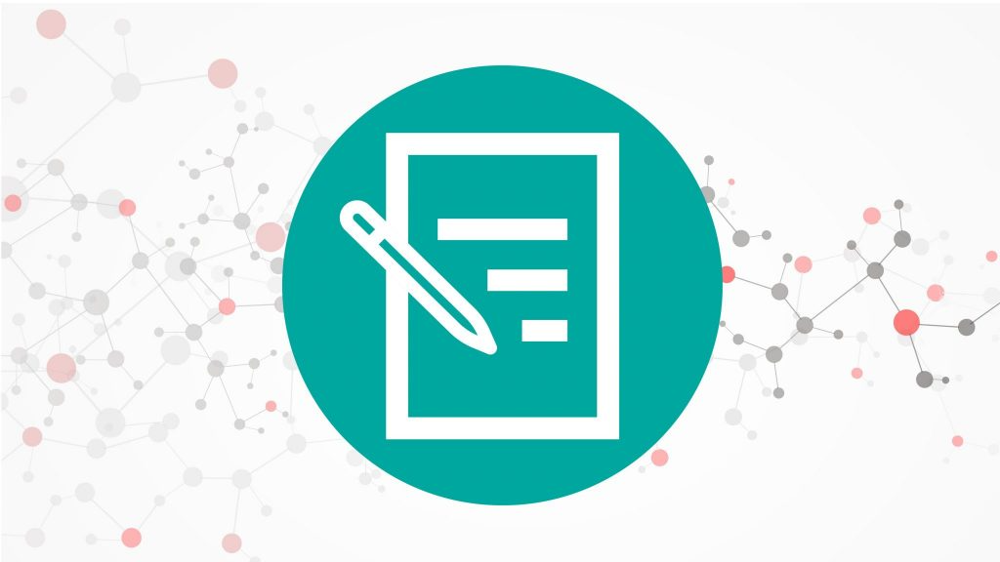

Les dépôts dans Infoscience s'effectuent à travers un formulaire. Ce formulaire vous permet de décrire la publication/ressource déposée, en tenant compte des spécificités de chaque type de document.

---

## Accéder au formulaire

Lorsque vous effectuez un dépôt (voir page [Déposer une publication](submit-a-publication.fr.md)), commencez par choisir la famille de documents pertinente (**1**), puis le type de document (**2**) adéquat.

Vous avez le choix entre **3 grandes familles de documents** (voir la page [Types de documents](document-types.fr.md)) :

- **Publication** (articles, conférences, chapitres d'ouvrage, etc.) ;
- **Dataset ou autre produit** (données de recherche, code, images, vidéos, etc.) ;
- **Brevet.**

!!! tip
    Sauf si vous déposez un dataset ou un brevet, sélectionnez la collection **Publication**, qui inclut les types de documents les plus courants.

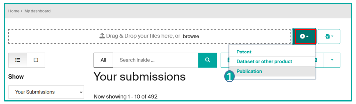
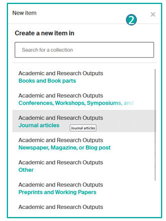

---

## Télécharger vos fichiers

En haut du formulaire, une bannière vous permet d'importer le ou les fichier(s) correspondant à la notice, ou de les glisser-déposer sur la page (**1**).

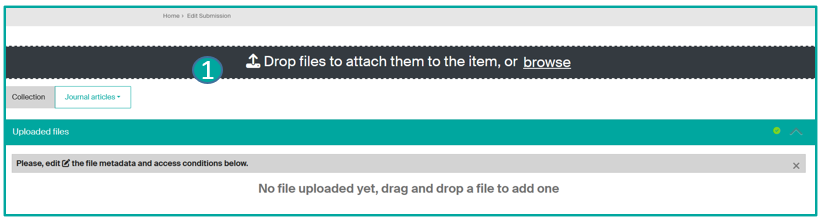

Après l'import du ou des fichier(s), vous devez compléter les métadonnées et les détails d'accès en cliquant sur l'icône Éditer (**2**).

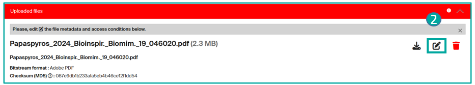

Dans le formulaire fichier (**3**), certains champs sont obligatoires :

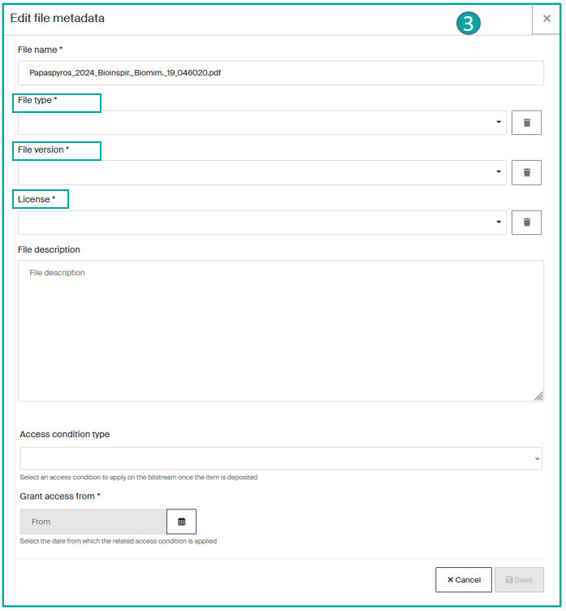

- **Type de fichier :** sélectionnez le type approprié :
    - **Document principal** : le fichier central contenant l'essentiel du travail ou de la recherche
    - **Matériel/Information supplémentaire** : contenu complémentaire (annexes, données détaillées)
    - **Présentation** : diaporama ou support visuel
    - **Enregistrement vidéo** : fichier vidéo d'une présentation ou démonstration
    - **Enregistrement audio** : fichier sonore d'une présentation ou interview
    - **Poster** : document visuel de synthèse graphique
    - **Figures** : graphiques, diagrammes, tableaux ou images
    - **Code source** : scripts ou programmes utilisés dans la recherche
    - **Miniature** : petite image ou aperçu graphique. **Ce type de fichier ne peut pas être téléchargé** (option « Télécharger »). Si vous souhaitez qu'il le soit, enregistrez-le en tant que « Matériel/Information supplémentaire » et importez-le en premier.
    - **Autre** : tout autre type de fichier ne correspondant pas aux catégories définies ci-dessus.

- **Version du fichier** (Preprint, version acceptée, version publiée finale…)
- **Licence** (CC-BY, CC-BY-NC, Copyright…)\*

Enfin, il est important de préciser les conditions d'accès :

- Open Access
- Accès limité aux membres EPFL uniquement
- Embargo (si sous embargo, veuillez indiquer la date à partir de laquelle l'accès sera autorisé)

!!! note
    Lors d'un dépôt via DOI, l'outil Unpaywall (**4**) importe le texte intégral associé s'il est en Open Access. Si le texte intégral est disponible, cliquez sur le bouton **Importer depuis Unpaywall**.

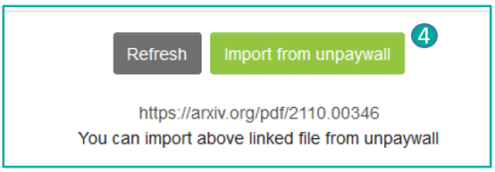

Attention : Unpaywall n'importe pas les métadonnées du fichier ni les conditions d'accès. Celles-ci doivent être renseignées manuellement.

### \*Licences de fichiers

**Lors du dépôt d'un fichier, il est obligatoire d'ajouter la licence du fichier déposé.**

**La Bibliothèque EPFL recommande d'utiliser les licences CC** dans la mesure du possible, pour toutes les publications (articles, livres, chapitres de livres), images, thèses de master et de doctorat, etc.

Dans le formulaire fichier, le·la déposant·e doit **choisir l'une des licences suivantes** :

| Licence | Description |
|---|---|
| **N/A** (sous droits d'auteur) | Tous droits réservés |
| **CC BY** | Distribuer, remixer, adapter et construire à partir de votre travail, même commercialement. La paternité doit être mentionnée. |
| **CC BY-SA** | Remixer, adapter et construire à partir de votre travail, même commercialement. La paternité doit être mentionnée et la même licence s'applique. |
| **CC BY-ND** | Réutiliser l'œuvre à toute fin. Le partage des versions modifiées n'est pas autorisé. La paternité doit être mentionnée. |
| **CC BY-NC** | Remixer, adapter et construire à partir de votre travail pour des usages non commerciaux. La paternité doit être mentionnée. |
| **CC BY-NC-SA** | Remixer, adapter et construire à partir de votre travail de façon non commerciale. Même licence requise. |
| **CC BY-NC-ND** | Télécharger et partager uniquement. La paternité doit être mentionnée. |
| **CC0** | Aucun droit réservé. |
| **Domaine public** | |
| **Autre** | Vous devez ajouter manuellement la licence. |

**Pour en savoir plus** sur les licences de fichiers, consultez les **[Fastguides](https://infoscience.epfl.ch/handle/20.500.14299/173018)** de la Bibliothèque EPFL.

### Vos fichiers : formats, nommage, versions autorisées

- **Formats** : téléchargez les fichiers en PDF, JPG pour les images, MP3/MP4 pour les vidéos ou ZIP s'il y en a plusieurs. Évitez les formats doc/docx/odt.
- **Nommage** : choisissez un nom court (max. 32 caractères) ; évitez les caractères spéciaux (# @ & € + …) ; évitez les espaces entre les mots, utilisez plutôt le tiret bas `_`.

**Versions de la publication :** preprint ou version soumise (avant relecture), postprint ou version acceptée (après relecture, avant mise en page), version publiée (version finale acceptée, relue et mise en page).

!!! tip
    **Si la politique de l'éditeur le permet, déposez la version publiée**, avec tout embargo imposé. **Il est toujours permis de déposer des preprints et postprints**.

Consultez [Sherpa Romeo](http://www.sherpa.ac.uk/romeo/) pour connaître la politique Open Access de votre éditeur.

**Pour plus d'informations, consultez la page** [Conseils pour le dépôt de vos fichiers](file-naming-formats.fr.md).

---

## Section Collection et Type de document (obligatoire)

Une fois la collection choisie, une fenêtre s'ouvre — choisissez le type de document souhaité. Voir la [page d'information complète](document-types.fr.md).

Le formulaire de dépôt s'ouvre, vous pouvez :

- Modifier la collection (**1**).
- Choisir le type de document (**2**) pour votre dépôt\*.
- Lorsque vous ouvrez la liste des sous-types de documents, une hiérarchie s'affiche (**3**) => choisissez/recherchez le sous-type souhaité.

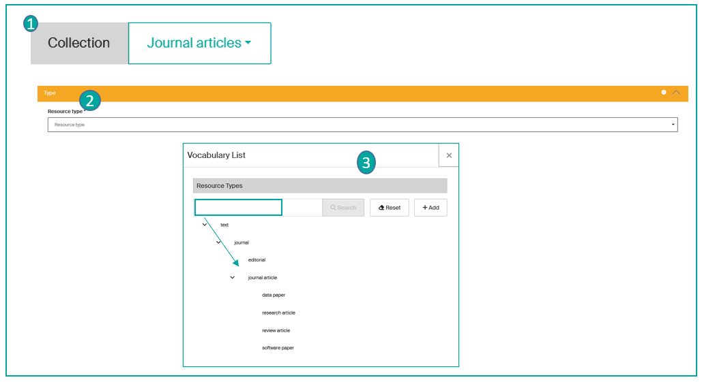

\*Les champs marqués d'un astérisque sont obligatoires.

---

## Section Identifiants

Dans cette section, vous pouvez insérer l'identifiant de votre publication (identifiant unique tel que DOI, Handle ou ISBN, ou un numéro attribué par des bases de données externes telles qu'arXiv, WOS ou Scopus), qui pré-remplira automatiquement le formulaire.

- (**1**) Le champ DOI est proposé par défaut. Infoscience récupère les métadonnées associées au DOI depuis la base de données [Crossref](https://www.crossref.org/) pour pré-remplir le formulaire (auteurs, titre, résumé, date, métadonnées éditeur, et potentiellement le texte intégral si disponible en Open Access via [Unpaywall](https://unpaywall.org/)).

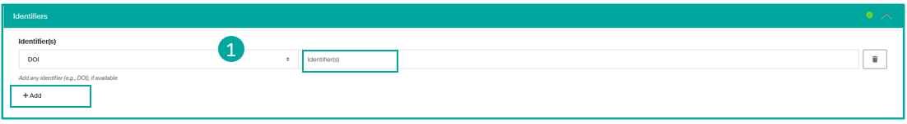

- (**2**) Ajoutez d'autres identifiants disponibles : arXiv, WoS, Scopus, Pubmed, Handle, ISBN. La récupération automatique est possible pour WoS ID, Scopus ID, Pubmed ID et arXiv ID.

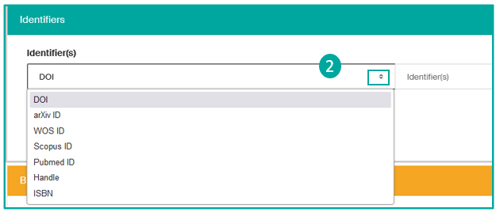

---

## Section Informations principales

Dans cette section (**1**), vous pouvez ajouter :

- **Auteur·trice·s**\* : pour chaque auteur·trice ajouté·e, une fenêtre contextuelle s'ouvre pour ajouter le nom (saisissez d'abord le nom de famille), l'institution (EPFL ou autre), **l'affiliation principale** (Laboratoire ou Unité), l'ORCID de l'auteur·trice, et indiquer s'il·elle est **Auteur·trice correspondant·e**.

!!! warning
    Il est impératif de mentionner TOUS les auteur·trice·s de la publication, dans l'ordre exact dans lequel ils·elles apparaissent. L'affiliation correspond à l'institution de recherche à laquelle l'auteur·trice est rattaché·e au moment de la production de la ressource.

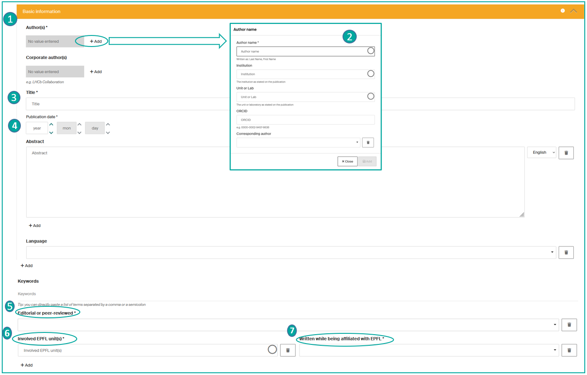

- **Auteur(s) corporatif(s)** : mentionner un groupe d'auteurs, par ex. : LHCb Collaboration
- **Titre**\* (**3**) : insérez le titre exact de la publication (les formats Mathjax sont supportés)
- **Date de publication**\* (**4**) : l'année est obligatoire, le mois et le jour sont recommandés.
- **Résumé** : ajoutez le résumé dans la langue souhaitée.
- **Langue** : ajoutez la langue de la publication si vous le souhaitez.
- **Mots-clés** : ajoutez des mots-clés séparés par des virgules ou des points-virgules.
- **Évalué par les pairs**\* : sélectionnez Oui ou Non
- **Unités affiliées**\* : ajoutez la ou les affiliation(s) de la publication
- **Écrit pendant une affiliation avec l'EPFL**\* : sélectionnez Oui ou Non

---

## Section Détails ou « Références de revue »

- **Titre de la revue** : saisissez le titre de la revue, en commençant par les premières lettres.
- **ISSN** : saisissez si non détecté automatiquement.
- **Volume** : saisissez si non détecté automatiquement.
- **Numéro** : saisissez si non détecté automatiquement.
- **Titre spécifique de ce numéro** : saisissez si non détecté automatiquement.
- **Numéro d'article** : saisissez si non détecté automatiquement.
- **Page de début / Page de fin** : saisissez si non détecté automatiquement.

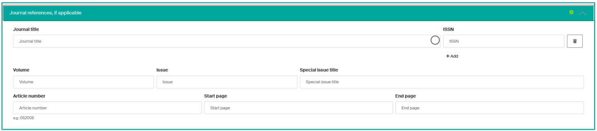

!!! note
    La complétion de ces sections n'est pas obligatoire, mais fortement recommandée pour assurer la promotion efficace de la publication.

---

## Section Politique Open Access de l'éditeur

La plateforme Infoscience fournit des informations sur les politiques Open Access des revues et éditeurs/ISSN, issues de [Sherpa Romeo](https://www.sherpa.ac.uk/romeo/). Vous pouvez ainsi savoir quelle version de votre publication vous êtes autorisé·e à déposer et si une restriction de diffusion (embargo) doit être appliquée.

*En cas de doute, vous pouvez déposer le texte intégral en Open Access : avant la diffusion de votre notice, l'équipe Infoscience vérifiera la licence et son adéquation avec ce type d'accès.*

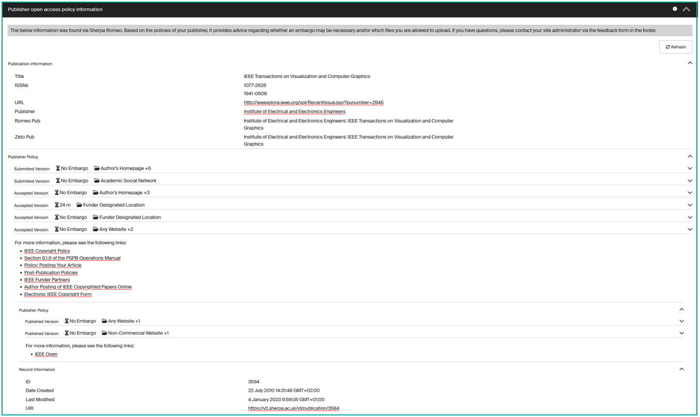

---

## Section Autres informations

- **Note** : ajoutez une note ou une description si nécessaire.
- **Lien supplémentaire** : ajoutez un ou plusieurs liens liés à votre publication si disponibles, par exemple vers le site de l'éditeur.

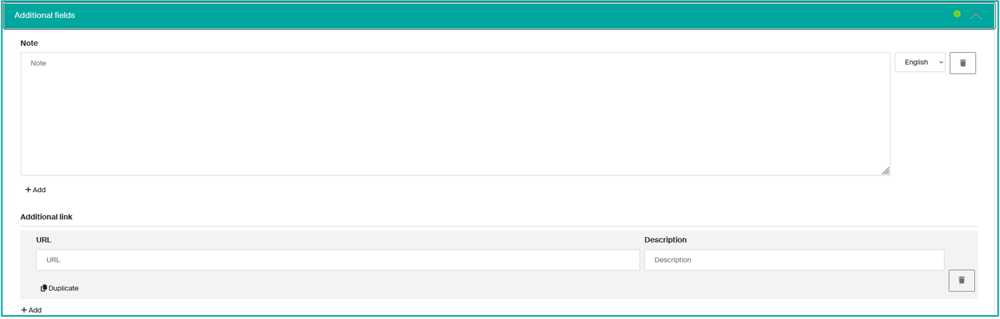

---

## Section Financement

Vous pouvez ajouter le nom, le numéro et l'URL du ou des financeur(s) ici (**1**) :

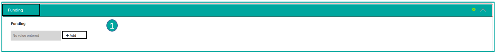

Lorsque vous ajoutez un financeur, une fenêtre s'ouvre (**2**) : complétez les champs. Une aide à la saisie est disponible pour les financeurs (données de [RoR](https://ror.org/)) et les noms de subventions (données d'[OpenAIRE](https://www.openaire.eu/)).

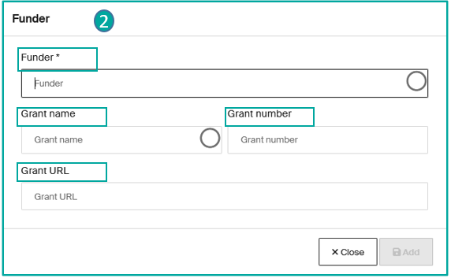

---

## Section Travaux liés

Dans cette section, vous pouvez lier votre publication à d'autres **publications**, par exemple **entre une publication et un dataset**.

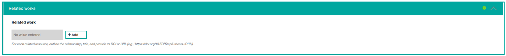

- Cliquez sur **Ajouter** et choisissez la relation appropriée dans la liste déroulante.
- Insérez le titre de la publication. Si la publication cible est dans Infoscience, le système pré-remplira le reste du titre, ainsi que l'URL ou le DOI.
- Sinon, saisissez l'URL ou le DOI manuellement.

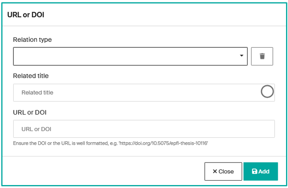

!!! note
    Vous pouvez ajouter autant de relations que nécessaire.

---

## Section Doublons potentiels

Si Infoscience détecte un doublon potentiel avec une publication déjà présente sur la plateforme, il l'indiquera ici.

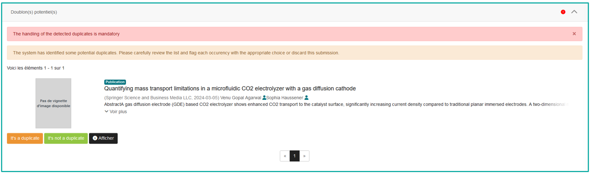

Il vous appartient d'analyser s'il s'agit effectivement d'un doublon => voir la page [Déposer une publication](submit-a-publication.fr.md#gerer-les-doublons).

---

## Section Accord de dépôt

**Le·la déposant·e est obligé·e d'accepter la licence pour finaliser sa demande.**

---

## Considérations particulières pour les livres et chapitres de livres

Lors du dépôt d'un livre ou d'un chapitre de livre, choisissez la collection « **Livres et chapitres de livres** ».

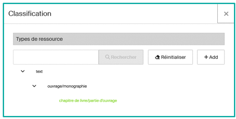

Des champs supplémentaires sont ajoutés dans la section **« Référence du livre, si applicable »** :

**Titre du livre**\*, **Éditeur(s) scientifique(s)**, **Éditeur**\*, **Lieu de publication**, **Édition**, **Nombre de pages**, **Titre de la partie**, **Numéro de la partie**, **ISBN** (du livre), **DOI** (du livre), **Titre de la série/Numéro de la série**, **ISSN** (de la série), **Validé par un comité éditorial** (OUI si le livre est validé par un éditeur ou comité scientifique, NON si auto-publié)

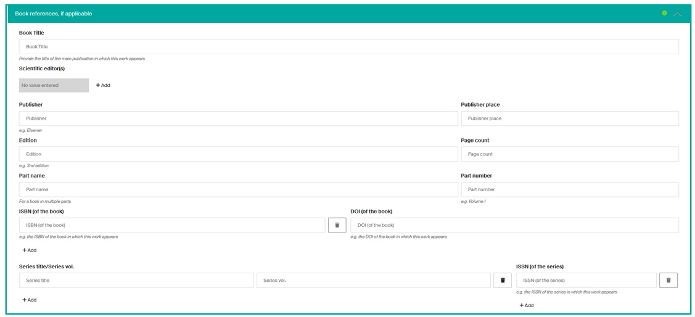

\*Sections avec un astérisque obligatoires.

---

## Considérations particulières pour les conférences

Pour déposer un article ou une communication de conférence, sélectionnez la collection « **Publications > Conférences, ateliers, symposiums et séminaires** ».

Sélectionnez le type de document approprié (**1**) (consultez la [page sur les types de documents](document-types.fr.md)).

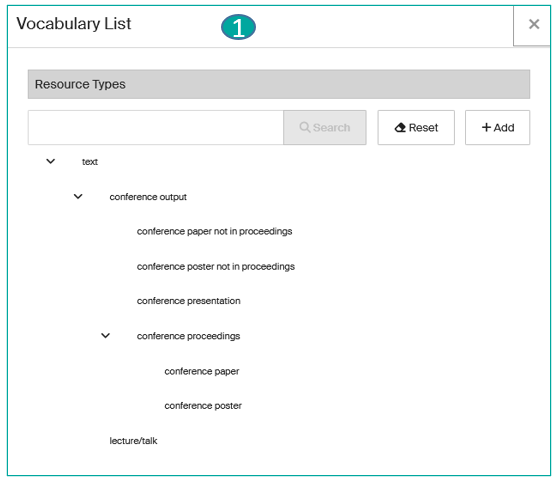

Une section supplémentaire est ajoutée en bas du formulaire : « **Événement lié, si applicable** » (**2**).

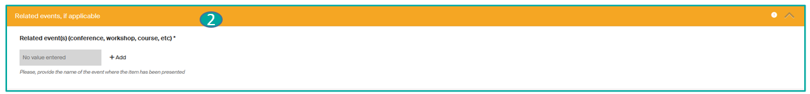

Cliquez sur **Ajouter** et renseignez les sections (**3**) :

- Type d'événement (Conférence ; Atelier ; Séminaire ou Journée d'étude ; Exposition ; Cours ; Autre)
- Nom de l'événement
- Lieu de l'événement
- Date

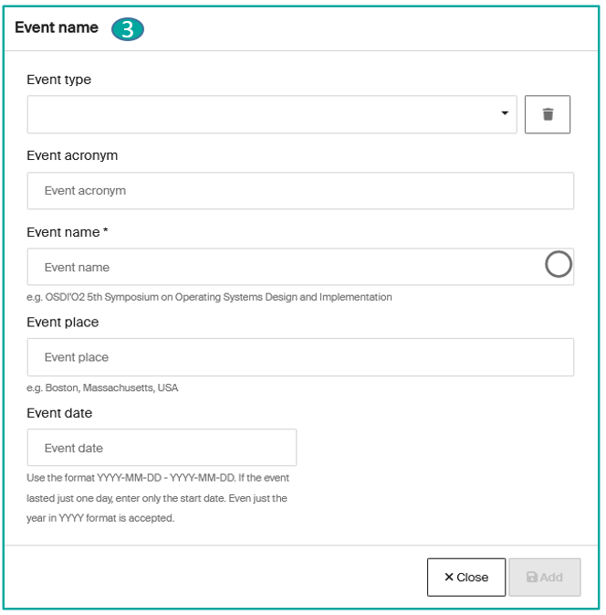

---

## Considérations particulières pour les Datasets

Pour déposer un dataset, sélectionnez la collection « **Dataset ou autre produit** » (**1**), puis remplissez le formulaire de dépôt.

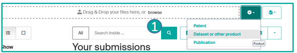

**Section Informations de base** (**2**) : Type\*, Identifiants, Créateur(s)\*, Contributeur(s), Titre\*, Éditeur (pré-rempli « EPFL »), Date de publication\*, Autres dates, Version, Mots-clés, Couverture géographique, Unité(s) EPFL impliquée(s), Écrit pendant une affiliation avec l'EPFL\*.

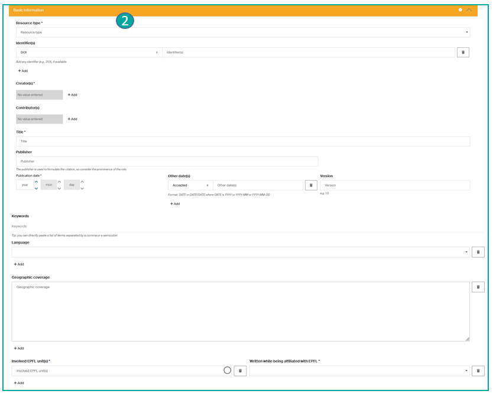

**Section Conditions d'accès** (**3**) : Type de condition d'accès (open access, embargo, accès restreint), Autoriser l'accès à partir de\*.

**Section Attributs communs des fichiers** (**4**) : Licence globale des fichiers\*.

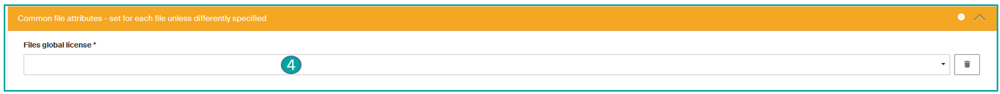

!!! note
    N'oubliez pas de lier votre Dataset à la publication correspondante si disponible (voir [Déposer une publication](submit-a-publication.fr.md#lier-mes-notices-a-dautres-publications) — section Travaux liés).

\*Champs avec un astérisque obligatoires.

---

## Considérations particulières pour les Brevets

Pour déposer un brevet, sélectionnez la collection **Brevet** (**1**), puis remplissez le formulaire de dépôt.

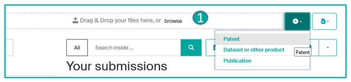

**Section « Informations de base »** (**2**) : Type\*, Numéro de brevet et Date de publication, Priorités et Date de priorité, Demande => Numéro de demande et Date de demande.

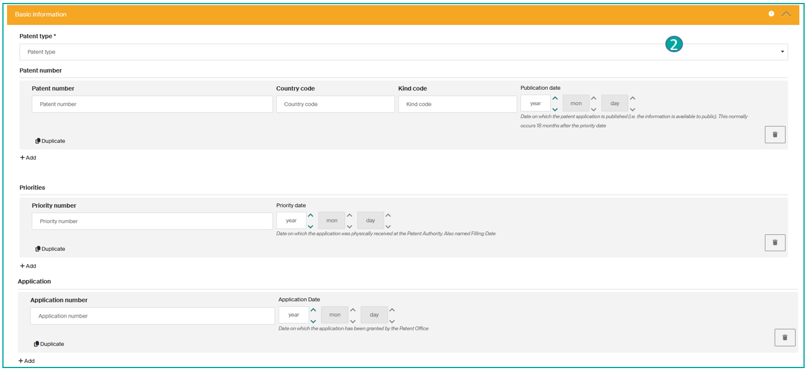

(**3**) : ID de famille, Titre\*, Titres supplémentaires, Inventeur(s)\*, Déposant(s), Résumé.

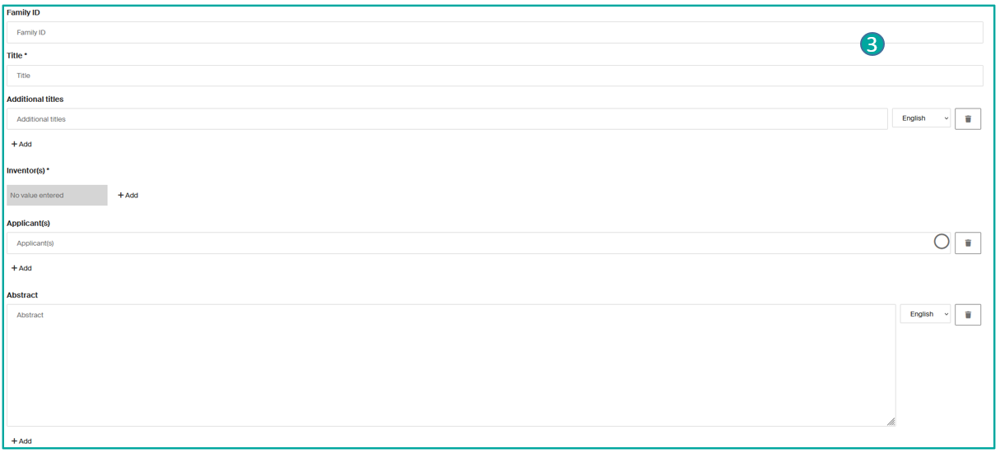

(**4**) : **Classification TTO**, **Mots-clés**, **Unités EPFL impliquées**\*, **Écrit pendant une affiliation avec l'EPFL**\*.

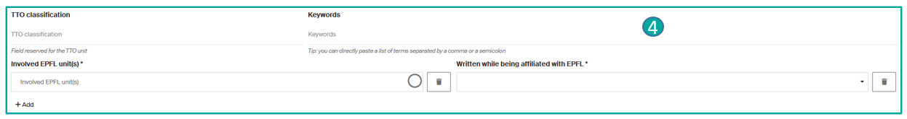

\*Champs avec un astérisque obligatoires.

---

[Retour à l'accueil de l'aide](index.fr.md)
